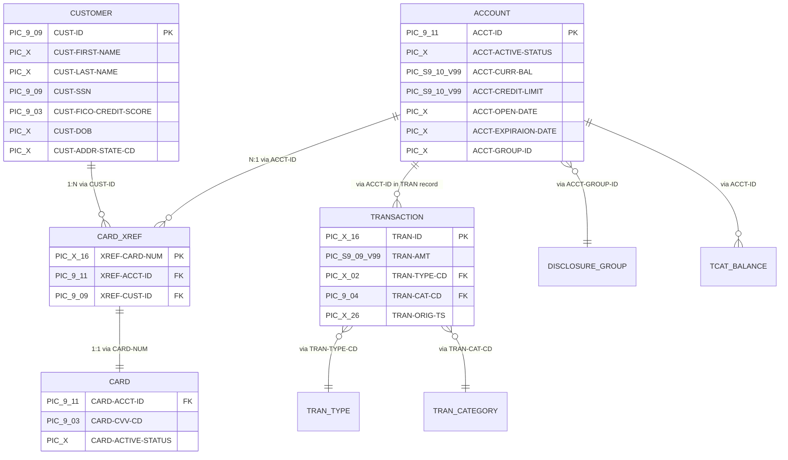
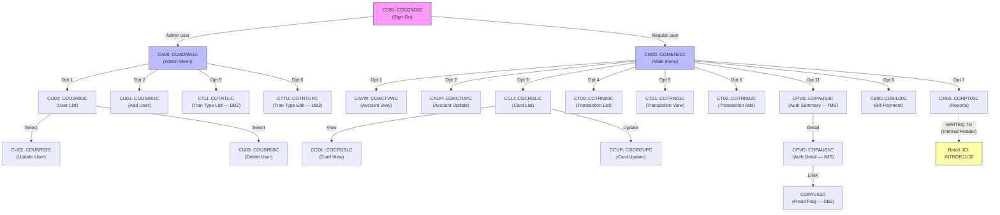
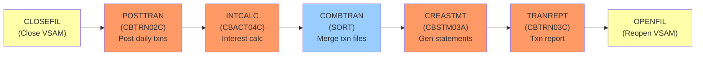
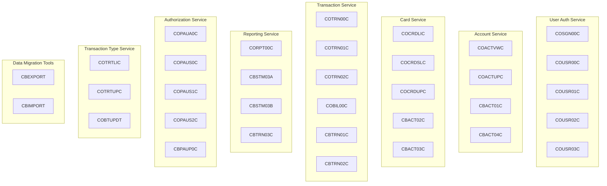

# CardDemo — Comprehensive COBOL Estate Analysis

> **Application:** CardDemo — Mainframe Credit Card Management System  
> **Repository:** `infosys-training/uc-legacy-modernization-cobol-to-java`  
> **Date:** June 2026  
> **Technologies:** COBOL, CICS, VSAM, JCL, Assembler, DB2, IMS, MQ

---

## Table of Contents

1. [Asset Inventory](#1-asset-inventory)
2. [Lines of Code (LOC) Summary](#2-lines-of-code-loc-summary)
3. [Business Domain Mapping](#3-business-domain-mapping)
4. [Data Architecture](#4-data-architecture)
5. [Program Dependency / Call Graph](#5-program-dependency--call-graph)
6. [CICS Transaction Flow](#6-cics-transaction-flow)
7. [Batch Processing Flow](#7-batch-processing-flow)
8. [Technology Complexity Assessment](#8-technology-complexity-assessment)
9. [Modernization Readiness Assessment](#9-modernization-readiness-assessment)

---

## 1. Asset Inventory

### 1.1 COBOL Programs (44 total)

#### Core Online Programs (`app/cbl/CO*.cbl`) — 16 programs

| # | File | Path | Total LOC | Code LOC | Type | CICS Txn | Description |
|---|------|------|-----------|----------|------|----------|-------------|
| 1 | COSGN00C.cbl | `app/cbl/` | 260 | 172 | Online CICS | CC00 | Sign-on/authentication screen |
| 2 | COMEN01C.cbl | `app/cbl/` | 308 | 213 | Online CICS | CM00 | Main menu hub — routes to all user functions |
| 3 | COADM01C.cbl | `app/cbl/` | 288 | 189 | Online CICS | CA00 | Admin menu — routes to admin functions |
| 4 | COACTVWC.cbl | `app/cbl/` | 941 | 703 | Online CICS | CAVW | Account view — read-only account display |
| 5 | COACTUPC.cbl | `app/cbl/` | 4,236 | 3,368 | Online CICS | CAUP | Account update — field validation & update (largest program) |
| 6 | COCRDLIC.cbl | `app/cbl/` | 1,459 | 1,093 | Online CICS | CCLI | Credit card list — paginated card browse |
| 7 | COCRDSLC.cbl | `app/cbl/` | 887 | 642 | Online CICS | CCDL | Credit card detail view |
| 8 | COCRDUPC.cbl | `app/cbl/` | 1,560 | 1,195 | Online CICS | CCUP | Credit card update |
| 9 | COTRN00C.cbl | `app/cbl/` | 699 | 529 | Online CICS | CT00 | Transaction list — paginated browse |
| 10 | COTRN01C.cbl | `app/cbl/` | 330 | 231 | Online CICS | CT01 | Transaction detail view |
| 11 | COTRN02C.cbl | `app/cbl/` | 783 | 614 | Online CICS | CT02 | Transaction add — new transaction entry |
| 12 | CORPT00C.cbl | `app/cbl/` | 649 | 498 | Online CICS | CR00 | Report request — submits batch JCL via INTRDR |
| 13 | COBIL00C.cbl | `app/cbl/` | 572 | 420 | Online CICS | CB00 | Bill payment processing |
| 14 | COUSR00C.cbl | `app/cbl/` | 695 | 531 | Online CICS | CU00 | User list — paginated user browse (admin) |
| 15 | COUSR01C.cbl | `app/cbl/` | 299 | 198 | Online CICS | CU01 | User add (admin) |
| 16 | COUSR02C.cbl | `app/cbl/` | 414 | 303 | Online CICS | CU02 | User update (admin) |

#### Core Batch Programs (`app/cbl/CB*.cbl` + utilities) — 14 programs

| # | File | Path | Total LOC | Code LOC | Type | Description |
|---|------|------|-----------|----------|------|-------------|
| 17 | COUSR03C.cbl | `app/cbl/` | 359 | 251 | Online CICS (CU03) | User delete (admin) |
| 18 | CSUTLDTC.cbl | `app/cbl/` | 157 | 114 | Utility (called) | Date validation utility — calls CEEDAYS |
| 19 | COBSWAIT.cbl | `app/cbl/` | 41 | 13 | Utility (batch) | Wait routine — calls assembler MVSWAIT |
| 20 | CBACT01C.cbl | `app/cbl/` | 430 | 358 | Batch | Account file read — calls assembler COBDATFT for dates |
| 21 | CBACT02C.cbl | `app/cbl/` | 178 | 129 | Batch | Card file read |
| 22 | CBACT03C.cbl | `app/cbl/` | 178 | 130 | Batch | Card cross-reference file read |
| 23 | CBACT04C.cbl | `app/cbl/` | 652 | 552 | Batch | Interest calculation on account balances |
| 24 | CBCUS01C.cbl | `app/cbl/` | 178 | 130 | Batch | Customer file read |
| 25 | CBTRN01C.cbl | `app/cbl/` | 494 | 415 | Batch | Daily transaction file read |
| 26 | CBTRN02C.cbl | `app/cbl/` | 731 | 619 | Batch | Post daily transactions to master |
| 27 | CBTRN03C.cbl | `app/cbl/` | 649 | 545 | Batch | Transaction report generation |
| 28 | CBSTM03A.CBL | `app/cbl/` | 924 | 784 | Batch | Statement generation (main) — text + HTML output |
| 29 | CBSTM03B.CBL | `app/cbl/` | 230 | 162 | Batch (submodule) | Statement I/O submodule — called by CBSTM03A |
| 30 | CBEXPORT.cbl | `app/cbl/` | 582 | 396 | Batch | Data export for branch migration |
| 31 | CBIMPORT.cbl | `app/cbl/` | 487 | 337 | Batch | Data import with validation |

#### Extension Programs — Authorization IMS/DB2/MQ (`app/app-authorization-ims-db2-mq/cbl/`) — 8 programs

| # | File | Path | Total LOC | Code LOC | Type | CICS Txn | Description |
|---|------|------|-----------|----------|------|----------|-------------|
| 32 | COPAUA0C.cbl | `app/app-authorization-ims-db2-mq/cbl/` | 1,026 | 771 | Online CICS | CP00 | Authorization request processing — MQ + IMS + DB2 |
| 33 | COPAUS0C.cbl | `app/app-authorization-ims-db2-mq/cbl/` | 1,032 | 792 | Online CICS | CPVS | Pending authorization summary — IMS + VSAM browse |
| 34 | COPAUS1C.cbl | `app/app-authorization-ims-db2-mq/cbl/` | 604 | 461 | Online CICS | CPVD | Pending authorization detail — IMS update + DB2 insert |
| 35 | COPAUS2C.cbl | `app/app-authorization-ims-db2-mq/cbl/` | 244 | 202 | Online CICS (LINKed) | — | Fraud flag insert — DB2 SQL |
| 36 | CBPAUP0C.cbl | `app/app-authorization-ims-db2-mq/cbl/` | 386 | 266 | Batch | — | Purge expired authorizations — IMS DL/I |
| 37 | PAUDBLOD.CBL | `app/app-authorization-ims-db2-mq/cbl/` | 369 | 274 | Batch | — | IMS database load — bulk ISRT |
| 38 | PAUDBUNL.CBL | `app/app-authorization-ims-db2-mq/cbl/` | 317 | 222 | Batch | — | IMS database unload — GN/GNP traversal |
| 39 | DBUNLDGS.CBL | `app/app-authorization-ims-db2-mq/cbl/` | 366 | 211 | Batch | — | GSAM unload utility — IMS to sequential |

#### Extension Programs — Transaction Type DB2 (`app/app-transaction-type-db2/cbl/`) — 3 programs

| # | File | Path | Total LOC | Code LOC | Type | CICS Txn | Description |
|---|------|------|-----------|----------|------|----------|-------------|
| 40 | COTRTLIC.cbl | `app/app-transaction-type-db2/cbl/` | 2,098 | 1,861 | Online CICS | CTLI | Transaction type list — DB2 cursor pagination |
| 41 | COTRTUPC.cbl | `app/app-transaction-type-db2/cbl/` | 1,702 | 1,429 | Online CICS | CTTU | Transaction type add/edit — DB2 SQL |
| 42 | COBTUPDT.cbl | `app/app-transaction-type-db2/cbl/` | 237 | 205 | Batch | — | Batch transaction type maintenance — DB2 |

#### Extension Programs — VSAM/MQ (`app/app-vsam-mq/cbl/`) — 2 programs

| # | File | Path | Total LOC | Code LOC | Type | CICS Txn | Description |
|---|------|------|-----------|----------|------|----------|-------------|
| 43 | COACCT01.cbl | `app/app-vsam-mq/cbl/` | 620 | 601 | Online CICS | CDRA | Account inquiry via MQ request/response |
| 44 | CODATE01.cbl | `app/app-vsam-mq/cbl/` | 524 | 508 | Online CICS | CDRD | System date inquiry via MQ request/response |

---

### 1.2 Copybooks (59 total)

#### Core Copybooks (`app/cpy/`) — 28 files

| File | Lines | Record Length | Data Entity / Purpose | Used By Programs |
|------|-------|---------------|----------------------|------------------|
| CVACT01Y.cpy | 20 | 300 bytes | Account master record | CBACT01C, CBACT04C, CBEXPORT, CBIMPORT, CBTRN02C, COACTUPC, COACTVWC, COBIL00C, COTRN02C, COPAUA0C, COPAUS0C |
| CVACT02Y.cpy | 14 | 150 bytes | Card master record | CBACT02C, CBEXPORT, CBIMPORT, COACTVWC, COCRDLIC, COCRDSLC, COCRDUPC, COPAUS0C |
| CVACT03Y.cpy | 11 | 50 bytes | Card-Account-Customer cross-reference | CBACT03C, CBACT04C, CBEXPORT, CBIMPORT, CBSTM03A, CBTRN01C, CBTRN02C, CBTRN03C, COACTUPC, COACTVWC, COBIL00C, COTRN02C, COPAUA0C, COPAUS0C |
| CVCUS01Y.cpy | 26 | 500 bytes | Customer master record | CBCUS01C, CBEXPORT, CBIMPORT, COACTUPC, COACTVWC, COCRDSLC, COCRDUPC, COPAUA0C, COPAUS0C |
| CVTRA01Y.cpy | 13 | 50 bytes | Transaction category balance | CBACT04C, CBTRN02C |
| CVTRA02Y.cpy | 13 | 50 bytes | Disclosure group | CBACT04C |
| CVTRA03Y.cpy | 10 | 60 bytes | Transaction type | CBTRN03C |
| CVTRA04Y.cpy | 12 | 60 bytes | Transaction category type | CBTRN03C |
| CVTRA05Y.cpy | 21 | 350 bytes | Transaction record (master) | CBACT04C, CBEXPORT, CBIMPORT, CBTRN01C, CBTRN02C, CBTRN03C, COBIL00C, CORPT00C, COTRN00C, COTRN01C, COTRN02C |
| CVTRA06Y.cpy | 21 | 350 bytes | Daily transaction record | CBTRN01C, CBTRN02C |
| CVTRA07Y.cpy | 73 | Variable | Transaction report layout | CBTRN03C |
| CVEXPORT.cpy | 103 | Variable | Export/import record (polymorphic REDEFINES) | CBEXPORT, CBIMPORT |
| CVCRD01Y.cpy | 46 | — | Card detail working storage | COACTUPC, COACTVWC, COCRDLIC, COCRDSLC, COCRDUPC, COTRTLIC, COTRTUPC |
| COCOM01Y.cpy | 47 | 52 bytes | COMMAREA — inter-program communication | All 16+ online CICS programs |
| CSUSR01Y.cpy | 26 | 80 bytes | User security record | COSGN00C, COACTUPC, COACTVWC, COCRDLIC, COCRDSLC, COCRDUPC, CORPT00C, COUSR00-03C, COTRTLIC, COTRTUPC |
| COTTL01Y.cpy | 27 | — | Screen title line working storage | All online CICS programs |
| CSDAT01Y.cpy | 58 | — | Date fields working storage | All online CICS programs |
| CSMSG01Y.cpy | 24 | — | Message area (single message) | All online CICS programs |
| CSMSG02Y.cpy | 35 | — | Message area (dual message) | COACTUPC, COACTVWC, COBIL00C, COCRDSLC, COCRDUPC, COTRN02C, COPAUS0C, COPAUS1C, COTRTUPC |
| CSLKPCDY.cpy | 1,318 | — | Lookup tables — US state codes, ZIP prefixes, NANPA phone area codes | COACTUPC |
| CSSETATY.cpy | 30 | — | COPY REPLACING macro for BMS attribute setting | COACTUPC (×35), COTRTUPC (×1) |
| CSSTRPFY.cpy | 85 | — | Strip trailing spaces utility paragraph | COACTVWC, COCRDLIC, COCRDSLC, COCRDUPC, COTRTLIC, COTRTUPC |
| CSUTLDWY.cpy | 89 | — | Date validation working storage | COACTUPC, COTRTUPC |
| CSUTLDPY.cpy | 375 | — | Date validation procedure division | (included via COPY REPLACING) |
| COSTM01.CPY | 38 | — | Statement generation working storage | CBSTM03A |
| CUSTREC.cpy | 26 | — | Customer record (alternate layout) | CBSTM03A |
| CODATECN.cpy | 52 | — | Date conversion record (for assembler call) | CBACT01C |
| COADM02Y.cpy | 62 | — | Admin menu option definitions | COADM01C |
| COMEN02Y.cpy | 101 | — | Main menu option definitions | COMEN01C |
| UNUSED1Y.cpy | 10 | — | **UNUSED** — placeholder/dead copybook | None |

#### BMS Map Copybooks (`app/cpy-bms/`) — 17 files

| File | Generated From | Used By |
|------|---------------|---------|
| COSGN00.CPY | COSGN00.bms | COSGN00C |
| COMEN01.CPY | COMEN01.bms | COMEN01C |
| COADM01.CPY | COADM01.bms | COADM01C |
| COACTVW.CPY | COACTVW.bms | COACTVWC |
| COACTUP.CPY | COACTUP.bms | COACTUPC |
| COCRDLI.CPY | COCRDLI.bms | COCRDLIC |
| COCRDSL.CPY | COCRDSL.bms | COCRDSLC |
| COCRDUP.CPY | COCRDUP.bms | COCRDUPC |
| COTRN00.CPY | COTRN00.bms | COTRN00C |
| COTRN01.CPY | COTRN01.bms | COTRN01C |
| COTRN02.CPY | COTRN02.bms | COTRN02C |
| CORPT00.CPY | CORPT00.bms | CORPT00C |
| COBIL00.CPY | COBIL00.bms | COBIL00C |
| COUSR00.CPY | COUSR00.bms | COUSR00C |
| COUSR01.CPY | COUSR01.bms | COUSR01C |
| COUSR02.CPY | COUSR02.bms | COUSR02C |
| COUSR03.CPY | COUSR03.bms | COUSR03C |

#### Extension Copybooks — Authorization IMS/DB2/MQ (`app/app-authorization-ims-db2-mq/cpy/`) — 9 files

| File | Lines | Purpose | Used By |
|------|-------|---------|---------|
| CIPAUSMY.cpy | 31 | Pending auth summary segment (IMS root) | COPAUA0C, COPAUS0C, COPAUS1C, CBPAUP0C, PAUDBLOD, PAUDBUNL, DBUNLDGS |
| CIPAUDTY.cpy | 54 | Pending auth detail segment (IMS child) | COPAUA0C, COPAUS0C, COPAUS1C, COPAUS2C, CBPAUP0C, PAUDBLOD, PAUDBUNL, DBUNLDGS |
| CCPAURQY.cpy | 36 | Authorization MQ request message layout | COPAUA0C |
| CCPAURLY.cpy | 24 | Authorization MQ reply message layout | COPAUA0C |
| CCPAUERY.cpy | 40 | Authorization MQ error message layout | COPAUA0C |
| IMSFUNCS.cpy | 26 | IMS DL/I function code constants | PAUDBLOD, PAUDBUNL, DBUNLDGS |
| PAUTBPCB.CPY | 26 | IMS PCB mask — primary database | PAUDBLOD, PAUDBUNL, DBUNLDGS |
| PADFLPCB.CPY | 26 | IMS PCB mask — detail field database | DBUNLDGS |
| PASFLPCB.CPY | 26 | IMS PCB mask — summary field database | DBUNLDGS |

#### Extension BMS Map Copybooks (`app/app-authorization-ims-db2-mq/cpy-bms/`) — 2 files

| File | Used By |
|------|---------|
| COPAU00.cpy | COPAUS0C |
| COPAU01.cpy | COPAUS1C |

#### Extension Copybooks — Transaction Type DB2 (`app/app-transaction-type-db2/cpy/`) — 2 files

| File | Lines | Purpose | Used By |
|------|-------|---------|---------|
| CSDB2RWY.cpy | 46 | DB2 return code working storage | COTRTLIC |
| CSDB2RPY.cpy | 89 | DB2 return code procedure paragraphs | COTRTLIC |

#### Extension BMS Map Copybooks (`app/app-transaction-type-db2/cpy-bms/`) — 2 files

| File | Used By |
|------|---------|
| COTRTLI.cpy | COTRTLIC |
| COTRTUP.cpy | COTRTUPC |

---

### 1.3 BMS Maps (21 total)

#### Core BMS Maps (`app/bms/`) — 17 files

| File | Path | Used By Program | Screen Function |
|------|------|-----------------|-----------------|
| COSGN00.bms | `app/bms/` | COSGN00C | Sign-on screen |
| COMEN01.bms | `app/bms/` | COMEN01C | Main menu |
| COADM01.bms | `app/bms/` | COADM01C | Admin menu |
| COACTVW.bms | `app/bms/` | COACTVWC | Account view |
| COACTUP.bms | `app/bms/` | COACTUPC | Account update |
| COCRDLI.bms | `app/bms/` | COCRDLIC | Credit card list |
| COCRDSL.bms | `app/bms/` | COCRDSLC | Credit card detail |
| COCRDUP.bms | `app/bms/` | COCRDUPC | Credit card update |
| COTRN00.bms | `app/bms/` | COTRN00C | Transaction list |
| COTRN01.bms | `app/bms/` | COTRN01C | Transaction detail |
| COTRN02.bms | `app/bms/` | COTRN02C | Transaction add |
| CORPT00.bms | `app/bms/` | CORPT00C | Report request |
| COBIL00.bms | `app/bms/` | COBIL00C | Bill payment |
| COUSR00.bms | `app/bms/` | COUSR00C | User list |
| COUSR01.bms | `app/bms/` | COUSR01C | User add |
| COUSR02.bms | `app/bms/` | COUSR02C | User update |
| COUSR03.bms | `app/bms/` | COUSR03C | User delete confirm |

#### Extension BMS Maps — 4 files

| File | Path | Used By | Screen Function |
|------|------|---------|-----------------|
| COPAU00.bms | `app/app-authorization-ims-db2-mq/bms/` | COPAUS0C | Pending auth summary |
| COPAU01.bms | `app/app-authorization-ims-db2-mq/bms/` | COPAUS1C | Pending auth detail |
| COTRTLI.bms | `app/app-transaction-type-db2/bms/` | COTRTLIC | Transaction type list |
| COTRTUP.bms | `app/app-transaction-type-db2/bms/` | COTRTUPC | Transaction type update |

---

### 1.4 JCL Jobs (54 total)

#### Core JCL Jobs (`app/jcl/`) — 36 files

| File | Programs/Utilities Invoked | Purpose |
|------|---------------------------|---------|
| ACCTFILE.jcl | IDCAMS | Define & load Account VSAM KSDS cluster |
| CARDFILE.jcl | IDCAMS | Define & load Card VSAM KSDS cluster |
| CUSTFILE.jcl | IDCAMS | Define & load Customer VSAM KSDS cluster |
| XREFFILE.jcl | IDCAMS | Define & load Card-Account XREF VSAM KSDS |
| TRANFILE.jcl | IDCAMS | Define & load Transaction VSAM KSDS |
| DISCGRP.jcl | IDCAMS | Load Disclosure Group VSAM file |
| TCATBALF.jcl | IDCAMS | Load Transaction Category Balance VSAM file |
| TRANCATG.jcl | IDCAMS | Load Transaction Category types VSAM file |
| TRANTYPE.jcl | IDCAMS | Load Transaction Type VSAM file |
| DUSRSECJ.jcl | IEBGENER | Initial load User Security VSAM file |
| CLOSEFIL.jcl | IEFBR14 | Close VSAM files held by CICS |
| OPENFIL.jcl | IEFBR14 | Reopen VSAM files for CICS |
| POSTTRAN.jcl | CBTRN02C | Post daily transactions to master file |
| INTCALC.jcl | CBACT04C | Calculate interest on account balances |
| CREASTMT.JCL | CBSTM03A | Generate customer statements (text + HTML) |
| TRANREPT.jcl | CBTRN03C | Generate daily transaction report |
| COMBTRAN.jcl | SORT | Combine system transactions with daily ones |
| TRANBKP.jcl | IDCAMS | Backup/refresh Transaction master |
| TRANIDX.jcl | IDCAMS | Define alternate index on transaction file |
| CBEXPORT.jcl | CBEXPORT | Export data for branch migration |
| CBIMPORT.jcl | CBIMPORT | Import and validate branch data |
| CBADMCDJ.jcl | — | Admin card data job |
| DEFGDGB.jcl | IDCAMS | Define GDG base entries |
| DEFGDGD.jcl | IDCAMS | Define additional GDG bases for DB2 |
| DEFCUST.jcl | IDCAMS | Customer dataset definition |
| DALYREJS.jcl | — | Daily rejection file setup |
| ESDSRRDS.jcl | IDCAMS | Create ESDS and RRDS VSAM files |
| WAITSTEP.jcl | COBSWAIT | Wait job — calls assembler timer |
| INTRDRJ1.JCL | (Internal Reader) | Submit report job 1 from CICS |
| INTRDRJ2.JCL | (Internal Reader) | Submit report job 2 from CICS |
| FTPJCL.JCL | FTP | FTP file transfer utility |
| TXT2PDF1.JCL | IEBGENER | Text to PDF conversion |
| PRTCATBL.jcl | — | Print category balance |
| READACCT.jcl | — | Read/verify Account file |
| READCARD.jcl | — | Read/verify Card file |
| READCUST.jcl | — | Read/verify Customer file |
| READXREF.jcl | — | Read/verify Cross-reference file |
| REPTFILE.jcl | — | Report file definition |

#### Extension JCL — Authorization IMS/DB2/MQ (`app/app-authorization-ims-db2-mq/jcl/`) — 5 files

| File | Programs/Utilities Invoked | Purpose |
|------|---------------------------|---------|
| CBPAUP0J.jcl | CBPAUP0C | Purge expired IMS authorizations |
| DBPAUTP0.jcl | — | IMS database definition |
| LOADPADB.JCL | PAUDBLOD | Load IMS pending authorization database |
| UNLDPADB.JCL | PAUDBUNL | Unload IMS pending authorization database |
| UNLDGSAM.JCL | DBUNLDGS | GSAM unload utility |

#### Extension JCL — Transaction Type DB2 (`app/app-transaction-type-db2/jcl/`) — 3 files

| File | Programs/Utilities Invoked | Purpose |
|------|---------------------------|---------|
| CREADB21.jcl | DSNTEP4 | Create DB2 database and load tables |
| MNTTRDB2.jcl | COBTUPDT | Batch maintenance of transaction type table |
| TRANEXTR.jcl | DSNTIAUL | Extract transaction type/category from DB2 |

#### Sample JCL (`samples/jcl/`) — 9 files

| File | Purpose |
|------|---------|
| BATCMP.jcl | Compile batch COBOL programs |
| BMSCMP.jcl | Compile BMS maps |
| CICCMP.jcl | Compile CICS COBOL programs |
| CICDBCMP.jcl | Compile CICS + DB2 programs |
| IMSMQCMP.jcl | Compile IMS/MQ programs |
| LISTCAT.jcl | List VSAM catalog entries |
| RACFCMDS.jcl | RACF security commands |
| REPRTEST.jcl | REPRO test utility |
| SORTTEST.jcl | SORT test utility |

---

### 1.5 Assembler Programs (`app/asm/`) — 2 files

| File | Lines | Purpose |
|------|-------|---------|
| COBDATFT.asm | ~80 | Date format conversion utility. Converts between `YYYYMMDD` (type 1) and `YYYY-MM-DD` (type 2) formats. Called by CBACT01C via `CALL 'COBDATFT'`. |
| MVSWAIT.asm | ~30 | Timer wait routine. Implements `ASMWAIT` for interval control. Called by COBSWAIT via `CALL 'MVSWAIT'`. Used in batch job scheduling. |

---

### 1.6 Scheduler Definitions (`app/scheduler/`) — 2 files

| File | Format | Purpose |
|------|--------|---------|
| CardDemo.ca7 | CA-7 (UCC7) | CA-7 job scheduling definitions. Defines daily batch pipeline: `CLOSEFIL` → `CBPAUP0J` → `POSTTRAN` → `WAITSTEP` → `OPENFIL`. Also includes parallel chain: `CLOSEFIL` → `TRANTYPE` → `WAITSTEP` → trigger chains for data loads. |
| CardDemo.controlm | Control-M | Control-M scheduling definitions. Defines SMART_FOLDER `CARDDEMO` with daily/weekly/monthly cycles. Daily: POSTTRAN → INTCALC → CREASTMT → TRANRPT. Weekly: EXPDATA (branch exports). Monthly: Full statement cycle. |

**CA-7 Orchestration Flow:**
```
CLOSEFIL ──triggers──► CBPAUP0J ──triggers──► POSTTRAN ──triggers──► WAITSTEP ──triggers──► OPENFIL
                                                                         │
CLOSEFIL ──triggers──► TRANTYPE ──triggers──► WAITSTEP ──triggers──►  ...chains
```

---

### 1.7 CSD Definition File (`app/csd/CARDDEMO.CSD`)

The CSD (CICS System Definition) file defines the following CICS resources in the `CARDDEMO` group:

**VSAM File Definitions (9 files):**

| CICS File Name | DSNAME | Description |
|----------------|--------|-------------|
| ACCTDAT | AWS.M2.CARDDEMO.ACCTDATA.VSAM.KSDS | Account master data |
| CARDDAT | AWS.M2.CARDDEMO.CARDDATA.VSAM.KSDS | Card master data |
| CARDAIX | AWS.M2.CARDDEMO.CARDDATA.VSAM.AIX.PATH | Card alternate index path |
| CCXREF | AWS.M2.CARDDEMO.CARDXREF.VSAM.KSDS | Card-account cross-reference |
| CXACAIX | AWS.M2.CARDDEMO.CARDXREF.VSAM.AIX.PATH | XREF alternate index by account |
| CUSTDAT | AWS.M2.CARDDEMO.CUSTDATA.VSAM.KSDS | Customer master data |
| TRANSACT | AWS.M2.CARDDEMO.TRANSACT.VSAM.KSDS | Transaction master |
| USRSEC | AWS.M2.CARDDEMO.USRSEC.VSAM.KSDS | User security data |
| DALYTRAN | AWS.M2.CARDDEMO.DALYTRAN.VSAM.KSDS | Daily transaction data |

**Mapset Definitions (17 mapsets):** COACTUP, COACTVW, COADM01, COBIL00, COCRDLI, COCRDSL, COCRDUP, COMEN01, CORPT00, COSGN00, COTRN00, COTRN01, COTRN02, COUSR00, COUSR01, COUSR02, COUSR03

**Program Definitions (17 programs):** COACTUPC, COACTVWC, COADM01C, COBIL00C, COCRDLIC, COCRDSEC, COCRDSLC, COCRDUPC, COMEN01C, CORPT00C, COSGN00C, COTRN00C, COTRN01C, COTRN02C, COUSR00C, COUSR01C, COUSR02C, COUSR03C

**Transaction Definitions (17 transactions):** CC00, CM00, CA00, CAVW, CAUP, CCLI, CCDL, CCUP, CT00, CT01, CT02, CR00, CB00, CU00, CU01, CU02, CU03

**Extension CSD Files:**
- `app/app-authorization-ims-db2-mq/csd/CRDDEMO2.csd` — Adds COPAUS0C, COPAUS1C, COPAUS2C, COPAUA0C programs and CPVS, CPVD, CP00 transactions
- `app/app-transaction-type-db2/csd/CRDDEMOD.csd` — Adds COTRTLIC, COTRTUPC programs and CTLI, CTTU transactions

---

## 2. Lines of Code (LOC) Summary

*Code LOC = Total lines − blank lines − comment-only lines (column 7 = `*`)*

### 2.1 Per-Program LOC

| Program | Category | Total LOC | Code LOC |
|---------|----------|-----------|----------|
| COACTUPC.cbl | Core Online | 4,236 | 3,368 |
| COTRTLIC.cbl | Extension DB2 | 2,098 | 1,861 |
| COTRTUPC.cbl | Extension DB2 | 1,702 | 1,429 |
| COCRDUPC.cbl | Core Online | 1,560 | 1,195 |
| COCRDLIC.cbl | Core Online | 1,459 | 1,093 |
| COPAUS0C.cbl | Extension IMS | 1,032 | 792 |
| COPAUA0C.cbl | Extension IMS | 1,026 | 771 |
| COACTVWC.cbl | Core Online | 941 | 703 |
| CBSTM03A.CBL | Core Batch | 924 | 784 |
| COCRDSLC.cbl | Core Online | 887 | 642 |
| COTRN02C.cbl | Core Online | 783 | 614 |
| CBTRN02C.cbl | Core Batch | 731 | 619 |
| COTRN00C.cbl | Core Online | 699 | 529 |
| COUSR00C.cbl | Core Online | 695 | 531 |
| CBACT04C.cbl | Core Batch | 652 | 552 |
| CBTRN03C.cbl | Core Batch | 649 | 545 |
| CORPT00C.cbl | Core Online | 649 | 498 |
| COACCT01.cbl | Extension MQ | 620 | 601 |
| COPAUS1C.cbl | Extension IMS | 604 | 461 |
| CBEXPORT.cbl | Core Batch | 582 | 396 |
| COBIL00C.cbl | Core Online | 572 | 420 |
| CODATE01.cbl | Extension MQ | 524 | 508 |
| CBTRN01C.cbl | Core Batch | 494 | 415 |
| CBIMPORT.cbl | Core Batch | 487 | 337 |
| CBACT01C.cbl | Core Batch | 430 | 358 |
| COUSR02C.cbl | Core Online | 414 | 303 |
| CBPAUP0C.cbl | Extension IMS | 386 | 266 |
| PAUDBLOD.CBL | Extension IMS | 369 | 274 |
| DBUNLDGS.CBL | Extension IMS | 366 | 211 |
| COUSR03C.cbl | Core Online | 359 | 251 |
| COTRN01C.cbl | Core Online | 330 | 231 |
| PAUDBUNL.CBL | Extension IMS | 317 | 222 |
| COMEN01C.cbl | Core Online | 308 | 213 |
| COUSR01C.cbl | Core Online | 299 | 198 |
| COADM01C.cbl | Core Online | 288 | 189 |
| COSGN00C.cbl | Core Online | 260 | 172 |
| COPAUS2C.cbl | Extension IMS | 244 | 202 |
| COBTUPDT.cbl | Extension DB2 | 237 | 205 |
| CBSTM03B.CBL | Core Batch | 230 | 162 |
| CBACT02C.cbl | Core Batch | 178 | 129 |
| CBACT03C.cbl | Core Batch | 178 | 130 |
| CBCUS01C.cbl | Core Batch | 178 | 130 |
| CSUTLDTC.cbl | Core Utility | 157 | 114 |
| COBSWAIT.cbl | Core Utility | 41 | 13 |

### 2.2 Category Totals

| Category | Programs | Total LOC | Code LOC | % of Code |
|----------|----------|-----------|----------|-----------|
| Core Online (`app/cbl/CO*.cbl` + `COUSR*`) | 17 | 15,194 | 11,274 | 47% |
| Core Batch (`app/cbl/CB*.cbl` + utilities) | 14 | 6,483 | 5,078 | 21% |
| Extension — Auth IMS/DB2/MQ | 8 | 4,344 | 3,199 | 13% |
| Extension — Tran Type DB2 | 3 | 4,037 | 3,495 | 15% |
| Extension — VSAM/MQ | 2 | 1,144 | 1,109 | 5% |
| **GRAND TOTAL** | **44** | **31,202** | **24,155** | **100%** |

### 2.3 Size Distribution

| Metric | Value |
|--------|-------|
| Total programs | 44 |
| Total LOC (all lines) | 31,202 |
| Total Code LOC (excl. blanks/comments) | 24,155 |
| Average Code LOC per program | 549 |
| Median Code LOC | 399 |
| Programs > 1,000 Code LOC | 5 (11%) |
| Programs > 500 Code LOC | 17 (39%) |
| Programs < 200 Code LOC | 9 (20%) |
| Largest program | COACTUPC.cbl — 3,368 Code LOC |
| Smallest program | COBSWAIT.cbl — 13 Code LOC |

---

## 3. Business Domain Mapping

### 3.1 Security & Authentication

| Component | Items |
|-----------|-------|
| **Online Programs** | COSGN00C (sign-on), COUSR00C (user list), COUSR01C (user add), COUSR02C (user update), COUSR03C (user delete) |
| **Batch Programs** | — |
| **Copybooks** | CSUSR01Y (user security record), COCOM01Y (COMMAREA) |
| **BMS Maps** | COSGN00, COUSR00, COUSR01, COUSR02, COUSR03 |
| **JCL Jobs** | DUSRSECJ (user security file load) |
| **VSAM Datasets** | USRSEC (AWS.M2.CARDDEMO.USRSEC.VSAM.KSDS) |

### 3.2 Account Management

| Component | Items |
|-----------|-------|
| **Online Programs** | COACTVWC (view), COACTUPC (update) |
| **Batch Programs** | CBACT01C (account read), CBACT04C (interest calc) |
| **Copybooks** | CVACT01Y (account record), CODATECN (date conversion) |
| **BMS Maps** | COACTVW, COACTUP |
| **JCL Jobs** | ACCTFILE (load), INTCALC (interest) |
| **VSAM Datasets** | ACCTDAT (AWS.M2.CARDDEMO.ACCTDATA.VSAM.KSDS) |

### 3.3 Card Management

| Component | Items |
|-----------|-------|
| **Online Programs** | COCRDLIC (list), COCRDSLC (view), COCRDUPC (update) |
| **Batch Programs** | CBACT02C (card read), CBACT03C (xref read) |
| **Copybooks** | CVACT02Y (card record), CVACT03Y (xref record), CVCRD01Y (card working storage) |
| **BMS Maps** | COCRDLI, COCRDSL, COCRDUP |
| **JCL Jobs** | CARDFILE (load), XREFFILE (xref load) |
| **VSAM Datasets** | CARDDAT, CARDAIX (AIX), CCXREF, CXACAIX (AIX) |

### 3.4 Transaction Processing

| Component | Items |
|-----------|-------|
| **Online Programs** | COTRN00C (list), COTRN01C (view), COTRN02C (add), COBIL00C (bill pay) |
| **Batch Programs** | CBTRN01C (daily tran read), CBTRN02C (post transactions), CBTRN03C (tran report) |
| **Copybooks** | CVTRA01Y (cat balance), CVTRA02Y (disclosure), CVTRA03Y (tran type), CVTRA04Y (tran category), CVTRA05Y (transaction), CVTRA06Y (daily tran), CVTRA07Y (report layout) |
| **BMS Maps** | COTRN00, COTRN01, COTRN02, COBIL00 |
| **JCL Jobs** | TRANFILE, POSTTRAN, COMBTRAN, TRANBKP, TRANIDX, DALYREJS |
| **VSAM Datasets** | TRANSACT, DALYTRAN, TCATBALF, DISCGRP, TRANCATG, TRANTYPE |

### 3.5 Billing & Statements

| Component | Items |
|-----------|-------|
| **Online Programs** | CORPT00C (report request) |
| **Batch Programs** | CBSTM03A (statement main), CBSTM03B (I/O sub), CBTRN03C (tran report) |
| **Copybooks** | COSTM01 (statement WS), CUSTREC, CVTRA07Y |
| **BMS Maps** | CORPT00 |
| **JCL Jobs** | CREASTMT, TRANREPT, INTRDRJ1, INTRDRJ2, REPTFILE, TXT2PDF1 |
| **VSAM Datasets** | Reads TRANSACT, CCXREF, CUSTDAT, ACCTDAT |

### 3.6 Authorization & Fraud

| Component | Items |
|-----------|-------|
| **Online Programs** | COPAUA0C (auth decision), COPAUS0C (auth summary), COPAUS1C (auth detail), COPAUS2C (fraud flag) |
| **Batch Programs** | CBPAUP0C (purge), PAUDBLOD (IMS load), PAUDBUNL (IMS unload), DBUNLDGS (GSAM unload) |
| **Copybooks** | CIPAUSMY (IMS summary), CIPAUDTY (IMS detail), CCPAURQY (MQ request), CCPAURLY (MQ reply), CCPAUERY (MQ error), IMSFUNCS, PCB masks |
| **BMS Maps** | COPAU00, COPAU01 |
| **JCL Jobs** | CBPAUP0J, LOADPADB, UNLDPADB, UNLDGSAM, DBPAUTP0 |
| **IMS Databases** | DBPAUTP0 (root), DBPAUTX0 (secondary) |
| **DB2 Tables** | AUTHFRDS (fraud flags) |
| **MQ Queues** | Request queue, Reply queue, Error queue |

### 3.7 Cross-Cutting Utilities

| Component | Items |
|-----------|-------|
| **Utility Programs** | CSUTLDTC (date validation), COBSWAIT (wait timer), COACCT01 (MQ account inquiry), CODATE01 (MQ date inquiry) |
| **Batch Utilities** | CBEXPORT (data export), CBIMPORT (data import), COBTUPDT (batch tran type maint) |
| **Copybooks** | CSSETATY (attribute macro), CSSTRPFY (strip spaces), CSUTLDWY/CSUTLDPY (date validation), CSLKPCDY (lookups), CVEXPORT (export/import record) |
| **Assembler** | COBDATFT (date format), MVSWAIT (timer) |
| **JCL Jobs** | WAITSTEP, FTPJCL, ESDSRRDS, DEFGDGB, DEFGDGD, LISTCAT (sample) |

### 3.8 Transaction Type Management (DB2 Extension)

| Component | Items |
|-----------|-------|
| **Online Programs** | COTRTLIC (list/delete), COTRTUPC (add/edit) |
| **Batch Programs** | COBTUPDT (batch maintenance) |
| **Copybooks** | CSDB2RWY, CSDB2RPY |
| **BMS Maps** | COTRTLI, COTRTUP |
| **JCL Jobs** | CREADB21, MNTTRDB2, TRANEXTR |
| **DB2 Tables** | TRNTYPE (transaction types), TRNTYCAT (transaction categories) |

---

## 4. Data Architecture

### 4.1 VSAM Datasets

| Dataset Name | CICS File | Copybook | Format | Rec Len | Key Field(s) | Description |
|-------------|-----------|----------|--------|---------|---------------|-------------|
| AWS.M2.CARDDEMO.ACCTDATA.VSAM.KSDS | ACCTDAT | CVACT01Y | KSDS FB | 300 | ACCT-ID PIC 9(11) | Account master — balance, limits, dates, status |
| AWS.M2.CARDDEMO.CARDDATA.VSAM.KSDS | CARDDAT | CVACT02Y | KSDS FB | 150 | CARD-NUM (implied) | Card master — CVV, status, expiration |
| AWS.M2.CARDDEMO.CARDDATA.VSAM.AIX.PATH | CARDAIX | CVACT02Y | AIX | — | Alternate key via CARD-ACCT-ID | Card alternate index by account |
| AWS.M2.CARDDEMO.CUSTDATA.VSAM.KSDS | CUSTDAT | CVCUS01Y | KSDS FB | 500 | CUST-ID PIC 9(09) | Customer master — name, SSN, address, FICO |
| AWS.M2.CARDDEMO.CARDXREF.VSAM.KSDS | CCXREF | CVACT03Y | KSDS FB | 50 | XREF-CARD-NUM PIC X(16) | Card→Account→Customer cross-reference |
| AWS.M2.CARDDEMO.CARDXREF.VSAM.AIX.PATH | CXACAIX | CVACT03Y | AIX | — | Alternate key via XREF-ACCT-ID | XREF alternate index by account |
| AWS.M2.CARDDEMO.TRANSACT.VSAM.KSDS | TRANSACT | CVTRA05Y | KSDS FB | 350 | TRAN-ID PIC X(16) | Transaction master |
| AWS.M2.CARDDEMO.DALYTRAN.VSAM.KSDS | DALYTRAN | CVTRA06Y | KSDS FB | 350 | (sequential key) | Daily transactions for batch posting |
| AWS.M2.CARDDEMO.USRSEC.VSAM.KSDS | USRSEC | CSUSR01Y | KSDS FB | 80 | SEC-USR-ID PIC X(08) | User security — userid, password, type |
| AWS.M2.CARDDEMO.DISCGRP.PS | — | CVTRA02Y | Seq FB | 50 | — | Disclosure groups |
| AWS.M2.CARDDEMO.TRANCATG.PS | — | CVTRA04Y | Seq FB | 60 | — | Transaction category types |
| AWS.M2.CARDDEMO.TRANTYPE.PS | — | CVTRA03Y | Seq FB | 60 | — | Transaction types |
| AWS.M2.CARDDEMO.TCATBALF.PS | — | CVTRA01Y | Seq FB | 50 | — | Transaction category balances |

### 4.2 Entity Cross-Reference Model



### 4.3 DB2 Tables (Extension Modules)

| Table | DDL File | Copybook/DCL | Columns | Purpose |
|-------|----------|-------------|---------|---------|
| TRNTYPE | `app/app-transaction-type-db2/ddl/TRNTYPE.ddl` | DCLTRTYP.dcl | Type code, description, category | Transaction type reference data |
| TRNTYCAT | `app/app-transaction-type-db2/ddl/TRNTYCAT.ddl` | DCLTRCAT.dcl | Category code, description | Transaction category reference data |
| AUTHFRDS | `app/app-authorization-ims-db2-mq/ddl/AUTHFRDS.ddl` | AUTHFRDS.dcl | Card number, timestamp, fraud details | Fraud flag records — inserted by COPAUS2C |

**DB2 Index definitions:** `XTRNTYPE.ddl`, `XTRNTYCAT.ddl`, `XAUTHFRD.ddl`

### 4.4 IMS Database Segments (Authorization Extension)

| DBD File | Segment | Key | Description |
|----------|---------|-----|-------------|
| DBPAUTP0.dbd | PAUTSMY (root) | Auth card number PIC S9(11) COMP-3 | Pending authorization summary — card, amount, timestamp |
| DBPAUTP0.dbd | PAUTDTY (child) | Auth detail sequence | Pending authorization detail — decline reasons, status |
| DBPAUTX0.dbd | (secondary index) | — | Secondary index for authorization lookup |
| PADFLDBD.DBD | (field-level) | — | Detail field-level sensitivity |
| PASFLDBD.DBD | (field-level) | — | Summary field-level sensitivity |

**PSB Definitions:**
- `PSBPAUTB.psb` — Batch PCB for authorization load/unload
- `PSBPAUTL.psb` — Online PCB for authorization lookup
- `PAUTBUNL.PSB` — Batch PCB for unload
- `DLIGSAMP.PSB` — GSAM sample PSB

### 4.5 MQ Queues

| Queue Purpose | Used By | Direction | Message Copybook |
|--------------|---------|-----------|-----------------|
| Authorization Request Queue | COPAUA0C | GET (consume) | CCPAURQY — card number, amount, merchant |
| Authorization Reply Queue | COPAUA0C | PUT (produce) | CCPAURLY — approval/denial, auth code |
| Authorization Error Queue | COPAUA0C | PUT (produce) | CCPAUERY — error code, description |
| Account Inquiry Request | COACCT01 | GET | Custom message format |
| Account Inquiry Reply | COACCT01 | PUT | Account data response |
| Date Inquiry Request | CODATE01 | GET | Custom message format |
| Date Inquiry Reply | CODATE01 | PUT | Date string response |

MQ copybooks used: `CMQV`, `CMQODV`, `CMQMDV`, `CMQTML`, `CMQPMOV`, `CMQGMOV`

---

## 5. Program Dependency / Call Graph

### 5.1 Dependency Matrix

#### Copybook Inclusions (COPY statements)

| Program | Copybooks Included |
|---------|-------------------|
| COSGN00C | COCOM01Y, COSGN00, COTTL01Y, CSDAT01Y, CSMSG01Y, CSUSR01Y, DFHAID, DFHBMSCA |
| COMEN01C | COCOM01Y, COMEN02Y, COMEN01, COTTL01Y, CSDAT01Y, CSMSG01Y, CSUSR01Y, DFHAID, DFHBMSCA |
| COADM01C | COCOM01Y, COADM02Y, COADM01, COTTL01Y, CSDAT01Y, CSMSG01Y, CSUSR01Y, DFHAID, DFHBMSCA |
| COACTUPC | CSUTLDWY, CVCRD01Y, CSLKPCDY, DFHBMSCA, DFHAID, COTTL01Y, COACTUP, CSDAT01Y, CSMSG01Y, CSMSG02Y, CSUSR01Y, CVACT01Y, CVACT03Y, CVCUS01Y, COCOM01Y, CSSETATY(×35) |
| COACTVWC | CVCRD01Y, COCOM01Y, DFHBMSCA, DFHAID, COTTL01Y, COACTVW, CSDAT01Y, CSMSG01Y, CSMSG02Y, CSUSR01Y, CVACT01Y, CVACT02Y, CVACT03Y, CVCUS01Y, CSSTRPFY |
| COCRDLIC | CVCRD01Y, COCOM01Y, DFHBMSCA, DFHAID, COTTL01Y, COCRDLI, CSDAT01Y, CSMSG01Y, CSUSR01Y, CVACT02Y, CSSTRPFY |
| COCRDSLC | CVCRD01Y, COCOM01Y, DFHBMSCA, DFHAID, COTTL01Y, COCRDSL, CSDAT01Y, CSMSG01Y, CSMSG02Y, CSUSR01Y, CVACT02Y, CVCUS01Y, CSSTRPFY |
| COCRDUPC | CVCRD01Y, COCOM01Y, DFHBMSCA, DFHAID, COTTL01Y, COCRDUP, CSDAT01Y, CSMSG01Y, CSMSG02Y, CSUSR01Y, CVACT02Y, CVCUS01Y, CSSTRPFY |
| COTRN00C | COCOM01Y, COTRN00, COTTL01Y, CSDAT01Y, CSMSG01Y, CVTRA05Y, DFHAID, DFHBMSCA |
| COTRN01C | COCOM01Y, COTRN01, COTTL01Y, CSDAT01Y, CSMSG01Y, CVTRA05Y, DFHAID, DFHBMSCA |
| COTRN02C | COCOM01Y, COTRN02, COTTL01Y, CSDAT01Y, CSMSG01Y, CVTRA05Y, CVACT01Y, CVACT03Y, DFHAID, DFHBMSCA |
| CORPT00C | COCOM01Y, CORPT00, COTTL01Y, CSDAT01Y, CSMSG01Y, CVTRA05Y, DFHAID, DFHBMSCA |
| COBIL00C | COCOM01Y, COBIL00, COTTL01Y, CSDAT01Y, CSMSG01Y, CVACT01Y, CVACT03Y, CVTRA05Y, DFHAID, DFHBMSCA |
| COUSR00C | COCOM01Y, COUSR00, COTTL01Y, CSDAT01Y, CSMSG01Y, CSUSR01Y, DFHAID, DFHBMSCA |
| COUSR01C | COCOM01Y, COUSR01, COTTL01Y, CSDAT01Y, CSMSG01Y, CSUSR01Y, DFHAID, DFHBMSCA |
| COUSR02C | COCOM01Y, COUSR02, COTTL01Y, CSDAT01Y, CSMSG01Y, CSUSR01Y, DFHAID, DFHBMSCA |
| COUSR03C | COCOM01Y, COUSR03, COTTL01Y, CSDAT01Y, CSMSG01Y, CSUSR01Y, DFHAID, DFHBMSCA |
| CBACT01C | CVACT01Y, CODATECN |
| CBACT02C | CVACT02Y |
| CBACT03C | CVACT03Y |
| CBACT04C | CVTRA01Y, CVACT03Y, CVTRA02Y, CVACT01Y, CVTRA05Y |
| CBCUS01C | CVCUS01Y |
| CBSTM03A | COSTM01, CVACT03Y, CUSTREC, CVACT01Y |
| CBTRN01C | CVTRA06Y, CVCUS01Y, CVACT03Y, CVACT02Y, CVACT01Y, CVTRA05Y |
| CBTRN02C | CVTRA06Y, CVTRA05Y, CVACT03Y, CVACT01Y, CVTRA01Y |
| CBTRN03C | CVTRA05Y, CVACT03Y, CVTRA03Y, CVTRA04Y, CVTRA07Y |
| CBEXPORT | CVCUS01Y, CVACT01Y, CVACT03Y, CVTRA05Y, CVACT02Y, CVEXPORT |
| CBIMPORT | CVCUS01Y, CVACT01Y, CVACT03Y, CVTRA05Y, CVACT02Y, CVEXPORT |
| COTRTLIC | CVCRD01Y, COCOM01Y, DFHBMSCA, DFHAID, COTTL01Y, COTRTLI, CSDAT01Y, CSMSG01Y, CSUSR01Y, CVACT02Y, CSSTRPFY, CSDB2RWY, SQLCA, DCLTRTYP |
| COTRTUPC | CSUTLDWY, CVCRD01Y, DFHBMSCA, DFHAID, COTTL01Y, COTRTUP, CSDAT01Y, CSMSG01Y, CSMSG02Y, CSUSR01Y, COCOM01Y, CSSETATY, DCLTRTYP, DCLTRCAT |
| COPAUA0C | CMQODV(×2), CMQMDV(×2), CMQV, CMQTML, CMQPMOV, CMQGMOV, CCPAURQY, CCPAURLY, CCPAUERY, CIPAUSMY, CIPAUDTY, CVACT03Y, CVACT01Y, CVCUS01Y |
| COPAUS0C | COCOM01Y, COPAU00, COTTL01Y, CSDAT01Y, CSMSG01Y, CSMSG02Y, CVACT01Y, CVACT02Y, CVACT03Y, CVCUS01Y, CIPAUSMY, CIPAUDTY, DFHAID, DFHBMSCA |
| COPAUS1C | COCOM01Y, COPAU01, COTTL01Y, CSDAT01Y, CSMSG01Y, CSMSG02Y, CIPAUSMY, CIPAUDTY, DFHAID, DFHBMSCA |
| COPAUS2C | CIPAUDTY |
| CBPAUP0C | CIPAUSMY, CIPAUDTY |
| PAUDBLOD | IMSFUNCS, CIPAUSMY, CIPAUDTY, PAUTBPCB |
| PAUDBUNL | IMSFUNCS, CIPAUSMY, CIPAUDTY, PAUTBPCB |
| DBUNLDGS | IMSFUNCS, CIPAUSMY, CIPAUDTY, PAUTBPCB, PASFLPCB, PADFLPCB |
| COACCT01 | CMQGMOV, CMQPMOV, CMQMDV, CMQODV, CMQV, CMQTML, CVACT01Y |
| CODATE01 | CMQGMOV, CMQPMOV, CMQMDV, CMQODV, CMQV, CMQTML |

### 5.2 Program Calls and Transfers

```mermaid
graph TD
    subgraph "CICS Online — XCTL/RETURN TRANSID"
        COSGN00C -->|"XCTL: Admin"| COADM01C
        COSGN00C -->|"XCTL: User"| COMEN01C
        COMEN01C -->|"XCTL"| COACTVWC
        COMEN01C -->|"XCTL"| COACTUPC
        COMEN01C -->|"XCTL"| COCRDLIC
        COMEN01C -->|"XCTL"| COTRN00C
        COMEN01C -->|"XCTL"| COTRN01C
        COMEN01C -->|"XCTL"| COTRN02C
        COMEN01C -->|"XCTL"| CORPT00C
        COMEN01C -->|"XCTL"| COBIL00C
        COMEN01C -->|"XCTL"| COPAUS0C
        COADM01C -->|"RETURN TRANSID"| COUSR00C
        COADM01C -->|"RETURN TRANSID"| COUSR01C
        COADM01C -->|"RETURN TRANSID"| COTRTLIC
        COADM01C -->|"RETURN TRANSID"| COTRTUPC
        COCRDLIC -->|"XCTL"| COCRDSLC
        COCRDLIC -->|"XCTL"| COCRDUPC
        COPAUS1C -->|"LINK"| COPAUS2C
    end

    subgraph "Batch — CALL"
        CBACT01C -->|"CALL"| COBDATFT["COBDATFT (ASM)"]
        CBSTM03A -->|"CALL"| CBSTM03B
        COBSWAIT -->|"CALL"| MVSWAIT["MVSWAIT (ASM)"]
        CSUTLDTC -->|"CALL"| CEEDAYS["CEEDAYS (LE)"]
        CORPT00C -->|"CALL"| CSUTLDTC
        COTRN02C -->|"CALL"| CSUTLDTC
    end

    subgraph "IMS — DL/I CALL"
        PAUDBLOD -->|"CBLTDLI: ISRT, GU"| IMS_DB[(IMS DB)]
        PAUDBUNL -->|"CBLTDLI: GN, GNP"| IMS_DB
        DBUNLDGS -->|"CBLTDLI: GN, GNP, ISRT"| IMS_DB
        CBPAUP0C -->|"DL/I: GN, GNP, DLET"| IMS_DB
        COPAUA0C -->|"DL/I: GU, SCHD, TERM"| IMS_DB
    end

    subgraph "MQ — API CALL"
        COPAUA0C -->|"MQOPEN, MQGET, MQPUT1, MQCLOSE"| MQ_Q[MQ Queues]
        COACCT01 -->|"MQOPEN, MQGET, MQPUT, MQCLOSE"| MQ_Q
        CODATE01 -->|"MQOPEN, MQGET, MQPUT, MQCLOSE"| MQ_Q
    end
```



### 5.3 VSAM File Access by Program

| CICS File | Operations | Programs |
|-----------|-----------|----------|
| ACCTDAT | READ | COACTVWC, COACTUPC, COBIL00C, COTRN02C, COPAUA0C, COPAUS0C |
| ACCTDAT | REWRITE | COACTUPC, COBIL00C, CBACT04C |
| ACCTDAT | READ (batch) | CBACT01C, CBACT04C, CBSTM03A, CBTRN02C, CBEXPORT |
| ACCTDAT | WRITE (batch) | CBIMPORT |
| CARDDAT | READ/BROWSE | COCRDLIC, COCRDSLC, COCRDUPC, COACTVWC, COPAUS0C |
| CARDDAT | REWRITE | COCRDUPC |
| CARDDAT | READ (batch) | CBACT02C, CBEXPORT |
| CUSTDAT | READ | COACTUPC, COACTVWC, COCRDSLC, COCRDUPC, COPAUA0C, COPAUS0C |
| CUSTDAT | READ (batch) | CBCUS01C, CBSTM03A, CBEXPORT |
| CCXREF | READ/BROWSE | COACTVWC, COACTUPC, COBIL00C, COTRN02C, COPAUA0C, COPAUS0C |
| CCXREF | READ (batch) | CBACT03C, CBACT04C, CBSTM03A, CBTRN01C, CBTRN02C, CBTRN03C, CBEXPORT |
| TRANSACT | STARTBR/READNEXT/READPREV | COTRN00C, COTRN02C, COBIL00C |
| TRANSACT | READ | COTRN01C, CORPT00C |
| TRANSACT | WRITE | COTRN02C, COBIL00C |
| TRANSACT | READ/WRITE (batch) | CBTRN02C, CBTRN03C, CBEXPORT |
| USRSEC | READ | COSGN00C, COUSR00C-03C |
| USRSEC | WRITE | COUSR01C |
| USRSEC | REWRITE | COUSR02C |
| USRSEC | DELETE | COUSR03C |
| USRSEC | BROWSE | COUSR00C |
| DALYTRAN | READ (batch) | CBTRN01C, CBTRN02C |

### 5.4 BMS Map Usage

| Map | SEND MAP | RECEIVE MAP | Program |
|-----|----------|-------------|---------|
| COSGN00 | ✓ | ✓ | COSGN00C |
| COMEN01 | ✓ | ✓ | COMEN01C |
| COADM01 | ✓ | ✓ | COADM01C |
| COACTUP | ✓ | ✓ | COACTUPC |
| COACTVW | ✓ | ✓ | COACTVWC |
| COCRDLI | ✓ | ✓ | COCRDLIC |
| COCRDSL | ✓ | ✓ | COCRDSLC |
| COCRDUP | ✓ | ✓ | COCRDUPC |
| COTRN00 | ✓ | ✓ | COTRN00C |
| COTRN01 | ✓ | ✓ | COTRN01C |
| COTRN02 | ✓ | ✓ | COTRN02C |
| CORPT00 | ✓ | ✓ | CORPT00C |
| COBIL00 | ✓ | ✓ | COBIL00C |
| COUSR00 | ✓ | ✓ | COUSR00C |
| COUSR01 | ✓ | ✓ | COUSR01C |
| COUSR02 | ✓ | ✓ | COUSR02C |
| COUSR03 | ✓ | ✓ | COUSR03C |
| COPAU00 | ✓ | ✓ | COPAUS0C |
| COPAU01 | ✓ | ✓ | COPAUS1C |
| COTRTLI | ✓ | ✓ | COTRTLIC |
| COTRTUP | ✓ | ✓ | COTRTUPC |

---

## 6. CICS Transaction Flow

### 6.1 Online Navigation Map



### 6.2 COMMAREA Structure (`COCOM01Y.cpy`)

The COMMAREA (47 bytes + filler to 52) is the inter-program communication block passed via XCTL/RETURN:

```
01 CDEMO-CDA-COMMAREA.
   05 CDEMO-FROM-TRANID        PIC X(04)    -- Source transaction ID
   05 CDEMO-FROM-PROGRAM        PIC X(08)    -- Source program name
   05 CDEMO-TO-TRANID           PIC X(04)    -- Target transaction ID
   05 CDEMO-TO-PROGRAM          PIC X(08)    -- Target program name
   05 CDEMO-PGM-CONTEXT         PIC 9(01)    -- Context flag (0=first, 1=return)
   05 CDEMO-PGM-REENTER         PIC X(01)    -- Re-enter flag
   05 CDEMO-USR-ID              PIC X(08)    -- Current user ID
   05 CDEMO-USR-TYP             PIC X(01)    -- User type (A=admin, U=user)
   05 CDEMO-USR-FNAME           PIC X(20)    -- User first name
   05 CDEMO-LAST-MAP            PIC X(07)    -- Last map displayed
   05 CDEMO-LAST-MAPSET         PIC X(07)    -- Last mapset used
   05 FILLER (extension fields for sub-applications)
```

**Flow Pattern:**
1. Program sets `CDEMO-TO-PROGRAM` and `CDEMO-TO-TRANID`
2. Executes `EXEC CICS XCTL PROGRAM(CDEMO-TO-PROGRAM) COMMAREA(CDEMO-CDA-COMMAREA)`
3. Target program reads `CDEMO-FROM-PROGRAM` to know the caller
4. On return, target sets `CDEMO-TO-PROGRAM` back to caller and executes `EXEC CICS RETURN TRANSID(CDEMO-FROM-TRANID) COMMAREA(..)`

---

## 7. Batch Processing Flow

### 7.1 Daily Batch Pipeline



### 7.2 Per-Program Batch Details

| Program | Input Files | Output Files | Processing Logic |
|---------|------------|--------------|------------------|
| **CBTRN02C** (POSTTRAN) | DALYTRAN (daily txns), CCXREF, ACCTDAT, CVTRA01Y (cat balance) | TRANSACT (master), ACCTDAT (updated balances) | Read daily transactions; validate via XREF; update account balances; write to transaction master; update category balances |
| **CBACT04C** (INTCALC) | TCATBAL, CCXREF, DISCGRP, ACCTDAT, TRANSACT | ACCTDAT (updated with interest) | For each account: lookup disclosure group; calculate interest based on balance tiers; apply interest to account balance; create interest transaction records |
| **CBSTM03A** (CREASTMT) | CCXREF, CUSTDAT, ACCTDAT, TRANSACT | STMT-FILE (text), HTML-FILE | For each customer/account: gather transactions for period; format text statement with header/detail/summary; generate HTML version with CSS styling; calls CBSTM03B for I/O |
| **CBSTM03B** (I/O sub) | (passed via linkage) | (passed via linkage) | Open/close/read/write files on behalf of CBSTM03A; abstracts file I/O operations |
| **CBTRN03C** (TRANREPT) | TRANSACT, CCXREF, TRANTYPE, TRANCATG | REPTFILE | Read transactions; join with XREF and type/category reference data; format columnar report with page breaks |
| **CBACT01C** (read acct) | ACCTDAT | (display) | Read and display account records; calls COBDATFT assembler for date formatting |
| **CBACT02C** (read card) | CARDDAT | (display) | Read and display card records |
| **CBACT03C** (read xref) | CCXREF | (display) | Read and display cross-reference records |
| **CBCUS01C** (read cust) | CUSTDAT | (display) | Read and display customer records |
| **CBTRN01C** (read tran) | DALYTRAN, CCXREF, CARDDAT, ACCTDAT, TRANSACT, CUSTDAT | (display) | Read and display daily transaction records with related data |
| **CBEXPORT** | CUSTDAT, ACCTDAT, CCXREF, TRANSACT, CARDDAT | EXPORT-FILE (polymorphic) | Export all data entities into single sequential file using CVEXPORT.cpy REDEFINES structure; each record prefixed with type indicator |
| **CBIMPORT** | IMPORT-FILE | CUSTDAT, ACCTDAT, CCXREF, TRANSACT, CARDDAT | Parse import file; validate record types; load into respective VSAM files |
| **CBPAUP0C** (IMS purge) | IMS DBPAUTP0 | IMS DBPAUTP0 (deleted records) | Traverse IMS database; identify expired authorizations; delete (DLET) expired segments |
| **PAUDBLOD** (IMS load) | Sequential input file | IMS DBPAUTP0 | Bulk load pending authorization records into IMS database via ISRT calls |
| **PAUDBUNL** (IMS unload) | IMS DBPAUTP0 | Sequential output file | Traverse IMS database via GN/GNP; write all segments to sequential file |
| **DBUNLDGS** (GSAM unload) | IMS DBPAUTP0 | GSAM output | Unload IMS data via GSAM interface; handles both root and child segments |
| **COBTUPDT** (DB2 batch) | Sequential input (type records) | DB2 TRNTYPE table | Read input records; INSERT/UPDATE transaction type table in DB2 |
| **COBSWAIT** | — | — | Call MVSWAIT assembler to pause batch execution for specified interval |

### 7.3 Scheduler-Driven Execution Sequence

**Control-M Daily Schedule:**
```
SMART_FOLDER: CARDDEMO
├── Group: DAILY
│   ├── CLOSEFIL     (prerequisite: none)
│   ├── CBPAUP0J     (prerequisite: CLOSEFIL)
│   ├── POSTTRAN     (prerequisite: CBPAUP0J)
│   ├── WAITSTEP     (prerequisite: POSTTRAN)
│   ├── INTCALC      (prerequisite: POSTTRAN)
│   ├── COMBTRAN     (prerequisite: POSTTRAN)
│   ├── CREASTMT     (prerequisite: COMBTRAN)
│   ├── TRANREPT     (prerequisite: COMBTRAN)
│   └── OPENFIL      (prerequisite: all above)
├── Group: WEEKLY
│   └── CBEXPORT     (prerequisite: DAILY complete)
└── Group: MONTHLY
    └── CREASTMT     (full statement cycle)
```

---

## 8. Technology Complexity Assessment

### 8.1 Feature Usage Matrix

| Feature | Programs Using It | Count |
|---------|------------------|-------|
| **EXEC SQL (DB2)** | COPAUS2C, COTRTLIC, COTRTUPC, COBTUPDT | 4 |
| **DL/I calls (IMS)** | CBPAUP0C, COPAUA0C, COPAUS0C, COPAUS1C, PAUDBLOD, PAUDBUNL, DBUNLDGS | 7 |
| **MQ API calls** | COPAUA0C, COACCT01, CODATE01 | 3 |
| **COMP-3 (packed decimal)** | COPAUA0C, COPAUS0C, COPAUS2C, COACCT01, CODATE01, COTRTLIC, COTRTUPC, CBACT01C, CBTRN03C, CBSTM03A, COACTUPC, COBIL00C, PAUDBLOD, PAUDBUNL, DBUNLDGS | 15 |
| **REDEFINES** | COACTUPC(×15), COCRDLIC(×5), COCRDSLC(×5), COCRDUPC(×7), COACTVWC(×2), CORPT00C, COTRTLIC(×8), COTRTUPC(×2), COPAUA0C(×2), COPAUS0C(×2), COPAUS1C, COPAUS2C, CBACT01C(×2), CBACT02C, CBACT03C, CBACT04C(×2), CBCUS01C, CBTRN01C, CBTRN02C, CBTRN03C, CBSTM03A | 25+ |
| **EVALUATE** | Nearly all online programs, batch with multiple branches | 35+ |
| **STRING** | COPAUA0C, COPAUS0C, COACTUPC, COACTVWC, COADM01C, COMEN01C, COBIL00C, COCRDUPC, CBSTM03A, CBEXPORT, CBACT04C, COTRTLIC, COTRTUPC, COACCT01, CODATE01, COPAUS2C, COBTUPDT, CORPT00C | 18 |
| **UNSTRING** | COPAUA0C | 1 |
| **INSPECT** | COACTUPC, COCRDLIC, COCRDUPC, COADM01C, COMEN01C, COTRTLIC, COTRTUPC | 7 |
| **Nested PERFORM** | COACTUPC, CBSTM03A, CBTRN02C, CBACT04C, COCRDLIC, COCRDUPC | 6+ |
| **COPY REPLACING** | COACTUPC (CSSETATY×35), COTRTUPC (CSSETATY×1) | 2 |
| **OCCURS DEPENDING ON** | (Referenced in README as present) | Minimal |

### 8.2 Complexity Distribution

| Complexity Level | Programs | Characteristics |
|-----------------|----------|-----------------|
| **Very High** (>1,000 Code LOC, multiple technologies) | COACTUPC, COTRTLIC, COTRTUPC | Large programs with extensive validation, DB2 cursor operations, COPY REPLACING macros |
| **High** (500-1,000 Code LOC, CICS + VSAM) | COCRDLIC, COCRDUPC, COACTVWC, CBSTM03A, COPAUA0C, COPAUS0C, CBTRN02C, CBACT04C, CBTRN03C, COACCT01 | Complex screen handling, VSAM browse operations, multi-file access, MQ integration |
| **Medium** (200-500 Code LOC) | COTRN00C, COTRN02C, CORPT00C, COBIL00C, COUSR00C, COCRDSLC, CODATE01, COPAUS1C, CBTRN01C, CBEXPORT, CBIMPORT, CBACT01C, COUSR02C, COUSR03C, CBPAUP0C, PAUDBLOD, PAUDBUNL, DBUNLDGS, COBTUPDT, COPAUS2C | Standard CRUD operations, single-screen programs |
| **Low** (<200 Code LOC) | COMEN01C, COADM01C, COSGN00C, COUSR01C, COTRN01C, CBSTM03B, CBACT02C, CBACT03C, CBCUS01C, CSUTLDTC, COBSWAIT | Simple menu/read programs, utility stubs |

### 8.3 Technology Hotspots

The most complex program is **COACTUPC.cbl** (Account Update) at **3,368 Code LOC** with:
- 35× COPY REPLACING (CSSETATY macro for BMS attribute setting)
- 15+ REDEFINES clauses
- COMP-3 fields
- INSPECT statements
- Validates: dates, SSN, phone numbers, US state codes, ZIP prefixes
- Accesses 3 VSAM files (ACCTDAT, CCXREF, CUSTDAT)
- ~359 branching statements (EVALUATE, IF)
- References the 1,318-line CSLKPCDY.cpy lookup table

---

## 9. Modernization Readiness Assessment

### 9.1 Bounded Contexts for Microservice Extraction



**8 candidate microservices** with clear data ownership boundaries.

### 9.2 Dead Code and Unused Assets

| Item | Path | Evidence |
|------|------|----------|
| **UNUSED1Y.cpy** | `app/cpy/UNUSED1Y.cpy` | Explicitly named "UNUSED"; 10 lines; not referenced by any program |
| **COCRDSEC (CSD only)** | Defined in CSD but no `.cbl` file | Program definition exists in CSD (`COCRDSEC`) but no corresponding COBOL source — likely an older version of COCRDSLC |

### 9.3 Domain Coupling Points

| Coupling Point | Programs Involved | Shared Data | Migration Impact |
|----------------|------------------|-------------|------------------|
| **CCXREF (Cross-Reference)** | 14+ programs across all domains | Links Card ↔ Account ↔ Customer | Central join table; must be accessible by all services. Consider: shared DB table or API gateway pattern. |
| **ACCTDAT (Account Master)** | 13+ programs, 5 with write access | Balance, limits, status | Heaviest-written file; needs dual-write during migration. Single source of truth critical. |
| **COCOM01Y (COMMAREA)** | All 21 online CICS programs | Session state, routing context | Must become API request context / JWT claims. |
| **CSLKPCDY (Lookup Tables)** | Only COACTUPC directly, but validation affects all | State codes, ZIP, phone codes | Extract to shared validation library / microservice. |

### 9.4 Assembler Dependencies Requiring Java Equivalents

| Assembler Program | Called By | Java Equivalent |
|-------------------|----------|-----------------|
| **COBDATFT** | CBACT01C | `java.time.format.DateTimeFormatter` — trivial conversion between `YYYYMMDD` and `YYYY-MM-DD` |
| **MVSWAIT** | COBSWAIT | `Thread.sleep()` or `ScheduledExecutorService` — interval timer |
| **CEEDAYS** (LE runtime) | CSUTLDTC | `java.time.LocalDate` / `ChronoUnit.DAYS.between()` — date arithmetic |
| **CEE3ABD** (LE runtime) | CBACT01C, CBACT02C, CBACT03C, CBCUS01C, CBSTM03A, CBEXPORT, CBIMPORT | `throw new RuntimeException()` — abnormal termination |

### 9.5 Data Migration Complexity

| Challenge | Affected Data | Complexity | Notes |
|-----------|--------------|------------|-------|
| **Packed Decimal (COMP-3)** | Monetary fields in all records: `ACCT-CURR-BAL PIC S9(10)V99`, `TRAN-AMT PIC S9(09)V99` | Medium | Must use `java.math.BigDecimal` with proper scale. Trailing overpunch encoding ({, A-I, }, J-R) requires custom decoder. |
| **Polymorphic Records (CVEXPORT.cpy)** | Export/import file | High | Single sequential file contains 5 different record types (Customer, Account, Card, XREF, Transaction) differentiated by type indicator byte. Uses REDEFINES extensively. |
| **EBCDIC Encoding** | All data files in `app/data/EBCDIC/` | Medium | Must convert EBCDIC to UTF-8/ASCII during migration. Sort order differs (EBCDIC: lowercase < uppercase < digits). |
| **IMS Hierarchical Data** | Pending authorization database (root + child segments) | High | Hierarchical parent-child structure must be flattened to relational tables. DL/I positional navigation (GNP = "get next within parent") has no SQL equivalent. |
| **VSAM KSDS Keys** | All 9 VSAM files | Low-Medium | Map KSDS primary keys to relational primary keys. AIX (alternate indexes) map to secondary indexes/unique constraints. |
| **Fixed-Length Records** | All VSAM and sequential files | Low | Fixed-width fields with FILLER bytes. Standard parsing; must match byte positions exactly to copybook layouts. |
| **Zoned Decimal & Signed Fields** | Numeric fields with `PIC S9(n)` | Medium | Trailing sign overpunch in display format. Separate from COMP-3 packed decimal handling. |
| **Plain-Text Passwords** | CSUSR01Y: `SEC-USR-PWD PIC X(08)` | Critical (Security) | Passwords stored in cleartext in VSAM. Must implement bcrypt/scrypt hashing in Java. Add Spring Security authentication framework. |

### 9.6 Migration Priority Ranking

| Priority | Programs | LOC | Rationale |
|----------|----------|-----|-----------|
| **P0: Foundation** | Shared copybooks, COMMAREA, validation libraries | — | Must establish common Java DTOs, validation utils, and API contracts first |
| **P1: Pilot** | CBSTM03A/B (statements), COUSR00-03C (user CRUD) | ~2,900 | Self-contained batch + simple CRUD. Proves migration approach with low risk. |
| **P2: Quick Win** | COTRTLIC, COTRTUPC, COBTUPDT (DB2 tran types) | ~3,500 | Already uses SQL — closest to modern patterns. Natural Spring Data JPA fit. |
| **P3: Core** | COACTUPC, COACTVWC, COCRDLIC, COCRDSLC, COCRDUPC | ~7,000 | Core account & card management. COACTUPC is the most complex single program — break into 3-4 services. |
| **P4: High Volume** | COTRN00-02C, COBIL00C, CBTRN01-03C | ~3,900 | Transaction processing — highest I/O volume. Convert batch to Spring Batch. |
| **P5: Complex Integration** | COPAUA0C, COPAUS0C-2C, CBPAUP0C + IMS/MQ batch | ~3,600 | Spans MQ + IMS + DB2 + CICS. Migrate as a unit. Replace MQ with SQS, IMS with RDBMS. |
| **P6: Retire** | CBEXPORT, CBIMPORT, COBSWAIT, assembly programs | ~800 | Data migration tools — build new ETL pipeline, then retire. |

### 9.7 Key Risk Factors

1. **COACTUPC Complexity** — At 3,368 Code LOC with 35 COPY REPLACING instances and 359+ branches, this is the single biggest risk. Recommend: generate comprehensive test cases from production data before migration; split into Account View, Account Edit, and Validation Service.

2. **COMMAREA Coupling** — All 21 online programs share COCOM01Y. Must design clean API contracts (REST DTOs) to replace the fixed-layout COMMAREA.

3. **VSAM Dual-Write Period** — During migration, both COBOL and Java may write to the same data. Need synchronization strategy (e.g., SQS FIFO queues, hourly reconciliation).

4. **IMS-to-RDBMS Mapping** — 7 programs use DL/I calls. The hierarchical parent-child structure (PAUTSMY root → PAUTDTY child) maps cleanly to 2 relational tables with FK, but GNP navigation semantics need careful translation.

5. **Plain-Text Passwords** — `CSUSR01Y` stores passwords in cleartext. Migration is a mandatory security improvement, not optional.

---

*Report generated from source code analysis of the CardDemo application in `infosys-training/uc-legacy-modernization-cobol-to-java`.*
