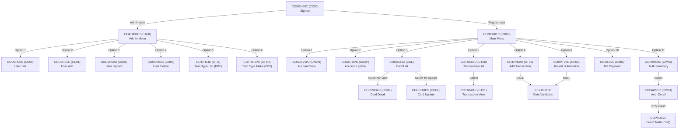
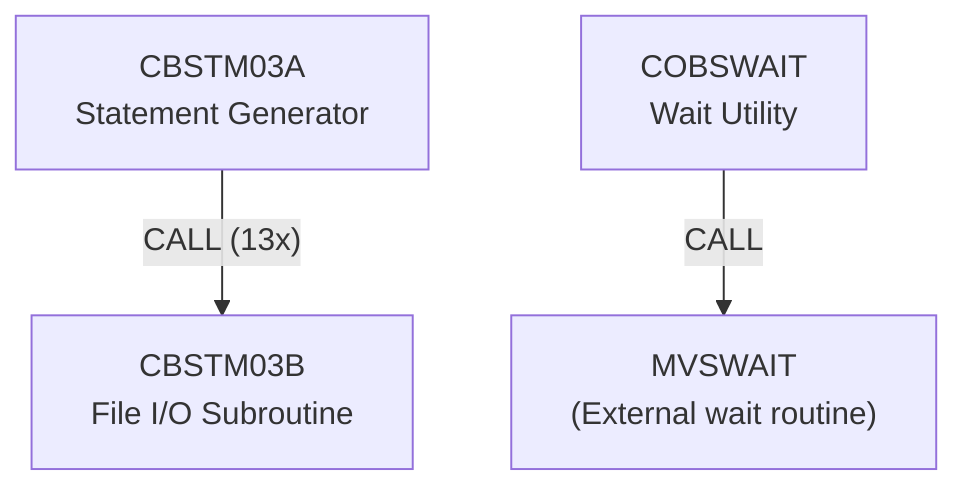
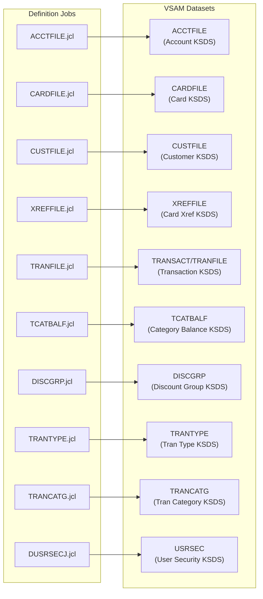
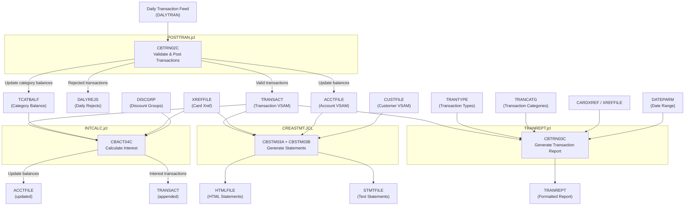
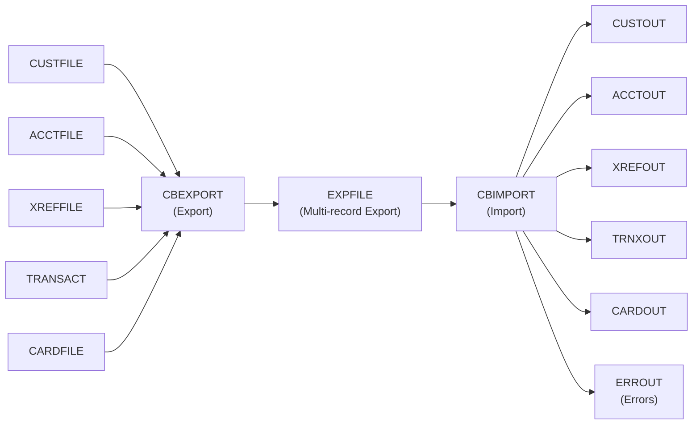

# CardDemo Dependency Map

Inter-program call graphs, dataset lineage, and end-to-end batch pipeline flows for the CardDemo application.

---

## A. Call Graph — Online (CICS) Programs

All online programs communicate through the `CARDDEMO-COMMAREA` (COCOM01Y) passed via `EXEC CICS XCTL`.

### Return Navigation

All programs return to their parent menu via XCTL using `CDEMO-TO-PROGRAM` from the COMMAREA. Card/Account/Transaction programs return to COMEN01C; User management programs return to COADM01C.

---

## B. Call Graph — Batch Programs

Batch programs are standalone executables invoked by JCL (see Section D). No batch-to-batch CALL relationships exist beyond CBSTM03A→CBSTM03B.

---

## C. Dataset Lineage

### C.1 Dataset Producer/Consumer Map

### C.2 Batch Program File Access

| Dataset | Producers (Write/I-O) | Consumers (Read) |
|:--------|:----------------------|:------------------|
| ACCTFILE | ACCTFILE.jcl (define/load), CBTRN02C (I-O), CBACT04C (I-O), COBIL00C (CICS REWRITE) | CBACT01C, CBTRN01C, CBTRN02C, CBACT04C, CBEXPORT, CBSTM03A, COACTVWC, COACTUPC, COBIL00C |
| CARDFILE | CARDFILE.jcl (define/load) | CBACT02C, CBTRN01C, CBEXPORT, COCRDLIC, COCRDSLC, COCRDUPC, COACTVWC |
| CUSTFILE | CUSTFILE.jcl (define/load) | CBCUS01C, CBTRN01C, CBEXPORT, CBSTM03A, COACTVWC, COACTUPC, COCRDSLC, COCRDUPC |
| XREFFILE | XREFFILE.jcl (define/load) | CBACT03C, CBTRN01C, CBTRN02C, CBACT04C, CBEXPORT, CBSTM03A, COACTVWC, COACTUPC, COBIL00C, COTRN02C |
| TRANSACT / TRANFILE | TRANFILE.jcl (define/load), CBTRN01C (W), CBTRN02C (W), CBACT04C (W), COBIL00C (CICS WRITE) | CBEXPORT, CBTRN03C, CBSTM03A, COTRN00C, COTRN01C |
| DALYTRAN | *(External feed — input to batch)* | CBTRN01C, CBTRN02C |
| DALYREJS | CBTRN02C (W) | *(Reviewed manually or by downstream processes)* |
| TCATBALF | TCATBALF.jcl (define/load), CBTRN02C (I-O), CBACT04C (R) | CBTRN02C, CBACT04C |
| DISCGRP | DISCGRP.jcl (define/load) | CBACT04C |
| TRANTYPE | TRANTYPE.jcl (define/load) | CBTRN03C |
| TRANCATG | TRANCATG.jcl (define/load) | CBTRN03C |
| USRSEC | DUSRSECJ.jcl (define/load), COUSR01C (CICS WRITE), COUSR02C (CICS REWRITE), COUSR03C (CICS DELETE) | COSGN00C, COUSR00C, COUSR02C |
| EXPFILE | CBEXPORT (W) | CBIMPORT (R) |
| STMTFILE | CBSTM03A (W) | TXT2PDF1.JCL (convert to PDF) |
| HTMLFILE | CBSTM03A (W) | *(External — HTML statement output)* |
| TRANREPT | CBTRN03C (W) | *(External — printed report output)* |

---

## D. End-to-End Batch Pipeline Flow

### Pipeline Execution Order

1. **POSTTRAN.jcl** (CBTRN02C) — Reads DALYTRAN feed, validates each transaction against XREFFILE/ACCTFILE, posts valid transactions to TRANSACT, rejects invalid ones to DALYREJS, updates ACCTFILE balances and TCATBALF category balances.

2. **INTCALC.jcl** (CBACT04C) — Reads TCATBALF category balances, looks up interest rates via DISCGRP using ACCT-GROUP-ID, calculates interest, writes interest transactions to TRANSACT, updates ACCTFILE balances.

3. **TRANREPT.jcl** (CBTRN03C via TRANREPT.prc) — Unloads TRANSACT via REPROC procedure, sorts by card number, reads TRANTYPE and TRANCATG for descriptions, filters by DATEPARM date range, writes formatted report with page/account/grand totals.

4. **CREASTMT.JCL** (CBSTM03A calling CBSTM03B) — Sorts TRANSACT by card+ID into TRNXFILE, reads account/customer/xref data, generates text statements (STMTFILE) and HTML statements (HTMLFILE).

---

## E. Export/Import Data Flow

The export/import pipeline supports branch migration: CBEXPORT reads all five normalized VSAM files and writes a single sequential export file (EXPFILE) using the multi-record CVEXPORT copybook layout. CBIMPORT reads the export file, validates record types, and writes to individual output files for loading at the target branch.

---

## F. Shared Copybook Dependencies

All online CICS programs share a common set of infrastructure copybooks:

| Copybook | Purpose | Used By |
|:---------|:--------|:--------|
| COCOM01Y | CARDDEMO-COMMAREA — inter-program communication | All 18 online programs |
| COTTL01Y | Screen title constants | All 18 online programs |
| CSDAT01Y | Date/time working storage | All 18 online programs |
| CSMSG01Y | Common screen messages | All 18 online programs |
| DFHAID | CICS attention identifiers | All 18 online programs |
| DFHBMSCA | BMS screen attributes | All 18 online programs |
| CSUSR01Y | User security record | COSGN00C, COADM01C, COMEN01C, COUSR00C–03C, COACTVWC, COACTUPC, COCRDLIC, COCRDSLC, COCRDUPC |
| CVCRD01Y | CICS card work areas | COACTVWC, COACTUPC, COCRDLIC, COCRDSLC, COCRDUPC |
| CSSTRPFY | Store PF key procedure | COACTVWC, COACTUPC, COCRDLIC, COCRDSLC, COCRDUPC |
| CSSETATY | Set field attributes (template) | COACTUPC (21 inclusions), COCRDUPC |
| CSUTLDWY | Date validation working storage | COACTUPC |
| CSUTLDPY | Date validation procedure | COACTUPC |
| CSLKPCDY | Lookup codes (area codes, states) | COACTUPC |
