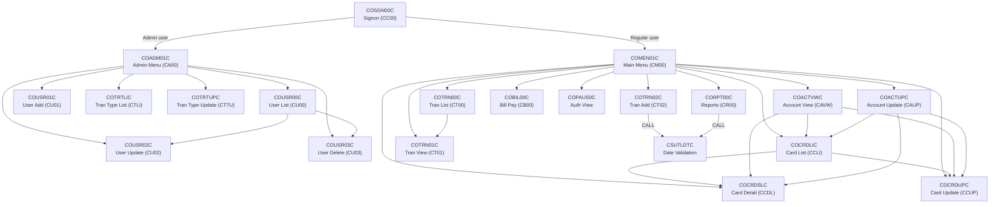
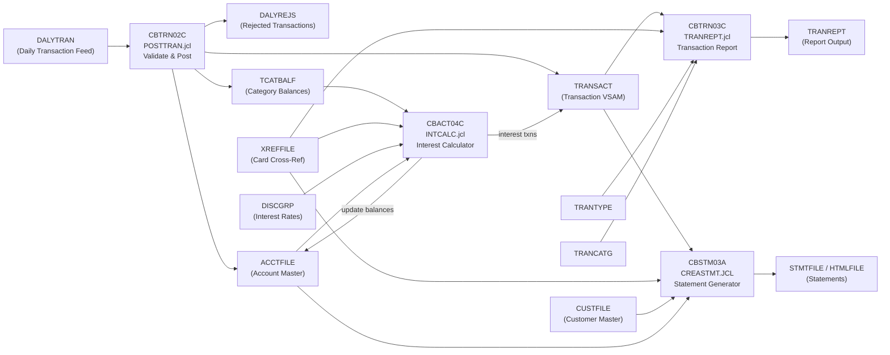

# CardDemo Dependency Map

This document maps inter-program calls, dataset lineage, and the batch processing pipeline.

---

## Call Graph

### Online CICS Program Flow (EXEC CICS XCTL / RETURN TRANSID)



### Batch Program Calls

| Caller | Callee | Mechanism | Purpose |
|---|---|---|---|
| CBSTM03A | CBSTM03B | CALL (subroutine) | Delegate all file I/O (open/close/read/write/rewrite) |
| CBACT01C | COBDATFT | CALL | Assembler date formatting routine |
| COTRN02C (online) | CSUTLDTC | CALL | Date validation via CEEDAYS LE API |
| CORPT00C | CSUTLDTC | CALL | Date validation via CEEDAYS LE API |
| All batch programs | CEE3ABD | CALL | LE abend handling |
| CORPT00C | (TDQ JOBS) | EXEC CICS WRITEQ TD | Submit batch JCL for report generation |

---

## Dataset Lineage

### VSAM Dataset → Program → JCL Mapping

| Dataset | VSAM Type | Defined By | Written By | Read By | I-O By |
|---|---|---|---|---|---|
| ACCTFILE / ACCTDAT | KSDS | ACCTFILE.jcl | (initial load) | CBACT01C, CBTRN01C, CBEXPORT, CBSTM03B, COACTVWC, COACTUPC, COBIL00C, COTRN02C | CBTRN02C, CBACT04C |
| CARDFILE / CARDDAT | KSDS | CARDFILE.jcl | (initial load) | CBACT02C, CBTRN01C, CBEXPORT, COCRDLIC, COCRDSLC, COCRDUPC | — |
| CUSTFILE / CUSTDAT | KSDS | CUSTFILE.jcl | (initial load) | CBCUS01C, CBTRN01C, CBEXPORT, CBSTM03B, COACTVWC, COACTUPC | — |
| XREFFILE / CCXREF / CXACAIX | KSDS + AIX | XREFFILE.jcl | (initial load) | CBACT03C, CBTRN01C, CBTRN02C, CBTRN03C, CBEXPORT, CBSTM03B, CBACT04C, COACTVWC, COACTUPC, COBIL00C, COTRN02C | — |
| TRANSACT / TRANFILE | KSDS | TRANFILE.jcl | CBTRN02C, CBACT04C, COBIL00C, COTRN02C | CBTRN03C, CBEXPORT, COTRN00C, COTRN01C, CORPT00C | — |
| DALYTRAN | Sequential | (external feed) | (external) | CBTRN01C, CBTRN02C | — |
| DALYREJS | ESDS | DALYREJS.jcl | CBTRN02C | — | — |
| TCATBALF | KSDS | TCATBALF.jcl | — | CBACT04C | CBTRN02C |
| DISCGRP | KSDS | DISCGRP.jcl | (initial load) | CBACT04C | — |
| TRANTYPE | KSDS | TRANTYPE.jcl | (initial load) | CBTRN03C | — |
| TRANCATG | KSDS | TRANCATG.jcl | (initial load) | CBTRN03C | — |
| USRSEC | KSDS | DUSRSECJ.jcl | COUSR01C, COUSR02C, COUSR03C | COSGN00C, COADM01C, COUSR00C | — |
| CARDAIX | AIX | CARDFILE.jcl | (built by IDCAMS) | COACTUPC, COCRDLIC, COCRDSLC, COCRDUPC | — |
| EXPFILE | Sequential | CBEXPORT.jcl | CBEXPORT | CBIMPORT | — |

### Non-VSAM Datasets

| Dataset | Format | Created By | Used By |
|---|---|---|---|
| STMTFILE | Sequential (text) | CBSTM03A | (printed output) |
| HTMLFILE | Sequential (HTML) | CBSTM03A | (browser/email output) |
| TRANREPT | Sequential (text) | CBTRN03C | (printed report) |
| DATEPARM | Sequential | TRANREPT.prc (SORT SYSIN) | CBTRN03C |
| OUTFILE, ARRYFILE, VBRCFILE | Sequential | CBACT01C | (debugging/export) |
| ERROUT | Sequential | CBIMPORT | (error/reject records) |

---

## Batch Pipeline Flow

The core batch processing pipeline runs in this sequence:



### Pipeline Step Detail

| Step | JCL Job | Program | Inputs | Outputs | Description |
|---|---|---|---|---|---|
| 1 | POSTTRAN.jcl | CBTRN02C | DALYTRAN, XREFFILE | TRANFILE, DALYREJS; updates ACCTFILE, TCATBALF | Validate daily transactions (overlimit, expiration), post valid ones, write rejects |
| 2 | INTCALC.jcl | CBACT04C | TCATBALF, XREFFILE, DISCGRP, ACCTFILE | TRANSACT (interest txns); updates ACCTFILE | Compute monthly interest using category balances and disclosure group rates |
| 3 | TRANREPT.jcl | CBTRN03C (via TRANREPT.prc) | TRANFILE (sorted), CARDXREF, TRANTYPE, TRANCATG | TRANREPT | Unload/sort transactions by date, produce formatted report with page/account/grand totals |
| 4 | CREASTMT.JCL | CBSTM03A (+ CBSTM03B) | TRNXFILE, XREFFILE, CUSTFILE, ACCTFILE | STMTFILE, HTMLFILE | Generate account statements in text and HTML formats |

### Data Migration Pipeline

```
Export: CBEXPORT (CBEXPORT.jcl)
  Reads: CUSTFILE + ACCTFILE + XREFFILE + TRANSACT + CARDFILE
  Writes: EXPFILE (multi-record sequential, type C/A/X/T/D)

Import: CBIMPORT (CBIMPORT.jcl)
  Reads: EXPFILE
  Writes: CUSTOUT + ACCTOUT + XREFOUT + TRNXOUT + CARDOUT + ERROUT
  (Normalized files with validation; errors to ERROUT)
```

---

## CICS Resource Dependencies

| Resource Type | Name | Used By |
|---|---|---|
| VSAM File | USRSEC | COSGN00C, COADM01C, COUSR00C, COUSR01C, COUSR02C, COUSR03C |
| VSAM File | ACCTDAT | COACTVWC, COACTUPC, COBIL00C, COTRN02C |
| VSAM File | CUSTDAT | COACTVWC, COACTUPC |
| VSAM File | CARDDAT | COCRDLIC, COCRDSLC, COCRDUPC |
| VSAM File | TRANSACT | COTRN00C, COTRN01C, COTRN02C, COBIL00C, CORPT00C |
| VSAM File (AIX) | CXACAIX | COACTVWC, COACTUPC, COBIL00C, COTRN02C |
| VSAM File (AIX) | CARDAIX | COACTUPC, COCRDLIC, COCRDSLC, COCRDUPC |
| VSAM File (AIX) | CCXREF | COTRN02C |
| TD Queue | JOBS | CORPT00C (writes JCL to submit batch report) |
| Transaction | CC00 | COSGN00C |
| Transaction | CA00 | COADM01C |
| Transaction | CM00 | COMEN01C |
| Transaction | CAVW | COACTVWC |
| Transaction | CAUP | COACTUPC |
| Transaction | CB00 | COBIL00C |
| Transaction | CCLI | COCRDLIC |
| Transaction | CCDL | COCRDSLC |
| Transaction | CCUP | COCRDUPC |
| Transaction | CT00 | COTRN00C |
| Transaction | CT01 | COTRN01C |
| Transaction | CT02 | COTRN02C |
| Transaction | CR00 | CORPT00C |
| Transaction | CU00 | COUSR00C |
| Transaction | CU01 | COUSR01C |
| Transaction | CU02 | COUSR02C |
| Transaction | CU03 | COUSR03C |
