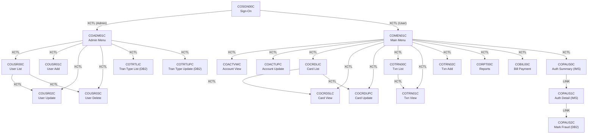
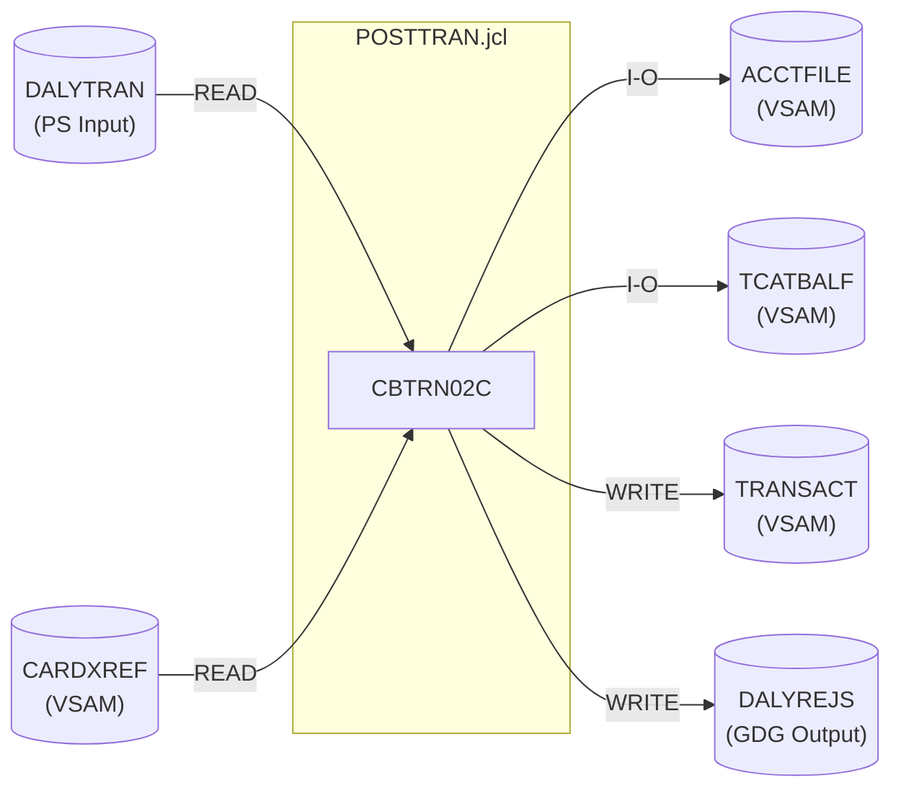
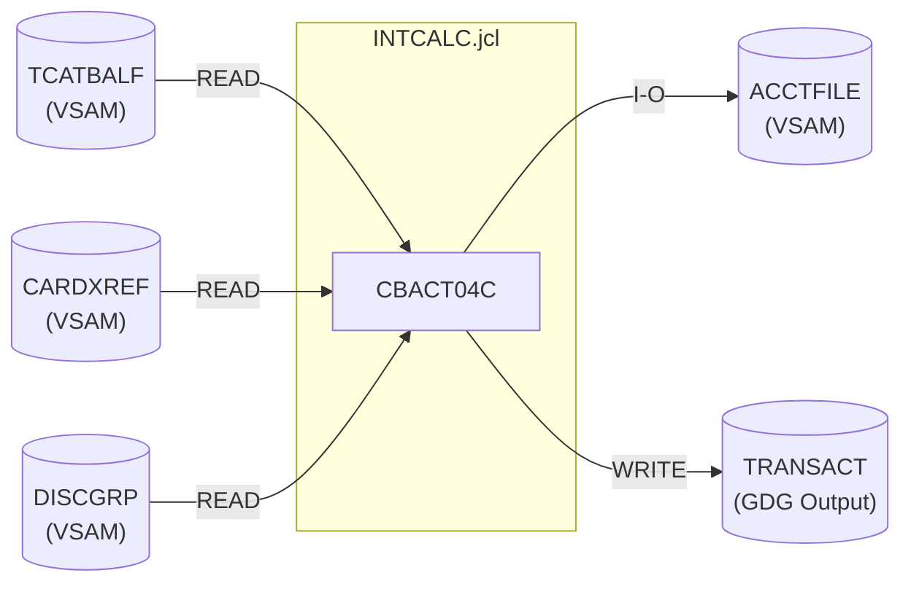
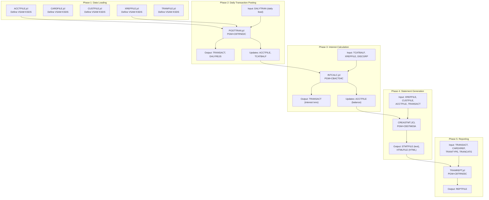
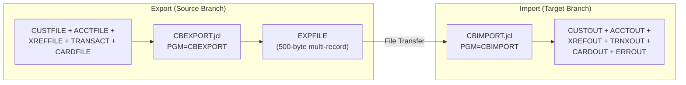
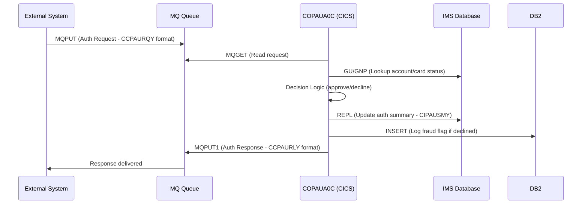

# DEPENDENCY MAP — AWS CardDemo

> Program call graphs, dataset lineage, and end-to-end batch pipeline flows.

---

## 1. Program Call Graph

### 1.1 Online Navigation Tree (CICS XCTL/LINK)



### 1.2 Batch Program Call Relationships

| Caller | Callee | Mechanism | Purpose |
|--------|--------|-----------|---------|
| CBACT01C | COBDATFT | CALL | Assembler date formatting |
| CBACT02C | CEE3ABD | CALL | LE abnormal termination |
| CBACT03C | CEE3ABD | CALL | LE abnormal termination |
| CBCUS01C | CEE3ABD | CALL | LE abnormal termination |
| CBSTM03A | CBSTM03B | CALL | I/O submodule for statement generation |
| COBSWAIT | MVSWAIT | CALL | Assembler wait routine |
| CSUTLDTC | CEEDAYS | CALL | LE date conversion (Lilian days) |
| CORPT00C | CSUTLDTC | CALL (LINK) | Date validation for report parameters |
| COTRN02C | CSUTLDTC | CALL (LINK) | Date validation for transaction dates |

### 1.3 External Dependencies

| External Routine | Type | Called By | Purpose |
|-----------------|------|-----------|---------|
| COBDATFT | Assembler | CBACT01C | Date formatting for account reports |
| MVSWAIT | Assembler | COBSWAIT | Wait for specified centiseconds |
| CEE3ABD | LE Runtime | CBACT02C, CBACT03C, CBCUS01C | Abnormal termination (abend) |
| CEEDAYS | LE Runtime | CSUTLDTC | Convert date to Lilian day number |
| DFHCSDUP | CICS Utility | CBADMCDJ.jcl | CSD (resource definition) updates |
| DSNTIAC | DB2 Utility | COTRTLIC, COTRTUPC | Format DB2 error messages |

---

## 2. Dataset Lineage

### 2.1 VSAM File Usage Matrix

| Dataset (VSAM KSDS) | JCL Define Job | Writers (Programs) | Readers (Programs) |
|---------------------|---------------|-------------------|-------------------|
| **ACCTFILE** (ACCTDATA) | ACCTFILE.jcl | CBACT04C (rewrite), CBTRN02C (rewrite), COACTUPC, COBIL00C, CBIMPORT | CBACT01C, CBACT04C, CBTRN01C, CBTRN02C, COACTVWC, COACTUPC, COBIL00C, COTRN02C, CBEXPORT, CBSTM03A |
| **CARDFILE** (CARDDATA) | CARDFILE.jcl | COCRDUPC, CBIMPORT | CBACT02C, COCRDLIC, COCRDSLC, COCRDUPC, COACTUPC, CBTRN01C, CBEXPORT |
| **CUSTFILE** (CUSTDATA) | CUSTFILE.jcl | CBIMPORT | CBCUS01C, CBTRN01C, COACTVWC, COACTUPC, CBEXPORT, CBSTM03A |
| **CARDXREF** (CARDXREF) | XREFFILE.jcl | CBIMPORT | CBACT03C, CBACT04C, CBTRN01C, CBTRN02C, CBTRN03C, COACTVWC, COACTUPC, COTRN02C, COBIL00C, CBEXPORT, CBSTM03A |
| **TRANSACT** (TRANSACT) | TRANFILE.jcl | CBTRN02C, CBACT04C, COTRN02C, COBIL00C, CBIMPORT | COTRN00C, COTRN01C, CORPT00C, CBTRN03C, CBEXPORT, CBSTM03A |
| **TCATBALF** (TCATBALF) | TCATBALF.jcl | CBTRN02C (rewrite) | CBACT04C |
| **DISCGRP** (DISCGRP) | DISCGRP.jcl | (loaded externally) | CBACT04C |
| **TRANTYPE** (TRANTYPE) | TRANTYPE.jcl | (loaded externally) | CBTRN03C |
| **TRANCATG** (TRANCATG) | TRANCATG.jcl | (loaded externally) | CBTRN03C |
| **USRSEC** (USRSEC) | DUSRSECJ.jcl | COUSR01C, COUSR02C, COUSR03C | COSGN00C, COUSR00C, COUSR01C, COUSR02C, COUSR03C |

### 2.2 Non-VSAM Datasets

| Dataset | Type | JCL Job | Writers | Readers |
|---------|------|---------|---------|---------|
| DALYTRAN | PS (Physical Sequential) | (external feed) | External system | CBTRN01C, CBTRN02C |
| DALYREJS | GDG | DALYREJS.jcl (base) | CBTRN02C | (review/audit) |
| TRANSACT (sequential output) | GDG | DEFGDGB.jcl | CBACT04C (interest txns) | (feeds back to VSAM) |
| REPTFILE | GDG | REPTFILE.jcl | CBTRN03C | (print/archive) |
| EXPFILE | PS | CBEXPORT.jcl | CBEXPORT | CBIMPORT |

### 2.3 JCL Job → Dataset → Program Mapping





---

## 3. End-to-End Batch Pipeline Flow

### 3.1 Daily Processing Pipeline



### 3.2 Pipeline Step Details

| Step | JCL Job | Program | Input Datasets | Output Datasets | Updates | Condition |
|------|---------|---------|---------------|-----------------|---------|-----------|
| 1 | POSTTRAN.jcl | CBTRN02C | DALYTRAN (PS), XREFFILE (VSAM) | TRANFILE (VSAM), DALYREJS (GDG+1) | ACCTFILE, TCATBALF | Daily — processes incoming transactions |
| 2 | INTCALC.jcl | CBACT04C | TCATBALF, XREFFILE, DISCGRP (all VSAM) | TRANSACT (GDG+1) — interest transaction records | ACCTFILE (balance update) | Daily — after POSTTRAN completes |
| 3 | CREASTMT.JCL | CBSTM03A→CBSTM03B | XREFFILE, CUSTFILE, ACCTFILE, TRANSACT (VSAM) | STMTFILE (text), HTMLFILE (HTML) | (none) | Monthly/On-demand — statement generation |
| 4 | TRANREPT.jcl | CBTRN03C (via REPROC) | TRANSACT, CARDXREF, TRANTYPE, TRANCATG | REPTFILE (GDG) | (none) | Daily — after INTCALC |

### 3.3 Export/Import Pipeline (Branch Migration)



### 3.4 IMS Batch Pipeline (Authorization Subsystem)

| Step | Program | Purpose | IMS Operations |
|------|---------|---------|----------------|
| Load | PAUDBLOD | Load authorization data into IMS database | ISRT, GU |
| Purge | CBPAUP0C | Delete expired pending authorizations | GN, GNP, DLET |
| Unload | PAUDBUNL | Unload IMS database to sequential file | GN, GNP |
| GSAM Unload | DBUNLDGS | Unload via GSAM for external processing | GN, GNP, ISRT |

---

## 4. Control-M Scheduling (`app/scheduler/`)

### 4.1 Daily Cycle (Weekday)

```
POSTTRAN (CBTRN02C)
    ↓ [CC=0]
INTCALC (CBACT04C)
    ↓ [CC=0]
TRANREPT (CBTRN03C)
```

### 4.2 Monthly Cycle

```
CREASTMT (CBSTM03A) — Full statement generation for all accounts
```

### 4.3 Weekly Cycle

```
CBEXPORT — Branch data export for migration/backup
TRANBKP  — Transaction file backup
```

### 4.4 On-Demand (from CICS)

```
CORPT00C → submits INTRDRJ1.JCL → triggers INTRDRJ2.JCL
    (Internal reader chain for ad-hoc reports)
```

---

## 5. Cross-System Integration Points

### 5.1 CICS ↔ Batch Bridge

| Online Program | Batch Trigger | Mechanism |
|---------------|--------------|-----------|
| CORPT00C | INTRDRJ1/J2 | TDQ (Transient Data Queue) → Internal Reader |
| COBIL00C | (indirect) | Writes TRANSACT → picked up by TRANREPT batch |
| COTRN02C | (indirect) | Writes TRANSACT → picked up by INTCALC batch |

### 5.2 MQ Integration (Authorization Flow)



### 5.3 IMS Database Hierarchy

```
Root Segment: CIPAUSMY (Authorization Summary)
    Key: PA-ACCT-ID
    │
    └── Dependent Segment: CIPAUDTY (Authorization Detail)
            Key: PA-AUTH-DATE-9C + PA-AUTH-TIME-9C
```

**DL/I Access Patterns:**
- `GU` (Get Unique) — Direct key lookup
- `GN` (Get Next) — Sequential forward read
- `GNP` (Get Next within Parent) — Read children of current root
- `ISRT` (Insert) — Add new segment
- `REPL` (Replace) — Update segment in place
- `DLET` (Delete) — Remove segment
