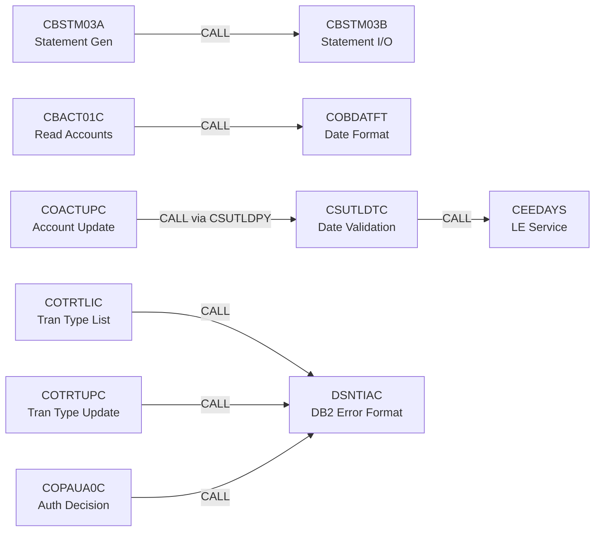
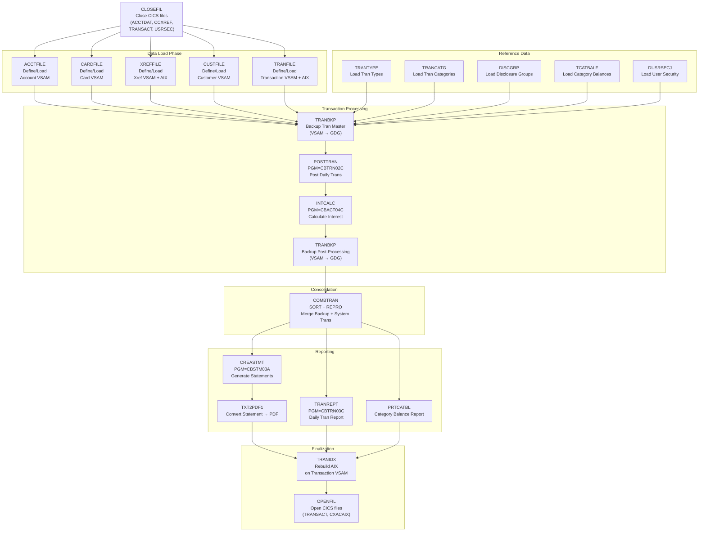
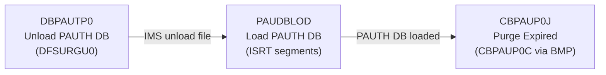
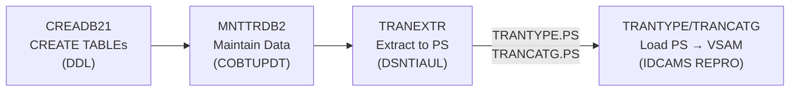
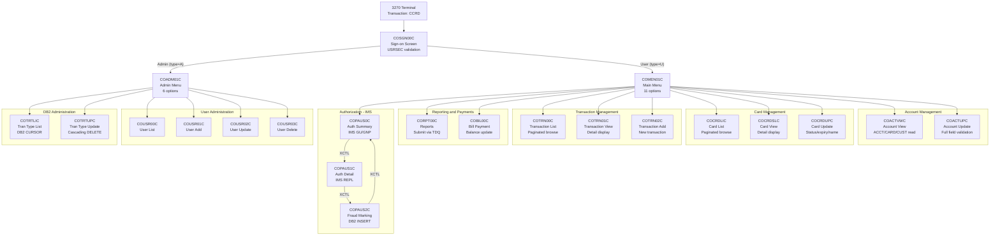

# Dependency Map — CardDemo COBOL Estate

---

## A. Program Call Graph

### A.1 Call Dependency Table

| Caller | Target | Mechanism | Direction |
|--------|--------|-----------|-----------|
| COSGN00C | COADM01C | EXEC CICS XCTL | Sign-on → Admin Menu |
| COSGN00C | COMEN01C | EXEC CICS XCTL | Sign-on → User Menu |
| COMEN01C | COACTVWC | EXEC CICS XCTL | Menu → Account View |
| COMEN01C | COACTUPC | EXEC CICS XCTL | Menu → Account Update |
| COMEN01C | COCRDLIC | EXEC CICS XCTL | Menu → Card List |
| COMEN01C | COCRDSLC | EXEC CICS XCTL | Menu → Card View |
| COMEN01C | COCRDUPC | EXEC CICS XCTL | Menu → Card Update |
| COMEN01C | COTRN00C | EXEC CICS XCTL | Menu → Transaction List |
| COMEN01C | COTRN01C | EXEC CICS XCTL | Menu → Transaction View |
| COMEN01C | COTRN02C | EXEC CICS XCTL | Menu → Transaction Add |
| COMEN01C | CORPT00C | EXEC CICS XCTL | Menu → Reports |
| COMEN01C | COBIL00C | EXEC CICS XCTL | Menu → Bill Payment |
| COMEN01C | COPAUS0C | EXEC CICS XCTL | Menu → Auth Summary (IMS sub-app) |
| COADM01C | COUSR00C | EXEC CICS XCTL | Admin Menu → User List |
| COADM01C | COUSR01C | EXEC CICS XCTL | Admin Menu → User Add |
| COADM01C | COUSR02C | EXEC CICS XCTL | Admin Menu → User Update |
| COADM01C | COUSR03C | EXEC CICS XCTL | Admin Menu → User Delete |
| COADM01C | COTRTLIC | EXEC CICS XCTL | Admin Menu → Tran Type List (DB2) |
| COADM01C | COTRTUPC | EXEC CICS XCTL | Admin Menu → Tran Type Update (DB2) |
| COACTVWC | COMEN01C | EXEC CICS XCTL | Return to Menu |
| COACTUPC | COMEN01C | EXEC CICS XCTL | Return to Menu |
| COCRDLIC | COMEN01C | EXEC CICS XCTL | Return to Menu |
| COCRDSLC | COMEN01C | EXEC CICS XCTL | Return to Menu |
| COCRDUPC | COMEN01C | EXEC CICS XCTL | Return to Menu |
| COTRN00C | COMEN01C | EXEC CICS XCTL | Return to Menu |
| COTRN01C | COMEN01C | EXEC CICS XCTL | Return to Menu |
| COTRN02C | COMEN01C | EXEC CICS XCTL | Return to Menu |
| CORPT00C | COMEN01C | EXEC CICS XCTL | Return to Menu |
| COBIL00C | COMEN01C | EXEC CICS XCTL | Return to Menu |
| COUSR00C | COADM01C | EXEC CICS XCTL | Return to Admin Menu |
| COUSR01C | COADM01C | EXEC CICS XCTL | Return to Admin Menu |
| COUSR02C | COADM01C | EXEC CICS XCTL | Return to Admin Menu |
| COUSR03C | COADM01C | EXEC CICS XCTL | Return to Admin Menu |
| COTRTLIC | COADM01C | EXEC CICS XCTL | Return to Admin Menu |
| COTRTUPC | COADM01C | EXEC CICS XCTL | Return to Admin Menu |
| COPAUS0C | COPAUS1C | EXEC CICS XCTL | Auth Summary → Auth Detail |
| COPAUS1C | COPAUS2C | EXEC CICS XCTL | Auth Detail → Fraud Marking |
| COPAUS2C | COPAUS0C | EXEC CICS XCTL | Fraud Marking → Auth Summary |
| CBACT01C | COBDATFT | CALL 'COBDATFT' | Date formatting subroutine |
| CBSTM03A | CBSTM03B | CALL 'CBSTM03B' | Statement I/O delegation |
| CSUTLDTC | CEEDAYS | CALL 'CEEDAYS' | LE date validation service |
| COACTUPC | CSUTLDTC | CALL 'CSUTLDTC' | Date validation (via CSUTLDPY) |
| COTRTLIC | DSNTIAC | CALL (DSNTIAC) | DB2 error message formatting |
| COTRTUPC | DSNTIAC | CALL (DSNTIAC) | DB2 error message formatting |
| COPAUA0C | DSNTIAC | CALL (DSNTIAC) | DB2 error message formatting |

### A.2 Online Call Graph (Mermaid)

```mermaid
graph TD
    COSGN00C["COSGN00C<br/>Sign-on"]

    subgraph Regular User Flow
        COMEN01C["COMEN01C<br/>Main Menu"]
        COACTVWC["COACTVWC<br/>Account View"]
        COACTUPC["COACTUPC<br/>Account Update"]
        COCRDLIC["COCRDLIC<br/>Card List"]
        COCRDSLC["COCRDSLC<br/>Card View"]
        COCRDUPC["COCRDUPC<br/>Card Update"]
        COTRN00C["COTRN00C<br/>Transaction List"]
        COTRN01C["COTRN01C<br/>Transaction View"]
        COTRN02C["COTRN02C<br/>Transaction Add"]
        CORPT00C["CORPT00C<br/>Reports"]
        COBIL00C["COBIL00C<br/>Bill Payment"]
    end

    subgraph Admin Flow
        COADM01C["COADM01C<br/>Admin Menu"]
        COUSR00C["COUSR00C<br/>User List"]
        COUSR01C["COUSR01C<br/>User Add"]
        COUSR02C["COUSR02C<br/>User Update"]
        COUSR03C["COUSR03C<br/>User Delete"]
        COTRTLIC["COTRTLIC<br/>Tran Type List"]
        COTRTUPC["COTRTUPC<br/>Tran Type Update"]
    end

    subgraph IMS Authorization Sub-app
        COPAUS0C["COPAUS0C<br/>Auth Summary"]
        COPAUS1C["COPAUS1C<br/>Auth Detail"]
        COPAUS2C["COPAUS2C<br/>Fraud Marking"]
    end

    COSGN00C -->|"XCTL (admin)"| COADM01C
    COSGN00C -->|"XCTL (user)"| COMEN01C

    COMEN01C -->|XCTL| COACTVWC
    COMEN01C -->|XCTL| COACTUPC
    COMEN01C -->|XCTL| COCRDLIC
    COMEN01C -->|XCTL| COCRDSLC
    COMEN01C -->|XCTL| COCRDUPC
    COMEN01C -->|XCTL| COTRN00C
    COMEN01C -->|XCTL| COTRN01C
    COMEN01C -->|XCTL| COTRN02C
    COMEN01C -->|XCTL| CORPT00C
    COMEN01C -->|XCTL| COBIL00C
    COMEN01C -->|XCTL| COPAUS0C

    COADM01C -->|XCTL| COUSR00C
    COADM01C -->|XCTL| COUSR01C
    COADM01C -->|XCTL| COUSR02C
    COADM01C -->|XCTL| COUSR03C
    COADM01C -->|XCTL| COTRTLIC
    COADM01C -->|XCTL| COTRTUPC

    COPAUS0C -->|XCTL| COPAUS1C
    COPAUS1C -->|XCTL| COPAUS2C
    COPAUS2C -->|XCTL| COPAUS0C

    COACTVWC -.->|"XCTL (back)"| COMEN01C
    COACTUPC -.->|"XCTL (back)"| COMEN01C
    COCRDLIC -.->|"XCTL (back)"| COMEN01C
    COCRDSLC -.->|"XCTL (back)"| COMEN01C
    COCRDUPC -.->|"XCTL (back)"| COMEN01C
    COTRN00C -.->|"XCTL (back)"| COMEN01C
    COTRN01C -.->|"XCTL (back)"| COMEN01C
    COTRN02C -.->|"XCTL (back)"| COMEN01C
    CORPT00C -.->|"XCTL (back)"| COMEN01C
    COBIL00C -.->|"XCTL (back)"| COMEN01C

    COUSR00C -.->|"XCTL (back)"| COADM01C
    COUSR01C -.->|"XCTL (back)"| COADM01C
    COUSR02C -.->|"XCTL (back)"| COADM01C
    COUSR03C -.->|"XCTL (back)"| COADM01C
    COTRTLIC -.->|"XCTL (back)"| COADM01C
    COTRTUPC -.->|"XCTL (back)"| COADM01C
```

### A.3 Batch Call Graph (Mermaid)

---

## B. Dataset Lineage

### B.1 VSAM Dataset Mapping

| Dataset (DSN) | Logical Name | VSAM Type | RECLN | Key | Programs (Read) | Programs (Write/Update) | JCL Jobs |
|---------------|-------------|-----------|-------|-----|-----------------|------------------------|----------|
| AWS.M2.CARDDEMO.ACCTDATA.VSAM.KSDS | ACCTFILE/ACCTDAT | KSDS | 300 | 11,0 | CBACT01C, CBACT04C, CBSTM03A, CBEXPORT, COACTVWC, COACTUPC, COBIL00C, COCRDSLC, COCRDUPC, COACCT01 | CBACT04C, CBTRN02C, COBIL00C, COACTUPC | ACCTFILE, READACCT, CLOSEFIL, OPENFIL |
| AWS.M2.CARDDEMO.CARDDATA.VSAM.KSDS | CARDFILE | KSDS | 150 | 16,0 | CBACT02C, CBEXPORT, COACTVWC, COACTUPC, COCRDLIC, COCRDSLC, COCRDUPC, COTRN02C | COCRDUPC | CARDFILE, READCARD |
| AWS.M2.CARDDEMO.CUSTDATA.VSAM.KSDS | CUSTFILE | KSDS | 500 | 9,0 | CBCUS01C, CBSTM03A, CBEXPORT, COACTVWC, COCRDSLC | (none) | CUSTFILE, READCUST |
| AWS.M2.CARDDEMO.CARDXREF.VSAM.KSDS | XREFFILE/CCXREF | KSDS | 50 | 16,0 | CBACT03C, CBACT04C, CBSTM03A, CBEXPORT, CBTRN02C, CBTRN03C, COACTVWC, COACTUPC, COTRN00C, COTRN02C, COBIL00C | (none) | XREFFILE, READXREF, CLOSEFIL |
| AWS.M2.CARDDEMO.TRANSACT.VSAM.KSDS | TRANSACT | KSDS | 350 | 16,0 | CBEXPORT, COTRN00C, COTRN01C | CBTRN02C, COTRN02C, COBIL00C | TRANFILE, COMBTRAN, TRANIDX, TRANBKP, CLOSEFIL, OPENFIL |
| AWS.M2.CARDDEMO.TRANTYPE.VSAM.KSDS | TRANTYPE | KSDS | 60 | 2,0 | CBTRN03C, COTRN02C | (none) | TRANTYPE, TRANEXTR |
| AWS.M2.CARDDEMO.TRANCATG.VSAM.KSDS | TRANCATG | KSDS | 60 | 6,0 | CBTRN03C, COTRN02C | (none) | TRANCATG, TRANEXTR |
| AWS.M2.CARDDEMO.TCATBALF.VSAM.KSDS | TCATBALF | KSDS | 50 | 17,0 | CBACT04C | CBTRN02C | TCATBALF, PRTCATBL |
| AWS.M2.CARDDEMO.DISCGRP.VSAM.KSDS | DISCGRP | KSDS | 50 | 16,0 | CBACT04C | (none) | DISCGRP |
| AWS.M2.CARDDEMO.USRSEC | USRSEC | KSDS | 80 | 8,0 | COSGN00C, COUSR00C, COUSR02C, COUSR03C | COUSR01C, COUSR02C, COUSR03C | DUSRSECJ, CLOSEFIL |

### B.2 Sequential Dataset Mapping

| Dataset (DSN) | DD Name | RECLN | Programs (Read) | Programs (Write) | JCL Jobs |
|---------------|---------|-------|-----------------|-----------------|----------|
| AWS.M2.CARDDEMO.DALYTRAN | DALYTRAN | 350 | CBTRN01C, CBTRN02C | (external load) | POSTTRAN |
| AWS.M2.CARDDEMO.TRANSACT.BKUP(n) | BKUP | 350 | SORT (COMBTRAN) | REPROC (TRANBKP) | TRANBKP, COMBTRAN |
| AWS.M2.CARDDEMO.SYSTRAN(n) | SYSTRAN | 350 | SORT (COMBTRAN) | COBIL00C (via batch) | COMBTRAN |
| AWS.M2.CARDDEMO.TRANSACT.COMBINED(n) | COMBINED | 350 | IDCAMS (COMBTRAN) | SORT (COMBTRAN) | COMBTRAN |
| AWS.M2.CARDDEMO.TRANSACT.DALY(n) | DALY | 350 | CBTRN03C | SORT (TRANREPT) | TRANREPT |
| AWS.M2.CARDDEMO.TRANREPT(n) | TRANREPT | 133 | (print/view) | CBTRN03C | TRANREPT |
| AWS.M2.CARDDEMO.TCATBALF.BKUP(n) | BKUP | 50 | SORT (PRTCATBL) | REPROC (PRTCATBL) | PRTCATBL |
| AWS.M2.CARDDEMO.TCATBALF.REPT | REPT | 40 | (print/view) | SORT (PRTCATBL) | PRTCATBL |
| AWS.M2.CARDDEMO.STATEMNT.PS | STMTFILE | 133 | TXT2PDF1 | CBSTM03A/B | CREASTMT, TXT2PDF1 |
| AWS.M2.CARDDEMO.STATEMNT.HTML | HTMLFILE | — | (browser) | CBSTM03A/B | CREASTMT |
| AWS.M2.CARDDEMO.EXPORT.DATA | EXPFILE | 500 | CBIMPORT | CBEXPORT | CBEXPORT, CBIMPORT |
| AWS.M2.CARDDEMO.ACCTDATA.PSCOMP | OUTFILE | 107 | (diagnostics) | CBACT01C | READACCT |
| AWS.M2.CARDDEMO.TRANTYPE.PS | TRANTYPE | 60 | IDCAMS REPRO | DSNTIAUL (DB2) | TRANTYPE, TRANEXTR |
| AWS.M2.CARDDEMO.TRANCATG.PS | TRANCATG | 60 | IDCAMS REPRO | DSNTIAUL (DB2) | TRANCATG, TRANEXTR |
| AWS.M2.CARDDEMO.IMSDATA.DBPAUTP0 | DFSURGU1 | VB 27990 | PAUDBLOD | DFSURGU0 (unload) | DBPAUTP0 |

### B.3 DB2 Table Mapping

| Table | Operations | Programs | JCL Jobs |
|-------|-----------|----------|----------|
| CARDDEMO.TRANSACTION_TYPE | SELECT, INSERT, UPDATE, DELETE | COTRTLIC, COTRTUPC, COBTUPDT | CREADB21, MNTTRDB2, TRANEXTR |
| CARDDEMO.TRANSACTION_TYPE_CATEGORY | SELECT, INSERT, UPDATE, DELETE | COTRTLIC, COTRTUPC, COBTUPDT | CREADB21, MNTTRDB2, TRANEXTR |
| Fraud reporting table | INSERT | COPAUA0C, COPAUS2C | — |

### B.4 IMS Database Mapping

| Database | PSB | Segments | Programs | JCL Jobs |
|----------|-----|----------|----------|----------|
| DBPAUTP0 (PAUTH) | PSBPAUTB | Summary (CIPAUSMY), Detail (CIPAUDTY) | CBPAUP0C, COPAUA0C, COPAUS0C, COPAUS1C, PAUDBLOD, PAUDBUNL, DBUNLDGS | CBPAUP0J, DBPAUTP0 |

### B.5 MQ Queue Mapping

| Queue | Operation | Program | Message Format |
|-------|-----------|---------|---------------|
| Auth Request Queue | MQPUT1 | COPAUA0C | CCPAURQY |
| Auth Response Queue | MQGET | COPAUA0C | CCPAURLY |
| Account Inquiry Queue | MQGET/MQPUT1 | COACCT01 | CVACT01Y |
| Date Inquiry Queue | MQGET/MQPUT1 | CODATE01 | Custom |
| INTRDR (TDQ) | EXEC CICS WRITEQ TD | CORPT00C | JCL stream |

---

## C. End-to-End Batch Pipeline

### C.1 Batch Execution Sequence

The batch cycle runs nightly after online processing closes:

### C.2 Dataset Flow Through Batch Pipeline

| Step | Input Datasets | Output Datasets | Program/Utility |
|------|---------------|-----------------|-----------------|
| CLOSEFIL | — | — | SDSF (CEMT SET FIL CLO) |
| ACCTFILE..DUSRSECJ | Flat PS files | VSAM KSDS clusters | IDCAMS (DEFINE, REPRO) |
| TRANBKP (pre) | TRANSACT.VSAM.KSDS | TRANSACT.BKUP(+1) | IDCAMS REPRO |
| POSTTRAN | DALYTRAN (sequential) | TRANSACT.VSAM.KSDS, ACCTFILE, TCATBALF | CBTRN02C |
| INTCALC | TCATBALF, DISCGRP, XREFFILE, ACCTFILE | ACCTFILE (updated balances) | CBACT04C |
| TRANBKP (post) | TRANSACT.VSAM.KSDS | TRANSACT.BKUP(+1) | IDCAMS REPRO |
| COMBTRAN | TRANSACT.BKUP(0), SYSTRAN(0) | TRANSACT.COMBINED(+1) → TRANSACT.VSAM.KSDS | SORT + IDCAMS REPRO |
| CREASTMT | XREFFILE, CUSTFILE, ACCTFILE, TRNXFILE | STATEMNT.PS, STATEMNT.HTML | CBSTM03A → CBSTM03B |
| TRANREPT | TRANSACT.VSAM.KSDS → DALY(+1) | TRANREPT(+1) | REPROC + SORT + CBTRN03C |
| PRTCATBL | TCATBALF.VSAM.KSDS → BKUP(+1) | TCATBALF.REPT | REPROC + SORT |
| TXT2PDF1 | STATEMNT.PS | STATEMNT.PS.PDF | IKJEFT1B (TXT2PDF) |
| TRANIDX | TRANSACT.VSAM.KSDS | TRANSACT.VSAM.AIX | IDCAMS (DEFINE AIX, BLDINDEX) |
| OPENFIL | — | — | SDSF (CEMT SET FIL OPE) |

### C.3 IMS Sub-App Pipeline

### C.4 DB2 Sub-App Pipeline

---

## D. Online Navigation Flow

### D.1 Transaction IDs

| CICS Transaction | Program | Function |
|-----------------|---------|----------|
| CCRD | COSGN00C | Application entry point (sign-on) |
| CC00 | COMEN01C | Main menu (regular user) |
| CA00 | COADM01C | Admin menu |
| CA01..CA06 | COUSR00C..COUSR03C, COTRTLIC, COTRTUPC | Admin functions |
| CC01..CC11 | COACTVWC..COBIL00C | User functions |

### D.2 Online Navigation Diagram

### D.3 VSAM Files Used by Online Programs

| File (FCT Name) | Programs | Operations |
|------------------|---------|-----------|
| ACCTDAT | COACTVWC, COACTUPC, COBIL00C, COCRDSLC, COCRDUPC | READ, REWRITE |
| CARDFILE | COACTVWC, COACTUPC, COCRDLIC, COCRDSLC, COCRDUPC, COTRN02C | READ, STARTBR, READNEXT, READPREV, ENDBR, REWRITE |
| CUSTFILE | COACTVWC, COCRDSLC | READ |
| CCXREF | COACTVWC, COACTUPC, COTRN00C, COTRN02C, COBIL00C | READ |
| TRANSACT | COTRN00C, COTRN01C, COTRN02C, COBIL00C | READ, WRITE, STARTBR, READNEXT, READPREV, ENDBR |
| TRANTYPE | COTRN02C | READ |
| TRANCATG | COTRN02C | READ |
| USRSEC | COSGN00C, COUSR00C, COUSR01C, COUSR02C, COUSR03C | READ, WRITE, REWRITE, DELETE, STARTBR, READNEXT, READPREV, ENDBR |
