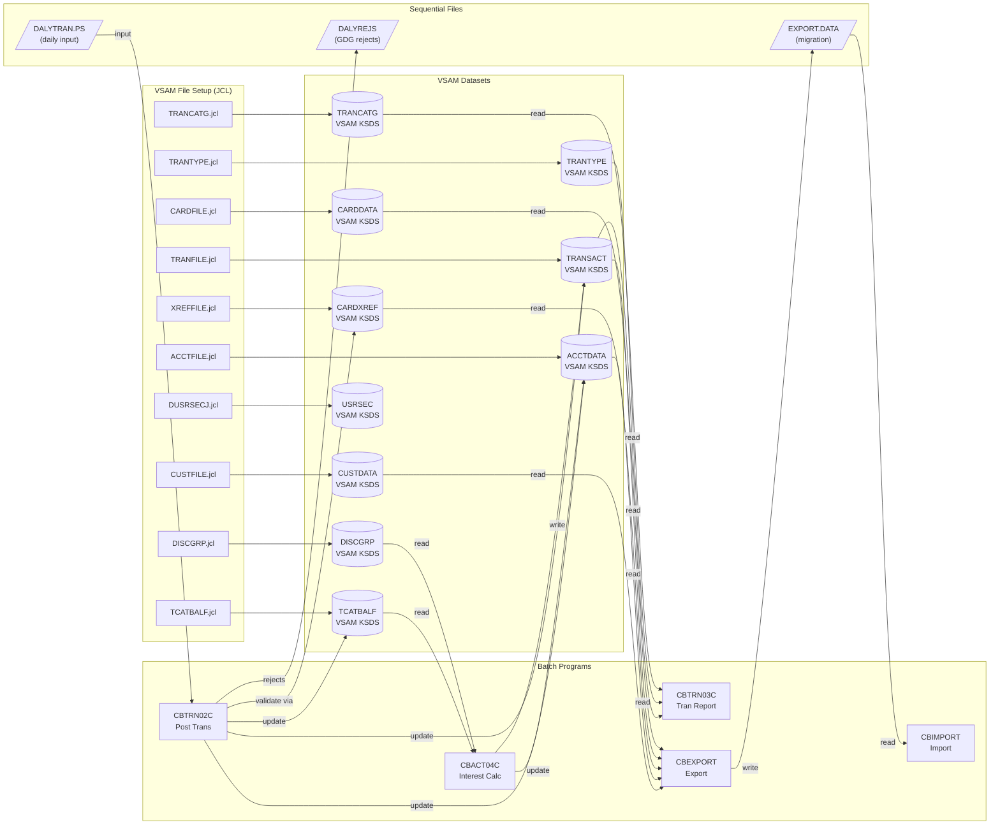

# DEPENDENCY MAP

## Section A: Program Call Graph

### Batch Program CALL Relationships

| Caller | Target | Call Type | Purpose |
|--------|--------|----------|---------|
| CBACT01C | COBDATFT | CALL | Date formatting utility |
| CBACT01C | CEE3ABD | CALL | Abnormal termination handler |
| CBACT02C | CEE3ABD | CALL | Abnormal termination handler |
| CBACT03C | CEE3ABD | CALL | Abnormal termination handler |
| CBACT04C | CEE3ABD | CALL | Abnormal termination handler |
| CBCUS01C | CEE3ABD | CALL | Abnormal termination handler |
| CBEXPORT | CEE3ABD | CALL | Abnormal termination handler |
| CBIMPORT | CEE3ABD | CALL | Abnormal termination handler |
| CBSTM03A | CBSTM03B | CALL (×11) | Subroutine for file I/O operations |
| CBSTM03A | CEE3ABD | CALL | Abnormal termination handler |
| CBTRN01C | CEE3ABD | CALL | Abnormal termination handler |
| CBTRN02C | CEE3ABD | CALL | Abnormal termination handler |
| CBTRN03C | CEE3ABD | CALL | Abnormal termination handler |
| COBSWAIT | MVSWAIT | CALL | System wait utility |
| CSUTLDTC | CEEDAYS | CALL | LE date conversion service |

### Online CICS Program XCTL/LINK Relationships

| Caller | Target | Nav Type | Purpose |
|--------|--------|---------|---------|
| COSGN00C | COADM01C | XCTL | Admin sign-on → Admin menu |
| COSGN00C | COMEN01C | XCTL | User sign-on → Main menu |
| COADM01C | COUSR00C | XCTL (option 1) | Admin → User List |
| COADM01C | COUSR01C | XCTL (option 2) | Admin → User Add |
| COADM01C | COUSR02C | XCTL (option 3) | Admin → User Update |
| COADM01C | COUSR03C | XCTL (option 4) | Admin → User Delete |
| COADM01C | COTRTLIC | XCTL (option 5) | Admin → Tran Type List (DB2) |
| COADM01C | COTRTUPC | XCTL (option 6) | Admin → Tran Type Maint (DB2) |
| COADM01C | *(dynamic)* | XCTL PROGRAM(CDEMO-TO-PROGRAM) | Return to calling program |
| COMEN01C | COACTVWC | XCTL (option 1) | Menu → Account View |
| COMEN01C | COACTUPC | XCTL (option 2) | Menu → Account Update |
| COMEN01C | COCRDLIC | XCTL (option 3) | Menu → Credit Card List |
| COMEN01C | COCRDSLC | XCTL (option 4) | Menu → Credit Card View |
| COMEN01C | COCRDUPC | XCTL (option 5) | Menu → Credit Card Update |
| COMEN01C | COTRN00C | XCTL (option 6) | Menu → Transaction List |
| COMEN01C | COTRN01C | XCTL (option 7) | Menu → Transaction View |
| COMEN01C | COTRN02C | XCTL (option 8) | Menu → Transaction Add |
| COMEN01C | CORPT00C | XCTL (option 9) | Menu → Transaction Reports |
| COMEN01C | COBIL00C | XCTL (option 10) | Menu → Bill Payment |
| COMEN01C | COPAUS0C | XCTL (option 11) | Menu → Pending Auth View |
| CORPT00C | CSUTLDTC | CALL (×2) | Date validation for report dates |
| COTRN02C | CSUTLDTC | CALL (×2) | Date validation for transaction dates |
| COCRDLIC | COCRDUPC | XCTL | Card list → Card update |
| COCRDLIC | COCRDSLC | XCTL | Card list → Card detail |
| COUSR00C | COUSR01C/02C/03C | XCTL PROGRAM(CDEMO-TO-PROGRAM) | User list → User CRUD |
| All CICS progs | *(dynamic)* | XCTL PROGRAM(CDEMO-TO-PROGRAM) | Return to menu/caller |

### Call Graph — Mermaid Diagram

```mermaid
graph TD
    subgraph "Sign-On"
        COSGN00C["COSGN00C<br/>Sign-On"]
    end

    subgraph "Menus"
        COADM01C["COADM01C<br/>Admin Menu"]
        COMEN01C["COMEN01C<br/>Main Menu"]
    end

    subgraph "Account Management"
        COACTVWC["COACTVWC<br/>Account View"]
        COACTUPC["COACTUPC<br/>Account Update"]
    end

    subgraph "Card Management"
        COCRDLIC["COCRDLIC<br/>Card List"]
        COCRDSLC["COCRDSLC<br/>Card Detail"]
        COCRDUPC["COCRDUPC<br/>Card Update"]
    end

    subgraph "Transaction Management"
        COTRN00C["COTRN00C<br/>Tran List"]
        COTRN01C["COTRN01C<br/>Tran View"]
        COTRN02C["COTRN02C<br/>Tran Add"]
        CORPT00C["CORPT00C<br/>Reports"]
        COBIL00C["COBIL00C<br/>Bill Pay"]
    end

    subgraph "User Management"
        COUSR00C["COUSR00C<br/>User List"]
        COUSR01C["COUSR01C<br/>User Add"]
        COUSR02C["COUSR02C<br/>User Update"]
        COUSR03C["COUSR03C<br/>User Delete"]
    end

    subgraph "Batch Programs"
        CBACT01C["CBACT01C<br/>Read Accounts"]
        CBACT02C["CBACT02C<br/>Read Cards"]
        CBACT03C["CBACT03C<br/>Read Xref"]
        CBACT04C["CBACT04C<br/>Interest Calc"]
        CBCUS01C["CBCUS01C<br/>Read Customers"]
        CBTRN01C["CBTRN01C<br/>Post Trans v1"]
        CBTRN02C["CBTRN02C<br/>Post Trans v2"]
        CBTRN03C["CBTRN03C<br/>Tran Report"]
        CBSTM03A["CBSTM03A<br/>Statements"]
        CBSTM03B["CBSTM03B<br/>Stmt Subroutine"]
        CBEXPORT["CBEXPORT<br/>Export"]
        CBIMPORT["CBIMPORT<br/>Import"]
        COBSWAIT["COBSWAIT<br/>Wait"]
    end

    subgraph "Shared Utilities"
        CSUTLDTC["CSUTLDTC<br/>Date Utility"]
        CEE3ABD["CEE3ABD<br/>LE Abort"]
        CEEDAYS["CEEDAYS<br/>LE Date Svc"]
        MVSWAIT["MVSWAIT<br/>System Wait"]
        COBDATFT["COBDATFT<br/>Date Format"]
    end

    %% Sign-on flow
    COSGN00C -->|"XCTL (admin)"| COADM01C
    COSGN00C -->|"XCTL (user)"| COMEN01C

    %% Admin menu
    COADM01C -->|"XCTL opt 1"| COUSR00C
    COADM01C -->|"XCTL opt 2"| COUSR01C
    COADM01C -->|"XCTL opt 3"| COUSR02C
    COADM01C -->|"XCTL opt 4"| COUSR03C

    %% Main menu
    COMEN01C -->|"XCTL"| COACTVWC
    COMEN01C -->|"XCTL"| COACTUPC
    COMEN01C -->|"XCTL"| COCRDLIC
    COMEN01C -->|"XCTL"| COCRDSLC
    COMEN01C -->|"XCTL"| COCRDUPC
    COMEN01C -->|"XCTL"| COTRN00C
    COMEN01C -->|"XCTL"| COTRN01C
    COMEN01C -->|"XCTL"| COTRN02C
    COMEN01C -->|"XCTL"| CORPT00C
    COMEN01C -->|"XCTL"| COBIL00C

    %% Card navigation
    COCRDLIC -->|"XCTL"| COCRDUPC
    COCRDLIC -->|"XCTL"| COCRDSLC

    %% Batch calls
    CBACT01C -->|"CALL"| COBDATFT
    CBSTM03A -->|"CALL ×11"| CBSTM03B
    COBSWAIT -->|"CALL"| MVSWAIT
    CSUTLDTC -->|"CALL"| CEEDAYS
    CORPT00C -->|"CALL ×2"| CSUTLDTC
    COTRN02C -->|"CALL ×2"| CSUTLDTC

    %% CEE3ABD calls
    CBACT01C -->|"CALL"| CEE3ABD
    CBACT02C -->|"CALL"| CEE3ABD
    CBACT03C -->|"CALL"| CEE3ABD
    CBACT04C -->|"CALL"| CEE3ABD
    CBCUS01C -->|"CALL"| CEE3ABD
    CBTRN01C -->|"CALL"| CEE3ABD
    CBTRN02C -->|"CALL"| CEE3ABD
    CBTRN03C -->|"CALL"| CEE3ABD
    CBEXPORT -->|"CALL"| CEE3ABD
    CBIMPORT -->|"CALL"| CEE3ABD
    CBSTM03A -->|"CALL"| CEE3ABD
```



---

## Section B: Dataset Lineage

### VSAM Dataset Map

| Dataset (DSN) | Created By (JCL) | Record Layout | Programs That Read | Programs That Write |
|--------------|------------------|---------------|-------------------|-------------------|
| AWS.M2.CARDDEMO.ACCTDATA.VSAM.KSDS | ACCTFILE.jcl | CVACT01Y (300 bytes, KEY 11,0) | CBACT01C, CBACT04C, CBTRN02C, CBEXPORT, CBSTM03B, COACTUPC, COACTVWC, COBIL00C, COTRN02C | CBTRN02C, CBACT04C, COACTUPC, COBIL00C |
| AWS.M2.CARDDEMO.CARDDATA.VSAM.KSDS | CARDFILE.jcl | CVACT02Y (150 bytes, KEY 16,0) | CBACT02C, CBEXPORT, CBTRN01C, COCRDLIC, COCRDSLC, COCRDUPC, COACTVWC | COCRDUPC |
| AWS.M2.CARDDEMO.CARDDATA.VSAM.AIX | CARDFILE.jcl (STEP40) | AIX on CARDDATA | COCRDLIC (CARDAIX) | — |
| AWS.M2.CARDDEMO.CUSTDATA.VSAM.KSDS | CUSTFILE.jcl | CVCUS01Y (500 bytes, KEY 9,0) | CBCUS01C, CBTRN01C, CBEXPORT, CBSTM03B, COACTUPC, COACTVWC | — |
| AWS.M2.CARDDEMO.TRANSACT.VSAM.KSDS | TRANFILE.jcl | CVTRA05Y (350 bytes, KEY 16,0) | CBTRN02C, CBTRN03C, CBEXPORT, CBSTM03B, COTRN00C, COTRN01C, COBIL00C | CBTRN02C, CBACT04C, COBIL00C, COTRN02C |
| AWS.M2.CARDDEMO.TRANSACT.VSAM.AIX | TRANFILE.jcl (STEP20) | AIX on TRANSACT by card+acct | COTRN00C (CXACAIX), COTRN02C, COBIL00C | — |
| AWS.M2.CARDDEMO.CARDXREF.VSAM.KSDS | XREFFILE.jcl | CVACT03Y (50 bytes, KEY 16,0) | CBACT03C, CBTRN01C, CBTRN02C, CBTRN03C, CBACT04C, CBEXPORT, CBSTM03B, COACTUPC, COACTVWC, COTRN02C, COBIL00C | — |
| AWS.M2.CARDDEMO.CARDXREF.VSAM.AIX | XREFFILE.jcl (STEP20) | AIX on CARDXREF by acct | COACTUPC, COACTVWC | — |
| AWS.M2.CARDDEMO.TCATBALF.VSAM.KSDS | TCATBALF.jcl | CVTRA01Y (50 bytes, KEY 17,0) | CBTRN02C, CBACT04C, COTRN02C | CBTRN02C, CBACT04C |
| AWS.M2.CARDDEMO.TRANTYPE.VSAM.KSDS | TRANTYPE.jcl | CVTRA03Y (60 bytes, KEY 2,0) | CBTRN03C | — |
| AWS.M2.CARDDEMO.TRANCATG.VSAM.KSDS | TRANCATG.jcl | CVTRA04Y (60 bytes, KEY 6,0) | CBTRN03C | — |
| AWS.M2.CARDDEMO.DISCGRP.VSAM.KSDS | DISCGRP.jcl | CVTRA02Y (50 bytes, KEY 16,0) | CBACT04C | — |
| AWS.M2.CARDDEMO.USRSEC.VSAM.KSDS | DUSRSECJ.jcl | CSUSR01Y (80 bytes, KEY 8,0) | COSGN00C, COADM01C, COMEN01C, COUSR00C, COUSR02C, COUSR03C | COUSR01C, COUSR02C, COUSR03C |
| AWS.M2.CARDDEMO.DALYTRAN.PS | External input | CVTRA06Y (350 bytes) | CBTRN01C, CBTRN02C | — |
| AWS.M2.CARDDEMO.DALYREJS (GDG) | DALYREJS.jcl (GDG def) | CVTRA06Y (350 bytes) | — | CBTRN02C |
| AWS.M2.CARDDEMO.EXPORT.DATA | CBEXPORT.jcl | CVEXPORT (500 bytes) | CBIMPORT | CBEXPORT |

### Dataset Lineage — Mermaid Diagram



---

## Section C: End-to-End Batch Pipeline

### Phase 1: File Setup (One-Time / Initial Load)

The following JCL jobs must be run in order to establish the VSAM files:

```
1. ACCTFILE.jcl  → Creates AWS.M2.CARDDEMO.ACCTDATA.VSAM.KSDS (account master)
2. CUSTFILE.jcl  → Creates AWS.M2.CARDDEMO.CUSTDATA.VSAM.KSDS (customer master)
3. CARDFILE.jcl  → Creates AWS.M2.CARDDEMO.CARDDATA.VSAM.KSDS + AIX (card data)
4. TRANFILE.jcl  → Creates AWS.M2.CARDDEMO.TRANSACT.VSAM.KSDS + AIX (transactions)
5. XREFFILE.jcl  → Creates AWS.M2.CARDDEMO.CARDXREF.VSAM.KSDS + AIX (cross-reference)
6. TRANCATG.jcl  → Creates AWS.M2.CARDDEMO.TRANCATG.VSAM.KSDS (tran categories)
7. TRANTYPE.jcl  → Creates AWS.M2.CARDDEMO.TRANTYPE.VSAM.KSDS (tran types)
8. DISCGRP.jcl   → Creates AWS.M2.CARDDEMO.DISCGRP.VSAM.KSDS (disclosure groups)
9. TCATBALF.jcl  → Creates AWS.M2.CARDDEMO.TCATBALF.VSAM.KSDS (category balances)
10. DUSRSECJ.jcl → Creates AWS.M2.CARDDEMO.USRSEC.VSAM.KSDS (user security)
```

Supporting infrastructure:
- `DALYREJS.jcl` → Defines GDG base for daily rejected transactions
- `DEFGDGB.jcl` → Defines GDG bases
- `REPTFILE.jcl` → Defines GDG for report files
- `ESDSRRDS.jcl` → Defines ESDS/RRDS datasets

### Phase 2: Daily Transaction Processing

**Job: POSTTRAN.jcl** (PGM=CBTRN02C)

```
Input:  DALYTRAN.PS (daily transaction file — sequential)
Process:
  1. Read each daily transaction record
  2. Validate card number against XREFFILE (CARDXREF)
  3. Look up account in ACCTFILE (ACCTDATA)
  4. Post valid transactions to TRANFILE (TRANSACT)
  5. Update account balance in ACCTFILE
  6. Update category balance in TCATBALF
  7. Write rejected records to DALYREJS (GDG)
Output: Updated TRANSACT, ACCTDATA, TCATBALF; DALYREJS for rejects
```

### Phase 3: Interest Calculation

**Job: INTCALC.jcl** (PGM=CBACT04C, PARM='2022071800')

```
Input:  TCATBALF (category balances), DISCGRP (interest rates), XREFFILE, ACCTFILE
Process:
  1. For each account, read category balances from TCATBALF
  2. Look up applicable interest rate from DISCGRP (by account group + tran type + category)
  3. Calculate interest for each category
  4. Update account balance in ACCTFILE
  5. Write interest transaction to TRANSACT
Output: Updated ACCTDATA, new records in TRANSACT
```

### Phase 4: Transaction Reporting

**Job: TRANREPT.jcl** (multi-step)

```
Step 1: STEP05R (PROC=REPROC) — Unload TRANSACT VSAM to sequential file
Step 2: STEP05R (PGM=SORT) — Sort and filter transactions by date range
Step 3: STEP10R (PGM=CBTRN03C) — Generate formatted transaction detail report
  - Reads: sorted transaction file, CARDXREF, TRANTYPE, TRANCATG
  - Reads: DATEPARM for date range filter
  - Writes: TRANREPT (formatted report)
Output: Printed transaction report with page/account/grand totals
```

### Phase 5: Account Statements

**Job: CREASTMT.JCL** (multi-step)

```
Step 1: DELDEF01 (IDCAMS) — Clean up previous statement files
Step 2: STEP010 (SORT) — Sort transaction data by card number
Step 3: STEP020 (IDCAMS) — REPRO sorted data into VSAM
Step 4: STEP030 (IEFBR14) — Allocate output files
Step 5: STEP040 (PGM=CBSTM03A) — Generate statements
  - CBSTM03A calls CBSTM03B for I/O (reads TRNXFILE, XREFFILE, CUSTFILE, ACCTFILE)
  - Produces plain text statements (STMTFILE) and HTML statements (HTMLFILE)
Output: Account statements in text and HTML format
```

### Phase 6: Data Migration

**Export: CBEXPORT.jcl** (multi-step)
```
Step 1: STEP01 (IDCAMS) — Define/clear export cluster
Step 2: STEP02 (PGM=CBEXPORT) — Export all entity data
  - Reads: CUSTFILE, ACCTFILE, XREFFILE, TRANSACT, CARDFILE
  - Writes: EXPFILE (multi-record format per CVEXPORT.cpy)
```

**Import: CBIMPORT.jcl** (single step)
```
Step 1: STEP01 (PGM=CBIMPORT)
  - Reads: EXPFILE
  - Writes: CUSTOUT, ACCTOUT, XREFOUT, TRNXOUT, CARDOUT, ERROUT
  - Separates multi-record export into individual entity files
```

### Phase 7: Utility / Verification Operations

| Job | Program | Purpose |
|-----|---------|---------|
| READACCT.jcl | CBACT01C | Verify account file contents |
| READCARD.jcl | CBACT02C | Verify card file contents |
| READCUST.jcl | CBCUS01C | Verify customer file contents |
| READXREF.jcl | CBACT03C | Verify cross-reference file contents |
| PRTCATBL.jcl | SORT | Print transaction category balance file |
| COMBTRAN.jcl | SORT + IDCAMS | Combine/merge transaction files |
| TRANBKP.jcl | REPROC + IDCAMS | Backup and recreate transaction master |
| WAITSTEP.jcl | COBSWAIT | Utility wait step |
| CLOSEFIL.jcl | SDSF | Close CICS files for maintenance |
| OPENFIL.jcl | SDSF | Open CICS files after maintenance |

### Complete Batch Pipeline Flow

```
┌─────────────────────────────────────────────────────────────────┐
│ Phase 1: FILE SETUP (one-time)                                   │
│ ACCTFILE → CUSTFILE → CARDFILE → TRANFILE → XREFFILE →          │
│ TRANCATG → TRANTYPE → DISCGRP → TCATBALF → DUSRSECJ             │
├─────────────────────────────────────────────────────────────────┤
│ Phase 2: DAILY PROCESSING (daily)                                │
│ DALYTRAN.PS ──► POSTTRAN (CBTRN02C)                              │
│   ├─► TRANSACT (posted transactions)                             │
│   ├─► ACCTDATA (updated balances)                                │
│   ├─► TCATBALF (updated category balances)                       │
│   └─► DALYREJS (rejected transactions)                           │
├─────────────────────────────────────────────────────────────────┤
│ Phase 3: INTEREST CALCULATION (periodic)                         │
│ TCATBALF + DISCGRP ──► INTCALC (CBACT04C)                       │
│   ├─► ACCTDATA (updated with interest)                           │
│   └─► TRANSACT (interest transaction records)                    │
├─────────────────────────────────────────────────────────────────┤
│ Phase 4: REPORTING (on-demand)                                   │
│ TRANSACT ──► TRANREPT (unload → sort → CBTRN03C)                │
│   └─► Formatted transaction report                               │
├─────────────────────────────────────────────────────────────────┤
│ Phase 5: STATEMENTS (periodic)                                   │
│ TRANSACT ──► CREASTMT (sort → CBSTM03A/B)                       │
│   ├─► Plain text statements                                      │
│   └─► HTML statements                                            │
├─────────────────────────────────────────────────────────────────┤
│ Phase 6: DATA MIGRATION (ad-hoc)                                 │
│ All files ──► CBEXPORT ──► EXPFILE ──► CBIMPORT ──► Entity files │
└─────────────────────────────────────────────────────────────────┘
```
