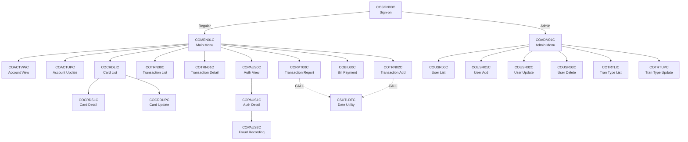
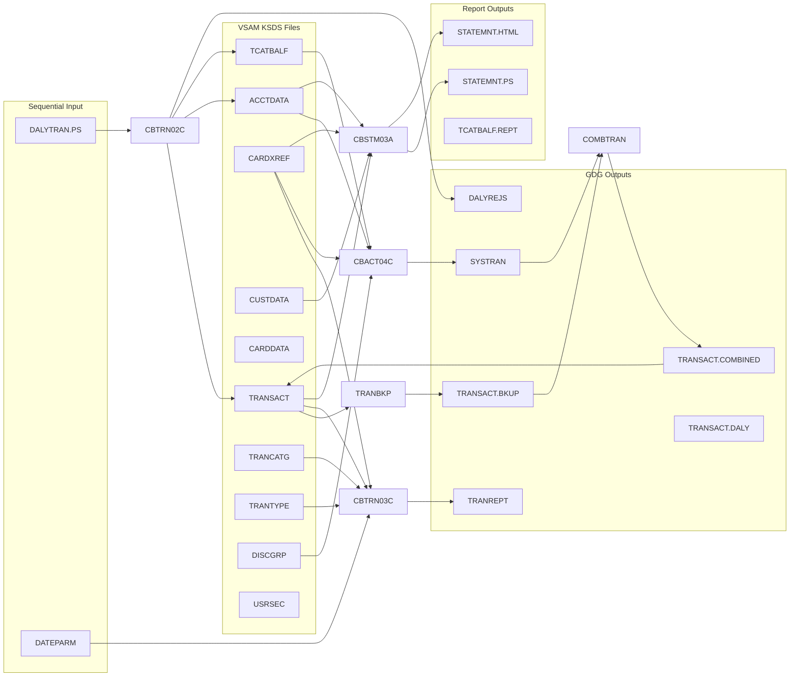
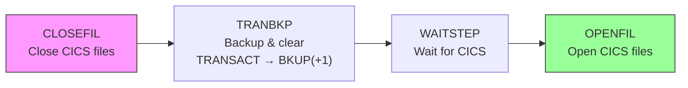
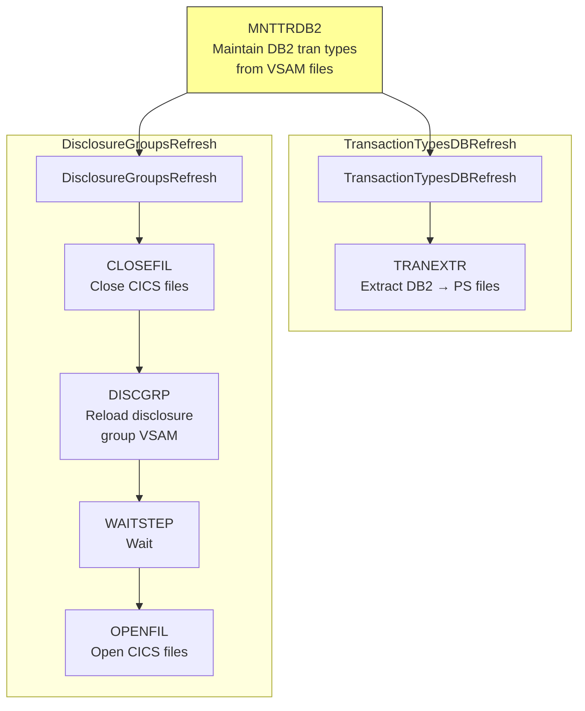
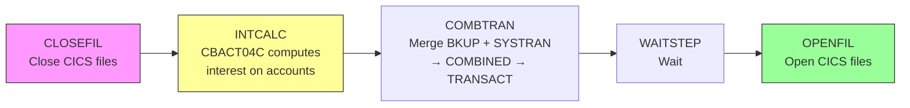
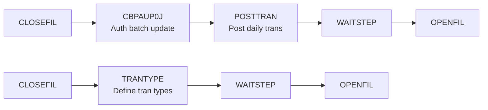

# Dependency Map — CardDemo

> Call graphs, dataset lineage, VSAM file maps, batch pipeline flows, and copybook usage matrix.

---

## Table of Contents

1. [Program Call Graph](#program-call-graph)
2. [Dataset Lineage](#dataset-lineage)
3. [VSAM File Map](#vsam-file-map)
4. [End-to-End Batch Pipeline Flow](#end-to-end-batch-pipeline-flow)
5. [Copybook Usage Matrix](#copybook-usage-matrix)

---

## Program Call Graph

### Inter-Program CALL Statements

| Caller | Called Program | Call Type | Purpose |
|--------|--------------|-----------|---------|
| CBACT01C | CEE3ABD | CALL | Language Environment abend handler |
| CBACT01C | COBDATFT | CALL | Date formatting utility |
| CBACT02C | CEE3ABD | CALL | Language Environment abend handler |
| CBACT03C | CEE3ABD | CALL | Language Environment abend handler |
| CBACT04C | CEE3ABD | CALL | Language Environment abend handler |
| CBCUS01C | CEE3ABD | CALL | Language Environment abend handler |
| CBEXPORT | CEE3ABD | CALL | Language Environment abend handler |
| CBIMPORT | CEE3ABD | CALL | Language Environment abend handler |
| CBSTM03A | CBSTM03B | CALL | Statement file I/O subroutine |
| CBSTM03A | CEE3ABD | CALL | Language Environment abend handler |
| CBTRN01C | CEE3ABD | CALL | Language Environment abend handler |
| CBTRN02C | CEE3ABD | CALL | Language Environment abend handler |
| CBTRN03C | CEE3ABD | CALL | Language Environment abend handler |
| COBSWAIT | MVSWAIT | CALL | System wait service |
| CORPT00C | CSUTLDTC | CALL | Date validation utility |
| COTRN02C | CSUTLDTC | CALL | Date validation utility |
| CSUTLDTC | CEEDAYS | CALL | LE date conversion service |
| COPAUA0C | MQOPEN | CALL | MQ queue open |
| COPAUA0C | MQGET | CALL | MQ queue read |
| COPAUA0C | MQPUT1 | CALL | MQ queue write |
| COPAUA0C | MQCLOSE | CALL | MQ queue close |
| COACCT01 | MQOPEN | CALL | MQ queue open |
| COACCT01 | MQGET | CALL | MQ queue read |
| COACCT01 | MQPUT | CALL | MQ queue write |
| COACCT01 | MQCLOSE | CALL | MQ queue close |
| CODATE01 | MQOPEN | CALL | MQ queue open |
| CODATE01 | MQGET | CALL | MQ queue read |
| CODATE01 | MQPUT | CALL | MQ queue write |
| CODATE01 | MQCLOSE | CALL | MQ queue close |
| DBUNLDGS | CBLTDLI | CALL | IMS DL/I interface |
| PAUDBLOD | CBLTDLI | CALL | IMS DL/I interface |
| PAUDBUNL | CBLTDLI | CALL | IMS DL/I interface |

### EXEC CICS LINK / XCTL Transfers

| Caller | Target | CICS Command | Purpose |
|--------|--------|-------------|---------|
| COSGN00C | COADM01C | EXEC CICS LINK | Sign-on routes admin users to admin menu |
| COSGN00C | COMEN01C | EXEC CICS LINK | Sign-on routes regular users to main menu |
| COMEN01C | _(dynamic)_ | EXEC CICS XCTL PROGRAM(CDEMO-MENU-OPT-PGMNAME) | Main menu routes to selected program |
| COACTUPC | _(dynamic)_ | EXEC CICS XCTL PROGRAM(CDEMO-TO-PROGRAM) | Account update returns to caller |
| COACTVWC | _(dynamic)_ | EXEC CICS XCTL PROGRAM(CDEMO-TO-PROGRAM) | Account view returns to caller |
| COCRDLIC | _(dynamic)_ | EXEC CICS XCTL PROGRAM(CCARD-NEXT-PROG) | Card list navigates to detail/update |
| COCRDLIC | _(dynamic)_ | EXEC CICS XCTL PROGRAM(LIT-MENUPGM) | Card list returns to menu |
| COCRDSLC | _(dynamic)_ | EXEC CICS XCTL PROGRAM(CDEMO-TO-PROGRAM) | Card detail returns to caller |
| COCRDUPC | _(dynamic)_ | EXEC CICS XCTL PROGRAM(CDEMO-TO-PROGRAM) | Card update returns to caller |
| COPAUS1C | _(dynamic)_ | EXEC CICS LINK PROGRAM(WS-PGM-AUTH-FRAUD) | Auth detail links to fraud recording |
| COTRTLIC | _(dynamic)_ | EXEC CICS XCTL PROGRAM(CDEMO-TO-PROGRAM) | Tran type list returns to caller |
| COTRTLIC | _(dynamic)_ | EXEC CICS XCTL PROGRAM(LIT-ADDTPGM) | Tran type list navigates to update |
| COTRTUPC | _(dynamic)_ | EXEC CICS XCTL PROGRAM(CDEMO-TO-PROGRAM) | Tran type update returns to caller |

### CCARD-NEXT-PROG Navigation (COMMAREA)

Programs that set `CCARD-NEXT-PROG` in the COMMAREA to control the next program transfer:

| Program | Sets CCARD-NEXT-PROG To | Meaning |
|---------|------------------------|---------|
| COACTUPC | LIT-THISPGM (self) | Re-enter account update |
| COACTVWC | LIT-THISPGM (self) | Re-enter account view |
| COCRDLIC | LIT-THISPGM, LIT-CARDDTLPGM (COCRDSLC), LIT-CARDUPDPGM (COCRDUPC) | Self, card detail, card update |
| COCRDSLC | LIT-THISPGM (self) | Re-enter card detail |
| COCRDUPC | LIT-THISPGM (self) | Re-enter card update |
| COTRTLIC | LIT-THISPGM (self) | Re-enter tran type list |
| COTRTUPC | LIT-THISPGM (self) | Re-enter tran type update |

### Program Navigation Flow

---

## Dataset Lineage

### Key Dataset Flows by JCL Job

| JCL Job | Input Datasets (DISP=SHR/OLD) | Output Datasets (DISP=NEW,CATLG) | Program |
|---------|------------------------------|----------------------------------|---------|
| READACCT | ACCTDATA.VSAM.KSDS | ACCTDATA.PSCOMP, ACCTDATA.ARRYPS, ACCTDATA.VBPS | CBACT01C |
| READCARD | CARDDATA.VSAM.KSDS | _(display only)_ | CBACT02C |
| READCUST | CUSTDATA.VSAM.KSDS | _(display only)_ | CBCUS01C |
| READXREF | CARDXREF.VSAM.KSDS | _(display only)_ | CBACT03C |
| POSTTRAN | TRANSACT.VSAM.KSDS, DALYTRAN.PS, CARDXREF.VSAM.KSDS, ACCTDATA.VSAM.KSDS, TCATBALF.VSAM.KSDS | DALYREJS(+1) | CBTRN02C |
| INTCALC | TCATBALF.VSAM.KSDS, CARDXREF.VSAM.KSDS (+AIX.PATH), ACCTDATA.VSAM.KSDS, DISCGRP.VSAM.KSDS | SYSTRAN(+1) | CBACT04C |
| TRANBKP | TRANSACT.VSAM.KSDS | TRANSACT.BKUP(+1) | IDCAMS (REPRO) |
| COMBTRAN | TRANSACT.BKUP(0), SYSTRAN(0) | TRANSACT.COMBINED(+1), TRANSACT.VSAM.KSDS (reloaded) | SORT, IDCAMS |
| TRANREPT | TRANSACT.VSAM.KSDS, CARDXREF.VSAM.KSDS, TRANTYPE.VSAM.KSDS, TRANCATG.VSAM.KSDS, DATEPARM | TRANSACT.BKUP(+1), TRANSACT.DALY(+1), TRANREPT(+1) | CBTRN03C |
| CREASTMT | TRANSACT.VSAM.KSDS, CARDXREF.VSAM.KSDS, ACCTDATA.VSAM.KSDS, CUSTDATA.VSAM.KSDS | TRXFL.SEQ, TRXFL.VSAM.KSDS, STATEMNT.PS, STATEMNT.HTML | SORT, CBSTM03A |
| CBEXPORT | CUSTDATA, ACCTDATA, CARDXREF, TRANSACT, CARDDATA (all VSAM) | EXPORT.DATA | CBEXPORT |
| CBIMPORT | EXPORT.DATA | CUSTDATA.IMPORT, ACCTDATA.IMPORT, CARDXREF.IMPORT, TRANSACT.IMPORT, IMPORT.ERRORS | CBIMPORT |
| PRTCATBL | TCATBALF.VSAM.KSDS | TCATBALF.BKUP(+1), TCATBALF.REPT | SORT |
| TXT2PDF1 | STATEMNT.PS | _(PDF output)_ | TXT2PDF (REXX) |
| MNTTRDB2 | TRANTYPE.PS, TRANCATG.PS | DB2 tables (via IKJEFT01) | IKJEFT01 |
| TRANEXTR | DB2 tables | TRANTYPE.PS, TRANCATG.PS (+ BKUP GDGs) | IKJEFT01 |

### Data Flow Diagram

---

## VSAM File Map

| VSAM KSDS | Key | Record Length | Programs That Read | Programs That Write | CICS File Name |
|-----------|-----|-------------|-------------------|--------------------|----|
| ACCTDATA | ACCT-ID (9(11)) | 300 | CBACT01C, CBACT04C, CBSTM03A, CBSTM03B, CBEXPORT, CBTRN01C, CBTRN02C | CBACT04C, CBTRN02C | ACCTDAT |
| TRANSACT | TRAN-ID (X(16)) | 350 | CBTRN02C, CBTRN03C, CORPT00C, COTRN00C, COTRN01C | CBACT04C, CBTRN01C, CBTRN02C, COBIL00C, COTRN02C | TRANSACT |
| CARDXREF | XREF-CARD-NUM (X(16)) | 50 | CBACT03C, CBACT04C, CBSTM03A, CBEXPORT, CBTRN01C, CBTRN02C, CBTRN03C, COPAUA0C | _(loaded by IDCAMS)_ | CARDXREF |
| CUSTDATA | CUST-ID (9(09)) | 500 | CBCUS01C, CBSTM03A, CBSTM03B, CBEXPORT, CBTRN01C, COPAUA0C | _(loaded by IDCAMS)_ | CUSTDAT |
| CARDDATA | CARD-NUM (X(16)) | 150 | CBACT02C, CBEXPORT, CBTRN01C, COCRDLIC, COCRDSLC, COCRDUPC | COCRDUPC | CARDDAT |
| USRSEC | SEC-USR-ID (X(08)) | 80 | COSGN00C, COADM01C, COACTUPC, COUSR00C, COUSR02C, COUSR03C | COUSR01C, COUSR02C, COUSR03C | USRSEC |
| TCATBALF | TRAN-CAT-KEY (composite) | 50 | CBACT04C, CBTRN02C, COTRN02C | CBACT04C, CBTRN02C, COTRN02C | TCATBALF |
| TRANCATG | TRAN-CAT-KEY (composite) | 60 | CBTRN03C | _(loaded by IDCAMS)_ | — |
| TRANTYPE | TRAN-TYPE (X(02)) | 60 | CBTRN03C | _(loaded by IDCAMS)_ | — |
| DISCGRP | DIS-GROUP-KEY (composite) | 50 | CBACT04C | _(loaded by IDCAMS)_ | — |

### CICS File Access Map

| CICS Program | ACCTDAT | TRANSACT | CARDXREF | CUSTDAT | CARDDAT | USRSEC | TCATBALF |
|-------------|---------|----------|----------|---------|---------|--------|----------|
| COACTUPC | R/W | — | R | R | R | R | — |
| COACTVWC | R | — | R | R | R | — | — |
| COBIL00C | R | W | R | — | — | — | — |
| COCRDLIC | — | — | R | R | Browse | — | — |
| COCRDSLC | R | — | R | R | R | — | — |
| COCRDUPC | R | — | R | R | R/W | — | — |
| COSGN00C | — | — | — | — | — | R | — |
| COADM01C | — | — | — | — | — | R | — |
| COMEN01C | — | — | — | — | — | R | — |
| COTRN00C | — | Browse | R | — | — | — | — |
| COTRN01C | — | R | — | — | — | — | — |
| COTRN02C | R/W | W | R | — | — | — | R/W |
| CORPT00C | — | Browse | — | — | — | — | — |
| COUSR00C | — | — | — | — | — | Browse | — |
| COUSR01C | — | — | — | — | — | W | — |
| COUSR02C | — | — | — | — | — | R/W | — |
| COUSR03C | — | — | — | — | — | R/D | — |
| COPAUA0C | R | — | R | R | — | — | — |
| COACCT01 | R/W | — | — | — | — | — | — |

Legend: R=Read, W=Write, R/W=Read+Write, R/D=Read+Delete, Browse=STARTBR/READNEXT

---

## End-to-End Batch Pipeline Flow

### DAILY — Transaction Backup

**Schedule**: Every day (ALL days)  
**Folder**: DAILY-TransactionBackup

**Steps**:
1. **CLOSEFIL** — SDSF command to close VSAM files in CICS (allows batch exclusive access)
2. **TRANBKP** — REPROC procedure backs up TRANSACT.VSAM.KSDS to TRANSACT.BKUP(+1) GDG, then IDCAMS deletes all records from TRANSACT
3. **WAITSTEP** — COBSWAIT pauses to allow CICS operations to settle
4. **OPENFIL** — SDSF command to reopen VSAM files in CICS

### WEEKLY — Transaction Types DB Refresh & Disclosure Groups Refresh

**Schedule**: Saturday  
**Folder**: WEEKLY-TransactionTypesDBRefresh

**Steps**:
1. **MNTTRDB2** — Backs up TRANTYPE.PS and TRANCATG.PS to GDG, then loads data into DB2 tables via IKJEFT01
2. After MNTTRDB2 completes, two parallel sub-flows execute:
   - **TransactionTypesDBRefresh/TRANEXTR** — Extracts from DB2 back to TRANTYPE.PS and TRANCATG.PS (with GDG backups)
   - **DisclosureGroupsRefresh** — CLOSEFIL → DISCGRP (reload DISCGRP VSAM from PS) → WAITSTEP → OPENFIL

### MONTHLY — Interest Calculation

**Schedule**: Monthly  
**Folder**: MONTHLY-InterestCalculation

**Steps**:
1. **CLOSEFIL** — Close CICS files
2. **INTCALC** — Runs CBACT04C with date parameter; reads disclosure groups to determine interest rates per account group/type/category, calculates interest, writes interest transactions to SYSTRAN GDG, updates TCATBALF and ACCTDATA balances
3. **COMBTRAN** — SORT merges TRANSACT.BKUP(0) with SYSTRAN(0) into TRANSACT.COMBINED(+1), then IDCAMS REPROs combined data back into TRANSACT.VSAM.KSDS
4. **WAITSTEP** — Pause
5. **OPENFIL** — Reopen CICS files

### CA-7 Legacy Pipeline

From `CardDemo.ca7`, a separate trigger chain:

---

## Copybook Usage Matrix

### Main Copybooks

| Copybook | CBACT01C | CBACT02C | CBACT03C | CBACT04C | CBCUS01C | CBEXPORT | CBIMPORT | CBSTM03A | CBSTM03B | CBTRN01C | CBTRN02C | CBTRN03C | COBSWAIT | CSUTLDTC |
|----------|:--------:|:--------:|:--------:|:--------:|:--------:|:--------:|:--------:|:--------:|:--------:|:--------:|:--------:|:--------:|:--------:|:--------:|
| CODATECN | ✓ | | | | | | | | | | | | | |
| COSTM01 | | | | | | | | ✓ | | | | | | |
| CUSTREC | | | | | | | | ✓ | | | | | | |
| CVACT01Y | ✓ | | | ✓ | | ✓ | ✓ | ✓ | | ✓ | ✓ | | | |
| CVACT02Y | | ✓ | | | | ✓ | ✓ | | | ✓ | | | | |
| CVACT03Y | | | ✓ | ✓ | | ✓ | ✓ | ✓ | | ✓ | ✓ | ✓ | | |
| CVCUS01Y | | | | | ✓ | ✓ | ✓ | | | ✓ | | | | |
| CVEXPORT | | | | | | ✓ | ✓ | | | | | | | |
| CVTRA01Y | | | | ✓ | | | | | | | ✓ | | | |
| CVTRA02Y | | | | ✓ | | | | | | | | | | |
| CVTRA03Y | | | | | | | | | | | | ✓ | | |
| CVTRA04Y | | | | | | | | | | | | ✓ | | |
| CVTRA05Y | | | | ✓ | | ✓ | ✓ | | | ✓ | ✓ | ✓ | | |
| CVTRA06Y | | | | | | | | | | ✓ | ✓ | | | |
| CVTRA07Y | | | | | | | | | | | | ✓ | | |

### CICS Online Programs

| Copybook | COACTUPC | COACTVWC | COADM01C | COBIL00C | COCRDLIC | COCRDSLC | COCRDUPC | COMEN01C | CORPT00C | COSGN00C | COTRN00C | COTRN01C | COTRN02C | COUSR00C | COUSR01C | COUSR02C | COUSR03C |
|----------|:--------:|:--------:|:--------:|:--------:|:--------:|:--------:|:--------:|:--------:|:--------:|:--------:|:--------:|:--------:|:--------:|:--------:|:--------:|:--------:|:--------:|
| COCOM01Y | ✓ | ✓ | ✓ | ✓ | ✓ | ✓ | ✓ | ✓ | ✓ | ✓ | ✓ | ✓ | ✓ | ✓ | ✓ | ✓ | ✓ |
| COTTL01Y | ✓ | ✓ | ✓ | ✓ | ✓ | ✓ | ✓ | ✓ | ✓ | ✓ | ✓ | ✓ | ✓ | ✓ | ✓ | ✓ | ✓ |
| CSDAT01Y | ✓ | ✓ | ✓ | ✓ | ✓ | ✓ | ✓ | ✓ | ✓ | ✓ | ✓ | ✓ | ✓ | ✓ | ✓ | ✓ | ✓ |
| CSMSG01Y | ✓ | ✓ | ✓ | ✓ | ✓ | ✓ | ✓ | ✓ | ✓ | ✓ | ✓ | ✓ | ✓ | ✓ | ✓ | ✓ | ✓ |
| CSMSG02Y | ✓ | ✓ | | | | ✓ | ✓ | | | | | | | | | | |
| CSUSR01Y | ✓ | ✓ | ✓ | | ✓ | ✓ | ✓ | ✓ | | ✓ | | | | ✓ | ✓ | ✓ | ✓ |
| CVCRD01Y | ✓ | ✓ | | | ✓ | ✓ | ✓ | | | | | | | | | | |
| CVACT01Y | ✓ | ✓ | | ✓ | | | | | | | | | ✓ | | | | |
| CVACT02Y | | ✓ | | | ✓ | ✓ | ✓ | | | | | | | | | | |
| CVACT03Y | ✓ | ✓ | | ✓ | | | | | | | | | ✓ | | | | |
| CVCUS01Y | ✓ | ✓ | | | | ✓ | ✓ | | | | | | | | | | |
| CVTRA05Y | | | | ✓ | | | | | ✓ | | ✓ | ✓ | ✓ | | | | |
| CSSTRPFY | ✓ | ✓ | | | ✓ | ✓ | ✓ | | | | | | | | | | |
| CSSETATY | ✓ | | | | | | | | | | | | | | | | |
| CSUTLDPY | ✓ | | | | | | | | | | | | | | | | |
| CSUTLDWY | ✓ | | | | | | | | | | | | | | | | |
| CSLKPCDY | ✓ | | | | | | | | | | | | | | | | |
| COADM02Y | | | ✓ | | | | | | | | | | | | | | |
| COMEN02Y | | | | | | | | ✓ | | | | | | | | | |
| DFHAID | ✓ | ✓ | ✓ | ✓ | ✓ | ✓ | ✓ | ✓ | ✓ | ✓ | ✓ | ✓ | ✓ | ✓ | ✓ | ✓ | ✓ |
| DFHBMSCA | ✓ | ✓ | ✓ | ✓ | ✓ | ✓ | ✓ | ✓ | ✓ | ✓ | ✓ | ✓ | ✓ | ✓ | ✓ | ✓ | ✓ |
| BMS Copy | COACTUP | COACTVW | COADM01 | COBIL00 | COCRDLI | COCRDSL | COCRDUP | COMEN01 | CORPT00 | COSGN00 | COTRN00 | COTRN01 | COTRN02 | COUSR00 | COUSR01 | COUSR02 | COUSR03 |

### Authorization Sub-App Programs

| Copybook | CBPAUP0C | COPAUA0C | COPAUS0C | COPAUS1C | COPAUS2C | DBUNLDGS | PAUDBLOD | PAUDBUNL |
|----------|:--------:|:--------:|:--------:|:--------:|:--------:|:--------:|:--------:|:--------:|
| CIPAUDTY | ✓ | | ✓ | ✓ | ✓ | ✓ | ✓ | ✓ |
| CIPAUSMY | ✓ | | ✓ | ✓ | | ✓ | ✓ | ✓ |
| CCPAUERY | | ✓ | | | | | | |
| CCPAURLY | | ✓ | | | | | | |
| CCPAURQY | | ✓ | | | | | | |
| IMSFUNCS | | | | | | ✓ | ✓ | ✓ |
| PADFLPCB | | | | | | ✓ | | |
| PASFLPCB | | | | | | ✓ | | |
| PAUTBPCB | | | | | | ✓ | ✓ | ✓ |
| CVACT01Y | | ✓ | ✓ | | | | | |
| CVACT02Y | | | ✓ | | | | | |
| CVACT03Y | | ✓ | ✓ | | | | | |
| CVCUS01Y | | ✓ | ✓ | | | | | |
| COCOM01Y | | | ✓ | ✓ | | | | |
| COTTL01Y | | | ✓ | ✓ | | | | |
| CSDAT01Y | | | ✓ | ✓ | | | | |
| CSMSG01Y | | | ✓ | ✓ | | | | |
| CSMSG02Y | | | ✓ | ✓ | | | | |
| DFHAID | | | ✓ | ✓ | | | | |
| DFHBMSCA | | | ✓ | ✓ | | | | |
| MQ Copies | | ✓ (6) | | | | | | |

### VSAM-MQ Sub-App Programs

| Copybook | COACCT01 | CODATE01 |
|----------|:--------:|:--------:|
| CVACT01Y | ✓ | |
| MQ Copies | ✓ (implicit) | ✓ (implicit) |
