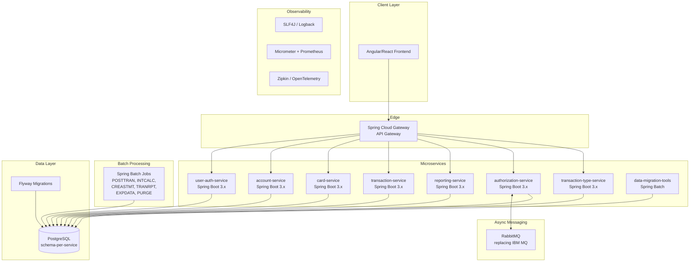

# CardDemo Migration Plan: COBOL/CICS/VSAM → Java 17+ / Spring Boot 3.x / PostgreSQL

## 1. Executive Summary

This document defines the migration plan for the CardDemo credit card management system from its current mainframe platform (COBOL/CICS/VSAM/DB2/IMS) to a modern Java 17+ / Spring Boot 3.x / PostgreSQL stack.

### Scope

| Metric | Value |
|--------|-------|
| COBOL programs | 44 (27 main + 10 sub-app + 7 IMS/MQ) |
| Total COBOL LOC | ~30,175 (code lines across all programs) |
| Target microservices | 8 |
| Target batch jobs | 6 Spring Batch jobs |
| Copybooks (data structures) | 30 |
| JCL jobs to retire | 46 |
| BMS maps to replace | 16 |

### Strategy

- **Pattern:** Strangler Fig — incremental migration with dual-write coexistence during transition
- **Timeline:** 6 phases over 32–42 weeks (8–10 months) with a 4-person team
- **Approach:** Domain-driven decomposition into 8 bounded-context microservices, replacing BMS/3270 screens with REST APIs consumed by a modern frontend

### Key Decisions

1. Single PostgreSQL instance with schema-per-service (simplifies operations; split later if needed)
2. Spring Batch replaces all JCL/batch COBOL (one-to-one job mapping)
3. RabbitMQ replaces IBM MQ for asynchronous authorization flow
4. Flyway for schema versioning; zero hand-written DDL in production
5. EBCDIC → UTF-8 conversion at data migration boundary (one-time ETL)
6. All monetary fields use `java.math.BigDecimal` (mandatory — no `double`/`float`)

---

## 2. Target Architecture

### 2.1 Architecture Diagram



### 2.2 Technology Stack

| Layer | Technology | Replaces |
|-------|-----------|----------|
| Language | Java 17+ (LTS) | COBOL-85 |
| Framework | Spring Boot 3.x | CICS application server |
| Data Access | Spring Data JPA / Hibernate | VSAM I/O, EXEC SQL |
| Batch | Spring Batch 5.x | JCL + batch COBOL |
| Security | Spring Security 6.x + JWT + bcrypt | CSUSR01Y plaintext passwords |
| Database | PostgreSQL 15+ | VSAM KSDS, DB2, IMS DB |
| Migration | Flyway | IDCAMS DEFINE CLUSTER |
| API Spec | OpenAPI 3.0 / Swagger UI | BMS maps + COMMAREA |
| Messaging | RabbitMQ (or Amazon SQS) | IBM MQ |
| Gateway | Spring Cloud Gateway | CICS routing |
| Testing | JUnit 5 + Testcontainers + Mockito | Manual testing |
| Build | Gradle 8.x or Maven | JCL compilation jobs |
| CI/CD | GitHub Actions | Control-M scheduler |
| Frontend | Angular 17+ or React 18+ | BMS/3270 screens |
| Observability | SLF4J, Micrometer, Zipkin | DISPLAY statements |

---

## 3. Data Migration Strategy

### 3.1 VSAM → PostgreSQL Table Mapping

#### `CVACT01Y.cpy` — ACCOUNT-RECORD (300 bytes) → `accounts` table

| COBOL Field | PIC Clause | PostgreSQL Column | Type | Notes |
|------------|-----------|-------------------|------|-------|
| ACCT-ID | 9(11) | `acct_id` | BIGINT PK | Primary key |
| ACCT-ACTIVE-STATUS | X(01) | `active_status` | CHAR(1) | 'Y'/'N' |
| ACCT-CURR-BAL | S9(10)V99 | `curr_bal` | DECIMAL(12,2) | Signed, implied decimal |
| ACCT-CREDIT-LIMIT | S9(10)V99 | `credit_limit` | DECIMAL(12,2) | |
| ACCT-CASH-CREDIT-LIMIT | S9(10)V99 | `cash_credit_limit` | DECIMAL(12,2) | |
| ACCT-OPEN-DATE | X(10) | `open_date` | DATE | CCYYMMDD → ISO date |
| ACCT-EXPIRAION-DATE | X(10) | `expiration_date` | DATE | |
| ACCT-REISSUE-DATE | X(10) | `reissue_date` | DATE | |
| ACCT-CURR-CYC-CREDIT | S9(10)V99 | `curr_cyc_credit` | DECIMAL(12,2) | |
| ACCT-CURR-CYC-DEBIT | S9(10)V99 | `curr_cyc_debit` | DECIMAL(12,2) | |
| ACCT-ADDR-ZIP | X(10) | `addr_zip` | VARCHAR(10) | |
| ACCT-GROUP-ID | X(10) | `group_id` | VARCHAR(10) | Links to disclosure rates |

#### `CVACT02Y.cpy` — CARD-RECORD (150 bytes) → `cards` table

| COBOL Field | PIC Clause | PostgreSQL Column | Type | Notes |
|------------|-----------|-------------------|------|-------|
| CARD-NUM | X(16) | `card_num` | VARCHAR(16) PK | Primary key |
| CARD-ACCT-ID | 9(11) | `acct_id` | BIGINT FK | → accounts.acct_id |
| CARD-CVV-CD | 9(03) | `cvv_cd` | SMALLINT | Stored encrypted |
| CARD-EMBOSSED-NAME | X(50) | `embossed_name` | VARCHAR(50) | |
| CARD-EXPIRAION-DATE | X(10) | `expiration_date` | DATE | |
| CARD-ACTIVE-STATUS | X(01) | `active_status` | CHAR(1) | 'Y'/'N' |

#### `CVCUS01Y.cpy` — CUSTOMER-RECORD (500 bytes) → `customers` table

| COBOL Field | PIC Clause | PostgreSQL Column | Type | Notes |
|------------|-----------|-------------------|------|-------|
| CUST-ID | 9(09) | `cust_id` | BIGINT PK | Primary key |
| CUST-FIRST-NAME | X(25) | `first_name` | VARCHAR(25) | |
| CUST-MIDDLE-NAME | X(25) | `middle_name` | VARCHAR(25) | |
| CUST-LAST-NAME | X(25) | `last_name` | VARCHAR(25) | |
| CUST-ADDR-LINE-1 | X(50) | `addr_line_1` | VARCHAR(50) | |
| CUST-ADDR-LINE-2 | X(50) | `addr_line_2` | VARCHAR(50) | |
| CUST-ADDR-LINE-3 | X(50) | `addr_line_3` | VARCHAR(50) | |
| CUST-ADDR-STATE-CD | X(02) | `addr_state_cd` | CHAR(2) | Validated via lookup |
| CUST-ADDR-COUNTRY-CD | X(03) | `addr_country_cd` | CHAR(3) | |
| CUST-ADDR-ZIP | X(10) | `addr_zip` | VARCHAR(10) | |
| CUST-PHONE-NUM-1 | X(15) | `phone_num_1` | VARCHAR(15) | |
| CUST-PHONE-NUM-2 | X(15) | `phone_num_2` | VARCHAR(15) | |
| CUST-SSN | 9(09) | `ssn` | VARCHAR(11) | Stored encrypted |
| CUST-GOVT-ISSUED-ID | X(20) | `govt_issued_id` | VARCHAR(20) | |
| CUST-DOB-YYYY-MM-DD | X(10) | `dob` | DATE | |
| CUST-EFT-ACCOUNT-ID | X(10) | `eft_account_id` | VARCHAR(10) | |
| CUST-PRI-CARD-HOLDER-IND | X(01) | `primary_card_holder` | BOOLEAN | 'Y'→true |
| CUST-FICO-CREDIT-SCORE | 9(03) | `fico_credit_score` | SMALLINT | Range 300–850 |

#### `CVACT03Y.cpy` — CARD-XREF-RECORD (50 bytes) → `card_xref` table

| COBOL Field | PIC Clause | PostgreSQL Column | Type | Notes |
|------------|-----------|-------------------|------|-------|
| XREF-CARD-NUM | X(16) | `card_num` | VARCHAR(16) PK/FK | → cards.card_num |
| XREF-CUST-ID | 9(09) | `cust_id` | BIGINT FK | → customers.cust_id |
| XREF-ACCT-ID | 9(11) | `acct_id` | BIGINT FK | → accounts.acct_id |

> **Note:** The card_xref table can alternatively be modeled as foreign keys directly on the `cards` table. Keeping it as a separate join table preserves the existing many-to-many semantics (one card ↔ one account ↔ one customer).

#### `CVTRA05Y.cpy` — TRAN-RECORD (350 bytes) → `transactions` table

| COBOL Field | PIC Clause | PostgreSQL Column | Type | Notes |
|------------|-----------|-------------------|------|-------|
| TRAN-ID | X(16) | `tran_id` | VARCHAR(16) PK | Primary key |
| TRAN-TYPE-CD | X(02) | `type_cd` | CHAR(2) FK | → tran_types.type_cd |
| TRAN-CAT-CD | 9(04) | `cat_cd` | SMALLINT FK | → tran_categories |
| TRAN-SOURCE | X(10) | `source` | VARCHAR(10) | |
| TRAN-DESC | X(100) | `description` | VARCHAR(100) | |
| TRAN-AMT | S9(09)V99 | `amount` | DECIMAL(11,2) | BigDecimal mandatory |
| TRAN-MERCHANT-ID | 9(09) | `merchant_id` | BIGINT | |
| TRAN-MERCHANT-NAME | X(50) | `merchant_name` | VARCHAR(50) | |
| TRAN-MERCHANT-CITY | X(50) | `merchant_city` | VARCHAR(50) | |
| TRAN-MERCHANT-ZIP | X(10) | `merchant_zip` | VARCHAR(10) | |
| TRAN-CARD-NUM | X(16) | `card_num` | VARCHAR(16) FK | → cards.card_num |
| TRAN-ORIG-TS | X(26) | `orig_ts` | TIMESTAMP | Original timestamp |
| TRAN-PROC-TS | X(26) | `proc_ts` | TIMESTAMP | Processing timestamp |

#### `CSUSR01Y.cpy` — SEC-USER-DATA (80 bytes) → `users` table

| COBOL Field | PIC Clause | PostgreSQL Column | Type | Notes |
|------------|-----------|-------------------|------|-------|
| SEC-USR-ID | X(08) | `user_id` | VARCHAR(8) PK | Primary key |
| SEC-USR-FNAME | X(20) | `first_name` | VARCHAR(20) | |
| SEC-USR-LNAME | X(20) | `last_name` | VARCHAR(20) | |
| SEC-USR-PWD | X(08) | `password_hash` | VARCHAR(72) | **bcrypt hash** (CRITICAL: plaintext → hashed) |
| SEC-USR-TYPE | X(01) | `user_type` | CHAR(1) | 'A'=admin, 'U'=user |

#### `CVTRA01Y.cpy` — TRAN-CAT-BAL-RECORD (50 bytes) → `tran_cat_balances` table

| COBOL Field | PIC Clause | PostgreSQL Column | Type |
|------------|-----------|-------------------|------|
| TRANCAT-ACCT-ID | 9(11) | `acct_id` | BIGINT FK |
| TRANCAT-TYPE-CD | X(02) | `type_cd` | CHAR(2) |
| TRANCAT-CD | 9(04) | `cat_cd` | SMALLINT |
| TRAN-CAT-BAL | S9(09)V99 | `balance` | DECIMAL(11,2) |

> Composite PK: (`acct_id`, `type_cd`, `cat_cd`)

#### `CVTRA02Y.cpy` — DIS-GROUP-RECORD (50 bytes) → `disclosure_groups` table

| COBOL Field | PIC Clause | PostgreSQL Column | Type |
|------------|-----------|-------------------|------|
| DIS-ACCT-GROUP-ID | X(10) | `group_id` | VARCHAR(10) |
| DIS-TRAN-TYPE-CD | X(02) | `tran_type_cd` | CHAR(2) |
| DIS-TRAN-CAT-CD | 9(04) | `tran_cat_cd` | SMALLINT |
| DIS-INT-RATE | S9(04)V99 | `interest_rate` | DECIMAL(6,2) |

> Composite PK: (`group_id`, `tran_type_cd`, `tran_cat_cd`)

#### `CVTRA03Y.cpy` — TRAN-TYPE-RECORD (60 bytes) → `tran_types` table

| COBOL Field | PIC Clause | PostgreSQL Column | Type |
|------------|-----------|-------------------|------|
| TRAN-TYPE | X(02) | `type_cd` | CHAR(2) PK |
| TRAN-TYPE-DESC | X(50) | `description` | VARCHAR(50) |

#### `CVTRA04Y.cpy` — TRAN-CAT-RECORD (60 bytes) → `tran_categories` table

| COBOL Field | PIC Clause | PostgreSQL Column | Type |
|------------|-----------|-------------------|------|
| TRAN-TYPE-CD | X(02) | `type_cd` | CHAR(2) FK |
| TRAN-CAT-CD | 9(04) | `cat_cd` | SMALLINT |
| TRAN-CAT-TYPE-DESC | X(50) | `description` | VARCHAR(50) |

> Composite PK: (`type_cd`, `cat_cd`)

#### `CVTRA06Y.cpy` — DALYTRAN-RECORD (350 bytes) → `daily_transactions` staging table

Same structure as `transactions` table (mirrors CVTRA05Y) — used as an ingest staging table for daily batch posting. Records move from `daily_transactions` → `transactions` during the POSTTRAN batch step.

### 3.2 DB2 Tables → PostgreSQL (Direct Migration)

| DB2 Table | PostgreSQL Table | Service Owner |
|-----------|-----------------|---------------|
| TRNTYPE | `tran_types` | transaction-type-service |
| TRNTYCAT | `tran_categories` | transaction-type-service |
| AUTHFRDS (fraud flags) | `fraud_flags` | authorization-service |

These tables already use relational SQL — migration is a straightforward schema port with minimal transformation.

### 3.3 IMS Hierarchical DB → PostgreSQL Relational

| IMS Segment | Relationship | PostgreSQL Table | Columns |
|-------------|-------------|-----------------|---------|
| PAUTSMY (root) | Parent | `pending_auth_summary` | `auth_id` PK, `card_num`, `request_ts`, `status`, `total_amount` |
| PAUTDTY (child) | Child of PAUTSMY | `pending_auth_detail` | `detail_id` PK, `auth_id` FK, `merchant_id`, `amount`, `auth_code`, `response_ts` |

DL/I call mapping:
| DL/I Call | JPA Equivalent |
|-----------|---------------|
| GU (Get Unique) | `findById()` |
| GN (Get Next) | `findAll()` with cursor/pagination |
| GNP (Get Next within Parent) | `findByAuthId()` (FK-based query) |
| ISRT (Insert) | `save()` |
| REPL (Replace) | `save()` (update) |
| DLET (Delete) | `deleteById()` |

### 3.4 Data Conversion Rules

| COBOL Construct | Java/PostgreSQL Equivalent | Rule |
|----------------|---------------------------|------|
| PIC S9(n)V99 (DISPLAY) | `BigDecimal(n+2, 2)` | Trailing overpunch sign: `{`=+0, `A`-`I`=+1..+9, `}`=-0, `J`-`R`=-1..-9 |
| PIC S9(n)V99 COMP-3 | `BigDecimal` | Packed decimal: each byte = 2 digits, last nibble = sign (C=+, D=-) |
| PIC S9(n) COMP | `long` or `int` | Binary big-endian (2/4/8 bytes depending on n) |
| PIC X(n) | `String` | Trim trailing spaces |
| PIC 9(n) | `long` | Unsigned numeric display |
| EBCDIC encoding | UTF-8 | One-time conversion using IBM CP037 codepage |
| Date PIC X(10) | `java.time.LocalDate` | Parse CCYYMMDD or YYYY-MM-DD format |
| Timestamp PIC X(26) | `java.time.LocalDateTime` | ISO-8601 format after conversion |
| FILLER fields | — | Discarded (padding only) |

### 3.5 Flyway Migration Naming Convention

```
V001__create_users_table.sql
V002__create_accounts_table.sql
V003__create_customers_table.sql
V004__create_cards_table.sql
V005__create_card_xref_table.sql
V006__create_transactions_table.sql
V007__create_daily_transactions_table.sql
V008__create_tran_types_table.sql
V009__create_tran_categories_table.sql
V010__create_tran_cat_balances_table.sql
V011__create_disclosure_groups_table.sql
V012__create_pending_auth_summary_table.sql
V013__create_pending_auth_detail_table.sql
V014__create_fraud_flags_table.sql
V015__seed_tran_types_from_db2.sql
V016__seed_tran_categories_from_db2.sql
```

---

## 4. Phased Migration Plan

### Phase 0 — Foundation (Weeks 1–4)

**Objective:** Establish the shared platform infrastructure that all subsequent phases depend on.

| Deliverable | Description |
|-------------|-------------|
| Java DTOs from copybooks | Generate Java record/class for every copybook in `app/cpy/` (30 copybooks) |
| Validation library | Replace `CSLKPCDY.cpy` (1,318 lines: US state codes, ZIP prefixes, NANPA phone area codes) and `CSUTLDTC.cbl` (date validation using CEEDAYS) with a `carddemo-validation` shared library |
| PostgreSQL schema | All 14 tables via Flyway migrations (V001–V016) |
| Spring Security config | JWT-based auth with bcrypt password hashing (replaces plaintext SEC-USR-PWD) |
| API contracts | OpenAPI 3.0 specs for all 8 services (design-first approach) |
| ASM replacements | `COBDATFT` → `java.time.DateTimeFormatter`, `MVSWAIT` → `Thread.sleep()` / `ScheduledExecutorService` |
| CI/CD pipeline | GitHub Actions: build → test → SAST → container image → deploy |
| Test harness | Testcontainers (PostgreSQL) + JUnit 5 base test classes |
| Shared libraries | `carddemo-commons` (DTOs, error handling), `carddemo-security` (JWT parsing) |

### Phase 1 — Pilot: User CRUD + Statement Generation (Weeks 5–9)

**Objective:** Prove the migration approach with low-risk, self-contained programs.

#### Online: user-auth-service

| COBOL Program | LOC | Java Target | REST Endpoint |
|--------------|-----|-------------|---------------|
| COSGN00C | 260 | `AuthController.login()` | POST `/api/auth/login` |
| COUSR00C | 695 | `UserController.list()` | GET `/api/users` |
| COUSR01C | 299 | `UserController.create()` | POST `/api/users` |
| COUSR02C | 414 | `UserController.update()` | PUT `/api/users/{id}` |
| COUSR03C | 359 | `UserController.delete()` | DELETE `/api/users/{id}` |

- Map USRSEC VSAM → `users` table
- Spring Security authentication replacing COSGN00C sign-on logic
- Role-based access: `SEC-USR-TYPE` 'A' → ROLE_ADMIN, 'U' → ROLE_USER

#### Batch: reporting-service (Spring Batch)

| COBOL Program | LOC | Spring Batch Job | Output |
|--------------|-----|-----------------|--------|
| CBSTM03A | 924 | `StatementGenerationJob` | Text + HTML statements |
| CBSTM03B | 230 | (I/O sub-module, inlined) | — |

- Replaces CREASTMT JCL
- ItemReader: query `transactions` + `accounts` + `customers` joined via `card_xref`
- ItemWriter: Thymeleaf templates for HTML output, formatted text for plain statements

### Phase 2 — Quick Win: Transaction Type (DB2 → JPA) (Weeks 10–14)

**Objective:** Migrate the simplest DB2 programs — already use SQL, minimal transformation.

| COBOL Program | LOC | Java Target | REST Endpoint |
|--------------|-----|-------------|---------------|
| COTRTLIC | 2,098 | `TranTypeController.list()` | GET `/api/tran-types` |
| COTRTUPC | 1,702 | `TranTypeController.createUpdateDelete()` | POST/PUT/DELETE `/api/tran-types` |
| COBTUPDT | 237 | `TranTypeBatchJob` | Spring Batch (replaces MNTTRDB2 JCL) |

**Key transformations:**
- DB2 embedded SQL cursors → Spring Data JPA `Pageable` queries
- DB2 `DECLARE CURSOR ... FETCH NEXT` → `JpaRepository.findAll(Pageable)`
- Cascading DELETE (COTRTUPC) → JPA `CascadeType.REMOVE` or explicit service logic
- `EXEC SQL INSERT/UPDATE/DELETE` → `JpaRepository.save()` / `deleteById()`

### Phase 3 — Core: Account & Card Management (Weeks 15–24)

**Objective:** Migrate the business-critical account and card subsystems.

#### account-service

| COBOL Program | LOC | Java Target |
|--------------|-----|-------------|
| COACTVWC | 941 | `AccountViewController` — read-only display |
| COACTUPC | 4,236 | **Decomposed into 3 components** (see below) |
| COACCT01 (MQ) | 620 | `AccountInquiryListener` — MQ-driven lookup |

**CRITICAL: COACTUPC.cbl Decomposition (4,236 LOC → 3+ classes)**

| Component | Responsibility | Estimated LOC |
|-----------|---------------|---------------|
| `AccountViewController` | Read-only display logic, field formatting | ~800 |
| `AccountEditService` | Update logic, field-level change detection, VSAM writes | ~1,200 |
| `AccountValidationService` | Replaces 35× `CSSETATY` COPY REPLACING instances + CSLKPCDY lookups (state/ZIP/phone/date validation) | ~600 |
| `AccountController` | REST API layer, request/response mapping | ~400 |

#### card-service

| COBOL Program | LOC | Java Target | REST Endpoint |
|--------------|-----|-------------|---------------|
| COCRDLIC | 1,459 | `CardController.list()` | GET `/api/cards` |
| COCRDSLC | 887 | `CardController.get()` | GET `/api/cards/{num}` |
| COCRDUPC | 1,560 | `CardController.update()` | PUT `/api/cards/{num}` |

#### Batch jobs

| COBOL Program | LOC | Spring Batch Job |
|--------------|-----|-----------------|
| CBACT01C | 430 | `AccountReportJob` (date formatting via java.time) |
| CBACT02C | 178 | `AccountCloseJob` |
| CBACT03C | 178 | `AccountOpenJob` |
| CBACT04C | 652 | `InterestCalculationJob` (BigDecimal arithmetic — replaces INTCALC JCL) |

**Data access:**
- ACCTDAT, CARDDAT, CCXREF, CUSTDAT VSAM → `accounts`, `cards`, `card_xref`, `customers` tables
- CARDXREF cross-reference → JPA `@ManyToOne` relationships or dedicated `card_xref` lookup table
- CBACT04C interest calculation → Spring Batch chunk step with `BigDecimal` arithmetic and `RoundingMode.HALF_UP`

### Phase 4 — High Volume: Transaction Processing (Weeks 25–32)

**Objective:** Migrate the highest-throughput transaction pipeline.

#### Online: transaction-service

| COBOL Program | LOC | Java Target | REST Endpoint |
|--------------|-----|-------------|---------------|
| COTRN00C | 699 | `TransactionController.list()` | GET `/api/transactions` |
| COTRN01C | 330 | `TransactionController.get()` | GET `/api/transactions/{id}` |
| COTRN02C | 783 | `TransactionController.create()` | POST `/api/transactions` |
| COBIL00C | 572 | `BillPaymentController.pay()` | POST `/api/bill-payments` |

- COBIL00C bill payment → REST endpoint with `@Transactional` guarantees (atomic debit + credit)

#### Batch: transaction-batch (Spring Batch)

| COBOL Program | LOC | Spring Batch Job | Description |
|--------------|-----|-----------------|-------------|
| CBTRN01C | 494 | `TransactionValidationJob` | Validate daily transaction file |
| CBTRN02C | 731 | `PostTransactionJob` | Post DALYTRAN → TRANSACT + update ACCOUNT balances |
| CBTRN03C | 649 | `TransactionReportJob` | Daily transaction report (replaces TRANRPT JCL) |

**Key patterns:**
- CBTRN02C (POSTTRAN) → Spring Batch chunk-oriented step: `JdbcCursorItemReader` (daily_transactions) → `TransactionProcessor` (validation + balance update) → `JdbcBatchItemWriter` (transactions table)
- COMBTRAN (SORT/merge) → SQL `UNION ALL` query or Spring Batch merge step with `CompositeItemReader`
- DALYTRAN, TRANSACT VSAM → `daily_transactions`, `transactions` PostgreSQL tables

### Phase 5 — Complex Integration: Authorization & Fraud (Weeks 33–40)

**Objective:** Migrate the most architecturally complex subsystem spanning IMS + MQ + CICS.

#### Online: authorization-service

| COBOL Program | LOC | Java Target |
|--------------|-----|-------------|
| COPAUA0C | 1,026 | `AuthorizationDecisionService` — orchestrates MQ + IMS + DB2 |
| COPAUS0C | 1,032 | `AuthSummaryController.list()` — browse pending authorizations |
| COPAUS1C | 604 | `AuthDetailController.getAndUpdate()` — view/update detail |
| COPAUS2C | 244 | `FraudFlagService.flag()` — DB2 insert to fraud_flags |

#### Batch

| COBOL Program | LOC | Spring Batch Job |
|--------------|-----|-----------------|
| CBPAUP0C | 386 | `AuthPurgeJob` — scheduled purge of expired authorizations (`@Scheduled`) |
| PAUDBLOD | 369 | `AuthDbLoadJob` — initial data load (one-time migration utility) |
| PAUDBUNL | 317 | `AuthDbUnloadJob` — export utility |
| DBUNLDGS | 366 | `GsamUnloadJob` — GSAM export |

**IMS → JPA replacement:**
- PAUTSMY root segment → `pending_auth_summary` table
- PAUTDTY child segment → `pending_auth_detail` table with FK `auth_id` → `pending_auth_summary`
- GN/GNP traversal → `JpaRepository.findAll()` / `findByAuthId()` queries

**MQ → RabbitMQ replacement:**

| MQ Artifact | RabbitMQ Equivalent |
|-------------|-------------------|
| CCPAURQY (request copybook) | `AuthorizationRequest` DTO → JSON message |
| CCPAURLY (reply copybook) | `AuthorizationResponse` DTO → JSON message |
| CCPAUERY (error copybook) | Dead-letter queue + error handling middleware |
| MQOPEN/MQGET/MQPUT/MQCLOSE | `@RabbitListener` / `RabbitTemplate.convertAndSend()` |

- COPAUS2C (fraud flag DB2 insert) → `JpaRepository.save()` to `fraud_flags` table
- CBPAUP0C (purge expired) → `@Scheduled` Spring Batch job with configurable retention period

---

## 5. COBOL-to-Java Program Mapping Matrix

### 5.1 Online Programs (CICS → REST)

| # | COBOL Program | LOC | CICS Txn | Java Service | Java Class | REST Endpoint | BMS Map → DTO |
|---|--------------|-----|----------|-------------|-----------|---------------|---------------|
| 1 | COSGN00C | 260 | CC00 | user-auth-service | `AuthController` | POST /api/auth/login | COSGN0A → `LoginRequest/Response` |
| 2 | COADM01C | 288 | CA00 | user-auth-service | `AdminMenuController` | GET /api/admin/menu | COADM0A → `MenuResponse` |
| 3 | COMEN01C | 308 | CM00 | user-auth-service | `MainMenuController` | GET /api/menu | COMEN0A → `MenuResponse` |
| 4 | COUSR00C | 695 | CU00 | user-auth-service | `UserController.list()` | GET /api/users | COUSR0A → `UserListResponse` |
| 5 | COUSR01C | 299 | CU01 | user-auth-service | `UserController.create()` | POST /api/users | COUSR1A → `CreateUserRequest` |
| 6 | COUSR02C | 414 | CU02 | user-auth-service | `UserController.update()` | PUT /api/users/{id} | COUSR2A → `UpdateUserRequest` |
| 7 | COUSR03C | 359 | CU03 | user-auth-service | `UserController.delete()` | DELETE /api/users/{id} | COUSR3A → `DeleteUserResponse` |
| 8 | COACTVWC | 941 | CA01 | account-service | `AccountViewController` | GET /api/accounts/{id} | COACTVW → `AccountDetailResponse` |
| 9 | COACTUPC | 4,236 | CA02 | account-service | `AccountEditService` + `AccountValidationService` | PUT /api/accounts/{id} | COACTUP → `UpdateAccountRequest` |
| 10 | COCRDLIC | 1,459 | CC01 | card-service | `CardController.list()` | GET /api/cards | COCRDLI → `CardListResponse` |
| 11 | COCRDSLC | 887 | CC02 | card-service | `CardController.get()` | GET /api/cards/{num} | COCRDSL → `CardDetailResponse` |
| 12 | COCRDUPC | 1,560 | CC03 | card-service | `CardController.update()` | PUT /api/cards/{num} | COCRDUP → `UpdateCardRequest` |
| 13 | COTRN00C | 699 | CT00 | transaction-service | `TransactionController.list()` | GET /api/transactions | COTRN0A → `TranListResponse` |
| 14 | COTRN01C | 330 | CT01 | transaction-service | `TransactionController.get()` | GET /api/transactions/{id} | COTRN1A → `TranDetailResponse` |
| 15 | COTRN02C | 783 | CT02 | transaction-service | `TransactionController.create()` | POST /api/transactions | COTRN2A → `CreateTranRequest` |
| 16 | COBIL00C | 572 | CB00 | transaction-service | `BillPaymentController.pay()` | POST /api/bill-payments | COBIL0A → `BillPaymentRequest` |
| 17 | CORPT00C | 649 | CR00 | reporting-service | `ReportController.request()` | POST /api/reports | CORPT0A → `ReportRequest` |
| 18 | COTRTLIC | 2,098 | TT01 | transaction-type-service | `TranTypeController.list()` | GET /api/tran-types | COTRTLI → `TranTypeListResponse` |
| 19 | COTRTUPC | 1,702 | TT02 | transaction-type-service | `TranTypeController.crud()` | POST/PUT/DELETE /api/tran-types | COTRTUP → `TranTypeRequest` |
| 20 | COPAUS0C | 1,032 | PA00 | authorization-service | `AuthSummaryController.list()` | GET /api/authorizations | COPAUS0 → `AuthSummaryResponse` |
| 21 | COPAUS1C | 604 | PA01 | authorization-service | `AuthDetailController.get()` | GET /api/authorizations/{id}/details | COPAUS1 → `AuthDetailResponse` |
| 22 | COPAUS2C | 244 | PA02 | authorization-service | `FraudFlagService.flag()` | POST /api/authorizations/{id}/fraud-flag | COPAUS2 → `FraudFlagRequest` |
| 23 | COPAUA0C | 1,026 | PA03 | authorization-service | `AuthDecisionService` | (internal — RabbitMQ listener) | — |

### 5.2 Batch Programs (JCL → Spring Batch)

| # | COBOL Program | LOC | JCL Job | Spring Batch Job | Step Type |
|---|--------------|-----|---------|-----------------|-----------|
| 1 | CBACT01C | 430 | ACTRPT | `AccountReportJob` | Tasklet |
| 2 | CBACT02C | 178 | CLOSEFIL | `AccountCloseJob` | Tasklet |
| 3 | CBACT03C | 178 | OPENFIL | `AccountOpenJob` | Tasklet |
| 4 | CBACT04C | 652 | INTCALC | `InterestCalculationJob` | Chunk (read accounts → calc → write) |
| 5 | CBCUS01C | 178 | CUSRPT | `CustomerReportJob` | Tasklet |
| 6 | CBTRN01C | 494 | VALTRN | `TransactionValidationJob` | Chunk |
| 7 | CBTRN02C | 731 | POSTTRAN | `PostTransactionJob` | Chunk (read daily_tran → post → update balance) |
| 8 | CBTRN03C | 649 | TRANRPT | `TransactionReportJob` | Chunk |
| 9 | CBSTM03A | 924 | CREASTMT | `StatementGenerationJob` | Chunk (multi-step: text + HTML) |
| 10 | CBSTM03B | 230 | (sub-program) | (inlined into StatementGenerationJob) | — |
| 11 | CBEXPORT | 582 | EXPDATA | `DataExportJob` | Chunk |
| 12 | CBIMPORT | 487 | IMPDATA | `DataImportJob` | Chunk (with validation) |
| 13 | CBPAUP0C | 386 | AUTHPURG | `AuthPurgeJob` | Chunk + @Scheduled |
| 14 | COBTUPDT | 237 | MNTTRDB2 | `TranTypeBatchUpdateJob` | Tasklet |
| 15 | PAUDBLOD | 369 | IMSLOAD | `AuthDbLoadJob` | Tasklet (one-time migration) |
| 16 | PAUDBUNL | 317 | IMSUNLD | `AuthDbUnloadJob` | Tasklet |
| 17 | DBUNLDGS | 366 | GSAMUNLD | `GsamUnloadJob` | Tasklet |

### 5.3 Utility / Sub-App Programs

| COBOL Program | LOC | Java Equivalent | Notes |
|--------------|-----|----------------|-------|
| CSUTLDTC | 157 | `DateValidationUtil` (uses `java.time`) | Replaces CEEDAYS LE call |
| COBSWAIT | 41 | `Thread.sleep()` / `ScheduledExecutorService` | Replaces MVSWAIT ASM |
| COACCT01 (MQ) | 620 | `AccountInquiryListener` (RabbitMQ) | Account lookup via message queue |
| CODATE01 (MQ) | 524 | `DateInquiryListener` (RabbitMQ) | Date formatting via message queue |

### 5.4 VSAM File → JPA Repository Mapping

| VSAM File (DD Name) | Copybook | JPA Repository | Entity Class |
|---------------------|----------|---------------|--------------|
| ACCTFILE | CVACT01Y | `AccountRepository` | `Account` |
| CARDFILE | CVACT02Y | `CardRepository` | `Card` |
| CUSTFILE | CVCUS01Y | `CustomerRepository` | `Customer` |
| CARDXREF | CVACT03Y | `CardXrefRepository` | `CardXref` |
| TRANSACT | CVTRA05Y | `TransactionRepository` | `Transaction` |
| DALYTRAN | CVTRA06Y | `DailyTransactionRepository` | `DailyTransaction` |
| USRSEC | CSUSR01Y | `UserRepository` | `User` |
| TCATBAL | CVTRA01Y | `TranCatBalanceRepository` | `TranCatBalance` |
| DISCGRP | CVTRA02Y | `DisclosureGroupRepository` | `DisclosureGroup` |
| TRANTYPE | CVTRA03Y | `TranTypeRepository` | `TranType` |
| TRANCATG | CVTRA04Y | `TranCategoryRepository` | `TranCategory` |

---

## 6. Cross-Cutting Concerns

### 6.1 COMMAREA → JWT + DTOs

The COBOL COMMAREA (`COCOM01Y.cpy`, 47 bytes used) carries session state between CICS programs:

```
CDEMO-FROM-TRANID      PIC X(04)  →  (implicit in REST routing)
CDEMO-FROM-PROGRAM     PIC X(08)  →  (implicit in REST routing)
CDEMO-TO-TRANID        PIC X(04)  →  (implicit in REST routing)
CDEMO-TO-PROGRAM       PIC X(08)  →  (implicit in REST routing)
CDEMO-USER-ID          PIC X(08)  →  JWT claim: "sub"
CDEMO-USER-TYPE        PIC X(01)  →  JWT claim: "role" (ADMIN/USER)
CDEMO-PGM-CONTEXT      PIC 9(01)  →  (not needed — REST is stateless)
CDEMO-CUST-ID          PIC 9(09)  →  Request parameter / path variable
CDEMO-ACCT-ID          PIC 9(11)  →  Request parameter / path variable
CDEMO-CARD-NUM         PIC 9(16)  →  Request parameter / path variable
CDEMO-LAST-MAP         PIC X(07)  →  (not needed — frontend manages navigation)
```

**Implementation:**
- JWT token carries: `sub` (user ID), `role` (A/U), `exp` (expiry)
- Request-scoped `@RequestScope` DTO for cross-service context (customer ID, account ID, card number)
- Navigation state managed entirely by frontend (Angular router / React Router)

### 6.2 Error Handling

| COBOL Pattern | Java Equivalent |
|--------------|----------------|
| CICS ABEND | `@ControllerAdvice` + `@ExceptionHandler` |
| CICS HANDLE CONDITION | Try-catch with custom exceptions |
| CEE3ABD (LE abend) | `RuntimeException` subclasses |
| WS-RETURN-MSG (display error on BMS) | REST error response body (RFC 7807 Problem Details) |

Global exception handler returns standardized error responses:
```json
{
  "type": "https://carddemo.example.com/errors/validation",
  "title": "Validation Failed",
  "status": 400,
  "detail": "Invalid state code: XX",
  "instance": "/api/accounts/12345678901"
}
```

### 6.3 Logging

| COBOL | Java |
|-------|------|
| `DISPLAY` statements | SLF4J + Logback |
| CICS journal | Structured JSON logging (ELK/CloudWatch) |
| Batch SYSOUT | Spring Batch `StepExecutionListener` logging |

### 6.4 Date Handling

| COBOL Source | Java Replacement |
|-------------|-----------------|
| COBDATFT (ASM date formatter) | `java.time.format.DateTimeFormatter` |
| CSUTLDTC.cbl (date validation) | `java.time.LocalDate.parse()` + custom validators |
| CEEDAYS (LE date conversion) | `java.time.temporal.ChronoUnit` |
| PIC X(10) date fields | `java.time.LocalDate` |
| PIC X(26) timestamp fields | `java.time.LocalDateTime` |

### 6.5 Pagination

| CICS Pattern | Spring Data Equivalent |
|-------------|----------------------|
| STARTBR (start browse) | `Pageable pageable = PageRequest.of(page, size)` |
| READNEXT | `Page<T> results = repository.findAll(pageable)` |
| READPREV | `pageable.previousOrFirst()` |
| ENDBR (end browse) | (automatic — no resource to close) |
| RESETBR (reposition) | New `PageRequest` with different offset |

### 6.6 Polymorphic Records (REDEFINES)

`CVEXPORT.cpy` uses COBOL `REDEFINES` to overlay multiple record structures on the same storage:

```cobol
05 EXPORT-REC-TYPE           PIC X(1).    ← discriminator
05 EXPORT-RECORD-DATA        PIC X(460).
05 EXPORT-CUSTOMER-DATA REDEFINES EXPORT-RECORD-DATA.
05 EXPORT-ACCOUNT-DATA  REDEFINES EXPORT-RECORD-DATA.
05 EXPORT-TRANSACTION-DATA REDEFINES EXPORT-RECORD-DATA.
```

**Java equivalent:** Sealed interface with Jackson discriminator:

```java
@JsonTypeInfo(use = JsonTypeInfo.Id.NAME, property = "recordType")
@JsonSubTypes({
    @JsonSubTypes.Type(value = CustomerExport.class, name = "C"),
    @JsonSubTypes.Type(value = AccountExport.class, name = "A"),
    @JsonSubTypes.Type(value = TransactionExport.class, name = "T")
})
public sealed interface ExportRecord
    permits CustomerExport, AccountExport, TransactionExport {}
```

---

## 7. Testing Strategy

### 7.1 Test Pyramid

| Level | Tool | Coverage Target | Scope |
|-------|------|----------------|-------|
| Unit | JUnit 5 + Mockito | ≥ 80% line coverage | Every converted service/repository |
| Integration | Testcontainers (PostgreSQL) | All repository methods | DB schema + queries |
| Contract | Spring Cloud Contract or Pact | All REST endpoints | API compatibility |
| End-to-End | Selenium / Playwright | Critical user journeys | Full stack |
| Regression | Side-by-side comparison | 100% output parity | COBOL vs Java output |

### 7.2 Regression Testing (COBOL ↔ Java Side-by-Side)

For each migrated batch program:
1. Run COBOL program (via GnuCOBOL for batch, or captured mainframe output)
2. Run Java equivalent with identical input data
3. Compare outputs byte-for-byte (after EBCDIC→UTF-8 normalization)
4. Flag any discrepancies for investigation

### 7.3 Data Validation

- Convert sample data files in `app/data/ASCII/` and `app/data/EBCDIC/`
- Verify round-trip: EBCDIC → Java parse → PostgreSQL insert → query → compare with source
- Validate all `PIC S9(n)V99` fields parse correctly (overpunch sign + implied decimal)
- Verify `COMP-3` packed decimal fields in CVEXPORT.cpy records decode without precision loss

### 7.4 Performance Benchmarks

| Batch Job | SLA Target | Benchmark Method |
|-----------|-----------|-----------------|
| POSTTRAN (CBTRN02C) | ≤ 110% of COBOL runtime | Time with 100K daily transactions |
| INTCALC (CBACT04C) | ≤ 110% of COBOL runtime | Time with 50K accounts |
| CREASTMT (CBSTM03A) | ≤ 110% of COBOL runtime | Time with 10K statements |

**Tuning levers:**
- `JdbcBatchItemWriter` batch size ≥ 1,000
- HikariCP connection pool sizing
- PostgreSQL indexes matching VSAM key structures
- Spring Batch chunk size optimization (start at 500, tune up/down)

---

## 8. Risk Register

| # | Risk | Likelihood | Impact | Severity | Mitigation |
|---|------|-----------|--------|----------|------------|
| 1 | **COACTUPC decomposition** — 4,236 LOC with 359 branching statements, 35× COPY REPLACING macros. Incorrect decomposition causes regression. | High | High | Critical | Generate 10,000+ test cases before rewrite. Shadow-run Java vs COBOL for 2 weeks. Split into 4 classes with clear interfaces. |
| 2 | **COMMAREA-to-REST mapping gaps** — Stateful CICS navigation relies on COMMAREA fields (FROM-PROGRAM, PGM-CONTEXT) that have no REST equivalent. Some business logic may depend on navigation sequence. | Medium | High | High | Audit all 23 CICS programs for COMMAREA field dependencies. Document state-dependent behavior. Use request-scoped DTOs where statelessness is insufficient. |
| 3 | **VSAM dual-write consistency** — During transition, both VSAM and PostgreSQL must stay in sync. VSAM lacks CDC. | Medium | High | High | SQS FIFO queues for sync events. Hourly reconciliation (count + checksum). Define single source of truth per entity per phase. Keep sync lag < 10 seconds. |
| 4 | **COMP-3 packed decimal precision loss** — Incorrect parsing of packed decimal fields causes financial calculation errors. | Low | Critical | Critical | Mandatory `BigDecimal` for all monetary fields. Exhaustive test suite for overpunch decoding (`{`/`}`/`A`-`I`/`J`-`R`). Verify with `wc -c` and `cut -c` against copybook byte positions. Never use `double`/`float`. |
| 5 | **IMS hierarchical-to-relational semantic mismatch** — GNP (Get Next within Parent) is position-dependent. Converting to SQL may miss ordering guarantees or parent-child constraints. | Medium | Medium | Medium | Map PAUTSMY→parent table, PAUTDTY→child table with FK. Replace GNP with `findByAuthIdOrderBySeq()`. Integration tests with realistic IMS data loads. |
| 6 | **Batch timing — Spring Batch replacing CLOSEFIL/OPENFIL pattern** — Mainframe batch relies on exclusive file locks (CLOSE→process→OPEN). PostgreSQL uses MVCC, so concurrent access semantics differ. | Low | Medium | Medium | Use `SELECT ... FOR UPDATE` for critical batch windows. Spring Batch `StepExecutionListener` to acquire/release logical locks. Monitor batch duration vs SLA. |
| 7 | **Plain-text password exposure during migration window** — CSUSR01Y stores passwords as `PIC X(08)` in clear text. During dual-write, clear-text may transit between systems. | Low | Critical | Critical | Phase 0: immediately hash all passwords with bcrypt during initial data load. Never transfer plaintext over the wire. Implement password reset flow for users. Audit trail for credential migration. |

---

## 9. Retirement Plan

### 9.1 Programs to Retire After Migration

| Category | Artifacts | Retire After Phase |
|----------|-----------|-------------------|
| Export/Import utilities | CBEXPORT.cbl, CBIMPORT.cbl | Phase 4 (no longer needed once all data lives in PostgreSQL) |
| Wait routine | COBSWAIT.cbl (41 LOC) + MVSWAIT (ASM) | Phase 0 (replaced by Java scheduling) |
| ASM programs | COBDATFT (date formatter), MVSWAIT (wait) | Phase 0 (replaced by java.time, Thread.sleep) |
| Date validation sub | CSUTLDTC.cbl (157 LOC) | Phase 0 (replaced by java.time + validation library) |
| IMS utilities | PAUDBLOD, PAUDBUNL, DBUNLDGS | Phase 5 (one-time migration tools) |

### 9.2 JCL to Retire

All **46 JCL scripts** in `app/jcl/` are retired incrementally as each phase completes:

| Phase | JCL Jobs Retired | Replaced By |
|-------|-----------------|-------------|
| Phase 0 | VSAM DEFINE jobs (ACCTFILE, CARDFILE, CUSTFILE, etc.) | Flyway DDL migrations |
| Phase 1 | CREASTMT.jcl | `StatementGenerationJob` (Spring Batch) + CI/CD schedule |
| Phase 2 | MNTTRDB2.jcl | `TranTypeBatchUpdateJob` + CI/CD |
| Phase 3 | INTCALC.jcl, CLOSEFIL.jcl, OPENFIL.jcl | `InterestCalculationJob` |
| Phase 4 | POSTTRAN.jcl, TRANRPT.jcl, EXPDATA.jcl, IMPDATA.jcl | Spring Batch jobs + CI/CD |
| Phase 5 | PAUDBLOD.jcl, PAUDBUNL.jcl, DBUNLDGS.jcl, AUTHPURG.jcl | Spring Batch + @Scheduled |
| Phase 6 | All remaining (scheduling, utility) | Fully decommissioned |

### 9.3 Dead Code Confirmation

- **`UNUSED1Y.cpy`** — Confirm no program references this copybook; remove from repository
- **COBSWAIT.cbl** — 41 LOC wrapper for ASM MVSWAIT; no business logic; retire immediately
- **Menu programs** (COADM01C, COMEN01C) — Navigation logic becomes frontend routing; retire after frontend deployment

### 9.4 Decommission Checklist (Phase 6 — Weeks 41–42)

- [ ] All 44 COBOL programs verified replaced by Java equivalents with passing regression tests
- [ ] All 46 JCL jobs disabled in Control-M scheduler
- [ ] VSAM clusters marked read-only for 30-day observation period
- [ ] IMS database offline after authorization-service goes live
- [ ] MQ queues drained and decommissioned
- [ ] BMS maps archived (no runtime dependency)
- [ ] CICS region shut down after 30-day stability window
- [ ] Final data reconciliation: PostgreSQL record counts match last VSAM snapshot
- [ ] Security audit: confirm no plaintext passwords remain in any system
- [ ] Archive COBOL source in read-only repository branch for compliance/audit

---

## Appendix A: References

- **Estate Analysis:** `COBOL_ESTATE_ANALYSIS.md` (PR #69, commit `41169ad7`)
- **Source Code:** `app/cbl/`, `app/cpy/`, `app/jcl/`, `app/bms/`
- **Sub-applications:** `app/app-authorization-ims-db2-mq/`, `app/app-transaction-type-db2/`, `app/app-vsam-mq/`
- **Sample Data:** `app/data/ASCII/`, `app/data/EBCDIC/`
- **Scheduler Config:** `app/scheduler/` (Control-M definitions)

## Appendix B: Glossary

| Term | Definition |
|------|-----------|
| BMS | Basic Mapping Support — CICS screen definition language |
| CICS | Customer Information Control System — IBM online transaction processor |
| COMMAREA | Communication Area — memory block for inter-program data passing |
| COMP-3 | Packed decimal storage (2 digits per byte, sign in last nibble) |
| DL/I | Data Language/Interface — IMS database access API |
| GDG | Generation Data Group — versioned sequential file management |
| IMS | Information Management System — IBM hierarchical database |
| JCL | Job Control Language — mainframe batch job definitions |
| KSDS | Key Sequenced Data Set — primary VSAM indexed file type |
| MQ | IBM MQ (formerly MQSeries) — message queuing middleware |
| Overpunch | Trailing sign encoding in COBOL DISPLAY numeric fields |
| REDEFINES | COBOL clause for polymorphic record overlays |
| Strangler Fig | Migration pattern: incrementally replace legacy with new system |
| VSAM | Virtual Storage Access Method — IBM mainframe file system |
| XCTL | CICS transfer control — passes control to another program |
