# Reconciliation Checks — CardDemo COBOL-to-Java Migration

## Quick Summary

### What Does This Document Mean?

#### For Business Analysts
- This document maps every batch job in the CardDemo mainframe system to the data it reads, writes, and transforms.
- It defines the mathematical equations that must hold true between input and output data after each job runs.
- Use it to verify that migrated Java batch jobs produce identical business outcomes to the original COBOL programs.

#### For Developers
- Each JCL job section lists the exact COBOL programs invoked, DD names, dataset references, and file status checks you must replicate.
- The reconciliation equations tell you what assertions to code into your Java integration tests for each batch process.
- Cross-reference integrity checks (Section 3) define the foreign-key relationships between VSAM files that your relational schema must enforce.

#### For Architects
- This is the authoritative data-flow specification for all 38 batch jobs, documenting the VSAM file ecosystem and inter-job dependencies.
- The data flow diagram (Section 7) shows the complete pipeline from file definition through daily processing to reporting.
- Use it to design the target batch architecture (Spring Batch, file-based vs DB-based) and validate that no data paths are lost in migration.

#### For Product Owner / Project Manager
- This document is the acceptance-criteria checklist for the batch migration workstream — every equation must pass before sign-off.
- Record count validations (Section 6) provide concrete, measurable metrics for migration testing progress.
- The cross-reference integrity checks define the data relationships that must be preserved across all nine data files.

#### For a Total Beginner
- CardDemo is a mainframe credit card system that processes transactions, calculates interest, and generates statements using batch jobs.
- This document lists every batch job, what data it reads and writes, and the math that proves the output is correct.
- Think of it as a checklist: if all the equations balance after running the new Java version, the migration worked.

### How Can I Use This Document?

#### For Business Analysts
- Walk through Section 2 job-by-job to validate that every business process you know about is captured.
- Use the reconciliation equations to write acceptance test scenarios for UAT.

#### For Developers
- For each batch job you migrate, find its section in this document and implement the reconciliation equation as an automated test.
- Use the input/output file mappings to configure your Spring Batch job readers and writers correctly.

#### For Architects
- Review the data flow diagram (Section 7) to design the target file/database topology and batch orchestration.
- Use cross-reference integrity checks (Section 3) to define foreign key constraints in the target relational schema.

#### For Product Owner / Project Manager
- Track migration progress by checking off reconciliation equations as they pass in the test harness.
- Use record count validations (Section 6) as sprint acceptance criteria for each batch job migration.

#### For a Total Beginner
- Start with Section 1 (Overview) to understand what batch jobs are and why reconciliation matters.
- Read the data flow diagram (Section 7) to see how all the pieces fit together visually.

### Key Sections in This Document

| Section | What It Tells You |
|---------|-------------------|
| 1. Overview | Purpose, scope, and the list of 9 data files and 38 JCL jobs covered by this checklist. |
| 2. JCL Job Analysis | Per-job breakdown of every batch job organized by category: purpose, programs invoked, inputs, outputs, reconciliation equations, and business rules. |
| 3. Cross-Reference Integrity Checks | Foreign-key relationships between the 9 data files (card-to-account, customer-to-card, transaction-to-card, account-group-to-disclosure). |
| 4. Cross-Pipeline Referential Integrity Checks | End-to-end referential integrity validations across the Card→XREF→Account chain, TCATBAL foreign keys, and disclosure group completeness. |
| 5. Numeric Reconciliation Equations | System-wide balance equations derived from COBOL source: account balance, transaction category balance, and daily transaction totals. |
| 6. Record Count Validations | Expected record counts per data file and batch-job-level assertions (records read vs written vs rejected). |
| 7. Data Flow Diagram | Mermaid diagram showing the complete flow of data between the 9 data files through all batch jobs, including VSAM operations. |
| 8. Future Scope | Placeholder for sub-applications not yet in scope: IMS DB2 MQ authorization, DB2 transaction types, and VSAM MQ processing. |

---

## Table of Contents

1. [Overview](#1-overview)
2. [JCL Job Analysis](#2-jcl-job-analysis)
   - [File Definition/Setup](#21-file-definitionsetup)
   - [Data Loading](#22-data-loading)
   - [Transaction Processing](#23-transaction-processing)
   - [Batch Operations](#24-batch-operations)
   - [File Management](#25-file-management)
   - [Utility/Other](#26-utilityother)
3. [Cross-Reference Integrity Checks](#3-cross-reference-integrity-checks)
4. [Cross-Pipeline Referential Integrity Checks](#4-cross-pipeline-referential-integrity-checks)
5. [Numeric Reconciliation Equations](#5-numeric-reconciliation-equations)
6. [Record Count Validations](#6-record-count-validations)
7. [Data Flow Diagram](#7-data-flow-diagram)
8. [Future Scope](#8-future-scope)

---

## 1. Overview

### Purpose

This document provides a reconciliation verification checklist for the COBOL-to-Java migration of the CardDemo batch processing system. Each batch job is analyzed for its data inputs, outputs, transformation logic, and the mathematical relationships that must hold between them. These reconciliation equations serve as acceptance criteria for migration testing.

### Scope

- **JCL Jobs**: All 38 JCL jobs in `app/jcl/`
- **COBOL Programs**: Batch programs in `app/cbl/` invoked by the JCL jobs
- **Copybooks**: Data record layouts in `app/cpy/`
- **Data Files**: 9 ASCII data files in `app/data/ASCII/`

### Key Data Files

| File | Records | Record Length | Copybook | VSAM Dataset |
|------|---------|-------------|----------|--------------|
| acctdata.txt | 50 | 300 bytes | CVACT01Y.cpy | AWS.M2.CARDDEMO.ACCTDATA.VSAM.KSDS |
| carddata.txt | 50 | 150 bytes | CVACT02Y.cpy | AWS.M2.CARDDEMO.CARDDATA.VSAM.KSDS |
| cardxref.txt | 50 | 50 bytes | CVACT03Y.cpy | AWS.M2.CARDDEMO.CARDXREF.VSAM.KSDS |
| custdata.txt | 50 | 500 bytes | CVCUS01Y.cpy | AWS.M2.CARDDEMO.CUSTDATA.VSAM.KSDS |
| dailytran.txt | 300 | 350 bytes | CVTRA06Y.cpy | AWS.M2.CARDDEMO.DALYTRAN.PS |
| discgrp.txt | 51 | 50 bytes | CVTRA02Y.cpy | AWS.M2.CARDDEMO.DISCGRP.VSAM.KSDS |
| tcatbal.txt | 50 | 50 bytes | CVTRA01Y.cpy | AWS.M2.CARDDEMO.TCATBALF.VSAM.KSDS |
| trancatg.txt | 18 | 60 bytes | CVTRA04Y.cpy | AWS.M2.CARDDEMO.TRANCATG.VSAM.KSDS |
| trantype.txt | 7 | 60 bytes | CVTRA03Y.cpy | AWS.M2.CARDDEMO.TRANTYPE.VSAM.KSDS |

### Key Record Layouts

**Account Record (CVACT01Y — 300 bytes)**
- `ACCT-ID` PIC 9(11) — Primary key
- `ACCT-ACTIVE-STATUS` PIC X(01)
- `ACCT-CURR-BAL` PIC S9(10)V99
- `ACCT-CREDIT-LIMIT` PIC S9(10)V99
- `ACCT-CASH-CREDIT-LIMIT` PIC S9(10)V99
- `ACCT-OPEN-DATE` / `ACCT-EXPIRAION-DATE` / `ACCT-REISSUE-DATE` PIC X(10)
- `ACCT-CURR-CYC-CREDIT` / `ACCT-CURR-CYC-DEBIT` PIC S9(10)V99
- `ACCT-GROUP-ID` PIC X(10)

**Card Record (CVACT02Y — 150 bytes)**
- `CARD-NUM` PIC X(16) — Primary key
- `CARD-ACCT-ID` PIC 9(11) — FK to account
- `CARD-CVV-CD` PIC 9(03)
- `CARD-ACTIVE-STATUS` PIC X(01)

**Card Cross-Reference (CVACT03Y — 50 bytes)**
- `XREF-CARD-NUM` PIC X(16) — Primary key
- `XREF-CUST-ID` PIC 9(09) — FK to customer
- `XREF-ACCT-ID` PIC 9(11) — FK to account

**Transaction Record (CVTRA05Y — 350 bytes)**
- `TRAN-ID` PIC X(16) — Primary key
- `TRAN-TYPE-CD` PIC X(02) / `TRAN-CAT-CD` PIC 9(04)
- `TRAN-AMT` PIC S9(09)V99
- `TRAN-CARD-NUM` PIC X(16) — FK to card
- `TRAN-ORIG-TS` / `TRAN-PROC-TS` PIC X(26)

**Transaction Category Balance (CVTRA01Y — 50 bytes)**
- Key: `TRANCAT-ACCT-ID` PIC 9(11) + `TRANCAT-TYPE-CD` PIC X(02) + `TRANCAT-CD` PIC 9(04)
- `TRAN-CAT-BAL` PIC S9(09)V99

**Disclosure Group (CVTRA02Y — 50 bytes)**
- Key: `DIS-ACCT-GROUP-ID` PIC X(10) + `DIS-TRAN-TYPE-CD` PIC X(02) + `DIS-TRAN-CAT-CD` PIC 9(04)
- `DIS-INT-RATE` PIC S9(04)V99

---

## 2. JCL Job Analysis

### 2.1 File Definition/Setup

#### ACCTFILE.jcl
- **Job Name**: ACCTFILE
- **Purpose**: Delete, define, and load the Account VSAM KSDS file from flat file
- **COBOL Program(s) Invoked**: None (uses IDCAMS utility)
- **Input Files/Datasets**:
  - DD `ACCTDATA` → `AWS.M2.CARDDEMO.ACCTDATA.PS` (flat file, 300-byte FB records)
- **Output Files/Datasets**:
  - DD `ACCTVSAM` → `AWS.M2.CARDDEMO.ACCTDATA.VSAM.KSDS` (KEYS(11 0), RECORDSIZE(300 300))
- **Reconciliation Equation**:
  - `COUNT(ACCTDATA.PS records) = COUNT(ACCTDATA.VSAM.KSDS records)`
  - `BYTE_CONTENT(ACCTDATA.PS) = BYTE_CONTENT(ACCTDATA.VSAM.KSDS)` (byte-for-byte REPRO)
- **Business Rules**:
  - Existing VSAM cluster is deleted before redefinition (MAXCC LE 08 suppressed)
  - Primary key is first 11 bytes (ACCT-ID)
  - Fixed record size of 300 bytes, indexed organization

#### CARDFILE.jcl
- **Job Name**: CARDFILE
- **Purpose**: Close CICS files, delete/define Card VSAM KSDS with alternate index on account ID, load data, reopen CICS files
- **COBOL Program(s) Invoked**: None (uses IDCAMS, SDSF)
- **Input Files/Datasets**:
  - DD `CARDDATA` → `AWS.M2.CARDDEMO.CARDDATA.PS` (flat file, 150-byte FB records)
- **Output Files/Datasets**:
  - DD `CARDVSAM` → `AWS.M2.CARDDEMO.CARDDATA.VSAM.KSDS` (KEYS(16 0), RECORDSIZE(150 150))
  - AIX: `AWS.M2.CARDDEMO.CARDDATA.VSAM.AIX` (KEYS(11 16) — account ID at offset 16, NONUNIQUEKEY)
  - PATH: `AWS.M2.CARDDEMO.CARDDATA.VSAM.AIX.PATH`
- **Reconciliation Equation**:
  - `COUNT(CARDDATA.PS) = COUNT(CARDDATA.VSAM.KSDS)`
  - `COUNT(DISTINCT CARD-ACCT-ID in CARDDATA) = COUNT(AIX entries)` (non-unique keys)
- **Business Rules**:
  - CICS files CARDDAT and CARDAIX are closed before and reopened after the operation
  - AIX on CARD-ACCT-ID (bytes 16–26) enables lookup by account number
  - Primary key is CARD-NUM (first 16 bytes)

#### CUSTFILE.jcl
- **Job Name**: CUSTFILE
- **Purpose**: Close CICS file, delete/define Customer VSAM KSDS, load data, reopen CICS file
- **COBOL Program(s) Invoked**: None (uses IDCAMS, SDSF)
- **Input Files/Datasets**:
  - DD `CUSTDATA` → `AWS.M2.CARDDEMO.CUSTDATA.PS` (flat file, 500-byte FB records)
- **Output Files/Datasets**:
  - DD `CUSTVSAM` → `AWS.M2.CARDDEMO.CUSTDATA.VSAM.KSDS` (KEYS(9 0), RECORDSIZE(500 500))
- **Reconciliation Equation**:
  - `COUNT(CUSTDATA.PS) = COUNT(CUSTDATA.VSAM.KSDS)`
  - `BYTE_CONTENT(CUSTDATA.PS) = BYTE_CONTENT(CUSTDATA.VSAM.KSDS)`
- **Business Rules**:
  - CICS file CUSTDAT closed/reopened around the reload
  - Primary key is CUST-ID (first 9 bytes)

#### XREFFILE.jcl
- **Job Name**: XREFFILE
- **Purpose**: Delete/define Card Cross-Reference VSAM KSDS with AIX on account ID, load data
- **COBOL Program(s) Invoked**: None (uses IDCAMS)
- **Input Files/Datasets**:
  - DD `XREFDATA` → `AWS.M2.CARDDEMO.CARDXREF.PS` (flat file, 50-byte FB records)
- **Output Files/Datasets**:
  - DD `XREFVSAM` → `AWS.M2.CARDDEMO.CARDXREF.VSAM.KSDS` (KEYS(16 0), RECORDSIZE(50 50))
  - AIX: `AWS.M2.CARDDEMO.CARDXREF.VSAM.AIX` (KEYS(11 25) — XREF-ACCT-ID at offset 25, NONUNIQUEKEY)
  - PATH: `AWS.M2.CARDDEMO.CARDXREF.VSAM.AIX.PATH`
- **Reconciliation Equation**:
  - `COUNT(CARDXREF.PS) = COUNT(CARDXREF.VSAM.KSDS)`
  - All XREF-CARD-NUM values are unique (primary key constraint)
- **Business Rules**:
  - AIX enables account-based lookup of cross-reference records
  - Links card numbers to customer IDs and account IDs

#### TRANFILE.jcl
- **Job Name**: TRANFILE
- **Purpose**: Close CICS files, delete/define Transaction Master VSAM KSDS with AIX on processed timestamp, load initial data, reopen CICS files
- **COBOL Program(s) Invoked**: None (uses IDCAMS, SDSF)
- **Input Files/Datasets**:
  - DD `TRANSACT` → `AWS.M2.CARDDEMO.DALYTRAN.PS.INIT` (initial transaction data, 350-byte FB)
- **Output Files/Datasets**:
  - DD `TRANVSAM` → `AWS.M2.CARDDEMO.TRANSACT.VSAM.KSDS` (KEYS(16 0), RECORDSIZE(350 350))
  - AIX: `AWS.M2.CARDDEMO.TRANSACT.VSAM.AIX` (KEYS(26 304) — TRAN-PROC-TS at offset 304, NONUNIQUEKEY)
  - PATH: `AWS.M2.CARDDEMO.TRANSACT.VSAM.AIX.PATH`
- **Reconciliation Equation**:
  - `COUNT(DALYTRAN.PS.INIT) = COUNT(TRANSACT.VSAM.KSDS)`
- **Business Rules**:
  - CICS files TRANSACT and CXACAIX closed/reopened
  - AIX on processed timestamp enables time-based queries
  - Primary key is TRAN-ID (first 16 bytes)

#### TRANTYPE.jcl
- **Job Name**: TRANTYPE
- **Purpose**: Delete/define Transaction Type reference VSAM KSDS, load data
- **COBOL Program(s) Invoked**: None (uses IDCAMS)
- **Input Files/Datasets**:
  - DD `TRANTYPE` → `AWS.M2.CARDDEMO.TRANTYPE.PS` (flat file, 60-byte FB records)
- **Output Files/Datasets**:
  - DD `TTYPVSAM` → `AWS.M2.CARDDEMO.TRANTYPE.VSAM.KSDS` (KEYS(2 0), RECORDSIZE(60 60))
- **Reconciliation Equation**:
  - `COUNT(TRANTYPE.PS) = COUNT(TRANTYPE.VSAM.KSDS)` (expected: 7 records)
- **Business Rules**:
  - Reference data for transaction type codes (2-byte key)
  - Contains type code and 50-byte description

#### TRANCATG.jcl
- **Job Name**: TRANCATG
- **Purpose**: Delete/define Transaction Category reference VSAM KSDS, load data
- **COBOL Program(s) Invoked**: None (uses IDCAMS)
- **Input Files/Datasets**:
  - DD `TRANCATG` → `AWS.M2.CARDDEMO.TRANCATG.PS` (flat file, 60-byte FB records)
- **Output Files/Datasets**:
  - DD `TCATVSAM` → `AWS.M2.CARDDEMO.TRANCATG.VSAM.KSDS` (KEYS(6 0), RECORDSIZE(60 60))
- **Reconciliation Equation**:
  - `COUNT(TRANCATG.PS) = COUNT(TRANCATG.VSAM.KSDS)` (expected: 18 records)
- **Business Rules**:
  - Reference data for transaction categories
  - Composite key: TRAN-TYPE-CD (2 bytes) + TRAN-CAT-CD (4 bytes)

#### TCATBALF.jcl
- **Job Name**: TCATBALF
- **Purpose**: Delete/define Transaction Category Balance VSAM KSDS, load data
- **COBOL Program(s) Invoked**: None (uses IDCAMS)
- **Input Files/Datasets**:
  - DD `TCATBAL` → `AWS.M2.CARDDEMO.TCATBALF.PS` (flat file, 50-byte FB records)
- **Output Files/Datasets**:
  - DD `TCATBALV` → `AWS.M2.CARDDEMO.TCATBALF.VSAM.KSDS` (KEYS(17 0), RECORDSIZE(50 50))
- **Reconciliation Equation**:
  - `COUNT(TCATBALF.PS) = COUNT(TCATBALF.VSAM.KSDS)` (expected: 50 records)
- **Business Rules**:
  - Composite key: TRANCAT-ACCT-ID (11) + TRANCAT-TYPE-CD (2) + TRANCAT-CD (4) = 17 bytes
  - Tracks running balance per account per transaction type per category

#### DISCGRP.jcl
- **Job Name**: DISCGRP
- **Purpose**: Delete/define Disclosure Group VSAM KSDS, load data
- **COBOL Program(s) Invoked**: None (uses IDCAMS)
- **Input Files/Datasets**:
  - DD `DISCGRP` → `AWS.M2.CARDDEMO.DISCGRP.PS` (flat file, 50-byte FB records)
- **Output Files/Datasets**:
  - DD `DISCVSAM` → `AWS.M2.CARDDEMO.DISCGRP.VSAM.KSDS` (KEYS(16 0), RECORDSIZE(50 50))
- **Reconciliation Equation**:
  - `COUNT(DISCGRP.PS) = COUNT(DISCGRP.VSAM.KSDS)` (expected: 51 records)
- **Business Rules**:
  - Composite key: DIS-ACCT-GROUP-ID (10) + DIS-TRAN-TYPE-CD (2) + DIS-TRAN-CAT-CD (4) = 16 bytes
  - Contains interest rates (DIS-INT-RATE) per account group / transaction type / category
  - A "DEFAULT" group ID is used as fallback when account-specific rate is not found

#### REPTFILE.jcl
- **Job Name**: REPTFILE
- **Purpose**: Define GDG base for transaction reports
- **COBOL Program(s) Invoked**: None (uses IDCAMS)
- **Input Files/Datasets**: None
- **Output Files/Datasets**:
  - GDG Base: `AWS.M2.CARDDEMO.TRANREPT` (LIMIT 10)
- **Reconciliation Equation**:
  - N/A (metadata definition only — verify GDG base exists with correct LIMIT)
- **Business Rules**:
  - GDG with 10 generation limit for report file versioning

#### DEFCUST.jcl
- **Job Name**: DEFCUST
- **Purpose**: Delete/define an alternative Customer VSAM KSDS cluster (different naming convention)
- **COBOL Program(s) Invoked**: None (uses IDCAMS)
- **Input Files/Datasets**: None
- **Output Files/Datasets**:
  - Cluster: `AWS.CUSTDATA.CLUSTER` (KEYS(10 0), RECORDSIZE(500 500))
- **Reconciliation Equation**:
  - N/A (definition only — no data load step)
- **Business Rules**:
  - Uses a different HLQ (`AWS.CCDA` / `AWS.CUSTDATA`) from the main CardDemo datasets
  - Key length is 10 (vs 9 in CUSTFILE) — likely an alternative/test configuration

#### DEFGDGB.jcl
- **Job Name**: DEFGDGB
- **Purpose**: Define all GDG bases needed by the CardDemo batch processing cycle
- **COBOL Program(s) Invoked**: None (uses IDCAMS)
- **Input Files/Datasets**: None
- **Output Files/Datasets**:
  - GDG Base: `AWS.M2.CARDDEMO.TRANSACT.BKUP` (LIMIT 5)
  - GDG Base: `AWS.M2.CARDDEMO.TRANSACT.DALY` (LIMIT 5)
  - GDG Base: `AWS.M2.CARDDEMO.TRANREPT` (LIMIT 5)
  - GDG Base: `AWS.M2.CARDDEMO.TCATBALF.BKUP` (LIMIT 5)
  - GDG Base: `AWS.M2.CARDDEMO.SYSTRAN` (LIMIT 5)
  - GDG Base: `AWS.M2.CARDDEMO.TRANSACT.COMBINED` (LIMIT 5)
- **Reconciliation Equation**:
  - N/A (metadata definition only — verify all 6 GDG bases exist)
- **Business Rules**:
  - SCRATCH option enables automatic deletion of oldest generation when limit exceeded
  - LASTCC=12 is suppressed (allows re-run if GDG already exists)

#### DEFGDGD.jcl
- **Job Name**: DEFGDGD
- **Purpose**: Define GDG bases and create first generation backups for reference data files (transaction type, transaction category, disclosure group)
- **COBOL Program(s) Invoked**: None (uses IDCAMS, IEBGENER)
- **Input Files/Datasets**:
  - `AWS.M2.CARDDEMO.TRANTYPE.PS` (60-byte FB)
  - `AWS.M2.CARDDEMO.TRANCATG.PS` (60-byte FB)
  - `AWS.M2.CARDDEMO.DISCGRP.PS` (50-byte FB)
- **Output Files/Datasets**:
  - GDG Base + Gen(+1): `AWS.M2.CARDDEMO.TRANTYPE.BKUP(+1)` (LRECL=60)
  - GDG Base + Gen(+1): `AWS.M2.CARDDEMO.TRANCATG.PS.BKUP(+1)` (LRECL=60)
  - GDG Base + Gen(+1): `AWS.M2.CARDDEMO.DISCGRP.BKUP(+1)` (LRECL=50)
- **Reconciliation Equation**:
  - `COUNT(TRANTYPE.PS) = COUNT(TRANTYPE.BKUP(+1))`
  - `COUNT(TRANCATG.PS) = COUNT(TRANCATG.PS.BKUP(+1))`
  - `COUNT(DISCGRP.PS) = COUNT(DISCGRP.BKUP(+1))`
- **Business Rules**:
  - IEBGENER performs byte-for-byte copy (no transformation)
  - Steps are conditional (COND=(0,NE)) — each step only runs if all prior steps succeeded

#### ESDSRRDS.jcl
- **Job Name**: ESDSRRDS
- **Purpose**: Create user security data from in-stream records, define ESDS and RRDS VSAM files, and load security data into both
- **COBOL Program(s) Invoked**: None (uses IEFBR14, IEBGENER, IDCAMS)
- **Input Files/Datasets**:
  - In-stream data (10 user records: 5 admins + 5 users, 80-byte FB)
- **Output Files/Datasets**:
  - PS file: `AWS.M2.CARDDEMO.ESDSRRDS.PS` (LRECL=80)
  - ESDS: `AWS.M2.CARDDEMO.USRSEC.VSAM.ESDS` (RECORDSIZE(80,80), NONINDEXED)
  - RRDS: `AWS.M2.CARDDEMO.USRSEC.VSAM.RRDS` (RECORDSIZE(80,80), NUMBERED)
- **Reconciliation Equation**:
  - `COUNT(in-stream records) = COUNT(ESDSRRDS.PS) = COUNT(USRSEC.VSAM.ESDS) = COUNT(USRSEC.VSAM.RRDS)` (expected: 10)
- **Business Rules**:
  - User record format: UserID(8) + FirstName(20) + LastName(20) + Password(9) + Type suffix (A=Admin, U=User)
  - ESDS provides entry-sequenced access; RRDS provides relative-record-number access
  - Both contain identical data — two access methods for the same security records

---

### 2.2 Data Loading

#### READACCT.jcl
- **Job Name**: READACCT
- **Purpose**: Read the Account VSAM master file sequentially and write to three different output formats (compressed PS, array PS, variable-length PS)
- **COBOL Program(s) Invoked**: `CBACT01C` (`app/cbl/CBACT01C.cbl`)
- **Input Files/Datasets**:
  - DD `ACCTFILE` → `AWS.M2.CARDDEMO.ACCTDATA.VSAM.KSDS` (300-byte KSDS)
- **Output Files/Datasets**:
  - DD `OUTFILE` → `AWS.M2.CARDDEMO.ACCTDATA.PSCOMP` (LRECL=107, FB — compressed format)
  - DD `ARRYFILE` → `AWS.M2.CARDDEMO.ACCTDATA.ARRYPS` (LRECL=110, FB — array format)
  - DD `VBRCFILE` → `AWS.M2.CARDDEMO.ACCTDATA.VBPS` (LRECL=84, VB — variable-block format)
- **Reconciliation Equation**:
  - `COUNT(ACCTDATA.VSAM.KSDS) = COUNT(ACCTDATA.PSCOMP) = COUNT(ACCTDATA.ARRYPS)`
  - `COUNT(ACCTDATA.VBPS) = 2 × COUNT(ACCTDATA.VSAM.KSDS)` (two VB records per account: status + balance)
  - For each record: `OUT-ACCT-ID = ACCT-ID` and `OUT-ACCT-CURR-BAL = ACCT-CURR-BAL`
- **Business Rules**:
  - CBACT01C reads each account record and writes three representations:
    - Compressed: key fields with COMP-3 encoding for ACCT-CURR-CYC-DEBIT
    - Array: repeats balance fields 5 times (OCCURS 5)
    - Variable-block: two records per account (VB1=ID+status, VB2=ID+balances+reissue year)
  - Previous output files are pre-deleted by IEFBR14 step
  - Calls assembler program COBDATFT for date formatting

#### READCARD.jcl
- **Job Name**: READCARD
- **Purpose**: Read and display all records from the Card VSAM master file
- **COBOL Program(s) Invoked**: `CBACT02C` (`app/cbl/CBACT02C.cbl`)
- **Input Files/Datasets**:
  - DD `CARDFILE` → `AWS.M2.CARDDEMO.CARDDATA.VSAM.KSDS` (150-byte KSDS)
- **Output Files/Datasets**:
  - SYSOUT (display only — no persistent output file)
- **Reconciliation Equation**:
  - `COUNT(records displayed) = COUNT(CARDDATA.VSAM.KSDS)` (expected: 50)
- **Business Rules**:
  - Sequential read of all card records
  - Displays each record to SYSOUT for verification
  - Uses CVACT02Y copybook for record layout

#### READCUST.jcl
- **Job Name**: READCUST
- **Purpose**: Read and display all records from the Customer VSAM master file
- **COBOL Program(s) Invoked**: `CBCUS01C` (`app/cbl/CBCUS01C.cbl`)
- **Input Files/Datasets**:
  - DD `CUSTFILE` → `AWS.M2.CARDDEMO.CUSTDATA.VSAM.KSDS` (500-byte KSDS)
- **Output Files/Datasets**:
  - SYSOUT (display only)
- **Reconciliation Equation**:
  - `COUNT(records displayed) = COUNT(CUSTDATA.VSAM.KSDS)` (expected: 50)
- **Business Rules**:
  - Sequential read of all customer records
  - Uses CVCUS01Y copybook for record layout

#### READXREF.jcl
- **Job Name**: READXREF
- **Purpose**: Read and display all records from the Card Cross-Reference VSAM master file
- **COBOL Program(s) Invoked**: `CBACT03C` (`app/cbl/CBACT03C.cbl`)
- **Input Files/Datasets**:
  - DD `XREFFILE` → `AWS.M2.CARDDEMO.CARDXREF.VSAM.KSDS` (50-byte KSDS)
- **Output Files/Datasets**:
  - SYSOUT (display only)
- **Reconciliation Equation**:
  - `COUNT(records displayed) = COUNT(CARDXREF.VSAM.KSDS)` (expected: 50)
- **Business Rules**:
  - Sequential read of all cross-reference records
  - Uses CVACT03Y copybook for record layout

---

### 2.3 Transaction Processing

#### POSTTRAN.jcl
- **Job Name**: POSTTRAN
- **Purpose**: Process daily transaction file — validate each transaction, post valid ones to the transaction master VSAM, update transaction category balances, update account balances, and write rejected transactions
- **COBOL Program(s) Invoked**: `CBTRN02C` (`app/cbl/CBTRN02C.cbl`)
- **Input Files/Datasets**:
  - DD `DALYTRAN` → `AWS.M2.CARDDEMO.DALYTRAN.PS` (350-byte sequential, daily transactions)
  - DD `TRANFILE` → `AWS.M2.CARDDEMO.TRANSACT.VSAM.KSDS` (350-byte KSDS, transaction master — I/O)
  - DD `XREFFILE` → `AWS.M2.CARDDEMO.CARDXREF.VSAM.KSDS` (50-byte KSDS, lookup)
  - DD `ACCTFILE` → `AWS.M2.CARDDEMO.ACCTDATA.VSAM.KSDS` (300-byte KSDS, I/O)
  - DD `TCATBALF` → `AWS.M2.CARDDEMO.TCATBALF.VSAM.KSDS` (50-byte KSDS, I/O)
- **Output Files/Datasets**:
  - DD `DALYREJS` → `AWS.M2.CARDDEMO.DALYREJS(+1)` (GDG, 430-byte FB — rejected transactions)
  - Updates to: TRANSACT.VSAM.KSDS (new records), ACCTDATA.VSAM.KSDS (balance updates), TCATBALF.VSAM.KSDS (balance updates)
- **Reconciliation Equation**:
  - `COUNT(DALYTRAN.PS) = COUNT(posted to TRANSACT) + COUNT(DALYREJS)`
  - `WS-TRANSACTION-COUNT = WS-REJECT-COUNT + COUNT(new TRANSACT records)`
  - For each posted transaction: `ACCT-CURR-BAL(after) = ACCT-CURR-BAL(before) + DALYTRAN-AMT`
  - If `DALYTRAN-AMT >= 0`: `ACCT-CURR-CYC-CREDIT(after) = ACCT-CURR-CYC-CREDIT(before) + DALYTRAN-AMT`
  - If `DALYTRAN-AMT < 0`: `ACCT-CURR-CYC-DEBIT(after) = ACCT-CURR-CYC-DEBIT(before) + DALYTRAN-AMT`
  - `TRAN-CAT-BAL(after) = TRAN-CAT-BAL(before) + DALYTRAN-AMT` (per acct/type/category)
- **Business Rules**:
  - **Validation 1500-A**: Card number must exist in XREFFILE (reject code 100: "INVALID CARD NUMBER FOUND")
  - **Validation 1500-B**: Account record must exist for the card's account (reject code 101: "ACCOUNT RECORD NOT FOUND")
  - **Credit limit check**: `ACCT-CURR-CYC-CREDIT - ACCT-CURR-CYC-DEBIT + DALYTRAN-AMT <= ACCT-CREDIT-LIMIT` (reject code 102: "OVERLIMIT TRANSACTION")
  - **Expiration check**: `ACCT-EXPIRAION-DATE >= DALYTRAN-ORIG-TS(1:10)` (reject code 103: "TRANSACTION RECEIVED AFTER ACCT EXPIRATION")
  - Rejected records written with 350-byte transaction data + 80-byte validation trailer (reason code + description)
  - RETURN-CODE set to 4 if any rejections occurred
  - TCATBAL records are created if they don't exist for the account/type/category combination
- **Cycle Credit/Debit Segregation Check**:
  ```
  Σ(ACCT-CURR-CYC-CREDIT after) - Σ(ACCT-CURR-CYC-CREDIT before) = Σ(positive DALYTRAN-AMT accepted)
  Σ(ACCT-CURR-CYC-DEBIT after) - Σ(ACCT-CURR-CYC-DEBIT before) = Σ(negative DALYTRAN-AMT accepted)
  ```
  - Source: `app/cbl/CBTRN02C.cbl` lines 547–552. The code splits: IF DALYTRAN-AMT >= 0 adds to CYC-CREDIT, else adds to CYC-DEBIT.
- **TCATBAL Accumulation Check** (per transaction category group):
  ```
  For each (ACCT-ID, TYPE-CD, CAT-CD) group:
    TRAN-CAT-BAL(after) = TRAN-CAT-BAL(before) + Σ(DALYTRAN-AMT for that group)
  ```
  - Source: `app/cbl/CBTRN02C.cbl` lines 503–508 (create new record), 526–528 (update existing). The program creates a new TCATBAL record if the (ACCT-ID, TYPE-CD, CAT-CD) key doesn't exist, or updates the existing one by adding DALYTRAN-AMT to TRAN-CAT-BAL.
- **Reject File Structure and Reason Code Integrity**:
  - Each reject record is 430 bytes: 350-byte original transaction (DALYTRAN-RECORD per CVTRA06Y.cpy) + 80-byte validation trailer
  - Trailer structure: `WS-VALIDATION-FAIL-REASON` PIC 9(04) + `WS-VALIDATION-FAIL-REASON-DESC` PIC X(76)
  - Valid reason codes and their meanings:
    - `0100` — Invalid card number (DALYTRAN-CARD-NUM not found in cardxref). Source: lines 380–392.
    - `0101` — Account record not found (XREF-ACCT-ID not in acctdata). Source: lines 393–399.
    - `0102` — Overlimit transaction (`ACCT-CREDIT-LIMIT < ACCT-CURR-CYC-CREDIT - ACCT-CURR-CYC-DEBIT + DALYTRAN-AMT`). Source: lines 403–413.
    - `0103` — Transaction after account expiration (`ACCT-EXPIRAION-DATE < DALYTRAN-ORIG-TS(1:10)`). Source: lines 414–420.
    - `0109` — Account rewrite failed (INVALID KEY on REWRITE). Source: lines 554–558.
  - Check: Every record in DALYREJS must have a reason code in {0100, 0101, 0102, 0103, 0109}. Any other code indicates corruption or a bug.
  - Source: `app/cbl/CBTRN02C.cbl` lines 176–187 for the REJECT-RECORD structure.

#### COMBTRAN.jcl
- **Job Name**: COMBTRAN
- **Purpose**: Combine the backed-up transaction file with system-generated transactions (interest/fees), sort by transaction ID, and reload into the transaction master VSAM
- **COBOL Program(s) Invoked**: None (uses SORT, IDCAMS)
- **Input Files/Datasets**:
  - `AWS.M2.CARDDEMO.TRANSACT.BKUP(0)` (current generation backup)
  - `AWS.M2.CARDDEMO.SYSTRAN(0)` (system-generated transactions from interest calculation)
- **Output Files/Datasets**:
  - GDG: `AWS.M2.CARDDEMO.TRANSACT.COMBINED(+1)` (sorted combined file)
  - VSAM: `AWS.M2.CARDDEMO.TRANSACT.VSAM.KSDS` (reloaded transaction master)
- **Reconciliation Equation**:
  - `COUNT(TRANSACT.BKUP(0)) + COUNT(SYSTRAN(0)) = COUNT(TRANSACT.COMBINED(+1))`
  - `COUNT(TRANSACT.COMBINED(+1)) = COUNT(TRANSACT.VSAM.KSDS)`
  - Records sorted ascending by TRAN-ID (positions 1–16)
- **Business Rules**:
  - SORT merges two inputs and sorts by TRAN-ID ascending
  - SYMNAMES defines TRAN-ID as positions 1–16, character type
  - Combined file is then REPRO'd into VSAM (complete reload)
- **Sort Order Verification**:
  - After SORT step, output TRANSACT.COMBINED must be ordered by TRAN-ID (positions 1–16, character ascending). Source: `app/jcl/COMBTRAN.jcl` line 30: `SORT FIELDS=(TRAN-ID,A)`.
  - Check: No duplicate TRAN-ID values should exist (POSTTRAN and INTCALC generate unique IDs with different prefixes).
- **REPRO Fidelity Check**:
  ```
  count(TRANSACT.COMBINED flat file) = count(TRANSACT.VSAM.KSDS after IDCAMS REPRO)
  ```
  - Source: `app/jcl/COMBTRAN.jcl` lines 41–49, STEP10 REPRO. If REPRO encounters duplicate keys, records will be skipped — any count mismatch indicates key collision.

#### DALYREJS.jcl
- **Job Name**: DALYREJS
- **Purpose**: Define GDG base for daily transaction rejection files
- **COBOL Program(s) Invoked**: None (uses IDCAMS)
- **Input Files/Datasets**: None
- **Output Files/Datasets**:
  - GDG Base: `AWS.M2.CARDDEMO.DALYREJS` (LIMIT 5, SCRATCH)
- **Reconciliation Equation**:
  - N/A (metadata definition only)
- **Business Rules**:
  - GDG with 5-generation limit stores rejected transactions from POSTTRAN

#### TRANIDX.jcl
- **Job Name**: TRANIDX
- **Purpose**: Define alternate index on the Transaction Master VSAM file for processed timestamp lookup
- **COBOL Program(s) Invoked**: None (uses IDCAMS)
- **Input Files/Datasets**:
  - `AWS.M2.CARDDEMO.TRANSACT.VSAM.KSDS` (base cluster for BLDINDEX)
- **Output Files/Datasets**:
  - AIX: `AWS.M2.CARDDEMO.TRANSACT.VSAM.AIX` (KEYS(26 304) — TRAN-PROC-TS)
  - PATH: `AWS.M2.CARDDEMO.TRANSACT.VSAM.AIX.PATH`
- **Reconciliation Equation**:
  - `COUNT(TRANSACT.VSAM.KSDS) = COUNT(TRANSACT.VSAM.AIX entries)` (one AIX entry per base record)
- **Business Rules**:
  - NONUNIQUEKEY — multiple transactions can share the same processed timestamp
  - UPGRADE — AIX is automatically updated when base cluster changes

#### TRANBKP.jcl
- **Job Name**: TRANBKP
- **Purpose**: Back up the transaction master VSAM to a GDG generation, then delete and redefine the empty VSAM cluster
- **COBOL Program(s) Invoked**: None (uses REPROC procedure, IDCAMS)
- **Input Files/Datasets**:
  - `AWS.M2.CARDDEMO.TRANSACT.VSAM.KSDS` (current transaction master)
- **Output Files/Datasets**:
  - GDG: `AWS.M2.CARDDEMO.TRANSACT.BKUP(+1)` (LRECL=350, FB backup)
  - Redefined empty: `AWS.M2.CARDDEMO.TRANSACT.VSAM.KSDS`
- **Reconciliation Equation**:
  - `COUNT(TRANSACT.VSAM.KSDS before) = COUNT(TRANSACT.BKUP(+1))`
  - `COUNT(TRANSACT.VSAM.KSDS after) = 0` (empty after redefine)
- **Business Rules**:
  - Uses REPROC cataloged procedure for REPRO operation
  - CNTLLIB points to `AWS.M2.CARDDEMO.CNTL` for procedure library
  - After backup, the VSAM cluster is deleted and redefined (fresh start for next cycle)
  - AIX is also deleted and would need to be rebuilt by TRANIDX

#### TRANREPT.jcl
- **Job Name**: TRANREPT
- **Purpose**: Unload transaction VSAM to backup, filter transactions by date range and sort by card number, then produce a formatted transaction detail report
- **COBOL Program(s) Invoked**: `CBTRN03C` (`app/cbl/CBTRN03C.cbl`)
- **Input Files/Datasets**:
  - `AWS.M2.CARDDEMO.TRANSACT.VSAM.KSDS` (unloaded via REPROC)
  - DD `TRANFILE` → `AWS.M2.CARDDEMO.TRANSACT.DALY(+1)` (filtered/sorted subset)
  - DD `CARDXREF` → `AWS.M2.CARDDEMO.CARDXREF.VSAM.KSDS`
  - DD `TRANTYPE` → `AWS.M2.CARDDEMO.TRANTYPE.VSAM.KSDS`
  - DD `TRANCATG` → `AWS.M2.CARDDEMO.TRANCATG.VSAM.KSDS`
  - DD `DATEPARM` → `AWS.M2.CARDDEMO.DATEPARM` (date range parameters)
- **Output Files/Datasets**:
  - GDG: `AWS.M2.CARDDEMO.TRANSACT.BKUP(+1)` (full backup, 350-byte FB)
  - GDG: `AWS.M2.CARDDEMO.TRANSACT.DALY(+1)` (date-filtered subset)
  - GDG: `AWS.M2.CARDDEMO.TRANREPT(+1)` (formatted report, LRECL=133)
- **Reconciliation Equation**:
  - `COUNT(TRANSACT.VSAM.KSDS) = COUNT(TRANSACT.BKUP(+1))`
  - `COUNT(TRANSACT.DALY(+1)) <= COUNT(TRANSACT.BKUP(+1))` (date filter reduces count)
  - `SUM(TRAN-REPORT-AMT in report) = SUM(TRAN-AMT for filtered records)`
  - Report account totals: `REPT-ACCOUNT-TOTAL = SUM(TRAN-AMT) per account`
  - Report grand total: `REPT-GRAND-TOTAL = SUM(all REPT-ACCOUNT-TOTAL)`
- **Business Rules**:
  - SORT filters by date range: `TRAN-PROC-DT >= PARM-START-DATE AND TRAN-PROC-DT <= PARM-END-DATE`
  - Default date range in JCL: 2022-01-01 to 2022-07-06
  - SORT output reorganized: card number moved to position 1 for card-based grouping
  - CBTRN03C reads DATEPARM for report date range, looks up transaction type and category descriptions
  - Report includes page totals, account totals, and grand total
  - Uses CVTRA07Y copybook for report layout
- **Transaction Type/Category Foreign Key Validation**:
  - Every TRAN-TYPE-CD in the input transaction file must exist in trantype.txt (mapped to CVTRA03Y.cpy).
  - Every (TRAN-TYPE-CD, TRAN-CAT-CD) pair must exist in trancatg.txt (mapped to CVTRA04Y.cpy).
  - Source: `app/jcl/TRANREPT.jcl` lines 65–74 — CBTRN03C reads TRANTYPE and TRANCATG as reference lookups.
  - Check: Missing type/category codes in the reference files would cause report output to show blanks or defaults for those transactions.

---

### 2.4 Batch Operations

#### CBEXPORT.jcl
- **Job Name**: CBEXPORT
- **Purpose**: Export all CardDemo data from normalized VSAM files into a single multi-record export file for branch migration
- **COBOL Program(s) Invoked**: `CBEXPORT` (`app/cbl/CBEXPORT.cbl`)
- **Input Files/Datasets**:
  - DD `CUSTFILE` → `AWS.M2.CARDDEMO.CUSTDATA.VSAM.KSDS` (customers)
  - DD `ACCTFILE` → `AWS.M2.CARDDEMO.ACCTDATA.VSAM.KSDS` (accounts)
  - DD `XREFFILE` → `AWS.M2.CARDDEMO.CARDXREF.VSAM.KSDS` (cross-references)
  - DD `TRANSACT` → `AWS.M2.CARDDEMO.TRANSACT.VSAM.KSDS` (transactions)
  - DD `CARDFILE` → `AWS.M2.CARDDEMO.CARDDATA.VSAM.KSDS` (cards)
- **Output Files/Datasets**:
  - DD `EXPFILE` → `AWS.M2.CARDDEMO.EXPORT.DATA` (VSAM KSDS, 500-byte records, KEYS(4 28))
- **Reconciliation Equation**:
  - `COUNT(EXPORT.DATA) = COUNT(customers) + COUNT(accounts) + COUNT(xrefs) + COUNT(transactions) + COUNT(cards)`
  - Each export record has EXPORT-REC-TYPE indicating source: customer/account/transaction/xref/card
  - Export uses COMP/COMP-3 storage optimization (CVEXPORT.cpy layout)
- **Business Rules**:
  - Multi-record export format defined in CVEXPORT.cpy with REDEFINES for each record type
  - Record type field (1 byte) identifies the source entity
  - Each record includes timestamp, sequence number, branch ID, and region code
  - Used for branch migration / data transfer scenarios

#### CBIMPORT.jcl
- **Job Name**: CBIMPORT
- **Purpose**: Import data from a multi-record export file and split into separate normalized output files with validation
- **COBOL Program(s) Invoked**: `CBIMPORT` (`app/cbl/CBIMPORT.cbl`)
- **Input Files/Datasets**:
  - DD `EXPFILE` → `AWS.M2.CARDDEMO.EXPORT.DATA` (500-byte VSAM KSDS)
- **Output Files/Datasets**:
  - DD `CUSTOUT` → `AWS.M2.CARDDEMO.CUSTDATA.IMPORT` (LRECL=500, FB)
  - DD `ACCTOUT` → `AWS.M2.CARDDEMO.ACCTDATA.IMPORT` (LRECL=300, FB)
  - DD `XREFOUT` → `AWS.M2.CARDDEMO.CARDXREF.IMPORT` (LRECL=50, FB)
  - DD `TRNXOUT` → `AWS.M2.CARDDEMO.TRANSACT.IMPORT` (LRECL=350, FB)
  - DD `ERROUT` → `AWS.M2.CARDDEMO.IMPORT.ERRORS` (LRECL=132, FB — error log)
- **Reconciliation Equation**:
  - `COUNT(EXPORT.DATA) = COUNT(CUSTDATA.IMPORT) + COUNT(ACCTDATA.IMPORT) + COUNT(CARDXREF.IMPORT) + COUNT(TRANSACT.IMPORT) + COUNT(IMPORT.ERRORS)`
  - Round-trip: `CBEXPORT → CBIMPORT` should reproduce original data files (modulo COMP/COMP-3 conversion)
- **Business Rules**:
  - Splits records by EXPORT-REC-TYPE to appropriate output files
  - Validates data integrity using checksums
  - Invalid records written to ERROUT with error descriptions
  - Reverse operation of CBEXPORT — together they form the migration pipeline

#### CBADMCDJ.jcl
- **Job Name**: CBADMCDJ
- **Purpose**: Create CICS resource definitions (CSD) for the CardDemo application — programs, mapsets, transactions, files, and library
- **COBOL Program(s) Invoked**: None (uses DFHCSDUP — CICS CSD utility)
- **Input Files/Datasets**:
  - In-stream SYSIN with CSD definition commands
- **Output Files/Datasets**:
  - Updates to DFHCSD (CICS System Definition file)
- **Reconciliation Equation**:
  - N/A (CICS resource definitions — verify via CEDA/CEMT that all resources are installed)
  - Expected resources: 1 LIBRARY, 16+ MAPSETs, 15+ PROGRAMs, 5+ TRANSACTIONs
- **Business Rules**:
  - Defines CARDDEMO group in CSD with:
    - Library COM2DOLL pointing to `&HLQ..LOADLIB`
    - Mapsets for login, account, card, transaction, billing, admin, and test screens
    - Programs for all online CICS transactions (COSGN00C, COACT00C, COTRN00C, etc.)
    - Transaction IDs: CC00 (login), CCDM (admin), CCT1–CCT4 (test programs)
  - All programs defined with DA(ANY) for dynamic allocation
  - Uses JCLONLY symbols for HLQ substitution

#### CREASTMT.JCL
- **Job Name**: CREASTMT
- **Purpose**: Create account statements in text and HTML formats by processing transaction data organized by card number
- **COBOL Program(s) Invoked**: `CBSTM03A` (`app/cbl/CBSTM03A.CBL`) — calls subroutine `CBSTM03B`
- **Input Files/Datasets**:
  - `AWS.M2.CARDDEMO.TRANSACT.VSAM.KSDS` (sorted into temp file)
  - DD `TRNXFILE` → `AWS.M2.CARDDEMO.TRXFL.VSAM.KSDS` (re-keyed transactions: card+tranID)
  - DD `XREFFILE` → `AWS.M2.CARDDEMO.CARDXREF.VSAM.KSDS`
  - DD `ACCTFILE` → `AWS.M2.CARDDEMO.ACCTDATA.VSAM.KSDS`
  - DD `CUSTFILE` → `AWS.M2.CARDDEMO.CUSTDATA.VSAM.KSDS`
- **Output Files/Datasets**:
  - DD `STMTFILE` → `AWS.M2.CARDDEMO.STATEMNT.PS` (LRECL=80, text statements)
  - DD `HTMLFILE` → `AWS.M2.CARDDEMO.STATEMNT.HTML` (LRECL=100, HTML statements)
  - Temp: `AWS.M2.CARDDEMO.TRXFL.SEQ` (sequential intermediate)
  - Temp: `AWS.M2.CARDDEMO.TRXFL.VSAM.KSDS` (re-keyed VSAM, KEYS(32 0))
- **Reconciliation Equation**:
  - `COUNT(TRXFL.VSAM.KSDS) = COUNT(TRANSACT.VSAM.KSDS)` (same transactions, re-keyed)
  - Number of statements = number of distinct TRNX-CARD-NUM values in TRXFL
  - For each card statement: `Total EXP = SUM(TRNX-AMT for that card)`
  - Both PS and HTML files contain the same financial data
- **Business Rules**:
  - SORT step re-keys transactions: card number (pos 263, 16 bytes) moved to position 1, then original transaction ID
  - OUTREC rearranges fields: `1:263,16 17:1,262 279:279,50`
  - CBSTM03A uses COSTM01.CPY for re-keyed transaction layout
  - Produces statements with: customer name/address, account ID, current balance, FICO score, and transaction summary
  - HTML output includes styled tables for "Bank of XYZ" branding
  - Calls CBSTM03B subroutine for VSAM I/O operations

#### INTCALC.jcl
- **Job Name**: INTCALC
- **Purpose**: Calculate monthly interest charges per account based on transaction category balances and disclosure group rates, generate system transactions, and update account balances
- **COBOL Program(s) Invoked**: `CBACT04C` (`app/cbl/CBACT04C.cbl`)
- **Input Files/Datasets**:
  - DD `TCATBALF` → `AWS.M2.CARDDEMO.TCATBALF.VSAM.KSDS` (category balances, sequential read)
  - DD `XREFFILE` → `AWS.M2.CARDDEMO.CARDXREF.VSAM.KSDS` (random read by alt key)
  - DD `XREFFIL1` → `AWS.M2.CARDDEMO.CARDXREF.VSAM.AIX.PATH` (alternate index path)
  - DD `ACCTFILE` → `AWS.M2.CARDDEMO.ACCTDATA.VSAM.KSDS` (random read/rewrite)
  - DD `DISCGRP` → `AWS.M2.CARDDEMO.DISCGRP.VSAM.KSDS` (interest rate lookup)
- **Output Files/Datasets**:
  - DD `TRANSACT` → `AWS.M2.CARDDEMO.SYSTRAN(+1)` (GDG, 350-byte — system-generated interest transactions)
  - Updates to: `ACCTDATA.VSAM.KSDS` (account balance adjustments)
- **Reconciliation Equation**:
  - `WS-MONTHLY-INT = (TRAN-CAT-BAL × DIS-INT-RATE) / 1200`
  - `WS-TOTAL-INT per account = SUM(WS-MONTHLY-INT for all categories of that account)`
  - `ACCT-CURR-BAL(after) = ACCT-CURR-BAL(before) + WS-TOTAL-INT`
  - `ACCT-CURR-CYC-CREDIT(after) = 0` (reset after interest posting)
  - `ACCT-CURR-CYC-DEBIT(after) = 0` (reset after interest posting)
  - `COUNT(SYSTRAN records) = COUNT(TCATBALF records where DIS-INT-RATE != 0)`
- **Business Rules**:
  - PARM='2022071800' provides the processing date
  - Interest formula: `monthly_interest = (balance × annual_rate) / 1200`
  - Each interest transaction written with: type '01', category '05', source 'System', description 'Int. for a/c {ACCT-ID}'
  - If disclosure group not found for account's group ID, falls back to 'DEFAULT' group
  - Fees computation (1400-COMPUTE-FEES) is stubbed — "To be implemented"
  - Account cycle credits/debits reset to 0 after interest posting (end-of-cycle)
  - System transaction IDs generated as: PARM-DATE + sequential suffix
- **SYSTRAN Output Count Check**:
  ```
  count(SYSTRAN output records) = count(TRAN-CAT-BAL records where corresponding DIS-INT-RATE ≠ 0)
  ```
  - One interest transaction is written per non-zero-rate category balance entry. Each output transaction has TRAN-TYPE-CD='01', TRAN-CAT-CD='05', TRAN-SOURCE='System'. Source: `app/cbl/CBACT04C.cbl` lines 473–498.
- **Interest Rate DEFAULT Fallback Validation**:
  - When an account's ACCT-GROUP-ID does not match any DIS-ACCT-GROUP-ID in discgrp.txt (VSAM status '23'), the program falls back to the DEFAULT group (source: `app/cbl/CBACT04C.cbl` lines 415–439).
  - Check: For every distinct ACCT-GROUP-ID in acctdata.txt, either:
    - The group ID exists as a DIS-ACCT-GROUP-ID in discgrp.txt, OR
    - A DEFAULT entry exists in discgrp.txt for the required (TRAN-TYPE-CD, TRAN-CAT-CD) combination
  - If neither condition is met, CBACT04C will ABEND — this check catches missing reference data before runtime.

#### PRTCATBL.jcl
- **Job Name**: PRTCATBL
- **Purpose**: Unload the transaction category balance VSAM file, sort by account/type/category, and produce a formatted report
- **COBOL Program(s) Invoked**: None (uses REPROC procedure, SORT)
- **Input Files/Datasets**:
  - `AWS.M2.CARDDEMO.TCATBALF.VSAM.KSDS` (via REPROC unload)
- **Output Files/Datasets**:
  - GDG: `AWS.M2.CARDDEMO.TCATBALF.BKUP(+1)` (LRECL=50, FB backup)
  - Report: `AWS.M2.CARDDEMO.TCATBALF.REPT` (LRECL=40, FB formatted report)
- **Reconciliation Equation**:
  - `COUNT(TCATBALF.VSAM.KSDS) = COUNT(TCATBALF.BKUP(+1))`
  - `COUNT(TCATBALF.BKUP(+1)) = COUNT(TCATBALF.REPT)` (one report line per balance record)
  - Report TRAN-CAT-BAL values should match VSAM source values
- **Business Rules**:
  - SORT by TRANCAT-ACCT-ID (ascending), then TRANCAT-TYPE-CD, then TRANCAT-CD
  - OUTREC formats output: account ID + space + type code + space + category code + space + edited balance (TTTTTTTTT.TT)
  - Previous report file pre-deleted by IEFBR14 step

---

### 2.5 File Management

#### OPENFIL.jcl
- **Job Name**: OPENFIL
- **Purpose**: Open VSAM files in the CICS region for online access
- **COBOL Program(s) Invoked**: None (uses SDSF to issue CICS CEMT commands)
- **Input Files/Datasets**: None
- **Output Files/Datasets**: None (CICS file state changes only)
- **Reconciliation Equation**:
  - N/A (operational command — verify CICS file status is OPEN/ENABLED)
- **Business Rules**:
  - Opens 5 CICS files: TRANSACT, CCXREF, ACCTDAT, CXACAIX, USRSEC
  - Uses SDSF `/F` command to issue CICS CEMT SET FIL commands
  - Typically run after batch processing to restore online access

#### CLOSEFIL.jcl
- **Job Name**: CLOSEFIL
- **Purpose**: Close VSAM files in the CICS region to allow batch processing
- **COBOL Program(s) Invoked**: None (uses SDSF to issue CICS CEMT commands)
- **Input Files/Datasets**: None
- **Output Files/Datasets**: None (CICS file state changes only)
- **Reconciliation Equation**:
  - N/A (operational command — verify CICS file status is CLOSED)
- **Business Rules**:
  - Closes 5 CICS files: TRANSACT, CCXREF, ACCTDAT, CXACAIX, USRSEC
  - Mirror of OPENFIL — same files in reverse operation
  - Typically run before batch processing to prevent online conflicts

---

### 2.6 Utility/Other

#### DUSRSECJ.jcl
- **Job Name**: DUSRSECJ
- **Purpose**: Create user security data from in-stream records and load into a KSDS VSAM file
- **COBOL Program(s) Invoked**: None (uses IEFBR14, IEBGENER, IDCAMS)
- **Input Files/Datasets**:
  - In-stream data (10 user records: 5 admins + 5 users, 80-byte)
- **Output Files/Datasets**:
  - PS: `AWS.M2.CARDDEMO.USRSEC.PS` (LRECL=80, intermediate)
  - VSAM: `AWS.M2.CARDDEMO.USRSEC.VSAM.KSDS` (KEYS(8,0), RECORDSIZE(80,80), INDEXED)
- **Reconciliation Equation**:
  - `COUNT(in-stream) = COUNT(USRSEC.PS) = COUNT(USRSEC.VSAM.KSDS)` (expected: 10)
- **Business Rules**:
  - Same user data as ESDSRRDS but stored in KSDS (indexed) instead of ESDS/RRDS
  - Key is first 8 bytes (User ID: e.g., ADMIN001, USER0001)
  - User format: UserID(8) + FirstName(20) + LastName(20) + Password(9) + Type(A/U)
  - REUSE option allows cluster to be reloaded without delete/redefine

#### WAITSTEP.jcl
- **Job Name**: WAITSTEP
- **Purpose**: Pause execution for a specified duration (centiseconds)
- **COBOL Program(s) Invoked**: `COBSWAIT` (`app/cbl/COBSWAIT.cbl`)
- **Input Files/Datasets**:
  - SYSIN in-stream: `00003600` (3600 centiseconds = 36 seconds)
- **Output Files/Datasets**: None
- **Reconciliation Equation**:
  - N/A (timing utility — verify elapsed time matches parameter)
- **Business Rules**:
  - COBSWAIT reads centisecond value from SYSIN, calls assembler routine MVSWAIT
  - Used for job scheduling dependencies — introduces delays between batch steps
  - Parameter format: 8-digit centisecond value (00003600 = 36 seconds)

#### FTPJCL.JCL
- **Job Name**: FTPJCLS
- **Purpose**: FTP a mainframe dataset to a remote server
- **COBOL Program(s) Invoked**: None (uses FTP program)
- **Input Files/Datasets**:
  - Dataset: `AWS.M2.CARDEMO.FTP.TEST`
- **Output Files/Datasets**:
  - Remote file: `/ftpfolder/welcome.txt` on server 172.31.21.124
- **Reconciliation Equation**:
  - `BYTE_CONTENT(FTP.TEST) = BYTE_CONTENT(remote welcome.txt)` (after ASCII conversion)
- **Business Rules**:
  - Connects to 172.31.21.124 with credentials carddemousr/ftpdemo1
  - ASCII transfer mode
  - PUT command sends mainframe file to remote /ftpfolder/

#### INTRDRJ1.JCL
- **Job Name**: INTRDRJ1
- **Purpose**: Back up an FTP test file and trigger a second JCL job (INTRDRJ2) via the internal reader
- **COBOL Program(s) Invoked**: None (uses IDCAMS, IEBGENER)
- **Input Files/Datasets**:
  - DD `IN` → `AWS.M2.CARDEMO.FTP.TEST` (source file)
  - JCL member: `AWS.M2.CARDDEMO.JCL(INTRDRJ2)` (next job to submit)
- **Output Files/Datasets**:
  - DD `OUT` → `AWS.M2.CARDEMO.FTP.TEST.BKUP` (backup copy)
  - Internal reader submission of INTRDRJ2
- **Reconciliation Equation**:
  - `BYTE_CONTENT(FTP.TEST) = BYTE_CONTENT(FTP.TEST.BKUP)`
  - INTRDRJ2 job should appear in JES queue after INTRDRJ1 completes
- **Business Rules**:
  - Demonstrates internal reader job chaining pattern
  - IEBGENER copies JCL member to INTRDR to submit next job

#### INTRDRJ2.JCL
- **Job Name**: INTRDRJ2
- **Purpose**: Create a secondary backup of the FTP test file (triggered by INTRDRJ1 via internal reader)
- **COBOL Program(s) Invoked**: None (uses IDCAMS)
- **Input Files/Datasets**:
  - DD `IN` → `AWS.M2.CARDEMO.FTP.TEST.BKUP`
- **Output Files/Datasets**:
  - DD `OUT` → `AWS.M2.CARDEMO.FTP.TEST.BKUP.INTRDR`
- **Reconciliation Equation**:
  - `BYTE_CONTENT(FTP.TEST.BKUP) = BYTE_CONTENT(FTP.TEST.BKUP.INTRDR)`
- **Business Rules**:
  - Second leg of internal reader chain — demonstrates job-to-job triggering
  - REPRO performs byte-for-byte copy

#### TXT2PDF1.JCL
- **Job Name**: TXT2PDF1
- **Purpose**: Convert a text statement file to PDF format
- **COBOL Program(s) Invoked**: None (uses IKJEFT1B with TXT2PDF REXX exec)
- **Input Files/Datasets**:
  - DD `INDD` → `AWS.M2.CARDDEMO.STATEMNT.PS` (text statements from CREASTMT)
- **Output Files/Datasets**:
  - `AWS.M2.CARDDEMO.STATEMNT.PS.PDF` (PDF output)
- **Reconciliation Equation**:
  - PDF should contain all text content from STATEMNT.PS
  - Number of pages in PDF proportional to record count in input
- **Business Rules**:
  - Uses TXT2PDF REXX utility loaded from `AWS.M2.LBD.TXT2PDF.EXEC`
  - BROWSE Y option enables browsing of output
  - Dependent on CREASTMT completing first (produces the input file)

---

## 3. Cross-Reference Integrity Checks

### Card-to-Account Mapping
```
For every record in cardxref (CVACT03Y):
  XREF-ACCT-ID must exist in acctdata (CVACT01Y) as ACCT-ID
```
- **Source**: `CARDXREF.VSAM.KSDS` → `ACCTDATA.VSAM.KSDS`
- **Key relationship**: `XREF-ACCT-ID (9 bytes at offset 25)` → `ACCT-ID (11 bytes at offset 0)`
- **Verified by**: CBTRN02C (1500-B-LOOKUP-ACCT), CBACT04C (1100-GET-ACCT-DATA)
- **Cardinality**: Many cards → one account (NONUNIQUEKEY AIX on account ID)

### Customer-to-Card Mapping
```
For every record in cardxref (CVACT03Y):
  XREF-CUST-ID must exist in custdata (CVCUS01Y) as CUST-ID
```
- **Source**: `CARDXREF.VSAM.KSDS` → `CUSTDATA.VSAM.KSDS`
- **Key relationship**: `XREF-CUST-ID (9 bytes at offset 16)` → `CUST-ID (9 bytes at offset 0)`
- **Verified by**: CBSTM03A (customer lookup for statements)
- **Cardinality**: Many cards → one customer

### Transaction-to-Card Mapping
```
For every record in dailytran (CVTRA06Y):
  DALYTRAN-CARD-NUM must exist in cardxref (CVACT03Y) as XREF-CARD-NUM
```
- **Source**: `DALYTRAN.PS` → `CARDXREF.VSAM.KSDS`
- **Key relationship**: `DALYTRAN-CARD-NUM (16 bytes at offset 262)` → `XREF-CARD-NUM (16 bytes at offset 0)`
- **Verified by**: CBTRN02C (1500-A-LOOKUP-XREF, reject code 100)
- **Cardinality**: Many transactions → one card

### Card-to-Card Data Mapping
```
For every record in cardxref (CVACT03Y):
  XREF-CARD-NUM should exist in carddata (CVACT02Y) as CARD-NUM
```
- **Source**: `CARDXREF.VSAM.KSDS` → `CARDDATA.VSAM.KSDS`
- **Key relationship**: `XREF-CARD-NUM (16 bytes)` → `CARD-NUM (16 bytes)`
- **Cardinality**: One-to-one (each xref entry corresponds to one card record)

### Account Group to Disclosure Mapping
```
For every account in acctdata (CVACT01Y):
  ACCT-GROUP-ID must exist in discgrp (CVTRA02Y) as DIS-ACCT-GROUP-ID
  OR a 'DEFAULT' group must exist as fallback
```
- **Source**: `ACCTDATA.VSAM.KSDS` → `DISCGRP.VSAM.KSDS`
- **Key relationship**: `ACCT-GROUP-ID (10 bytes at offset 110)` → `DIS-ACCT-GROUP-ID (10 bytes at offset 0)`
- **Verified by**: CBACT04C (1200-GET-INTEREST-RATE with DEFAULT fallback)
- **Cardinality**: Many accounts → one disclosure group (plus DEFAULT fallback)

### Transaction Category Balance to Account Mapping
```
For every record in tcatbal (CVTRA01Y):
  TRANCAT-ACCT-ID must exist in acctdata (CVACT01Y) as ACCT-ID
```
- **Source**: `TCATBALF.VSAM.KSDS` → `ACCTDATA.VSAM.KSDS`
- **Key relationship**: `TRANCAT-ACCT-ID (11 bytes at offset 0)` → `ACCT-ID (11 bytes at offset 0)`
- **Verified by**: CBACT04C (1100-GET-ACCT-DATA), CBTRN02C (2700-UPDATE-TCATBAL)
- **Cardinality**: Many category balance records → one account

---

## 4. Cross-Pipeline Referential Integrity Checks

### Card→XREF→Account Chain
```
∀ record in cardxref.txt: XREF-ACCT-ID exists in acctdata.txt (ACCT-ID field)
∀ record in dailytran.txt: DALYTRAN-CARD-NUM exists in cardxref.txt (XREF-CARD-NUM field)
```
- Cross-reference layout per CVACT03Y.cpy: `XREF-CARD-NUM` PIC X(16), `XREF-CUST-ID` PIC 9(09), `XREF-ACCT-ID` PIC 9(11), FILLER PIC X(14).

### TCATBAL Referential Integrity
```
∀ record in tcatbal.txt:
  TRANCAT-ACCT-ID must exist in acctdata.txt
  TRANCAT-TYPE-CD must exist in trantype.txt
  (TRANCAT-TYPE-CD, TRANCAT-CD) must exist in trancatg.txt
```
- Layout per CVTRA01Y.cpy: `TRANCAT-ACCT-ID` PIC 9(11), `TRANCAT-TYPE-CD` PIC X(02), `TRANCAT-CD` PIC 9(04), `TRAN-CAT-BAL` PIC S9(09)V99.

### Disclosure Group Completeness
```
∀ distinct ACCT-GROUP-ID in acctdata.txt:
  ∀ distinct (TRAN-TYPE-CD, TRAN-CAT-CD) in trancatg.txt:
    (ACCT-GROUP-ID, TRAN-TYPE-CD, TRAN-CAT-CD) exists in discgrp.txt
    OR ('DEFAULT', TRAN-TYPE-CD, TRAN-CAT-CD) exists in discgrp.txt
```
- Layout per CVTRA02Y.cpy: `DIS-ACCT-GROUP-ID` PIC X(10), `DIS-TRAN-TYPE-CD` PIC X(02), `DIS-TRAN-CAT-CD` PIC 9(04), `DIS-INT-RATE` PIC S9(04)V99.
- This ensures CBACT04C (INTCALC) will not ABEND due to missing discount group entries.

---

## 5. Numeric Reconciliation Equations

### Account Balance Equation
```
ACCT-CURR-BAL = Initial_Balance
                + SUM(all posted DALYTRAN-AMT for this account)
                + SUM(all computed interest for this account)
```
- Derived from CBTRN02C (2800-UPDATE-ACCOUNT-REC) and CBACT04C (1050-UPDATE-ACCOUNT)
- During posting: `ACCT-CURR-BAL += DALYTRAN-AMT` for each valid transaction
- During interest: `ACCT-CURR-BAL += WS-TOTAL-INT` (sum of monthly interest per category)

### Account Cycle Balance Equation
```
During POSTTRAN:
  If DALYTRAN-AMT >= 0: ACCT-CURR-CYC-CREDIT += DALYTRAN-AMT
  If DALYTRAN-AMT < 0:  ACCT-CURR-CYC-DEBIT  += DALYTRAN-AMT

During INTCALC (end of cycle):
  ACCT-CURR-CYC-CREDIT = 0 (reset)
  ACCT-CURR-CYC-DEBIT  = 0 (reset)
```

### Credit Limit Validation
```
ACCT-CURR-CYC-CREDIT - ACCT-CURR-CYC-DEBIT + DALYTRAN-AMT <= ACCT-CREDIT-LIMIT
```
- Enforced by CBTRN02C (1500-B-LOOKUP-ACCT)
- Violation results in reject code 102

### Transaction Category Balance Equation
```
TRAN-CAT-BAL(acct, type, cat) = SUM(DALYTRAN-AMT)
    for all posted transactions with matching account, type code, and category code
```
- Maintained by CBTRN02C (2700-UPDATE-TCATBAL): `TRAN-CAT-BAL += DALYTRAN-AMT`
- New TCATBAL records created on first occurrence (2700-A-CREATE-TCATBAL-REC)
- Existing records updated via REWRITE (2700-B-UPDATE-TCATBAL-REC)

### Interest Calculation Equation
```
For each TCATBAL record:
  monthly_interest = (TRAN-CAT-BAL × DIS-INT-RATE) / 1200

For each account:
  total_interest = SUM(monthly_interest for all categories)
  ACCT-CURR-BAL += total_interest
```
- Derived from CBACT04C (1300-COMPUTE-INTEREST)
- DIS-INT-RATE looked up from DISCGRP by (ACCT-GROUP-ID, TRANCAT-TYPE-CD, TRANCAT-CD)
- Falls back to DEFAULT group if account-specific rate not found
- Each interest charge generates a system transaction (type '01', category '05')

### Daily Transaction Totals
```
SUM(DALYTRAN-AMT for all records in DALYTRAN.PS)
  = SUM(TRAN-AMT for records posted to TRANSACT.VSAM.KSDS)
    + SUM(DALYTRAN-AMT for records in DALYREJS)
```
- The total dollar amount across all daily transactions must be accounted for between posted and rejected records

### Combined Transaction File Equation
```
COUNT(TRANSACT.BKUP(0)) + COUNT(SYSTRAN(0)) = COUNT(TRANSACT.COMBINED(+1))
```
- From COMBTRAN.jcl: SORT merges backup transactions with system-generated interest transactions
- Combined file is then reloaded into TRANSACT.VSAM.KSDS

### Export/Import Round-Trip Equation
```
CBEXPORT:
  COUNT(EXPORT.DATA) = COUNT(customers) + COUNT(accounts) + COUNT(xrefs) + COUNT(transactions) + COUNT(cards)

CBIMPORT (reverse):
  COUNT(EXPORT.DATA) = COUNT(CUSTDATA.IMPORT) + COUNT(ACCTDATA.IMPORT) + COUNT(CARDXREF.IMPORT) + COUNT(TRANSACT.IMPORT) + COUNT(IMPORT.ERRORS)

Full round-trip:
  If IMPORT.ERRORS = 0, then imported files should match original source files
```

---

## 6. Record Count Validations

### Base Data Files (Initial Load)

| Data File | Expected Records | Record Length | Key | Loaded By |
|-----------|-----------------|--------------|-----|-----------|
| ACCTDATA.VSAM.KSDS | 50 | 300 | ACCT-ID (11 bytes) | ACCTFILE.jcl |
| CARDDATA.VSAM.KSDS | 50 | 150 | CARD-NUM (16 bytes) | CARDFILE.jcl |
| CARDXREF.VSAM.KSDS | 50 | 50 | XREF-CARD-NUM (16 bytes) | XREFFILE.jcl |
| CUSTDATA.VSAM.KSDS | 50 | 500 | CUST-ID (9 bytes) | CUSTFILE.jcl |
| DALYTRAN.PS | 300 | 350 | N/A (sequential) | External feed |
| DISCGRP.VSAM.KSDS | 51 | 50 | Group+Type+Cat (16 bytes) | DISCGRP.jcl |
| TCATBALF.VSAM.KSDS | 50 | 50 | Acct+Type+Cat (17 bytes) | TCATBALF.jcl |
| TRANCATG.VSAM.KSDS | 18 | 60 | Type+Cat (6 bytes) | TRANCATG.jcl |
| TRANTYPE.VSAM.KSDS | 7 | 60 | Type (2 bytes) | TRANTYPE.jcl |
| USRSEC.VSAM.KSDS | 10 | 80 | UserID (8 bytes) | DUSRSECJ.jcl |

### Batch Job Record Count Assertions

| Job | Assertion |
|-----|-----------|
| POSTTRAN | `records_read(DALYTRAN) = records_posted(TRANSACT) + records_rejected(DALYREJS)` |
| POSTTRAN | `WS-TRANSACTION-COUNT = total records read from DALYTRAN` |
| POSTTRAN | `WS-REJECT-COUNT = total records written to DALYREJS` |
| READACCT | `records_read(ACCTDATA.VSAM) = records_written(PSCOMP) = records_written(ARRYPS)` |
| READACCT | `records_written(VBPS) = 2 × records_read(ACCTDATA.VSAM)` |
| INTCALC | `records_read(TCATBALF) = WS-RECORD-COUNT` |
| INTCALC | `records_written(SYSTRAN) <= records_read(TCATBALF)` (only where DIS-INT-RATE ≠ 0) |
| COMBTRAN | `records_in(TRANSACT.BKUP) + records_in(SYSTRAN) = records_out(COMBINED)` |
| TRANBKP | `records_in(TRANSACT.VSAM) = records_out(TRANSACT.BKUP)` |
| TRANREPT | `records_out(TRANSACT.DALY) <= records_in(TRANSACT.BKUP)` (date filter) |
| CBEXPORT | `records_out(EXPORT.DATA) = SUM(records from all 5 input files)` |
| CBIMPORT | `records_in(EXPORT.DATA) = SUM(records to all output files) + errors` |
| CREASTMT | `records_in(TRXFL.VSAM) = records_in(TRANSACT.VSAM)` (re-keyed, same count) |
| PRTCATBL | `records_in(TCATBALF.VSAM) = records_out(TCATBALF.BKUP) = records_out(TCATBALF.REPT)` |
| DEFGDGD | `records_out(TRANTYPE.BKUP) = records_in(TRANTYPE.PS)` |
| DEFGDGD | `records_out(TRANCATG.BKUP) = records_in(TRANCATG.PS)` |
| DEFGDGD | `records_out(DISCGRP.BKUP) = records_in(DISCGRP.PS)` |

---

## 7. Data Flow Diagram

```mermaid
graph TD
    subgraph "Flat Files (PS)"
        PS_ACCT["acctdata.txt<br/>(50 recs, 300B)"]
        PS_CARD["carddata.txt<br/>(50 recs, 150B)"]
        PS_CUST["custdata.txt<br/>(50 recs, 500B)"]
        PS_XREF["cardxref.txt<br/>(50 recs, 50B)"]
        PS_DALY["dailytran.txt<br/>(300 recs, 350B)"]
        PS_DISC["discgrp.txt<br/>(51 recs, 50B)"]
        PS_TCAT["tcatbal.txt<br/>(50 recs, 50B)"]
        PS_TCATG["trancatg.txt<br/>(18 recs, 60B)"]
        PS_TTYP["trantype.txt<br/>(7 recs, 60B)"]
    end

    subgraph "VSAM KSDS Files"
        V_ACCT["ACCTDATA.VSAM.KSDS<br/>Key: ACCT-ID(11)"]
        V_CARD["CARDDATA.VSAM.KSDS<br/>Key: CARD-NUM(16)<br/>AIX: CARD-ACCT-ID"]
        V_CUST["CUSTDATA.VSAM.KSDS<br/>Key: CUST-ID(9)"]
        V_XREF["CARDXREF.VSAM.KSDS<br/>Key: XREF-CARD-NUM(16)<br/>AIX: XREF-ACCT-ID"]
        V_TRAN["TRANSACT.VSAM.KSDS<br/>Key: TRAN-ID(16)<br/>AIX: TRAN-PROC-TS"]
        V_DISC["DISCGRP.VSAM.KSDS<br/>Key: Group+Type+Cat(16)"]
        V_TCAT["TCATBALF.VSAM.KSDS<br/>Key: Acct+Type+Cat(17)"]
        V_TCATG["TRANCATG.VSAM.KSDS<br/>Key: Type+Cat(6)"]
        V_TTYP["TRANTYPE.VSAM.KSDS<br/>Key: Type(2)"]
    end

    subgraph "File Definition Jobs (IDCAMS)"
        J_ACCTF["ACCTFILE.jcl"]
        J_CARDF["CARDFILE.jcl"]
        J_CUSTF["CUSTFILE.jcl"]
        J_XREFF["XREFFILE.jcl"]
        J_TRANF["TRANFILE.jcl"]
        J_DISCG["DISCGRP.jcl"]
        J_TCATB["TCATBALF.jcl"]
        J_TCATG["TRANCATG.jcl"]
        J_TTYP["TRANTYPE.jcl"]
    end

    PS_ACCT --> J_ACCTF --> V_ACCT
    PS_CARD --> J_CARDF --> V_CARD
    PS_CUST --> J_CUSTF --> V_CUST
    PS_XREF --> J_XREFF --> V_XREF
    PS_DALY -.->|"initial load"| J_TRANF --> V_TRAN
    PS_DISC --> J_DISCG --> V_DISC
    PS_TCAT --> J_TCATB --> V_TCAT
    PS_TCATG --> J_TCATG --> V_TCATG
    PS_TTYP --> J_TTYP --> V_TTYP

    subgraph "Daily Batch Processing"
        J_CLOSE["CLOSEFIL.jcl<br/>(Close CICS files)"]
        J_POST["POSTTRAN.jcl<br/>CBTRN02C"]
        J_INTCALC["INTCALC.jcl<br/>CBACT04C"]
        J_TRANBKP["TRANBKP.jcl<br/>(Backup + Reset)"]
        J_COMB["COMBTRAN.jcl<br/>(Sort + Merge)"]
        J_TRANIDX["TRANIDX.jcl<br/>(Rebuild AIX)"]
        J_OPEN["OPENFIL.jcl<br/>(Open CICS files)"]
    end

    J_CLOSE --> J_POST
    PS_DALY --> J_POST
    V_XREF --> J_POST
    V_ACCT --> J_POST
    V_TCAT --> J_POST
    V_TRAN --> J_POST
    J_POST -->|"posted trans"| V_TRAN
    J_POST -->|"update balances"| V_ACCT
    J_POST -->|"update cat bal"| V_TCAT
    J_POST -->|"rejects"| REJS["DALYREJS GDG"]

    V_TCAT --> J_INTCALC
    V_XREF --> J_INTCALC
    V_ACCT --> J_INTCALC
    V_DISC --> J_INTCALC
    J_INTCALC -->|"interest trans"| SYSTRAN["SYSTRAN GDG"]
    J_INTCALC -->|"update balance"| V_ACCT

    V_TRAN --> J_TRANBKP
    J_TRANBKP -->|"backup"| BKUP["TRANSACT.BKUP GDG"]
    J_TRANBKP -->|"reset"| V_TRAN

    BKUP --> J_COMB
    SYSTRAN --> J_COMB
    J_COMB -->|"combined"| COMBINED["TRANSACT.COMBINED GDG"]
    COMBINED --> V_TRAN

    V_TRAN --> J_TRANIDX
    J_TRANIDX --> J_OPEN

    subgraph "Reporting & Statements"
        J_TRANREPT["TRANREPT.jcl<br/>CBTRN03C"]
        J_CREASTMT["CREASTMT.JCL<br/>CBSTM03A"]
        J_PRTCATBL["PRTCATBL.jcl<br/>(SORT report)"]
        J_TXT2PDF["TXT2PDF1.JCL<br/>(PDF conversion)"]
    end

    V_TRAN --> J_TRANREPT
    V_XREF --> J_TRANREPT
    V_TTYP --> J_TRANREPT
    V_TCATG --> J_TRANREPT
    J_TRANREPT --> TRANREPT["TRANREPT GDG<br/>(formatted report)"]

    V_TRAN --> J_CREASTMT
    V_XREF --> J_CREASTMT
    V_ACCT --> J_CREASTMT
    V_CUST --> J_CREASTMT
    J_CREASTMT --> STMTPS["STATEMNT.PS<br/>(text)"]
    J_CREASTMT --> STMTHTML["STATEMNT.HTML"]

    STMTPS --> J_TXT2PDF --> STMTPDF["STATEMNT.PS.PDF"]

    V_TCAT --> J_PRTCATBL --> TCATREPT["TCATBALF.REPT"]

    subgraph "Data Migration"
        J_EXPORT["CBEXPORT.jcl<br/>CBEXPORT"]
        J_IMPORT["CBIMPORT.jcl<br/>CBIMPORT"]
    end

    V_CUST --> J_EXPORT
    V_ACCT --> J_EXPORT
    V_XREF --> J_EXPORT
    V_TRAN --> J_EXPORT
    V_CARD --> J_EXPORT
    J_EXPORT --> EXPDATA["EXPORT.DATA<br/>(multi-record)"]
    EXPDATA --> J_IMPORT
    J_IMPORT --> IMP_CUST["CUSTDATA.IMPORT"]
    J_IMPORT --> IMP_ACCT["ACCTDATA.IMPORT"]
    J_IMPORT --> IMP_XREF["CARDXREF.IMPORT"]
    J_IMPORT --> IMP_TRAN["TRANSACT.IMPORT"]
    J_IMPORT --> IMP_ERR["IMPORT.ERRORS"]
```



---

## 8. Future Scope

The following sub-applications are out of scope for this initial reconciliation checklist but will require their own reconciliation analysis when brought into the migration:

### app-authorization-ims-db2-mq
- IMS DB-based authorization processing
- DB2 integration for persistent storage
- MQ-based message queuing for real-time authorization requests
- Will require: DB2 table reconciliation, IMS segment comparison, MQ message count verification

### app-transaction-type-db2
- DB2-based transaction type management
- May replace or augment the VSAM-based TRANTYPE file
- Will require: DB2-to-VSAM data comparison, referential integrity checks against TRANCATG

### app-vsam-mq
- VSAM file access via MQ message interface
- Provides asynchronous file operations
- Will require: MQ message count reconciliation, VSAM update verification, dead-letter queue monitoring
