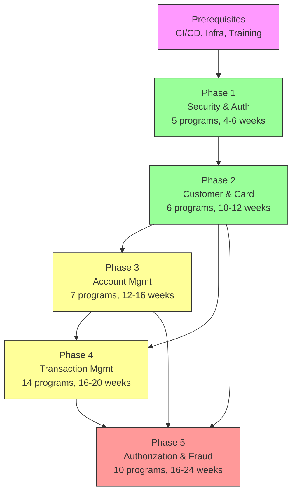

# Phased Migration Cutover Plan — CardDemo Application

## Quick Summary

### What Does This Document Mean?

**For Business Analysts:**
- This document defines the order in which the 6 CardDemo business domains will be migrated from mainframe to modern technology, across 5 phases.
- Each phase specifies which business functions move, what data is affected, and what acceptance criteria must be met before proceeding.
- Rollback plans ensure that if any phase fails, the business can revert to the working mainframe system without data loss.

**For Developers:**
- Each phase lists the exact COBOL programs (by filename) being migrated and their target technology (Java/Spring Boot).
- Integration bridge specifications (Sections 3–7, subsection d) describe the temporary COBOL-to-Java adapters and data sync mechanisms you'll need to build.
- Acceptance criteria define the functional, performance, and data integrity tests your code must pass before the next phase begins.

**For Architects:**
- The Phase Dependency Map (Section 9) shows which phases can overlap and which must be sequential, with a Mermaid diagram.
- The Parallel Run Strategy (Section 8) covers traffic splitting (shadow mode, canary, blue-green) and data reconciliation approaches.
- Integration bridges account for CARDXREF tri-domain coupling — the most complex cross-cutting concern in the migration.

**For Product Owners / Project Managers:**
- The 5-phase structure with relative timing (weeks, not calendar dates) gives you the skeleton for your project schedule.
- Go/no-go decision points (Section 10) define stakeholder checkpoints between phases.
- Each phase's estimated scope (program count, LOC, complexity) helps with effort estimation and team sizing.

**For a Total Beginner:**
- Migrating a mainframe system is like renovating a building floor by floor while people still work in it — you can't shut everything down at once.
- This document is the renovation schedule: which floors get done first, how to keep the building running during construction, and what to do if something goes wrong.
- There are 5 phases, starting with the simplest domain (Security) and ending with the most complex (Authorization & Fraud).

### How Can I Use This Document?

**For Business Analysts:**
- Review each phase's acceptance criteria to ensure business-critical scenarios are covered in the testing plan.
- Use the rollback plans to understand the safety net at each stage.

**For Developers:**
- Find your phase, read the program list and integration bridge specs, and use those as your implementation requirements.
- The acceptance criteria section defines your "definition of done" for each phase.

**For Architects:**
- Use the Phase Dependency Map to design the CI/CD pipeline stages and environment promotion strategy.
- The Parallel Run Strategy informs your infrastructure and monitoring architecture during transition.

**For Product Owners / Project Managers:**
- Map each phase to sprints or quarters in your project management tool.
- Use the go/no-go checkpoints to schedule steering committee reviews.

**For a Total Beginner:**
- Read the Executive Summary (Section 1) for the overall approach, then look at the Phase Dependency Map diagram (Section 9) for a visual timeline.
- The Prerequisites section (Section 2) lists what needs to be set up before any migration work starts.

### Key Sections and What They Indicate

| Section | What It Tells You |
|---------|-------------------|
| 1. Executive Summary | 5-phase overview with domains, strategies, and relative timing per phase |
| 2. Prerequisites | Infrastructure, tooling, and team readiness required before Phase 1 |
| 3–7. Phase Definitions | Per-phase details: programs migrating, data stores affected, integration bridges, rollback plans, and acceptance criteria |
| 8. Parallel Run Strategy | How old and new systems run side-by-side with traffic splitting and data reconciliation |
| 9. Phase Dependency Map | Mermaid diagram showing phase sequencing, overlaps, and dependencies |
| 10. Communication & Stakeholder Checkpoints | Go/no-go decision points and sign-off requirements between phases |

---

## Table of Contents

1. [Executive Summary](#1-executive-summary)
2. [Prerequisites](#2-prerequisites)
3. [Phase 1 — Security & Authentication Foundation](#3-phase-1--security--authentication-foundation)
4. [Phase 2 — Customer Management & Card Domain Core](#4-phase-2--customer-management--card-domain-core)
5. [Phase 3 — Account Management (Strangler)](#5-phase-3--account-management-strangler)
6. [Phase 4 — Transaction Management (Strangler)](#6-phase-4--transaction-management-strangler)
7. [Phase 5 — Authorization & Fraud (Rewrite)](#7-phase-5--authorization--fraud-rewrite)
8. [Parallel Run Strategy](#8-parallel-run-strategy)
9. [Phase Dependency Map](#9-phase-dependency-map)
10. [Communication & Stakeholder Checkpoints](#10-communication--stakeholder-checkpoints)

---

## 1. Executive Summary

This plan defines a **5-phase migration cutover** for the CardDemo application — a 44-program, 30,175 LOC mainframe credit card management system spanning COBOL, CICS, VSAM, IMS, DB2, and MQ technologies.

### Migration Structure

| Phase | Domain(s) | Strategy | Relative Timing |
|-------|-----------|----------|-----------------|
| 1 | Security & Authentication | Rewrite | Weeks 1–6 |
| 2 | Customer Management + Credit Card Management | Rewrite | Weeks 7–18 |
| 3 | Account Management | Strangler Pattern | Weeks 12–28 (overlaps Phase 2) |
| 4 | Transaction Management | Strangler Pattern | Weeks 22–42 |
| 5 | Authorization & Fraud | Rewrite | Weeks 34–58 |

### Key Principles

1. **Zero data loss** — Every data migration step uses dual-write with nightly reconciliation; cutover only proceeds after 7+ consecutive days of zero-delta reconciliation.
2. **Rollback at every phase** — Each phase maintains the ability to revert to the prior operating state within a defined rollback window; legacy systems remain operational until decommission criteria are met.
3. **Parallel run periods** — New and legacy systems operate concurrently with automated output comparison before traffic is fully shifted.
4. **Dependency-ordered sequencing** — Phases respect the coupling analysis from the Domain Decomposition: Security first (zero dependencies), Customer/Card next (enables CARDXREF lookup API), then Account and Transaction (highest coupling), and Authorization last (depends on Card + Account APIs).
5. **Incremental value delivery** — Each phase delivers measurable business value upon completion without requiring subsequent phases to be started.

---

## 2. Prerequisites

The following must be in place before Phase 1 begins:

### Infrastructure

| Prerequisite | Purpose | Acceptance Criteria |
|-------------|---------|-------------------|
| CI/CD pipeline (GitHub Actions or Jenkins) | Automated build, test, deploy | Pipeline deploys to staging on merge; rollback in < 5 minutes |
| API gateway (Kong, AWS API Gateway, or equivalent) | Traffic routing between legacy and modern | Route rules configurable per-endpoint; header-based routing for canary |
| PostgreSQL 15+ provisioned (dev, staging, prod) | Target database for all rewrite domains | Schemas deployable via Flyway; point-in-time recovery enabled |
| Apache Kafka cluster | Event-driven messaging (Phases 4–5) | Topics creatable; consumer groups operational; 7-day retention |
| Redis cluster | Authorization caching, session state | Sentinel/cluster mode; sub-millisecond latency confirmed |
| Container orchestration (ECS/EKS) | Service deployment | Namespace per domain; auto-scaling validated |
| Observability stack (Prometheus + Grafana + ELK) | Monitoring, alerting, log aggregation | Dashboards for latency, error rate, throughput per service |

### Testing Infrastructure

| Prerequisite | Purpose |
|-------------|---------|
| Integration test framework | Compare COBOL output with API output (byte-for-byte for financial calculations) |
| Contract testing (Pact) | Validate inter-service API contracts |
| Performance test harness (Gatling/k6) | Validate latency and throughput under production load patterns |
| Data reconciliation tooling | Nightly comparison of VSAM and PostgreSQL data stores |
| Shadow traffic replay | Capture production CICS transactions, replay against new services |

### Team & Process

| Prerequisite | Purpose |
|-------------|---------|
| Team training — Spring Boot, Kafka, PostgreSQL | Ensure developers are proficient in target stack |
| Mainframe SME availability | COBOL/CICS expertise for logic validation during each phase |
| Runbook documentation template | Standardized rollback and incident response procedures |
| Change Advisory Board (CAB) process | Go/no-go approval workflow for each phase gate |
| Data migration scripts framework | Reusable EBCDIC-to-UTF-8 conversion tooling |

### Legacy System Readiness

| Prerequisite | Purpose |
|-------------|---------|
| VSAM data export tooling verified (CBEXPORT/CBIMPORT) | Data extraction mechanism validated end-to-end |
| IMS unload mechanism verified (PAUDBUNL/DBUNLDGS) | Authorization data exportable to sequential format |
| Control-M/CA7 scheduler access | Ability to modify batch chains during transition |
| CICS adapter development pattern | Proxy mechanism for COBOL programs to call new REST services |

---

## 3. Phase 1 — Security & Authentication Foundation

### a. Phase Name & Objective

**Phase 1: Security Foundation** — Replace the plaintext-password USRSEC VSAM system with a modern Spring Security authentication and user management service. Establish the authentication perimeter (JWT-based) that all subsequent domains will consume.

### b. Programs Migrating

| Program | File | Type | LOC | Target Technology |
|---------|------|------|-----|-------------------|
| COSGN00C | `app/cbl/COSGN00C.cbl` | CICS Online | 260 | Spring Security — `POST /api/auth/login` |
| COUSR00C | `app/cbl/COUSR00C.cbl` | CICS Online | 695 | Spring Data JPA — `GET /api/users` (paginated) |
| COUSR01C | `app/cbl/COUSR01C.cbl` | CICS Online | 299 | Spring Data JPA — `POST /api/users` |
| COUSR02C | `app/cbl/COUSR02C.cbl` | CICS Online | 414 | Spring Data JPA — `PUT /api/users/{id}` |
| COUSR03C | `app/cbl/COUSR03C.cbl` | CICS Online | 359 | Spring Data JPA — `DELETE /api/users/{id}` |

**Total: 5 programs, 2,027 LOC**

**Strategy:** Full Rewrite (Java 17 / Spring Boot 3.x / Spring Security 6.x)

### c. Data Stores Affected

| Store | Current | Target | Migration |
|-------|---------|--------|-----------|
| USRSEC (VSAM KSDS, 80-byte records) | SEC-USR-ID(8), SEC-USR-FNAME(20), SEC-USR-LNAME(20), SEC-USR-PWD(8), SEC-USR-TYPE(1) | PostgreSQL `users` table with BCrypt password column | One-time bulk migration via DUSRSECJ.jcl export → ETL → INSERT; passwords re-hashed from plaintext to BCrypt |

**Data migration steps:**
1. Export USRSEC records via DUSRSECJ.jcl to sequential file
2. Transform EBCDIC → UTF-8, map fields to relational schema
3. Hash all passwords with BCrypt (existing plaintext → BCrypt digest)
4. Load into PostgreSQL users table
5. Validate row counts match (expected: small dataset, <1000 records)

### d. Integration Bridges

| Bridge | Direction | Mechanism | Duration |
|--------|-----------|-----------|----------|
| CICS-to-JWT adapter | Legacy → New | CICS program calls REST `/api/auth/validate-token`; returns SEC-USR-TYPE equivalent in COMMAREA | Until all CICS programs are decommissioned |
| COMMAREA user-type propagation | New → Legacy | JWT claims include `user_type` claim; CICS adapter maps JWT → COMMAREA `CDEMO-USER-TYPE` field | Until Phase 3+ eliminates CICS dependency |

**Data synchronization:** Not required — USRSEC is a clean-cut migration (no ongoing dual-write). Legacy USRSEC becomes read-only immediately after cutover; the new service is the sole authority.

### e. Rollback Plan

| Step | Action |
|------|--------|
| 1 | Revert API gateway routing — direct authentication traffic back to COSGN00C |
| 2 | Re-enable USRSEC VSAM write access for COUSR* programs |
| 3 | Remove CICS-to-JWT adapter from transaction routing |
| 4 | Validate COSGN00C authenticates successfully against original USRSEC |
| **Data reconciliation** | No data reconciliation needed — during parallel run, any user changes made via the new service are back-synced to USRSEC via scheduled ETL (reverse migration script) |
| **Rollback window** | 72 hours post-cutover (user changes are minimal volume; reverse sync is trivial) |

### f. Acceptance Criteria

| Category | Criterion | Threshold |
|----------|-----------|-----------|
| **Functional** | All 5 REST endpoints operational and passing integration tests | 100% test pass rate |
| **Functional** | Authentication response matches COSGN00C behavior (admin/regular routing) | Byte-level parity for SEC-USR-TYPE determination |
| **Performance** | Login latency (p99) | < 200ms |
| **Performance** | User CRUD operations (p99) | < 100ms |
| **Data Integrity** | All USRSEC records migrated with zero loss | Row count match; BCrypt-hashed passwords authenticate correctly |
| **Security** | Zero plaintext passwords in any store | Verified by security scan |
| **Operational** | Monitoring dashboards live (auth success/failure rates, latency) | Alerts fire within 60s of threshold breach |
| **Operational** | Audit logging for all auth events | Every login attempt logged with timestamp, source IP, outcome |

### g. Estimated Scope

- **Programs:** 5
- **LOC:** 2,027
- **Complexity:** Lowest in estate (no hotspot programs)
- **Copybooks affected:** COCOM01Y (shared COMMAREA — adapter only), CSUSR01Y (internalized)
- **Batch jobs:** DUSRSECJ (data migration utility — decommissioned after migration)
- **Duration:** 4–6 weeks

---

## 4. Phase 2 — Customer Management & Card Domain Core

### a. Phase Name & Objective

**Phase 2: Customer & Card Core** — Rewrite the Customer Management and Credit Card Management domains as standalone microservices. Critically, this phase establishes the **CARDXREF lookup API** — the shared service that resolves the tri-domain Card↔Customer↔Account coupling used by 16 programs across all 6 domains. This phase also resolves PCI-DSS compliance violations (plaintext PAN and CVV storage).

### b. Programs Migrating

#### Customer Management

| Program | File | Type | LOC | Target Technology |
|---------|------|------|-----|-------------------|
| CBCUS01C | `app/cbl/CBCUS01C.cbl` | Batch | 178 | Spring Data JPA — `GET /api/customers` (paginated) |

**Strategy:** Rewrite (Java 17 / Spring Boot 3.x / Spring Data JPA)

#### Credit Card Management

| Program | File | Type | LOC | Target Technology |
|---------|------|------|-----|-------------------|
| COCRDLIC | `app/cbl/COCRDLIC.cbl` | CICS Online | 1,459 | Spring Data JPA — `GET /api/cards` (paginated, replaces AIX browse) |
| COCRDSLC | `app/cbl/COCRDSLC.cbl` | CICS Online | 887 | Spring Data JPA — `GET /api/cards/{num}` |
| COCRDUPC | `app/cbl/COCRDUPC.cbl` | CICS Online | 1,560 | Spring Data JPA — `PUT /api/cards/{num}` |
| CBACT02C | `app/cbl/CBACT02C.cbl` | Batch | 178 | Decommissioned (replaced by `GET /api/cards` with streaming) |
| CBACT03C | `app/cbl/CBACT03C.cbl` | Batch | 178 | Decommissioned (replaced by `GET /api/cards/{num}/xref`) |

**Strategy:** Rewrite (Java 17 / Spring Boot 3.x / Spring Data JPA + HashiCorp Vault for PAN tokenization)

**Total: 6 programs, 4,440 LOC**

### c. Data Stores Affected

| Store | Current | Target | Migration |
|-------|---------|--------|-----------|
| CUSTDATA (VSAM KSDS, 500-byte) | Customer records keyed by CUST-ID | PostgreSQL `customers` table with field-level encryption (pgcrypto) for SSN, government ID | Bulk export via CBEXPORT → ETL → INSERT with encryption |
| CARDDATA (VSAM KSDS, 150-byte) | Card records keyed by CARD-NUM | PostgreSQL `cards` table with tokenized PAN (vault-backed) | Export via CARDFILE.jcl → ETL with PAN tokenization → INSERT |
| CARDXREF (VSAM KSDS, 50-byte) | Card↔Customer↔Account cross-reference | PostgreSQL foreign keys: `cards.customer_id` FK → `customers`, `cards.account_id` FK → `accounts` | Export via XREFFILE.jcl → ETL → UPDATE cards table with FK references |
| CARDAIX (VSAM Alternate Index) | Secondary access by ACCT-ID | PostgreSQL index: `CREATE INDEX idx_cards_account_id ON cards(account_id)` | Eliminated — standard database index |

**Data migration steps:**
1. Export CUSTDATA, CARDDATA, CARDXREF via CBEXPORT to sequential files
2. Transform EBCDIC → UTF-8; tokenize PANs via vault; encrypt PII fields
3. Load customers first (no FK dependencies), then cards (FK to customers + accounts placeholder)
4. Validate: row counts, referential integrity, sample record spot-checks
5. Dual-write period: new records flow to both VSAM (via bridge) and PostgreSQL for 7 days
6. Cutover: VSAM writes cease; PostgreSQL is sole authority

### d. Integration Bridges

| Bridge | Direction | Mechanism | Duration |
|--------|-----------|-----------|----------|
| CARDXREF lookup API | Legacy (COBOL) → New | CICS adapter replaces `EXEC CICS READ FILE('CARDXREF')` with REST call to `GET /api/cards/{num}/xref` → returns `{custId, acctId}` | Until all consuming programs (16 across 4 domains) are migrated |
| Customer read adapter | Legacy batch → New | CBSTM03A (statement gen, Phase 4) calls Customer API instead of direct CUSTFILE read | Until CBSTM03A is rewritten in Phase 4 |
| Card validation adapter | Legacy batch → New | CBTRN01C/02C call Card API for card validation instead of direct CARDDAT read | Until CBTRN01C/02C are rewritten in Phase 4 |
| Dual-write bridge (CUSTDATA) | New → Legacy | During parallel run: Customer API writes to PostgreSQL AND syncs to VSAM via CDC connector | 7-day parallel run period |
| Dual-write bridge (CARDDATA) | New → Legacy | During parallel run: Card API writes to PostgreSQL AND syncs to VSAM via CDC connector | 7-day parallel run period |

**CARDXREF tri-domain coupling handling:**
- CARDXREF currently links Card, Customer, and Account across 16 programs in ALL 6 domains
- The new Card service owns the cross-reference data as foreign keys on the `cards` table
- A dedicated lookup API (`GET /api/cards/{num}/xref`) replaces all 16 direct VSAM reads
- During transition, a CICS-callable adapter wraps this API for legacy programs that haven't migrated yet

### e. Rollback Plan

| Step | Action |
|------|--------|
| 1 | Revert API gateway — route card/customer traffic back to CICS programs |
| 2 | Disable CARDXREF lookup API adapter — CICS programs resume direct VSAM reads |
| 3 | Disable dual-write CDC connectors |
| 4 | Reconcile any PostgreSQL-only writes back to VSAM via reverse ETL |
| 5 | Validate COCRDLIC/COCRDSLC/COCRDUPC function correctly against original VSAM files |
| 6 | Re-enable CARDFILE/XREFFILE/CUSTFILE batch jobs on original schedule |
| **Data reconciliation** | Run nightly reconciliation job; any records created only in PostgreSQL during the parallel run are reverse-migrated to VSAM. Job completes in < 30 minutes for expected delta volume. |
| **Rollback window** | 7 days post-cutover (allows full weekly batch cycle to complete) |

### f. Acceptance Criteria

| Category | Criterion | Threshold |
|----------|-----------|-----------|
| **Functional** | All Customer and Card REST endpoints passing integration tests | 100% pass rate |
| **Functional** | CARDXREF lookup API returns identical results to direct VSAM reads | 100% parity (tested with full XREF dataset) |
| **Functional** | Card list by account (replaces AIX browse) returns matching results | Sort order and pagination parity |
| **Performance** | Card lookup latency (p99) | < 50ms |
| **Performance** | XREF lookup latency (p99) | < 30ms (critical path for 16 consumers) |
| **Data Integrity** | All CUSTDATA records migrated with field-level encryption intact | Decrypted values match original; zero PII in plaintext |
| **Data Integrity** | All CARDDATA records migrated with tokenized PANs | Original PANs not stored anywhere; tokenization round-trips correctly |
| **Security (PCI-DSS)** | CVV removed from all persistent storage | Audit scan confirms zero CVV values in any database/file |
| **Security (PCI-DSS)** | PAN tokenized — never stored in plaintext | Vault-backed tokenization verified |
| **Operational** | CICS adapter successfully proxies XREF lookups for remaining legacy programs | Validated with CBTRN01C, CBACT04C, CBSTM03A, COPAUA0C |
| **Data Integrity** | 7 consecutive days of zero-delta reconciliation between VSAM and PostgreSQL | Nightly reconciliation job reports zero discrepancies |

### g. Estimated Scope

- **Programs:** 6 (1 Customer + 5 Card)
- **LOC:** 4,440
- **Complexity:** Moderate (COCRDUPC rank #4, COCRDLIC rank #5 in hotspot scores)
- **Critical deliverable:** CARDXREF lookup API — enables all subsequent phases
- **Batch jobs decommissioned:** CARDFILE.jcl, XREFFILE.jcl, CUSTFILE.jcl (VSAM define/load — replaced by PostgreSQL DDL)
- **Batch jobs requiring adapter:** CBTRN01C, CBTRN02C, CBACT04C, CBSTM03A (read card/customer via API)
- **Duration:** 10–12 weeks

---

## 5. Phase 3 — Account Management (Strangler)

### a. Phase Name & Objective

**Phase 3: Account Management Strangler** — Incrementally wrap and replace the Account Management domain using the Strangler Pattern. Begins with read-only Account View API, progresses through validation extraction, and culminates in full Account Update replacement and interest calculation migration. This phase addresses the **#1 hotspot program** in the estate (COACTUPC, 4,236 LOC, composite score 96).

### b. Programs Migrating

| Program | File | Type | LOC | Target Technology |
|---------|------|------|-----|-------------------|
| COACTVWC | `app/cbl/COACTVWC.cbl` | CICS Online | 941 | Spring Data JPA — `GET /api/accounts/{id}` (Sub-phase 3A) |
| COACTUPC | `app/cbl/COACTUPC.cbl` | CICS Online | 4,236 | Spring Boot — Account Update service with extracted validation (Sub-phase 3B–3C) |
| CBACT01C | `app/cbl/CBACT01C.cbl` | Batch | 430 | **MIGRATED** — Plain Java 17+ CLI (`migrated-code/java/cbact01c-processor/`). Mapping: `migrated-code/COBOL_JAVA_MAPPING.md`. Test coverage: 36 tests (7 classes), 100% pass. |
| CBACT04C | `app/cbl/CBACT04C.cbl` | Batch | 652 | Spring Batch — scheduled interest calculation job (Sub-phase 3D) |
| COBIL00C | `app/cbl/COBIL00C.cbl` | CICS Online | 572 | Spring Boot — `POST /api/accounts/{id}/credit` (Sub-phase 3C) |
| COADM01C | `app/cbl/COADM01C.cbl` | CICS Online | 288 | Spring Boot — Admin menu routing (navigation concern absorbed into API gateway) |
| COMEN01C | `app/cbl/COMEN01C.cbl` | CICS Online | 308 | Spring Boot — Main menu routing (navigation concern absorbed into frontend SPA) |

**Total: 7 programs, 7,427 LOC**

**Strategy:** Strangler Pattern (API-first, incremental replacement)

**Sub-phases:**
- **3A:** Account View API (`GET /api/accounts/{id}`) — 2–3 weeks
- **3B:** Validation extraction (state codes, area codes, dates) — 3–4 weeks
- **3C:** Account Update API + Bill Payment API — 4–6 weeks
- **3D:** Interest calculation as Spring Batch scheduled job — 3–4 weeks
- **3E:** ACCTDAT VSAM decommission — 2 weeks (data layer cutover)

### c. Data Stores Affected

| Store | Current | Target | Migration |
|-------|---------|--------|-----------|
| ACCTDATA (VSAM KSDS, 300-byte) | Account records keyed by ACCT-ID | PostgreSQL `accounts` table | Phased: dual-write during strangler; full migration at Sub-phase 3E |
| DISCGRP (VSAM KSDS, 50-byte) | Interest rate disclosure groups | PostgreSQL `disclosure_groups` table | Migrated at Sub-phase 3D |
| TCATBALF (VSAM KSDS, 50-byte) | Transaction category balances | PostgreSQL `category_balances` table (co-owned with Transaction) | Migrated at Sub-phase 3D |

**Data migration approach (Strangler-specific):**
1. **Sub-phase 3A (read):** Account View reads from VSAM via existing path; new API also reads from VSAM (thin wrapper)
2. **Sub-phase 3B–3C (write):** Dual-write — Account Update writes to both VSAM and PostgreSQL; nightly reconciliation validates consistency
3. **Sub-phase 3D:** Interest calculation runs against PostgreSQL; results compared against CBACT04C VSAM output for validation
4. **Sub-phase 3E:** After 7 days zero-delta, VSAM writes cease; PostgreSQL is sole authority; remaining VSAM readers (POSTTRAN, INTCALC legacy paths) redirected via adapter

### d. Integration Bridges

| Bridge | Direction | Mechanism | Duration |
|--------|-----------|-----------|----------|
| Account balance update API | Transaction → Account | CBTRN01C/COBIL00C call `POST /api/accounts/{id}/debit` or `POST /api/accounts/{id}/credit` instead of direct VSAM write | Until Transaction programs are migrated (Phase 4) |
| ACCTDAT dual-write | New → Legacy | Account service writes to PostgreSQL AND VSAM simultaneously during transition | Sub-phases 3B–3E (~10 weeks) |
| CARDAIX lookup adapter | Card → Account | Card service calls Account API `GET /api/accounts/{id}` instead of VSAM read via AIX | Permanent (clean service boundary) |
| Authorization account check | Auth → Account | COPAUA0C calls `GET /api/accounts/{id}/balance` for credit limit check | Until Auth domain is migrated (Phase 5) |
| Interest calculation bridge | Account (batch) → Transaction | Spring Batch interest job publishes `interest.calculated` events; Transaction service creates interest transaction records | Permanent (event-driven pattern) |

### e. Rollback Plan

| Step | Action |
|------|--------|
| 1 | Revert API gateway — route account traffic back to COACTUPC/COACTVWC |
| 2 | Disable dual-write to PostgreSQL |
| 3 | Restore CBACT04C batch job in Control-M/CA7 schedule (re-enable INTCALC.jcl with CLOSEFIL/OPENFIL) |
| 4 | Re-enable direct VSAM access for COBIL00C |
| 5 | Validate COACTUPC functions correctly (test full update flow) |
| 6 | Run reconciliation — reverse-migrate any PostgreSQL-only changes to VSAM |
| **Data reconciliation** | Dual-write ensures VSAM is always current during transition. PostgreSQL-only writes (if any gap in dual-write) reverse-migrated via scheduled ETL job. |
| **Maximum rollback window** | 14 days post-cutover (allows full monthly batch cycle including INTCALC to validate) |

### f. Acceptance Criteria

| Category | Criterion | Threshold |
|----------|-----------|-----------|
| **Functional** | Account View API matches COACTVWC output for all test accounts | 100% field-level parity |
| **Functional** | Account Update API handles all 20 EVALUATE-driven validation paths | All paths covered by integration tests |
| **Functional** | Interest calculation produces identical results to CBACT04C | Financial amounts match to 2 decimal places for all accounts |
| **Functional** | Bill Payment API matches COBIL00C behavior | Balance updates identical |
| **Performance** | Account View latency (p99) | < 100ms |
| **Performance** | Account Update latency (p99) | < 200ms |
| **Performance** | Interest calculation job completes within | < 2× current CBACT04C batch runtime |
| **Data Integrity** | Dual-write reconciliation zero-delta | 7 consecutive days before VSAM decommission |
| **Data Integrity** | Credit limit enforcement working | No overlimit transactions processed |
| **Operational** | CLOSEFIL/OPENFIL batch window eliminated for account data | 24/7 online availability for account operations |
| **Operational** | Circuit breaker patterns operational | Resilience4j fallback to VSAM read if API unavailable during transition |

### g. Estimated Scope

- **Programs:** 7
- **LOC:** 7,847
- **Complexity:** Highest in estate (COACTUPC is #1 hotspot, score 96)
- **Batch jobs eliminated:** CLOSEFIL/OPENFIL (for account operations), INTCALC.jcl (replaced by Spring Batch)
- **Batch jobs requiring adaptation:** POSTTRAN.jcl (must call Account API for balance updates — coordinated in Phase 4)
- **Duration:** 12–16 weeks (across all sub-phases)

---

## 6. Phase 4 — Transaction Management (Strangler)

### a. Phase Name & Objective

**Phase 4: Transaction Management Strangler** — Incrementally replace the largest and most complex domain (10,178 LOC, 14 programs) using the Strangler Pattern. Begins with eliminating the dual-store sync pattern (transaction types already in DB2), wraps online CRUD with APIs, and progressively replaces the batch pipeline (POSTTRAN → INTCALC → statement generation) with event-driven processing.

### b. Programs Migrating

| Program | File | Type | LOC | Target Technology |
|---------|------|------|-----|-------------------|
| COTRTLIC | `app/app-transaction-type-db2/cbl/COTRTLIC.cbl` | CICS/DB2 | 2,098 | Spring Data JPA — `GET /api/transaction-types` (Sub-phase 4A) |
| COTRTUPC | `app/app-transaction-type-db2/cbl/COTRTUPC.cbl` | CICS/DB2 | 1,702 | Spring Data JPA — `PUT /api/transaction-types/{code}` (Sub-phase 4A) |
| COBTUPDT | `app/app-transaction-type-db2/cbl/COBTUPDT.cbl` | Batch/DB2 | 237 | Decommissioned — direct API/DB access replaces batch update (Sub-phase 4A) |
| COTRN00C | `app/cbl/COTRN00C.cbl` | CICS Online | 699 | Spring Data JPA — `GET /api/transactions` (Sub-phase 4B) |
| COTRN01C | `app/cbl/COTRN01C.cbl` | CICS Online | 330 | Spring Data JPA — `GET /api/transactions/{id}` (Sub-phase 4B) |
| COTRN02C | `app/cbl/COTRN02C.cbl` | CICS Online | 783 | Spring Boot — `POST /api/transactions` (Sub-phase 4B) |
| CORPT00C | `app/cbl/CORPT00C.cbl` | CICS Online | 649 | Spring Boot — `GET /api/reports/transactions` (Sub-phase 4B) |
| COBSWAIT | `app/cbl/COBSWAIT.cbl` | Utility | 41 | Decommissioned — eliminated with VSAM batch window |
| CSUTLDTC | `app/cbl/CSUTLDTC.cbl` | Utility | 157 | Java `java.time` date validation (shared library) |
| CBTRN01C | `app/cbl/CBTRN01C.cbl` | Batch | 494 | Kafka consumer — event-driven transaction posting (Sub-phase 4C) |
| CBTRN02C | `app/cbl/CBTRN02C.cbl` | Batch | 731 | Kafka consumer — transaction validation (Sub-phase 4C) |
| CBTRN03C | `app/cbl/CBTRN03C.cbl` | Batch | 649 | Spring Batch — scheduled report generation (Sub-phase 4D) |
| CBSTM03A | `app/cbl/CBSTM03A.CBL` | Batch | 924 | Spring Batch + Apache FOP — statement generation (Sub-phase 4D) |
| CBSTM03B | `app/cbl/CBSTM03B.CBL` | Batch | 230 | Absorbed into statement generation service (Sub-phase 4D) |

**Total: 14 programs, 9,724 LOC**

**Strategy:** Strangler Pattern (eliminate dual-store sync first, then API-first wrapping, then batch pipeline replacement)

**Sub-phases:**
- **4A:** Eliminate dual-store sync — direct DB2/PostgreSQL access for transaction types; decommission TRANEXTR/TRANCATG/TRANTYPE weekly jobs — 6–8 weeks
- **4B:** Online CRUD API — wrap COTRN00C–02C, CORPT00C with REST APIs — 4–6 weeks
- **4C:** Batch pipeline — replace POSTTRAN (CBTRN01C) and COMBTRAN (CBTRN02C) with Kafka-driven event processing — 6–8 weeks
- **4D:** Statement & reports — replace CBSTM03A/B and CBTRN03C with Spring Batch + template engine — 4–6 weeks

### c. Data Stores Affected

| Store | Current | Target | Migration |
|-------|---------|--------|-----------|
| TRANSACT (VSAM KSDS, 350-byte) | Transaction records keyed by TRAN-ID | PostgreSQL `transactions` table (date-partitioned) | Phased dual-write during strangler period |
| DALYTRAN (Sequential, 350-byte) | Daily transaction input from card network | Kafka topic `transactions.incoming` | External feed redirected to Kafka producer |
| DALYREJS (VSAM ESDS) | Validation rejects | PostgreSQL `transaction_rejects` table | Direct migration at Sub-phase 4C |
| REPTFILE (VSAM ESDS) | Report output | Object storage (S3/equivalent) | New report format at Sub-phase 4D |
| STMTFILE (Sequential) | Statement output | Object storage (PDF) via Apache FOP | New statement format at Sub-phase 4D |
| DB2 TRANSACTION_TYPE | Transaction type reference | PostgreSQL `transaction_types` table | Direct migration from DB2 at Sub-phase 4A |
| DB2 TRANSACTION_CATEGORY | Transaction category reference | PostgreSQL `transaction_categories` table | Direct migration from DB2 at Sub-phase 4A |
| TRANTYPE (VSAM — sync copy) | VSAM copy of DB2 types | **Eliminated entirely** | VSAM sync copy no longer needed |
| TRANCATG (VSAM — sync copy) | VSAM copy of DB2 categories | **Eliminated entirely** | VSAM sync copy no longer needed |
| TCATBALF (VSAM KSDS) | Category balances | PostgreSQL `category_balances` table | Migrated at Sub-phase 4C |

### d. Integration Bridges

| Bridge | Direction | Mechanism | Duration |
|--------|-----------|-----------|----------|
| Account balance event | Transaction → Account | Transaction posting publishes `account.balance.debit` event → Account service updates balance via API | Permanent (event-driven architecture) |
| Card validation call | Transaction → Card | Transaction validation calls Card API `GET /api/cards/{num}` for card/expiry check | Permanent (service boundary) |
| Customer lookup call | Transaction → Customer | Statement generation calls Customer API `GET /api/customers/{id}` for name/address | Permanent (service boundary) |
| XREF lookup call | Transaction → Card | Batch posting calls `GET /api/cards/{num}/xref` for card→account resolution | Permanent (service boundary) |
| DALYTRAN feed bridge | External → New | During transition: external feed writes to both sequential file (legacy) and Kafka topic (new) | Sub-phase 4C transition period |
| Interest transaction event | Account → Transaction | Account interest calculation publishes `interest.calculated` event → Transaction service creates transaction record | Permanent (established in Phase 3) |
| Dual-write (TRANSACT) | New → Legacy | During parallel run: new transaction API writes to both PostgreSQL and VSAM | Sub-phase 4B–4C (~12 weeks) |

### e. Rollback Plan

| Step | Action |
|------|--------|
| 1 | Revert API gateway — route transaction traffic back to CICS programs |
| 2 | Re-enable DALYTRAN sequential file feed from card network |
| 3 | Restore batch chain: CLOSEFIL → POSTTRAN → WAITSTEP → OPENFIL in Control-M |
| 4 | Restore weekly sync chain: MNTTRDB2 → TRANEXTR → TRANCATG → TRANTYPE |
| 5 | Disable Kafka consumers |
| 6 | Validate CBTRN01C/CBTRN02C batch posting against VSAM |
| 7 | Run reconciliation — reverse-migrate PostgreSQL-only transactions to VSAM |
| **Data reconciliation** | Dual-write ensures VSAM TRANSACT current during transition. For rollback of 4A (type sync): re-enable TRANEXTR weekly job to repopulate VSAM type files from DB2. |
| **Maximum rollback window** | 14 days (must cover one full monthly statement cycle for complete validation) |

**Sub-phase rollbacks are independent:**
- 4A rollback: Re-enable TRANEXTR/TRANCATG/TRANTYPE weekly sync jobs
- 4B rollback: Revert API gateway; CICS programs resume
- 4C rollback: Switch external feed back to sequential; restore POSTTRAN batch
- 4D rollback: Restore CREASTMT/CBTRN03C batch jobs in scheduler

### f. Acceptance Criteria

| Category | Criterion | Threshold |
|----------|-----------|-----------|
| **Functional** | Transaction type CRUD matches COTRTLIC/COTRTUPC behavior | All DB2 records accessible; pagination matches |
| **Functional** | Online transaction CRUD matches COTRN00C–02C output | 100% test parity |
| **Functional** | Event-driven posting produces identical account balance results to POSTTRAN | Financial amounts match to 2 decimal places |
| **Functional** | Statement generation produces equivalent output to CBSTM03A | Content parity (amounts, dates, names); PDF formatting acceptable |
| **Performance** | Transaction posting throughput | ≥ current POSTTRAN batch throughput (transactions/second) |
| **Performance** | Online transaction API latency (p99) | < 150ms |
| **Performance** | Statement generation completes within | ≤ current CREASTMT batch runtime |
| **Data Integrity** | Zero-delta reconciliation TRANSACT (PostgreSQL vs VSAM) | 7 consecutive days |
| **Data Integrity** | Daily transaction rejects match CBTRN02C output | Identical reject reasons and counts |
| **Operational** | Dual-store sync eliminated (4A) | TRANEXTR/TRANCATG/TRANTYPE jobs decommissioned |
| **Operational** | CLOSEFIL/OPENFIL eliminated for transaction data | 24/7 online availability |
| **Operational** | DALYTRAN feed flows through Kafka with at-least-once delivery | Zero message loss (tested with 10K records) |
| **Financial** | Zero-delta balance validation post-posting | Sum of all posted amounts equals total balance change |

### g. Estimated Scope

- **Programs:** 14
- **LOC:** 9,651
- **Complexity:** Highest total volume; COTRTLIC (#2 hotspot, score 89) and COTRTUPC (#3, score 87); CBSTM03A (#9, score 54, 97 I/O ops)
- **Batch jobs decommissioned:** TRANEXTR, TRANCATG, TRANTYPE, MNTTRDB2 (dual-store sync); POSTTRAN, COMBTRAN (replaced by Kafka); CREASTMT, TXT2PDF1, PRTCATBL (replaced by Spring Batch); TRANBKP (replaced by DB backup); CLOSEFIL/OPENFIL (eliminated); WAITSTEP (eliminated)
- **Duration:** 16–20 weeks (across all sub-phases)

---

## 7. Phase 5 — Authorization & Fraud (Rewrite)

### a. Phase Name & Objective

**Phase 5: Authorization & Fraud Rewrite** — Replace the most technologically complex domain in the estate (IMS HIDAM + DB2 + VSAM + MQ across 8 programs) with an event-driven Kafka-based authorization service and pluggable fraud scoring engine. Eliminates all three legacy storage technologies (IMS, VSAM cross-lookups, MQ) and enables future ML-based fraud detection.

### b. Programs Migrating

| Program | File | Type | LOC | Target Technology |
|---------|------|------|-----|-------------------|
| COPAUA0C | `app/app-authorization-ims-db2-mq/cbl/COPAUA0C.cbl` | CICS/MQ | 1,026 | Spring Kafka consumer — `AuthorizationRequestProcessor` |
| COPAUS0C | `app/app-authorization-ims-db2-mq/cbl/COPAUS0C.cbl` | CICS/DB2 | 1,032 | Spring Data JPA — `GET /api/authorizations` |
| COPAUS1C | `app/app-authorization-ims-db2-mq/cbl/COPAUS1C.cbl` | CICS/DB2 | 604 | Spring Data JPA — `GET /api/authorizations/{id}` |
| COPAUS2C | `app/app-authorization-ims-db2-mq/cbl/COPAUS2C.cbl` | CICS | 244 | Spring Boot — `PUT /api/authorizations/{id}/schedule` |
| CBPAUP0C | `app/app-authorization-ims-db2-mq/cbl/CBPAUP0C.cbl` | Batch/IMS | 386 | Scheduled Spring task — purge expired auths (PostgreSQL DELETE) |
| DBUNLDGS | `app/app-authorization-ims-db2-mq/cbl/DBUNLDGS.CBL` | Batch/IMS | 366 | Decommissioned (IMS eliminated; standard DB backup replaces) |
| PAUDBLOD | `app/app-authorization-ims-db2-mq/cbl/PAUDBLOD.CBL` | Batch/IMS | 369 | Decommissioned (IMS eliminated) |
| PAUDBUNL | `app/app-authorization-ims-db2-mq/cbl/PAUDBUNL.CBL` | Batch/IMS | 317 | Decommissioned (IMS eliminated) |

**Also migrated (VSAM-MQ integration):**

| Program | File | Type | LOC | Target Technology |
|---------|------|------|-----|-------------------|
| COACCT01 | `app/app-vsam-mq/cbl/COACCT01.cbl` | CICS/MQ | ~350 | Decommissioned — Account API replaces MQ-based inquiry |
| CODATE01 | `app/app-vsam-mq/cbl/CODATE01.cbl` | CICS/MQ | ~200 | Decommissioned — `java.time` validation replaces MQ-based service |

**Total: 10 programs, ~4,894 LOC**

**Strategy:** Rewrite (Java 17 / Spring Boot 3.x / Spring Kafka / PostgreSQL)

### c. Data Stores Affected

| Store | Current | Target | Migration |
|-------|---------|--------|-----------|
| IMS PAUTBDB (HIDAM) | Hierarchical: CIPAUSMY (summary, root) → CIPAUDTY (detail, child) | PostgreSQL: `authorization_summary` + `authorization_detail` tables with FK | Export via PAUDBUNL → flatten hierarchy → INSERT |
| DB2 AUTHFRDS (View) | Fraud reporting view | PostgreSQL `fraud_reports` materialized view | Schema-compatible migration |
| MQ auth request queue | IBM MQ point-to-point | Kafka topic `authorizations.requests` | Dual-publish during cutover; external card network redirected |
| MQ auth response queue | IBM MQ point-to-point | Kafka topic `authorizations.responses` | Consumers redirected to Kafka |
| MQ account inquiry queue | IBM MQ | Eliminated — replaced by REST call to Account API | Direct API integration |
| MQ date validation queue | IBM MQ | Eliminated — replaced by `java.time` library | In-process validation |

**Data migration steps:**
1. Unload IMS PAUTBDB via PAUDBUNL to sequential file
2. Parse segments: map CIPAUSMY → `authorization_summary` rows, CIPAUDTY → `authorization_detail` rows
3. Convert packed decimal (COMP-3) fields to standard numeric types
4. Load into PostgreSQL with FK relationships
5. Validate: segment counts, date ranges, status distributions match
6. Dual-publish MQ/Kafka during 7-day parallel run
7. Cutover: MQ queues decommissioned; Kafka is sole messaging layer

### d. Integration Bridges

| Bridge | Direction | Mechanism | Duration |
|--------|-----------|-----------|----------|
| Card validation | Auth → Card | Auth service calls Card API `GET /api/cards/{num}` for card verification | Permanent (service boundary) |
| Account credit check | Auth → Account | Auth service calls Account API `GET /api/accounts/{id}/balance` for limit verification | Permanent (service boundary) |
| MQ-to-Kafka bridge | External → Both | During transition: card network messages published to both MQ and Kafka; COPAUA0C continues processing MQ while new service processes Kafka | 7-day parallel run |
| Transaction match events | Auth → Transaction | Authorization service publishes `authorization.approved` events; Transaction service matches against posted transactions | Permanent (event-driven) |

### e. Rollback Plan

| Step | Action |
|------|--------|
| 1 | Disable Kafka auth consumers |
| 2 | Re-enable COPAUA0C MQ listener in CICS |
| 3 | Revert external card network to publish to MQ only (disable Kafka bridge) |
| 4 | Restore CBPAUP0J daily purge in scheduler |
| 5 | Verify MQ-based authorization processing returns to normal operation |
| 6 | PostgreSQL auth data reconciled with IMS via comparison job |
| **Data reconciliation** | During dual-publish period, both IMS and PostgreSQL contain auth records. On rollback: PostgreSQL-only records exported via SQL, converted to sequential format, loaded to IMS via PAUDBLOD. |
| **Maximum rollback window** | 7 days post-cutover (authorization records are time-bounded; expired records purged daily regardless) |

### f. Acceptance Criteria

| Category | Criterion | Threshold |
|----------|-----------|-----------|
| **Functional** | Authorization request processing produces identical approve/decline decisions | 100% decision parity (tested with 10K historical requests) |
| **Functional** | Fraud scoring matches existing rule-based logic | Score distributions statistically equivalent |
| **Functional** | Pending auth list/detail APIs match COPAUS0C/COPAUS1C output | Field-level parity |
| **Functional** | Daily purge removes identical expired records | Count and ID parity with CBPAUP0C |
| **Performance** | Authorization request latency (p99) | < 200ms (sub-second response to card network) |
| **Performance** | Authorization throughput | ≥ peak MQ message rate × 2 (headroom) |
| **Data Integrity** | IMS→PostgreSQL migration zero data loss | All segments accounted for; summary/detail relationships intact |
| **Data Integrity** | Packed decimal conversion accuracy | All monetary/date values match IMS values exactly |
| **Operational** | IMS HIDAM fully decommissioned | No IMS infrastructure running |
| **Operational** | MQ queues fully decommissioned | No IBM MQ infrastructure for auth domain |
| **Operational** | Kafka consumer lag < 100ms | Authorization responses delivered in real-time |
| **Operational** | Zero authorization message loss during cutover | Dual-publish validation: every MQ message has corresponding Kafka message |

### g. Estimated Scope

- **Programs:** 10
- **LOC:** ~4,894
- **Complexity:** Highest technology diversity (IMS + DB2 + VSAM + MQ); COPAUS0C rank #6, COPAUA0C rank #7
- **Technologies eliminated:** IMS HIDAM, IBM MQ, VSAM cross-lookups (replaced by service calls to Card/Account)
- **Batch jobs decommissioned:** CBPAUP0J (replaced by scheduled task), DBPAUTP0, LOADPADB, UNLDPADB, UNLDGSAM (IMS utilities — all eliminated)
- **Duration:** 16–24 weeks

---

## 8. Parallel Run Strategy

### 8.1 Approach

During each phase's transition period, the legacy and modern systems operate concurrently. This ensures confidence in the new system before legacy decommission.

### 8.2 Traffic Modes

| Mode | Description | When Used |
|------|-------------|-----------|
| **Shadow mode** | Production traffic processed by legacy (authoritative); copy of traffic replayed against new system; responses compared but new system responses discarded | Initial validation (first 2–4 weeks of each phase) |
| **Canary (10%)** | 10% of traffic routed to new system (authoritative for that traffic); 90% continues on legacy | After shadow mode validates parity; used for performance validation under real load |
| **Blue-green (50/50 → 100%)** | Traffic split evenly between systems; both authoritative for their share; results compared daily | After canary shows < 0.1% error divergence; progresses to 100% new system |
| **Legacy dark** | Legacy system receives no traffic but remains operational and data-synced for rollback | Post-cutover holding period (7–14 days per phase) |

### 8.3 Data Reconciliation During Parallel Run

```
┌─────────────────────────────────────────────────────────────────┐
│                     Reconciliation Pipeline                       │
├─────────────────────────────────────────────────────────────────┤
│                                                                   │
│  ┌─────────┐    ┌──────────────┐    ┌─────────────────────────┐ │
│  │  VSAM   │───►│ Nightly ETL  │───►│  Compare Engine         │ │
│  │  Store   │    │  (Export)    │    │  (Row-by-row diff)      │ │
│  └─────────┘    └──────────────┘    │                         │ │
│                                      │  • Row count check      │ │
│  ┌─────────┐    ┌──────────────┐    │  • Field-level diff     │ │
│  │PostgreSQL│───►│  SQL Export   │───►│  • Financial precision  │ │
│  │  Store   │    │  (pg_dump)   │    │    (2 decimal places)   │ │
│  └─────────┘    └──────────────┘    │  • Timestamp tolerance  │ │
│                                      │    (±1 second)          │ │
│                                      └───────────┬─────────────┘ │
│                                                  │               │
│                                      ┌───────────▼─────────────┐ │
│                                      │  Reconciliation Report   │ │
│                                      │  • Zero-delta = GREEN    │ │
│                                      │  • Deltas = RED + alert  │ │
│                                      └─────────────────────────┘ │
└─────────────────────────────────────────────────────────────────┘
```

**Reconciliation rules:**
- **Financial fields** (balances, amounts): Must match to exactly 2 decimal places — zero tolerance
- **Timestamps:** ±1 second tolerance (clock sync differences)
- **Row counts:** Must match exactly
- **Character fields:** Case-sensitive, trimmed comparison
- **Cutover trigger:** 7 consecutive GREEN reports = eligible for cutover decision

### 8.4 Conflict Resolution

During dual-write periods, conflicts are possible (e.g., legacy and modern both update the same record):

| Conflict Type | Resolution |
|--------------|------------|
| Same record updated by legacy and modern | Legacy wins (legacy is authoritative during parallel run) |
| Record created only in modern system | Synced to legacy via reverse ETL |
| Record deleted in modern, exists in legacy | Modern deletion deferred until legacy confirms |
| Financial calculation divergence | Alert immediately; pause canary; investigate |

---

## 9. Phase Dependency Map

### 9.1 Mermaid Diagram



### 9.2 Sequencing Rules

| Constraint | Reason |
|-----------|--------|
| Phase 1 before ALL others | All domains consume JWT tokens from Security service |
| Phase 2 before Phase 3 | Account Management needs CARDXREF lookup API (Card service) for AIX-equivalent queries |
| Phase 2 before Phase 4 | Transaction posting needs Card API for validation; Statement generation needs Customer API |
| Phase 3 before Phase 4 | POSTTRAN/INTCALC write to ACCTFILE — Account API must be stable before Transaction can integrate |
| Phase 2 before Phase 5 | Authorization reads CARDDAT/CARDAIX — needs Card API |
| Phase 3 before Phase 5 | Authorization reads ACCTDAT — needs Account API |
| Phase 4 before Phase 5 (soft dependency) | Kafka infrastructure proven by Transaction domain before Authorization uses it |

### 9.3 Overlap Opportunities

| Overlap | Feasibility | Condition |
|---------|-------------|-----------|
| Phase 2 + Phase 3 (start) | **Yes** — Phase 3A (Account View) has no dependency on Card XREF | Phase 3A can start when Phase 2 Card service reaches XREF API milestone |
| Phase 3 + Phase 4 (start) | **Yes** — Phase 4A (dual-store sync elimination) is independent of Account | Phase 4A can start when Phase 2 completes |
| Phase 4 + Phase 5 (start) | **Partial** — Phase 5 infrastructure setup can begin while Phase 4 is in progress | Phase 5 development starts when Card + Account APIs are stable (mid-Phase 4) |
| Phase 3 + Phase 5 | **No** — Phase 5 depends on stable Account API which Phase 3 is actively building | Must be sequential |

---

## 10. Communication & Stakeholder Checkpoints

### 10.1 Go/No-Go Decision Points

| Gate | Between | Decision Makers | Criteria |
|------|---------|-----------------|----------|
| **Gate 0** | Prerequisites → Phase 1 | Engineering Lead, Security Officer | All infra provisioned; team training complete; CI/CD operational |
| **Gate 1** | Phase 1 → Phase 2 | Engineering Lead, Compliance Officer | Security service live; all acceptance criteria met; audit logging verified |
| **Gate 2** | Phase 2 → Phase 3/4 | CTO, Product Owner, Engineering Lead | PCI-DSS compliance confirmed; CARDXREF API operational; dual-write validated |
| **Gate 3** | Phase 3E (VSAM decommission) | CTO, Risk Officer, DBA Lead | 7-day zero-delta; interest calculation matches; no balance discrepancies |
| **Gate 4** | Phase 4C (batch replacement) | CTO, Finance Officer, Operations Lead | Event-driven posting matches batch output; zero financial discrepancies; external feed stable |
| **Gate 5** | Phase 5 (IMS decommission) | CTO, Risk Officer, External Partner (card network) | Authorization latency met; message loss = zero; fraud scoring parity; card network cutover approved |

### 10.2 Stakeholder Sign-Off Requirements

| Phase | Sign-Offs Required |
|-------|-------------------|
| Phase 1 | Security Officer (compliance), Engineering Lead (technical), QA Lead (test coverage) |
| Phase 2 | PCI-DSS QSA or Internal Auditor (card security), DBA Lead (data migration), Product Owner (functionality) |
| Phase 3 | Finance Officer (interest calculation accuracy), Risk Officer (balance integrity), Operations Lead (batch elimination) |
| Phase 4 | Finance Officer (posting accuracy), External Feed Partner (format change), Operations Lead (Kafka operational readiness) |
| Phase 5 | Card Network Partner (authorization format), Risk Officer (fraud detection parity), CTO (IMS decommission), Operations Lead (MQ decommission) |

### 10.3 Communication Cadence

| Audience | Frequency | Format | Content |
|----------|-----------|--------|---------|
| Engineering team | Daily | Stand-up + async Slack | Current sub-phase progress, blockers, next steps |
| Engineering leads | Weekly | Status report | Phase metrics (test pass rate, reconciliation status, latency benchmarks) |
| Stakeholder committee | Bi-weekly | Steering meeting | Phase health dashboard, risk register, upcoming gate decisions |
| Executive sponsors | Monthly | Executive summary | Overall migration progress, budget, timeline, key decisions needed |
| External partners (card network) | Phase 5 only — weekly | Joint planning call | Message format migration plan, cutover date coordination, testing windows |

### 10.4 Escalation Path

| Severity | Trigger | Escalation To | Response Time |
|----------|---------|---------------|---------------|
| **P1 — Data Loss** | Reconciliation shows missing records | CTO + Engineering Lead + DBA Lead | Immediate (< 1 hour); automatic rollback initiated |
| **P2 — Financial Discrepancy** | Balance/amount mismatch detected | Finance Officer + Engineering Lead | < 4 hours; canary paused |
| **P3 — Performance Degradation** | Latency > 2× threshold | Operations Lead + Engineering Lead | < 8 hours; investigate before expanding traffic |
| **P4 — Test Failure** | Acceptance criteria not met at gate | Engineering Lead + QA Lead | Next sprint; gate delayed until resolved |

---

## Appendix: Complete Program-to-Phase Mapping

All 44 programs in the CardDemo estate are assigned to exactly one phase:

| # | Program | File | Phase |
|---|---------|------|-------|
| 1 | COSGN00C | `app/cbl/COSGN00C.cbl` | Phase 1 |
| 2 | COUSR00C | `app/cbl/COUSR00C.cbl` | Phase 1 |
| 3 | COUSR01C | `app/cbl/COUSR01C.cbl` | Phase 1 |
| 4 | COUSR02C | `app/cbl/COUSR02C.cbl` | Phase 1 |
| 5 | COUSR03C | `app/cbl/COUSR03C.cbl` | Phase 1 |
| 6 | CBCUS01C | `app/cbl/CBCUS01C.cbl` | Phase 2 |
| 7 | COCRDLIC | `app/cbl/COCRDLIC.cbl` | Phase 2 |
| 8 | COCRDSLC | `app/cbl/COCRDSLC.cbl` | Phase 2 |
| 9 | COCRDUPC | `app/cbl/COCRDUPC.cbl` | Phase 2 |
| 10 | CBACT02C | `app/cbl/CBACT02C.cbl` | Phase 2 |
| 11 | CBACT03C | `app/cbl/CBACT03C.cbl` | Phase 2 |
| 12 | COACTVWC | `app/cbl/COACTVWC.cbl` | Phase 3 |
| 13 | COACTUPC | `app/cbl/COACTUPC.cbl` | Phase 3 |
| 14 | CBACT01C | `app/cbl/CBACT01C.cbl` | Phase 3 — **MIGRATED** |
| 15 | CBACT04C | `app/cbl/CBACT04C.cbl` | Phase 3 |
| 16 | COBIL00C | `app/cbl/COBIL00C.cbl` | Phase 3 |
| 17 | COADM01C | `app/cbl/COADM01C.cbl` | Phase 3 |
| 18 | COMEN01C | `app/cbl/COMEN01C.cbl` | Phase 3 |
| 19 | COTRTLIC | `app/app-transaction-type-db2/cbl/COTRTLIC.cbl` | Phase 4 |
| 20 | COTRTUPC | `app/app-transaction-type-db2/cbl/COTRTUPC.cbl` | Phase 4 |
| 21 | COBTUPDT | `app/app-transaction-type-db2/cbl/COBTUPDT.cbl` | Phase 4 |
| 22 | COTRN00C | `app/cbl/COTRN00C.cbl` | Phase 4 |
| 23 | COTRN01C | `app/cbl/COTRN01C.cbl` | Phase 4 |
| 24 | COTRN02C | `app/cbl/COTRN02C.cbl` | Phase 4 |
| 25 | CORPT00C | `app/cbl/CORPT00C.cbl` | Phase 4 |
| 26 | CBTRN01C | `app/cbl/CBTRN01C.cbl` | Phase 4 |
| 27 | CBTRN02C | `app/cbl/CBTRN02C.cbl` | Phase 4 |
| 28 | CBTRN03C | `app/cbl/CBTRN03C.cbl` | Phase 4 |
| 29 | CBSTM03A | `app/cbl/CBSTM03A.CBL` | Phase 4 |
| 30 | CBSTM03B | `app/cbl/CBSTM03B.CBL` | Phase 4 |
| 31 | COBSWAIT | `app/cbl/COBSWAIT.cbl` | Phase 4 |
| 32 | CSUTLDTC | `app/cbl/CSUTLDTC.cbl` | Phase 4 |
| 33 | COPAUA0C | `app/app-authorization-ims-db2-mq/cbl/COPAUA0C.cbl` | Phase 5 |
| 34 | COPAUS0C | `app/app-authorization-ims-db2-mq/cbl/COPAUS0C.cbl` | Phase 5 |
| 35 | COPAUS1C | `app/app-authorization-ims-db2-mq/cbl/COPAUS1C.cbl` | Phase 5 |
| 36 | COPAUS2C | `app/app-authorization-ims-db2-mq/cbl/COPAUS2C.cbl` | Phase 5 |
| 37 | CBPAUP0C | `app/app-authorization-ims-db2-mq/cbl/CBPAUP0C.cbl` | Phase 5 |
| 38 | DBUNLDGS | `app/app-authorization-ims-db2-mq/cbl/DBUNLDGS.CBL` | Phase 5 |
| 39 | PAUDBLOD | `app/app-authorization-ims-db2-mq/cbl/PAUDBLOD.CBL` | Phase 5 |
| 40 | PAUDBUNL | `app/app-authorization-ims-db2-mq/cbl/PAUDBUNL.CBL` | Phase 5 |
| 41 | COACCT01 | `app/app-vsam-mq/cbl/COACCT01.cbl` | Phase 5 |
| 42 | CODATE01 | `app/app-vsam-mq/cbl/CODATE01.cbl` | Phase 5 |
| 43 | CBEXPORT | `app/cbl/CBEXPORT.cbl` | Phase 4 (infrastructure utility — decommissioned when all VSAM eliminated) |
| 44 | CBIMPORT | `app/cbl/CBIMPORT.cbl` | Phase 4 (infrastructure utility — decommissioned when all VSAM eliminated) |

---

*This cutover plan is based on the DEPENDENCY_MAP.md (call graphs and dataset lineage), docs/DDD-ANALYSIS.md Section 4 (VSAM-to-DB2 phased migration sequence), docs/MODERNIZATION_BLUEPRINT.md (recommended strategies per domain), and docs/DOMAIN_DECOMPOSITION.md (bounded contexts, data ownership, coupling analysis) for the CardDemo application in `infosys-training/uc-legacy-modernization-cobol-to-java`.*
