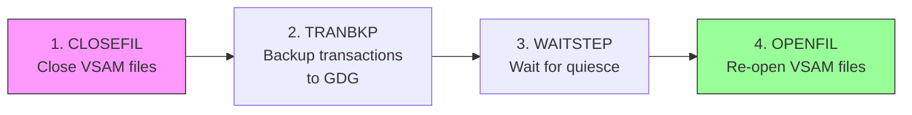
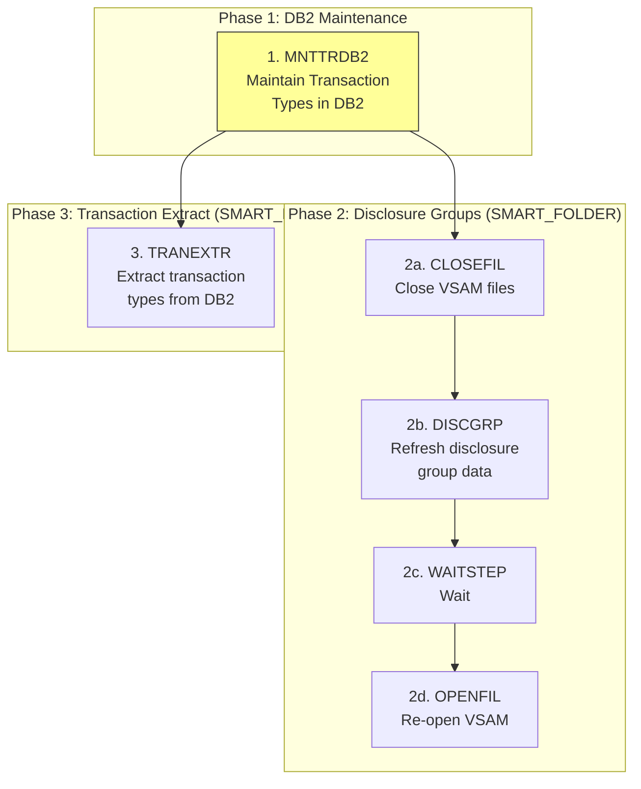
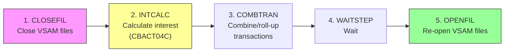

# Dependency Map — CardDemo COBOL Estate

> Inter-program call graph, dataset lineage, and batch pipeline flows derived from static analysis of `infosys-training/uc-legacy-modernization-cobol-to-java`.

---

## 1. Inter-Program Call Graph

The following diagram shows XCTL (transfer control) and CALL relationships between programs.

```mermaid
graph TD
    subgraph "Online CICS Programs"
        COSGN00C["COSGN00C<br/>Sign-On"]
        COMEN01C["COMEN01C<br/>Main Menu"]
        COADM01C["COADM01C<br/>Admin Menu"]

        COACTVWC["COACTVWC<br/>Account View"]
        COACTUPC["COACTUPC<br/>Account Update"]
        COCRDLIC["COCRDLIC<br/>Card List"]
        COCRDSLC["COCRDSLC<br/>Card View"]
        COCRDUPC["COCRDUPC<br/>Card Update"]
        COTRN00C["COTRN00C<br/>Transaction List"]
        COTRN01C["COTRN01C<br/>Transaction View"]
        COTRN02C["COTRN02C<br/>Transaction Add"]
        COBIL00C["COBIL00C<br/>Bill Payment"]
        CORPT00C["CORPT00C<br/>Reports"]

        COUSR00C["COUSR00C<br/>User List"]
        COUSR01C["COUSR01C<br/>User Add"]
        COUSR02C["COUSR02C<br/>User Update"]
        COUSR03C["COUSR03C<br/>User Delete"]
    end

    subgraph "Batch Programs"
        CBACT01C["CBACT01C<br/>Account Read"]
        CBACT02C["CBACT02C<br/>Card Read"]
        CBACT03C["CBACT03C<br/>Xref Read"]
        CBACT04C["CBACT04C<br/>Interest Calc"]
        CBCUS01C["CBCUS01C<br/>Customer Read"]
        CBTRN01C["CBTRN01C<br/>Tran Post"]
        CBTRN02C["CBTRN02C<br/>Tran Categorize"]
        CBTRN03C["CBTRN03C<br/>Tran Report"]
        CBSTM03A["CBSTM03A<br/>Statements"]
        CBSTM03B["CBSTM03B<br/>Stmt File I/O"]
        CBEXPORT["CBEXPORT<br/>Data Export"]
        CBIMPORT["CBIMPORT<br/>Data Import"]
    end

    subgraph "Utilities"
        CSUTLDTC["CSUTLDTC<br/>Date Utility"]
        COBSWAIT["COBSWAIT<br/>Wait Utility"]
        COBDATFT["COBDATFT<br/>Date Format (ASM)"]
        MVSWAIT["MVSWAIT<br/>Wait (ASM)"]
        CEEDAYS["CEEDAYS<br/>LE Date (System)"]
        CEE3ABD["CEE3ABD<br/>LE Abend (System)"]
    end

    %% Sign-on dispatches
    COSGN00C -->|"XCTL"| COMEN01C
    COSGN00C -->|"XCTL (admin)"| COADM01C

    %% Main Menu dispatches (via COMEN02Y option table)
    COMEN01C -->|"XCTL"| COACTVWC
    COMEN01C -->|"XCTL"| COACTUPC
    COMEN01C -->|"XCTL"| COCRDLIC
    COMEN01C -->|"XCTL"| COCRDSLC
    COMEN01C -->|"XCTL"| COCRDUPC
    COMEN01C -->|"XCTL"| COTRN00C
    COMEN01C -->|"XCTL"| COTRN01C
    COMEN01C -->|"XCTL"| COTRN02C
    COMEN01C -->|"XCTL"| CORPT00C
    COMEN01C -->|"XCTL"| COBIL00C

    %% Admin Menu dispatches (via COADM02Y option table)
    COADM01C -->|"XCTL"| COUSR00C
    COADM01C -->|"XCTL"| COUSR01C
    COADM01C -->|"XCTL"| COUSR02C
    COADM01C -->|"XCTL"| COUSR03C

    %% Card List navigation
    COCRDLIC -->|"XCTL"| COCRDSLC
    COCRDLIC -->|"XCTL"| COCRDUPC

    %% Return-to-menu XCTLs (all programs can return)
    COACTVWC -->|"XCTL (return)"| COMEN01C
    COACTUPC -->|"XCTL (return)"| COMEN01C
    COCRDSLC -->|"XCTL (return)"| COMEN01C
    COCRDUPC -->|"XCTL (return)"| COMEN01C
    COTRN00C -->|"XCTL (return)"| COMEN01C
    COTRN01C -->|"XCTL (return)"| COMEN01C
    COBIL00C -->|"XCTL (return)"| COMEN01C
    COUSR00C -->|"XCTL (return)"| COADM01C

    %% CALL relationships
    CORPT00C -->|"CALL"| CSUTLDTC
    COTRN02C -->|"CALL"| CSUTLDTC
    CSUTLDTC -->|"CALL"| CEEDAYS
    CBACT01C -->|"CALL"| COBDATFT
    CBSTM03A -->|"CALL"| CBSTM03B
    COBSWAIT -->|"CALL"| MVSWAIT

    %% Abend handler (all batch programs)
    CBACT01C -.->|"CALL"| CEE3ABD
    CBACT02C -.->|"CALL"| CEE3ABD
    CBACT03C -.->|"CALL"| CEE3ABD
    CBACT04C -.->|"CALL"| CEE3ABD
    CBCUS01C -.->|"CALL"| CEE3ABD
    CBTRN01C -.->|"CALL"| CEE3ABD
    CBTRN02C -.->|"CALL"| CEE3ABD
    CBTRN03C -.->|"CALL"| CEE3ABD
    CBEXPORT -.->|"CALL"| CEE3ABD
    CBIMPORT -.->|"CALL"| CEE3ABD
```

### Call Relationship Summary

| Source Program | Target Program | Mechanism | Purpose |
|---------------|---------------|-----------|---------|
| COSGN00C | COMEN01C / COADM01C | EXEC CICS XCTL | Post-login menu dispatch |
| COMEN01C | 10 sub-programs | EXEC CICS XCTL | Main menu option dispatch (via COMEN02Y table) |
| COADM01C | COUSR00C–COUSR03C, COTRTLIC, COTRTUPC | EXEC CICS XCTL | Admin menu dispatch (via COADM02Y table) |
| COCRDLIC | COCRDSLC / COCRDUPC | EXEC CICS XCTL | Card detail/update navigation |
| CORPT00C | CSUTLDTC | CALL | Date validation for report parameters |
| COTRN02C | CSUTLDTC | CALL | Date validation for new transactions |
| CSUTLDTC | CEEDAYS | CALL | LE callable service for date conversion |
| CBACT01C | COBDATFT | CALL | Assembler date formatting routine |
| CBSTM03A | CBSTM03B | CALL | Delegated file I/O for statement generation |
| COBSWAIT | MVSWAIT | CALL | Assembler wait routine |
| All batch | CEE3ABD | CALL | LE abend handler for fatal errors |

---

## 2. Dataset Lineage

The following diagram shows the relationship between JCL jobs, VSAM datasets, and the programs that read/write them.

```mermaid
graph LR
    subgraph "VSAM KSDS Datasets"
        ACCTDATA[("ACCTDATA<br/>Account File<br/>RECLN 300")]
        CARDDATA[("CARDDATA<br/>Card File<br/>RECLN 150")]
        CUSTDATA[("CUSTDATA<br/>Customer File<br/>RECLN 500")]
        XREFDATA[("XREFDATA<br/>Cross-Reference<br/>RECLN 50")]
        TRANSACT[("TRANSACT<br/>Transaction File<br/>RECLN 350")]
        USRSEC[("USRSEC<br/>User Security<br/>RECLN 80")]
        TCATBAL[("TCATBAL<br/>Category Balance<br/>RECLN 50")]
        DISCGRP[("DISCGRP<br/>Disclosure Group<br/>RECLN 50")]
        TRANTYPE[("TRANTYPE<br/>Transaction Type<br/>RECLN 60")]
    end

    subgraph "Sequential / GDG Datasets"
        DALYTRAN[/"DALYTRAN<br/>Daily Transactions"/]
        DALYREJS[/"DALYREJS<br/>Daily Rejects"/]
        REPTFILE[/"REPTFILE<br/>Report Output"/]
        EXPORTF[/"EXPORT-FILE<br/>Migration Export"/]
        GDGBKP[/"GDG Backups<br/>Transaction Archive"/]
    end

    subgraph "JCL Setup Jobs"
        ACCTFILE_JCL["ACCTFILE.jcl"]
        CARDFILE_JCL["CARDFILE.jcl"]
        CUSTFILE_JCL["CUSTFILE.jcl"]
        XREFFILE_JCL["XREFFILE.jcl"]
        TRANFILE_JCL["TRANFILE.jcl"]
        DUSRSECJ_JCL["DUSRSECJ.jcl"]
    end

    subgraph "Batch Processing Jobs"
        CLOSEFIL_JCL["CLOSEFIL.jcl"]
        TRANBKP_JCL["TRANBKP.jcl"]
        POSTTRAN_JCL["POSTTRAN.jcl"]
        OPENFIL_JCL["OPENFIL.jcl"]
        INTCALC_JCL["INTCALC.jcl"]
        CREASTMT_JCL["CREASTMT.JCL"]
        TRANREPT_JCL["TRANREPT.jcl"]
    end

    %% Setup jobs define datasets
    ACCTFILE_JCL -->|"IDCAMS DEFINE"| ACCTDATA
    CARDFILE_JCL -->|"IDCAMS DEFINE"| CARDDATA
    CUSTFILE_JCL -->|"IDCAMS DEFINE"| CUSTDATA
    XREFFILE_JCL -->|"IDCAMS DEFINE"| XREFDATA
    TRANFILE_JCL -->|"IDCAMS DEFINE"| TRANSACT
    DUSRSECJ_JCL -->|"IDCAMS DEFINE"| USRSEC

    %% Daily batch flow
    CLOSEFIL_JCL -->|"CLOSE"| ACCTDATA
    CLOSEFIL_JCL -->|"CLOSE"| TRANSACT
    TRANBKP_JCL -->|"REPRO"| TRANSACT
    TRANSACT -->|"backup"| GDGBKP
    DALYTRAN -->|"input"| POSTTRAN_JCL
    POSTTRAN_JCL -->|"CBTRN01C/02C"| TRANSACT
    POSTTRAN_JCL -->|"rejects"| DALYREJS
    OPENFIL_JCL -->|"OPEN"| ACCTDATA
    OPENFIL_JCL -->|"OPEN"| TRANSACT

    %% Monthly jobs
    INTCALC_JCL -->|"CBACT04C read"| TCATBAL
    INTCALC_JCL -->|"CBACT04C read"| DISCGRP
    INTCALC_JCL -->|"CBACT04C read"| XREFDATA
    INTCALC_JCL -->|"CBACT04C update"| ACCTDATA
    CREASTMT_JCL -->|"CBSTM03A read"| TRANSACT
    CREASTMT_JCL -->|"CBSTM03A read"| ACCTDATA
    CREASTMT_JCL -->|"CBSTM03A read"| CUSTDATA

    %% Report job
    TRANREPT_JCL -->|"CBTRN03C read"| TRANSACT
    TRANREPT_JCL -->|"CBTRN03C write"| REPTFILE

    %% Online CICS program access
    COACTVWC_P["COACTVWC"] -->|"READ"| ACCTDATA
    COACTVWC_P -->|"READ"| CARDDATA
    COACTVWC_P -->|"READ"| CUSTDATA
    COACTUPC_P["COACTUPC"] -->|"READ/REWRITE"| ACCTDATA
    COCRDLIC_P["COCRDLIC"] -->|"STARTBR/READNEXT"| CARDDATA
    COTRN00C_P["COTRN00C"] -->|"STARTBR/READNEXT"| TRANSACT
    COTRN02C_P["COTRN02C"] -->|"WRITE"| TRANSACT
    COBIL00C_P["COBIL00C"] -->|"READ/REWRITE"| ACCTDATA
    COUSR00C_P["COUSR00C"] -->|"STARTBR/READNEXT"| USRSEC
    COSGN00C_P["COSGN00C"] -->|"READ"| USRSEC

    %% Migration
    CBEXPORT_P["CBEXPORT"] -->|"READ ALL"| CUSTDATA
    CBEXPORT_P -->|"READ ALL"| ACCTDATA
    CBEXPORT_P -->|"READ ALL"| CARDDATA
    CBEXPORT_P -->|"READ ALL"| XREFDATA
    CBEXPORT_P -->|"READ ALL"| TRANSACT
    CBEXPORT_P -->|"WRITE"| EXPORTF
    CBIMPORT_P["CBIMPORT"] -->|"READ"| EXPORTF
    CBIMPORT_P -->|"WRITE ALL"| CUSTDATA
    CBIMPORT_P -->|"WRITE ALL"| ACCTDATA
    CBIMPORT_P -->|"WRITE ALL"| CARDDATA
    CBIMPORT_P -->|"WRITE ALL"| XREFDATA
    CBIMPORT_P -->|"WRITE ALL"| TRANSACT
```

### Dataset Access Matrix

| Dataset | Type | Record Length | Read By | Written By | Updated By |
|---------|------|-------------|---------|-----------|------------|
| ACCTDATA | VSAM KSDS | 300 | COACTVWC, COACTUPC, COBIL00C, CBACT01C, CBACT04C, CBEXPORT | CBIMPORT | COACTUPC, COBIL00C, CBACT04C |
| CARDDATA | VSAM KSDS | 150 | COACTVWC, COCRDLIC, COCRDSLC, COCRDUPC, CBACT02C, CBEXPORT | CBIMPORT | COCRDUPC |
| CUSTDATA | VSAM KSDS | 500 | COACTVWC, COCRDSLC, CBCUS01C, CBSTM03A, CBEXPORT | CBIMPORT | — |
| XREFDATA | VSAM KSDS | 50 | COACTVWC, COCRDSLC, COTRN02C, CBACT03C, CBTRN01C, CBEXPORT | CBIMPORT | — |
| TRANSACT | VSAM KSDS | 350 | COTRN00C, COTRN01C, CBTRN03C, CBSTM03A, CBEXPORT | COTRN02C, CBTRN01C, CBTRN02C, CBIMPORT | — |
| USRSEC | VSAM KSDS | 80 | COSGN00C, COUSR00C | COUSR01C | COUSR02C, COUSR03C (delete) |
| TCATBAL | VSAM KSDS | 50 | CBACT04C | — | CBACT04C |
| DISCGRP | VSAM KSDS | 50 | CBACT04C | DISCGRP.jcl (load) | — |
| TRANTYPE | VSAM KSDS | 60 | CBTRN03C | TRANTYPE.jcl (load) | — |
| DALYTRAN | Sequential | 350 | CBTRN01C, CBTRN02C | External feed | — |
| DALYREJS | Sequential | 350 | — | CBTRN02C | — |
| REPTFILE | Sequential | 133 | — | CBTRN03C | — |
| EXPORT-FILE | Sequential | 500 | CBIMPORT | CBEXPORT | — |

---

## 3. End-to-End Batch Pipeline Flow

Derived from `app/scheduler/CardDemo.controlm`.

### 3.1 Daily Cycle — Transaction Backup

**Folder:** `DAILY-TransactionBackup`
**Schedule:** Every day (ALL days, all months)

**Dependency chain:** CLOSEFIL → (condition: CLOSEFIL-complete) → TRANBKP → (condition: TRANBKP-complete) → WAITSTEP → (condition: WAITSTEP-complete) → OPENFIL

### 3.2 Weekly Cycle — Reference Data Refresh

**Folder:** `WEEKLY-TransactionTypesDBRefresh`
**Schedule:** Saturdays (SA), all months

**Dependency chain:** MNTTRDB2 → [parallel: DisclosureGroupsRefresh SMART_FOLDER, TransactionTypesDBRefresh SMART_FOLDER]

### 3.3 Monthly Cycle — Interest Calculation

**Folder:** `MONTHLY-InterestCalculation`
**Schedule:** Monthly (all months)

**Dependency chain:** CLOSEFIL → INTCALC → COMBTRAN → WAITSTEP → OPENFIL

### 3.4 Pipeline Summary

| Cycle | Frequency | Jobs in Chain | Critical Program | Purpose |
|-------|-----------|---------------|-----------------|---------|
| Daily | Every day | CLOSEFIL → TRANBKP → WAITSTEP → OPENFIL | TRANBKP (IDCAMS REPRO) | Backup transaction data to GDG archive |
| Weekly | Saturdays | MNTTRDB2 → [CLOSEFIL → DISCGRP → WAITSTEP → OPENFIL] | MNTTRDB2 | Refresh DB2 transaction types and disclosure groups |
| Weekly | Saturdays | MNTTRDB2 → TRANEXTR | TRANEXTR | Extract transaction type data from DB2 |
| Monthly | All months | CLOSEFIL → INTCALC → COMBTRAN → WAITSTEP → OPENFIL | CBACT04C (INTCALC) | Calculate interest, consolidate transactions |

### 3.5 Common Pattern: Close-Process-Open

All batch cycles follow the same structural pattern:

1. **CLOSEFIL** — Close VSAM files to gain exclusive batch access
2. **Processing step(s)** — Run one or more batch programs
3. **WAITSTEP** — COBSWAIT utility providing quiesce period
4. **OPENFIL** — Re-open VSAM files for online CICS access

This pattern ensures data integrity by preventing concurrent online and batch access to the same VSAM datasets.
