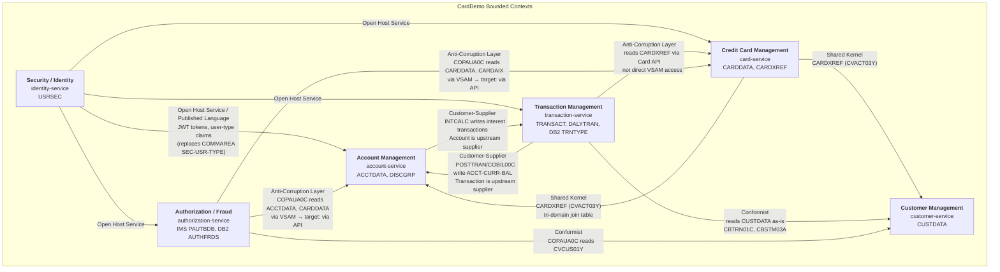

# Domain Decomposition Analysis — CardDemo COBOL Estate

## Table of Contents

1. [Executive Summary](#1-executive-summary)
2. [Methodology](#2-methodology)
3. [Copybook-Sharing Matrix](#3-copybook-sharing-matrix)
4. [JCL Job Domain Mapping](#4-jcl-job-domain-mapping)
5. [Data Store Ownership Analysis](#5-data-store-ownership-analysis)
6. [Bounded Context Definitions](#6-bounded-context-definitions)
   - [6.1 Security / Identity Management](#61-security--identity-management)
   - [6.2 Customer Management](#62-customer-management)
   - [6.3 Account Management](#63-account-management)
   - [6.4 Credit Card Management](#64-credit-card-management)
   - [6.5 Transaction Management](#65-transaction-management)
   - [6.6 Authorization / Fraud Management](#66-authorization--fraud-management)
7. [Context Map](#7-context-map)
8. [Microservice Mapping](#8-microservice-mapping)
9. [Data Ownership & Migration Implications](#9-data-ownership--migration-implications)
10. [Appendix: Raw Program-to-Copybook Matrix](#10-appendix-raw-program-to-copybook-matrix)

---

## 1. Executive Summary

The CardDemo application is a multi-tier mainframe credit card management system comprising **44 COBOL programs**, **30+ copybooks**, and **38+ JCL jobs** across 4 application modules. Despite being a monolithic CICS/COBOL application, it exhibits clear domain boundaries that map naturally to 6 bounded contexts:

| # | Bounded Context | Programs | Primary Data Store | Candidate Service |
|---|----------------|----------|-------------------|-------------------|
| 1 | **Security / Identity** | 5 | USRSEC | `identity-service` |
| 2 | **Customer Management** | 1 batch + indirect access | CUSTDATA | `customer-service` |
| 3 | **Account Management** | 4 | ACCTDATA | `account-service` |
| 4 | **Credit Card Management** | 5 | CARDDATA, CARDXREF | `card-service` |
| 5 | **Transaction Management** | 14 | TRANSACT, DALYTRAN | `transaction-service` |
| 6 | **Authorization / Fraud** | 10 | IMS PAUTBDB, DB2 AUTHFRDS | `authorization-service` |

**Key findings:**
- **CARDXREF is the #1 coupling hotspot.** The cross-reference file (CVACT03Y.cpy) is shared across 16 programs in 4 domains, linking cards to customers and accounts. This is the most critical decomposition decision.
- **17 of 30 copybooks are shared across multiple domains**, creating structural coupling that must be addressed through APIs or shared libraries.
- **12 of 38 JCL jobs span multiple domains**, with the Close-Process-Open pattern (CLOSEFIL/OPENFIL) being the most pervasive cross-cutting concern.
- **ACCTDATA is the most contended dataset**, with 4 batch writers and 7 online readers/writers across 3 domains.

---

## 2. Methodology

### 2.1 Bounded Context Identification

Bounded contexts were identified using a bottom-up analysis of the COBOL estate:

1. **Entity Analysis**: Identified core business entities from copybook record layouts (CVACT01Y → Account, CVCUS01Y → Customer, CVACT02Y → Card, CVTRA05Y → Transaction, CSUSR01Y → User, CIPAUDTY → Authorization).

2. **Cohesion Analysis**: Grouped programs that operate on the same primary entity and share the same domain copybooks. Programs that COPY the same business record layouts belong to the same domain candidate.

3. **CICS Transaction Grouping**: Mapped CICS transaction IDs to screen flows. Programs reachable from the same menu path with the same entity focus form a bounded context.

4. **Data Access Pattern Analysis**: For each VSAM dataset, identified all programs that read or write it. Programs sharing the same primary write target typically belong to the same domain.

5. **Batch Job Correlation**: Grouped JCL jobs by the programs they execute and datasets they touch. Jobs in the same Control-M/CA7 scheduling chain that share datasets belong to the same domain.

6. **Coupling Point Identification**: Copybooks used across multiple domain candidates represent coupling points. CARDXREF (CVACT03Y.cpy) emerged as the primary tri-domain coupling mechanism.

### 2.2 Source Evidence

All claims trace to:
- **Copybook COPY statements**: Extracted via `grep -i "COPY " *.cbl` across all 44 programs
- **VSAM file access**: Identified from `EXEC CICS READ/WRITE` and COBOL `OPEN/READ/WRITE` verbs
- **JCL DD statements**: Mapped programs to datasets via JCL `//DD` cards
- **Scheduler definitions**: `app/scheduler/CardDemo.controlm` (Control-M) and `app/scheduler/CardDemo.ca7` (CA7)
- **Program call graphs**: `CALL`, `EXEC CICS XCTL`, `EXEC CICS LINK` statements

---

## 3. Copybook-Sharing Matrix

### 3.1 Business Data Copybooks — Programs That COPY Them

This matrix covers all 30 application copybooks (excluding system copybooks DFHAID, DFHBMSCA, and MQ/SQLCA includes) and all 44 programs. Each cell indicates whether the program includes (COPYs) the copybook.

#### Account Domain Copybooks

| Copybook | Entity | CBACT01C | CBACT04C | CBEXPORT | CBIMPORT | CBSTM03A | CBTRN01C | CBTRN02C | COACTUPC | COACTVWC | COBIL00C | COCRDSLC | COTRN02C | COPAUA0C | COPAUS0C |
|----------|--------|----------|----------|----------|----------|----------|----------|----------|----------|----------|----------|----------|----------|----------|----------|
| **CVACT01Y** | Account Record | ✓ | ✓ | ✓ | ✓ | ✓ | ✓ | ✓ | ✓ | ✓ | ✓ | — | ✓ | ✓ | ✓ |
| **Programs using CVACT01Y** | | | | | | | | | | | | | | | |
| **Total: 14 programs** | | | | | | | | | | | | | | | |

**Complete CVACT01Y usage (14 programs across 5 domains):**
CBACT01C, CBACT04C, CBEXPORT, CBIMPORT, CBSTM03A, CBTRN01C, CBTRN02C (batch) — COACTUPC, COACTVWC, COBIL00C, COTRN02C (CICS online) — COPAUA0C, COPAUS0C (auth sub-app) — COACCT01 (VSAM-MQ)

#### Card Domain Copybooks

| Copybook | Entity | Programs Using It | Count | Domains Touched |
|----------|--------|-------------------|-------|-----------------|
| **CVACT02Y** | Card Record | CBACT02C, CBEXPORT, CBIMPORT, CBTRN01C, COACTUPC, COACTVWC, COCRDLIC, COCRDSLC, COCRDUPC, COPAUS0C, COTRTLIC | 11 | Account, Card, Transaction, Auth, TranType |
| **CVACT03Y** | Card XREF | CBACT03C, CBACT04C, CBEXPORT, CBIMPORT, CBSTM03A, CBTRN01C, CBTRN02C, CBTRN03C, COACTUPC, COACTVWC, COBIL00C, COCRDSLC¹, COCRDUPC¹, COTRN02C, COPAUA0C, COPAUS0C | 16 | **ALL 6 domains** |
| **CVCRD01Y** | Card Screen WS | COACTUPC, COACTVWC, COCRDLIC, COCRDSLC, COCRDUPC, COTRTLIC, COTRTUPC | 7 | Account, Card, TranType |

¹ COCRDSLC and COCRDUPC have CVACT03Y references in APPLICATION_INVENTORY but the COPY is commented out in source; they access XREF via CARDAIX alternate index path.

#### Customer Domain Copybooks

| Copybook | Entity | Programs Using It | Count | Domains Touched |
|----------|--------|-------------------|-------|-----------------|
| **CVCUS01Y** | Customer Record | CBCUS01C, CBEXPORT, CBIMPORT, CBTRN01C, COACTUPC, COACTVWC, COCRDSLC, COCRDUPC, COPAUA0C, COPAUS0C | 10 | Customer, Account, Card, Transaction, Auth |
| **CUSTREC** | Customer (alt layout) | CBSTM03A | 1 | Transaction (statement gen) |

#### Transaction Domain Copybooks

| Copybook | Entity | Programs Using It | Count | Domains Touched |
|----------|--------|-------------------|-------|-----------------|
| **CVTRA05Y** | Transaction Record | CBACT04C, CBEXPORT, CBIMPORT, CBTRN01C, CBTRN02C, CBTRN03C, COBIL00C, COTRN00C, COTRN01C, COTRN02C, CORPT00C | 11 | Transaction, Account |
| **CVTRA06Y** | Daily Transaction | CBTRN01C, CBTRN02C | 2 | Transaction |
| **CVTRA01Y** | Category Balance | CBACT04C, CBTRN02C | 2 | Transaction, Account |
| **CVTRA02Y** | Disclosure Group | CBACT04C | 1 | Account |
| **CVTRA03Y** | Transaction Type | CBTRN03C | 1 | Transaction |
| **CVTRA04Y** | Transaction Category | CBTRN03C | 1 | Transaction |
| **CVTRA07Y** | Report Structures | CBTRN03C | 1 | Transaction |
| **COSTM01** | Statement Transaction | CBSTM03A | 1 | Transaction |

#### Security Domain Copybooks

| Copybook | Entity | Programs Using It | Count | Domains Touched |
|----------|--------|-------------------|-------|-----------------|
| **CSUSR01Y** | User Security | COSGN00C, COADM01C, COUSR00C, COUSR01C, COUSR02C, COUSR03C, COACTUPC, COACTVWC, COCRDLIC, COCRDSLC, COCRDUPC, COMEN01C, COTRTLIC, COTRTUPC | 14 | Security, Account, Card, Navigation, TranType |

#### Authorization Domain Copybooks

| Copybook | Entity | Programs Using It | Count | Domains Touched |
|----------|--------|-------------------|-------|-----------------|
| **CIPAUDTY** | IMS Auth Detail | CBPAUP0C, COPAUA0C, COPAUS0C, COPAUS1C, COPAUS2C, DBUNLDGS, PAUDBLOD, PAUDBUNL | 8 | Authorization only |
| **CIPAUSMY** | IMS Auth Summary | CBPAUP0C, COPAUA0C, COPAUS0C, COPAUS1C, DBUNLDGS, PAUDBLOD, PAUDBUNL | 7 | Authorization only |
| **CCPAURQY** | Auth Request (MQ) | COPAUA0C | 1 | Authorization only |
| **CCPAURLY** | Auth Reply (MQ) | COPAUA0C | 1 | Authorization only |
| **CCPAUERY** | Auth Error (MQ) | COPAUA0C | 1 | Authorization only |
| **PAUTBPCB** | IMS PCB Mask | DBUNLDGS, PAUDBLOD, PAUDBUNL | 3 | Authorization only |
| **PADFLPCB** | IMS PCB (detail) | DBUNLDGS | 1 | Authorization only |
| **PASFLPCB** | IMS PCB (summary) | DBUNLDGS | 1 | Authorization only |
| **IMSFUNCS** | IMS DL/I Functions | DBUNLDGS, PAUDBLOD, PAUDBUNL | 3 | Authorization only |

#### Infrastructure / Shared Copybooks

| Copybook | Purpose | Programs Using It | Count | Notes |
|----------|---------|-------------------|-------|-------|
| **COCOM01Y** | COMMAREA | All 18 CICS online programs + COPAUS0C, COPAUS1C, COTRTLIC, COTRTUPC, COACCT01 | 23 | Cross-cutting: CICS navigation framework |
| **COTTL01Y** | Screen Title | All CICS programs with BMS screens | 21 | Cross-cutting: UI branding |
| **CSDAT01Y** | Date/Time WS | All CICS programs + COACCT01 | 22 | Cross-cutting: utility |
| **CSMSG01Y** | Message Area | All CICS programs | 22 | Cross-cutting: UI messaging |
| **CSMSG02Y** | Message Area 2 | COACTUPC, COACTVWC, COCRDSLC, COCRDUPC, COTRN02C, COPAUS0C, COPAUS1C, COTRTUPC | 8 | Extended validation messages |
| **CSUTLDPY** | Date Validation | COACTUPC, COTRN02C | 2 | Date utility |
| **CSUTLDWY** | Day-of-Week | COACTUPC, COTRTUPC | 2 | Date utility |
| **CSSETATY** | State/Area Code | COACTUPC, COTRTUPC | 2 | Validation lookup |
| **CSSTRPFY** | String Processing | COACTUPC, COACTVWC, COCRDLIC, COCRDSLC, COCRDUPC, COTRTLIC, COTRTUPC | 7 | String utility |
| **CSLKPCDY** | Lookup Code | COACTUPC | 1 | Account domain only |
| **CODATECN** | Date Conversion | CBACT01C | 1 | Batch utility |
| **CVEXPORT** | Export Layout | CBEXPORT, CBIMPORT | 2 | Migration utility |
| **COADM02Y** | Admin Menu Config | COADM01C | 1 | Security/Navigation |
| **COMEN02Y** | Main Menu Config | COMEN01C | 1 | Navigation |
| **UNUSED1Y** | Unused | _(none)_ | 0 | Dead code |

#### DB2 Sub-App Copybooks

| Copybook | Purpose | Programs Using It | Count | Domains Touched |
|----------|---------|-------------------|-------|-----------------|
| **CSDB2RWY** | DB2 Working Storage | COTRTLIC | 1 | TranType |
| **CSDB2RPY** | DB2 Procedures | COTRTLIC | 1 | TranType |
| **DCLTRTYP** | DB2 Tran Type DCL | COBTUPDT, COTRTLIC, COTRTUPC | 3 | TranType |
| **DCLTRCAT** | DB2 Tran Cat DCL | COTRTUPC | 1 | TranType |

### 3.2 Coupling Analysis Summary

| Classification | Copybooks | Coupling Risk |
|---------------|-----------|---------------|
| **Single-domain (clean boundary)** | CVTRA06Y, CVTRA02Y, CVTRA03Y, CVTRA04Y, CVTRA07Y, COSTM01, CUSTREC, CCPAURQY, CCPAURLY, CCPAUERY, CIPAUDTY, CIPAUSMY, PAUTBPCB, PADFLPCB, PASFLPCB, IMSFUNCS, CODATECN, COADM02Y, COMEN02Y, CSLKPCDY, UNUSED1Y, all DB2 DCLs | **LOW** — clean service boundaries |
| **Multi-domain (coupling points)** | CVACT01Y (14 progs, 5 domains), CVACT02Y (11 progs, 5 domains), **CVACT03Y** (16 progs, 6 domains), CVCUS01Y (10 progs, 5 domains), CVTRA05Y (11 progs, 2 domains), CSUSR01Y (14 progs, 4 domains), CVCRD01Y (7 progs, 3 domains) | **HIGH** — require shared library or API |
| **Cross-cutting infrastructure** | COCOM01Y, COTTL01Y, CSDAT01Y, CSMSG01Y, CSMSG02Y, CSSTRPFY, CSSETATY, CSUTLDPY, CSUTLDWY | **LOW** — map to shared utility library |

**Hotspot: CVACT03Y (Card Cross-Reference)** — used by 16 programs across ALL 6 domains. This is the single most important decomposition decision. In the target architecture, CARDXREF lookups must become an API call rather than a direct data read.

---

## 4. JCL Job Domain Mapping

### 4.1 Jobs by Domain

All 46 JCL jobs (38 core + 5 auth sub-app + 3 tran-type sub-app) are classified below by primary domain.

#### Security Domain (2 jobs)

| Job | File | Purpose | Datasets Touched | Cross-Domain? |
|-----|------|---------|-----------------|---------------|
| DUSRSECJ | `app/jcl/DUSRSECJ.jcl` | Define/load USRSEC VSAM | USRSEC | No |
| CBADMCDJ | `app/jcl/CBADMCDJ.jcl` | CICS NEWCOPY for online programs | _(CICS system)_ | **Yes** — refreshes ALL programs |

#### Customer Domain (2 jobs)

| Job | File | Purpose | Datasets Touched | Cross-Domain? |
|-----|------|---------|-----------------|---------------|
| CUSTFILE | `app/jcl/CUSTFILE.jcl` | Define/load CUSTDATA VSAM | CUSTDATA | No |
| READCUST | `app/jcl/READCUST.jcl` | Sequential read/audit customer | CUSTDATA (read) | No |
| DEFCUST | `app/jcl/DEFCUST.jcl` | Define CUSTDATA (alternate) | CUSTDATA | No |

#### Account Domain (2 jobs)

| Job | File | Purpose | Datasets Touched | Cross-Domain? |
|-----|------|---------|-----------------|---------------|
| ACCTFILE | `app/jcl/ACCTFILE.jcl` | Define/load ACCTDATA VSAM | ACCTDATA | No |
| READACCT | `app/jcl/READACCT.jcl` | Sequential read/audit account (CBACT01C) | ACCTDATA (read) | No |

#### Card Domain (3 jobs)

| Job | File | Purpose | Datasets Touched | Cross-Domain? |
|-----|------|---------|-----------------|---------------|
| CARDFILE | `app/jcl/CARDFILE.jcl` | Define/load CARDDATA VSAM + AIX | CARDDATA, CARDAIX | No |
| READCARD | `app/jcl/READCARD.jcl` | Sequential read/audit card (CBACT02C) | CARDDATA (read) | No |
| XREFFILE | `app/jcl/XREFFILE.jcl` | Define/load CARDXREF VSAM | CARDXREF | **Shared** — XREF spans Card/Customer/Account |
| READXREF | `app/jcl/READXREF.jcl` | Sequential read/audit XREF (CBACT03C) | CARDXREF (read) | **Shared** — reads tri-domain data |

#### Transaction Domain (17 jobs)

| Job | File | Purpose | Datasets Touched | Cross-Domain? |
|-----|------|---------|-----------------|---------------|
| TRANFILE | `app/jcl/TRANFILE.jcl` | Define/load TRANSACT VSAM | TRANSACT | No |
| TRANIDX | `app/jcl/TRANIDX.jcl` | Define AIX on TRANSACT | TRANSACT | No |
| DALYREJS | `app/jcl/DALYREJS.jcl` | Define daily rejects ESDS | DALYREJS | No |
| REPTFILE | `app/jcl/REPTFILE.jcl` | Define report ESDS | REPTFILE | No |
| TCATBALF | `app/jcl/TCATBALF.jcl` | Define/load category balance | TCATBALF | No |
| TRANCATG | `app/jcl/TRANCATG.jcl` | Define/load transaction category | TRANCATG | No |
| TRANTYPE | `app/jcl/TRANTYPE.jcl` | Define/load transaction type | TRANTYPE | No |
| DISCGRP | `app/jcl/DISCGRP.jcl` | Define/load disclosure group | DISCGRP | No |
| POSTTRAN | `app/jcl/POSTTRAN.jcl` | Post daily transactions (CBTRN01C) | DALYTRAN, CUSTFILE, XREFFILE, CARDFILE, ACCTFILE, TRANFILE | **Yes** — reads Customer, Card, Account; writes Transaction, Account |
| COMBTRAN | `app/jcl/COMBTRAN.jcl` | Validate/reject transactions (CBTRN02C) | DALYTRAN, XREFFILE, CARDFILE, ACCTFILE, TRANFILE, DALYREJS | **Yes** — reads Card, Account; writes Transaction |
| INTCALC | `app/jcl/INTCALC.jcl` | Monthly interest (CBACT04C) | XREFFILE, TRANFILE, ACCTFILE, TCATBALF, DISCGRP | **Yes** — reads/writes Account AND Transaction |
| TRANREPT | `app/jcl/TRANREPT.jcl` | Transaction reports (CBTRN03C) | TRANFILE, XREFFILE, TRANTYPE, TRANCATG | **Yes** — reads Card XREF |
| CREASTMT | `app/jcl/CREASTMT.JCL` | Statement generation (CBSTM03A) | CUSTFILE, ACCTFILE, XREFFILE, STMTFILE | **Yes** — reads Customer, Account, Card |
| TXT2PDF1 | `app/jcl/TXT2PDF1.JCL` | Convert statements to PDF | STMTFILE | No |
| PRTCATBL | `app/jcl/PRTCATBL.jcl` | Print category balance report | TCATBALF | No |
| TRANBKP | `app/jcl/TRANBKP.jcl` | Backup transactions to GDG | TRANSACT | No |

#### Authorization / Fraud Domain (5 jobs)

| Job | File | Purpose | Datasets Touched | Cross-Domain? |
|-----|------|---------|-----------------|---------------|
| CBPAUP0J | `app/app-authorization-ims-db2-mq/jcl/CBPAUP0J.jcl` | Purge expired auths (CBPAUP0C) | IMS PAUTBDB | No |
| DBPAUTP0 | `app/app-authorization-ims-db2-mq/jcl/DBPAUTP0.jcl` | Unload IMS DB | IMS PAUTBDB | No |
| LOADPADB | `app/app-authorization-ims-db2-mq/jcl/LOADPADB.JCL` | Load IMS DB (PAUDBLOD) | IMS PAUTBDB | No |
| UNLDPADB | `app/app-authorization-ims-db2-mq/jcl/UNLDPADB.JCL` | Unload IMS DB (PAUDBUNL) | IMS PAUTBDB | No |
| UNLDGSAM | `app/app-authorization-ims-db2-mq/jcl/UNLDGSAM.JCL` | GSAM unload (DBUNLDGS) | IMS PAUTBDB | No |

#### Transaction Type (DB2) Domain (3 jobs)

| Job | File | Purpose | Datasets Touched | Cross-Domain? |
|-----|------|---------|-----------------|---------------|
| CREADB21 | `app/app-transaction-type-db2/jcl/CREADB21.jcl` | Create DB2 tables | DB2 TRNTYPE, TRNTYCAT | No |
| MNTTRDB2 | `app/app-transaction-type-db2/jcl/MNTTRDB2.jcl` | Batch update DB2 types (COBTUPDT) | DB2 TRNTYPE | No |
| TRANEXTR | `app/app-transaction-type-db2/jcl/TRANEXTR.jcl` | Extract DB2 → sequential | DB2 TRNTYPE, TRNTYCAT | **Yes** — syncs DB2 → VSAM (dual-store) |

#### Cross-Cutting Infrastructure (8 jobs)

| Job | File | Purpose | Domains Affected |
|-----|------|---------|-----------------|
| CLOSEFIL | `app/jcl/CLOSEFIL.jcl` | Close CICS files for batch | **All domains** — every VSAM file |
| OPENFIL | `app/jcl/OPENFIL.jcl` | Reopen CICS files | **All domains** |
| WAITSTEP | `app/jcl/WAITSTEP.jcl` | Timer synchronization | **All domains** — pipeline coordination |
| CBEXPORT | `app/jcl/CBEXPORT.jcl` | Export all VSAM data | **All domains** — reads CUSTFILE, ACCTFILE, CARDXREF, TRANFILE, CARDFILE |
| CBIMPORT | `app/jcl/CBIMPORT.jcl` | Import to all VSAM files | **All domains** — writes CUSTFILE, ACCTFILE, CARDXREF, TRANFILE, CARDFILE |
| DEFGDGB | `app/jcl/DEFGDGB.jcl` | Define GDG base (backup) | Infrastructure |
| DEFGDGD | `app/jcl/DEFGDGD.jcl` | Define GDG base (daily) | Infrastructure |
| ESDSRRDS | `app/jcl/ESDSRRDS.jcl` | Define ESDS/RRDS clusters | Infrastructure |
| FTPJCL | `app/jcl/FTPJCL.JCL` | FTP file transfer | Infrastructure / migration |
| INTRDRJ1 | `app/jcl/INTRDRJ1.JCL` | Internal reader submit 1 | Infrastructure |
| INTRDRJ2 | `app/jcl/INTRDRJ2.JCL` | Internal reader submit 2 | Infrastructure |

### 4.2 Scheduling Chain → Domain Mapping

#### Control-M Chains

| Chain | Schedule | Jobs | Primary Domain | Cross-Domain? |
|-------|----------|------|---------------|---------------|
| **DAILY-TransactionBackup** | All days | CLOSEFIL → TRANBKP → WAITSTEP → OPENFIL | Transaction + Infrastructure | **Yes** — CLOSEFIL/OPENFIL affect all domains |
| **MONTHLY-InterestCalculation** | Monthly | CLOSEFIL → INTCALC → COMBTRAN → WAITSTEP → OPENFIL | Transaction + Account | **Yes** — INTCALC writes both TRANFILE and ACCTFILE |
| **WEEKLY-TransactionTypesDBRefresh** | Saturdays | MNTTRDB2 → {DisclosureGroupsRefresh, TransactionTypesDBRefresh} | Transaction Type (DB2) | **Yes** — syncs DB2 to VSAM |
| WEEKLY-DisclosureGroupsRefresh (sub) | Saturdays | CLOSEFIL → DISCGRP → WAITSTEP → OPENFIL | Transaction (ref data) | Yes |
| WEEKLY-TransactionTypesDBRefresh (sub) | Saturdays | TRANEXTR | Transaction Type | Yes |

#### CA7 Chains

| Chain | Schedule | Jobs | Primary Domain | Cross-Domain? |
|-------|----------|------|---------------|---------------|
| **Daily Processing** | Daily | CLOSEFIL → CBPAUP0J → POSTTRAN → WAITSTEP → OPENFIL | Transaction + Auth | **Yes** — CBPAUP0J is auth; POSTTRAN is transaction + account |
| **Weekly Ref Data** | Weekly | CLOSEFIL → TRANTYPE → WAITSTEP → (CLOSEFIL1 ‖ CLOSEFIL2) → TRANCATG / TCATBALF → WAITSTEP → OPENFIL | Transaction (ref data) | No |
| **Statement Cycle** | Monthly | CLOSEFIL → CREASTMT → TXT2PDF1 → WAITSTEP → OPENFIL | Transaction (statements) | **Yes** — CREASTMT reads Customer, Account, Card |
| **Monthly Validation** | Monthly | CLOSEFIL → READACCT → READCARD → READCUST → READXREF → WAITSTEP → OPENFIL | **All domains** — audits all files | **Yes** |
| **Monthly Reporting** | Monthly | after TXT2PDF1 → PRTCATBL | Transaction | No |

### 4.3 Cross-Domain Job Summary

| Job | Primary Domain | Other Domains Touched | Risk |
|-----|---------------|----------------------|------|
| **POSTTRAN** | Transaction | Account (writes ACCT-CURR-BAL), Card (reads XREF), Customer (reads) | **HIGH** |
| **COMBTRAN** | Transaction | Account (writes), Card (reads XREF) | **HIGH** |
| **INTCALC** | Account | Transaction (writes interest transactions), Card (reads XREF) | **HIGH** |
| **CREASTMT** | Transaction | Customer (reads), Account (reads), Card (reads XREF) | **MEDIUM** |
| **TRANREPT** | Transaction | Card (reads XREF) | **LOW** |
| **CBEXPORT** | Infrastructure | All domains (reads all VSAM files) | **MEDIUM** |
| **CBIMPORT** | Infrastructure | All domains (writes all VSAM files) | **HIGH** |
| **CLOSEFIL/OPENFIL** | Infrastructure | All domains (VSAM exclusive access) | **HIGH** — eliminated by DB2 migration |

---

## 5. Data Store Ownership Analysis

### 5.1 VSAM Dataset Classification

For each dataset, this section identifies all programs that read or write it, the domains involved, and the ownership classification.

| Dataset | Primary Key | Batch Writers | Batch Readers | Online Writers | Online Readers | Domains | Classification |
|---------|------------|--------------|--------------|----------------|----------------|---------|---------------|
| **ACCTDATA** | ACCT-ID (11) | CBIMPORT, CBTRN01C, CBTRN02C, CBACT04C | CBACT01C, CBACT04C, CBEXPORT, CBSTM03A | COACTUPC, COBIL00C | COACTVWC, COCRDLIC, COCRDSLC, COCRDUPC, COTRN02C, COPAUA0C, COACCT01 | Account, Transaction, Card, Auth | **Shared-Mutable** |
| **CARDDATA** | CARD-NUM (16) | CBIMPORT | CBACT02C, CBEXPORT, CBTRN01C, CBTRN02C | COCRDUPC | COCRDLIC, COCRDSLC, COTRN02C, COPAUA0C | Card, Transaction, Auth | **Shared-Read** |
| **CUSTDATA** | CUST-ID (9) | CBIMPORT | CBCUS01C, CBEXPORT, CBTRN01C, CBSTM03A | — | — | Customer, Transaction | **Shared-Read** |
| **CARDXREF** | XREF-CARD-NUM (16) | CBIMPORT | CBACT03C, CBACT04C, CBEXPORT, CBTRN01C, CBTRN02C, CBTRN03C, CBSTM03A | — | COCRDLIC (via AIX) | Card, Account, Transaction, Auth | **Shared-Read** |
| **TRANSACT** | TRAN-ID (16) | CBIMPORT, CBTRN01C, CBTRN02C, CBACT04C | CBACT04C, CBTRN03C, CBEXPORT | COTRN02C, COBIL00C | COTRN00C, COTRN01C | Transaction, Account | **Shared-Mutable** |
| **DALYTRAN** | — (sequential) | _(external feed)_ | CBTRN01C, CBTRN02C | — | — | Transaction | **Domain-Private** |
| **USRSEC** | SEC-USR-ID (8) | _(DUSRSECJ.jcl)_ | — | COUSR01C | COSGN00C, COUSR00C, COUSR02C, COUSR03C | Security | **Domain-Private** |
| **TCATBALF** | compound | CBACT04C | — | — | — | Transaction/Account | **Domain-Private** |
| **TRANTYPE** | TRAN-TYPE (2) | _(TRANTYPE.jcl)_ | CBTRN03C | — | — | Transaction | **Domain-Private** |
| **TRANCATG** | compound | _(TRANCATG.jcl)_ | CBTRN03C | — | — | Transaction | **Domain-Private** |
| **DISCGRP** | compound | _(DISCGRP.jcl)_ | CBACT04C | — | — | Account | **Domain-Private** |
| **DALYREJS** | — (ESDS) | CBTRN02C | — | — | — | Transaction | **Domain-Private** |
| **REPTFILE** | — (ESDS) | CBTRN03C | — | — | — | Transaction | **Domain-Private** |
| **STMTFILE** | — (sequential) | CBSTM03A, CBSTM03B | — | — | — | Transaction | **Domain-Private** |

#### IMS / DB2 Stores

| Store | Type | Writers | Readers | Domains | Classification |
|-------|------|---------|---------|---------|---------------|
| **IMS PAUTBDB** | HIDAM | COPAUA0C (CICS), PAUDBLOD (batch) | COPAUS0C, COPAUS1C, CBPAUP0C (batch purge), PAUDBUNL, DBUNLDGS | Authorization | **Domain-Private** |
| **DB2 TRNTYPE** | Table | COBTUPDT, COTRTUPC | COTRTLIC, COTRTUPC | Transaction Type | **Domain-Private** |
| **DB2 TRNTYCAT** | Table | COTRTUPC | COTRTLIC | Transaction Type | **Domain-Private** |
| **DB2 AUTHFRDS** | View | — | COPAUS0C, COPAUS1C | Authorization | **Domain-Private** |

### 5.2 Classification Legend

| Classification | Definition | Service Implication | Count |
|---------------|-----------|---------------------|-------|
| **Domain-Private** | Single domain reads and writes | Database-per-service; clean microservice boundary | 11 |
| **Shared-Read** | One domain writes, multiple domains read | Owner service exposes read API; consumers call API instead of direct read | 3 |
| **Shared-Mutable** | Multiple domains write | **Highest coupling risk**; requires event-driven architecture, saga pattern, or shared database with clear write ownership | 2 |

### 5.3 Critical Shared Datasets

#### ACCTDATA — Shared-Mutable (Highest Risk)

**Writers by domain:**
- **Account domain**: COACTUPC (online account update), CBIMPORT (bulk import)
- **Transaction domain**: CBTRN01C (post transactions — updates `ACCT-CURR-BAL`, `ACCT-CURR-CYC-DEBIT`), CBTRN02C (validation — updates balances), COBIL00C (bill payment — updates balance)
- **Account domain (interest)**: CBACT04C (interest calculation — updates `ACCT-CURR-BAL`)

**Impact**: In a microservices architecture, the Account service MUST own ACCTDATA. Transaction posting and bill payment must call Account service APIs to update balances rather than writing directly. This is the #1 saga/event pattern requirement.

#### TRANSACT — Shared-Mutable (High Risk)

**Writers by domain:**
- **Transaction domain**: CBTRN01C (post daily), CBTRN02C (validate), COTRN02C (online add), COBIL00C (bill payment), CBIMPORT
- **Account domain**: CBACT04C (writes interest-generated transactions)

**Impact**: Transaction service owns TRANSACT. Interest calculation (CBACT04C) must publish events or call Transaction service API to create interest transaction records.

#### CARDXREF — Shared-Read (High Coupling)

**Single writer**: CBIMPORT (bulk import only)
**Readers**: 16 programs across all domains

**Impact**: Card service owns CARDXREF. All other services must call Card service's lookup API: `GET /api/cards/{cardNum}/xref` → returns `{custId, acctId}`. This single API replaces 16 direct VSAM reads.

---

## 6. Bounded Context Definitions

### 6.1 Security / Identity Management

**Candidate Microservice**: `identity-service`
**Responsibility**: User authentication, authorization, and user lifecycle management.

#### Programs Owned

| Program | File | Type | Function |
|---------|------|------|----------|
| COSGN00C | `app/cbl/COSGN00C.cbl` | CICS Online | Sign-on / authentication |
| COUSR00C | `app/cbl/COUSR00C.cbl` | CICS Online | User list (paginated browse) |
| COUSR01C | `app/cbl/COUSR01C.cbl` | CICS Online | User add |
| COUSR02C | `app/cbl/COUSR02C.cbl` | CICS Online | User update |
| COUSR03C | `app/cbl/COUSR03C.cbl` | CICS Online | User delete |

#### Copybooks Owned vs. Shared

| Copybook | Status | Used By Other Domains? |
|----------|--------|----------------------|
| **CSUSR01Y** | **Shared** — used by 14 programs in 4 domains | Yes — Account, Card, Navigation, TranType programs include it for `SEC-USR-TYPE` checks |
| **COADM02Y** | Owned | No — admin menu config only |

#### Data Stores

| Store | Ownership | Access Pattern |
|-------|-----------|---------------|
| **USRSEC** | **Owned** — sole domain | Read/Write by COUSR* programs; Read by COSGN00C |

#### CICS Transactions

| Transaction ID | Program | Function |
|---------------|---------|----------|
| CDSG | COSGN00C | Sign-on |
| CAUL | COUSR00C | User list |
| CAUA | COUSR01C | User add |
| CAUU | COUSR02C | User update |
| CAUD | COUSR03C | User delete |

#### Batch Jobs

| Job | Purpose |
|-----|---------|
| DUSRSECJ | Define and load USRSEC VSAM |
| CBADMCDJ | CICS NEWCOPY (refreshes programs — cross-cutting) |

#### Inbound Dependencies

| Caller | Mechanism | Purpose |
|--------|-----------|---------|
| All CICS programs | COMMAREA `CDEMO-USER-TYPE` | Check user type (Admin/Regular) for screen access gating |
| COADM01C | XCTL | Routes to user management screens |

#### Outbound Dependencies

| Target | Mechanism | Purpose |
|--------|-----------|---------|
| COADM01C | XCTL | After admin login |
| COMEN01C | XCTL | After regular user login |

#### Suggested API Boundary

| Method | Endpoint | Maps To |
|--------|----------|---------|
| POST | `/api/auth/login` | COSGN00C authentication |
| POST | `/api/auth/logout` | Session termination |
| GET | `/api/users` | COUSR00C user list |
| POST | `/api/users` | COUSR01C user add |
| GET | `/api/users/{id}` | COUSR02C user detail |
| PUT | `/api/users/{id}` | COUSR02C user update |
| DELETE | `/api/users/{id}` | COUSR03C user delete |

---

### 6.2 Customer Management

**Candidate Microservice**: `customer-service`
**Responsibility**: Customer profile lifecycle management — create, read, update customer records.

#### Programs Owned

| Program | File | Type | Function |
|---------|------|------|----------|
| CBCUS01C | `app/cbl/CBCUS01C.cbl` | Batch | Sequential read/display of customer records |

**Note**: Customer Management has no dedicated CICS screens. Customer data is accessed indirectly through Account and Card screens. This makes it a strong candidate for a standalone service consumed by others via API.

#### Copybooks Owned vs. Shared

| Copybook | Status | Used By Other Domains? |
|----------|--------|----------------------|
| **CVCUS01Y** | **Shared** — used by 10 programs in 5 domains | Yes — Account, Card, Transaction, Auth programs read customer data |
| **CUSTREC** | **Shared** — alternate layout used by CBSTM03A | Yes — Transaction (statement generation) |

#### Data Stores

| Store | Ownership | Access Pattern |
|-------|-----------|---------------|
| **CUSTDATA** | **Owned** — sole writer is CBIMPORT (bulk) | Read-only by other domains; no online writes currently |

#### CICS Transactions

_(None — Customer has no dedicated CICS transactions in the base application)_

#### Batch Jobs

| Job | Purpose |
|-----|---------|
| CUSTFILE | Define/load CUSTDATA VSAM cluster |
| READCUST | Sequential read/audit of customer file |
| DEFCUST | Define CUSTDATA (alternate parameters) |

#### Inbound Dependencies

| Caller | Mechanism | Purpose |
|--------|-----------|---------|
| CBTRN01C | Direct VSAM read | Customer lookup during transaction posting |
| CBSTM03A | Direct VSAM read | Customer data for statement generation |
| COPAUA0C | CVACT03Y XREF → CVCUS01Y | Customer lookup for authorization |
| COACTUPC, COACTVWC, COCRDSLC, COCRDUPC | CVCUS01Y COPY | Display customer info on account/card screens |

#### Outbound Dependencies

_(None — Customer is a pure data provider)_

#### Suggested API Boundary

| Method | Endpoint | Maps To |
|--------|----------|---------|
| GET | `/api/customers` | List customers (paginated) |
| GET | `/api/customers/{id}` | Get customer detail |
| POST | `/api/customers` | Create customer (currently batch-only) |
| PUT | `/api/customers/{id}` | Update customer profile |
| DELETE | `/api/customers/{id}` | Delete customer |
| GET | `/api/customers/{id}/accounts` | List accounts for customer (via XREF) |

---

### 6.3 Account Management

**Candidate Microservice**: `account-service`
**Responsibility**: Credit card account lifecycle — view, update, interest calculation, balance management.

#### Programs Owned

| Program | File | Type | Function |
|---------|------|------|----------|
| CBACT01C | `app/cbl/CBACT01C.cbl` | Batch | Read account VSAM; write flat/array/variable-length files |
| CBACT04C | `app/cbl/CBACT04C.cbl` | Batch | Interest calculation — compute interest, update accounts and transactions |
| COACTUPC | `app/cbl/COACTUPC.cbl` | CICS Online | Account update with field validation |
| COACTVWC | `app/cbl/COACTVWC.cbl` | CICS Online | Account view |

#### Copybooks Owned vs. Shared

| Copybook | Status | Used By Other Domains? |
|----------|--------|----------------------|
| **CVACT01Y** | **Shared** — 14 programs, 5 domains | Yes — Transaction, Card, Auth, MQ all read account records |
| **CVTRA02Y** | Owned — interest rate config | No — only CBACT04C |
| **CSLKPCDY** | Owned — lookup codes | No — only COACTUPC |

#### Data Stores

| Store | Ownership | Access Pattern |
|-------|-----------|---------------|
| **ACCTDATA** | **Owned** (primary writer) | Updated by COACTUPC, COBIL00C, CBACT04C, CBTRN01C, CBTRN02C — but Account service must own and mediate writes |
| **DISCGRP** | **Owned** — interest rate configuration | Read by CBACT04C for interest calculation |
| **TCATBALF** | **Co-owned** with Transaction | Read/write by CBACT04C |

#### CICS Transactions

| Transaction ID | Program | Function |
|---------------|---------|----------|
| CAAV | COACTVWC | Account view |
| CAAU | COACTUPC | Account update |

#### Batch Jobs

| Job | Purpose | Cross-Domain? |
|-----|---------|---------------|
| ACCTFILE | Define/load ACCTDATA | No |
| READACCT | Sequential read/audit | No |
| INTCALC | Monthly interest calculation (CBACT04C) | **Yes** — writes TRANFILE and ACCTFILE |
| DISCGRP | Define/load disclosure group data | No |

#### Inbound Dependencies

| Caller | Domain | Mechanism | Purpose |
|--------|--------|-----------|---------|
| CBTRN01C | Transaction | Direct VSAM write | Update ACCT-CURR-BAL after posting |
| CBTRN02C | Transaction | Direct VSAM write | Update balance after validation |
| COBIL00C | Transaction | Direct VSAM write | Update balance after bill payment |
| COPAUA0C | Authorization | VSAM read | Verify account for authorization |
| COACCT01 | MQ Integration | VSAM read | Account inquiry via MQ |
| COCRDLIC, COCRDSLC, COCRDUPC | Card | VSAM read | Account lookup from card screens |

#### Outbound Dependencies

| Target | Domain | Mechanism | Purpose |
|--------|--------|-----------|---------|
| CARDXREF (XREF) | Card | VSAM read | Resolve card → account mapping |
| CUSTDATA | Customer | VSAM read | Customer name display on account screens |
| TRANFILE | Transaction | VSAM write | CBACT04C writes interest transactions |

#### Suggested API Boundary

| Method | Endpoint | Maps To |
|--------|----------|---------|
| GET | `/api/accounts` | List accounts |
| GET | `/api/accounts/{id}` | Get account detail (COACTVWC) |
| PUT | `/api/accounts/{id}` | Update account (COACTUPC) |
| POST | `/api/accounts/{id}/debit` | Debit account balance (for transaction posting) |
| POST | `/api/accounts/{id}/credit` | Credit account balance (for bill payment) |
| POST | `/api/accounts/{id}/interest` | Apply interest (CBACT04C equivalent) |
| GET | `/api/accounts/{id}/balance` | Get current balance |

---

### 6.4 Credit Card Management

**Candidate Microservice**: `card-service`
**Responsibility**: Credit card lifecycle — issue, view, update, deactivate cards. Owns the Card-Customer-Account cross-reference.

#### Programs Owned

| Program | File | Type | Function |
|---------|------|------|----------|
| CBACT02C | `app/cbl/CBACT02C.cbl` | Batch | Sequential read/display card records |
| CBACT03C | `app/cbl/CBACT03C.cbl` | Batch | Sequential read/display XREF records |
| COCRDLIC | `app/cbl/COCRDLIC.cbl` | CICS Online | Card list (paginated, with AIX lookup) |
| COCRDSLC | `app/cbl/COCRDSLC.cbl` | CICS Online | Card detail view |
| COCRDUPC | `app/cbl/COCRDUPC.cbl` | CICS Online | Card update |

#### Copybooks Owned vs. Shared

| Copybook | Status | Used By Other Domains? |
|----------|--------|----------------------|
| **CVACT02Y** | **Shared** — 11 programs, 5 domains | Yes — Account, Transaction, Auth, TranType programs read card data |
| **CVACT03Y** | **Shared** — 16 programs, ALL domains | **#1 coupling hotspot** — XREF links Card, Customer, Account |
| **CVCRD01Y** | **Shared** — 7 programs, 3 domains | Yes — Account and TranType programs use card screen working storage |

#### Data Stores

| Store | Ownership | Access Pattern |
|-------|-----------|---------------|
| **CARDDATA** | **Owned** | Updated by COCRDUPC (online), CBIMPORT (bulk) |
| **CARDXREF** | **Owned** | This is the "Rosetta Stone" — Card service provides XREF lookup API |
| **CARDAIX** | **Owned** | Alternate index on CARDDATA (by ACCT-ID) |

#### CICS Transactions

| Transaction ID | Program | Function |
|---------------|---------|----------|
| CACL | COCRDLIC | Card list |
| CACS | COCRDSLC | Card detail |
| CACU | COCRDUPC | Card update |

#### Batch Jobs

| Job | Purpose |
|-----|---------|
| CARDFILE | Define/load CARDDATA VSAM + AIX |
| READCARD | Sequential read/audit card file |
| XREFFILE | Define/load CARDXREF VSAM |
| READXREF | Sequential read/audit XREF |

#### Inbound Dependencies

| Caller | Domain | Mechanism | Purpose |
|--------|--------|-----------|---------|
| CBTRN01C | Transaction | VSAM read CARDDAT + XREFFILE | Card validation + card→account lookup |
| CBTRN02C | Transaction | VSAM read XREFFILE + CARDDAT | Card/account validation |
| CBTRN03C | Transaction | VSAM read XREFFILE | Report: resolve card→account |
| CBSTM03A | Transaction | VSAM read XREFFILE | Statement: iterate cards by account |
| CBACT04C | Account | VSAM read XREFFILE | Interest: iterate all card-account pairs |
| COPAUA0C | Authorization | VSAM read CARDDAT + CARDAIX | Verify card for authorization |
| COACTUPC, COACTVWC | Account | VSAM read via CARDAIX | Look up cards for an account |

#### Outbound Dependencies

| Target | Domain | Mechanism | Purpose |
|--------|--------|-----------|---------|
| ACCTDATA | Account | VSAM read | Display account info on card screens |
| CUSTDATA | Customer | CVCUS01Y COPY | Display customer name on card screens |

#### Suggested API Boundary

| Method | Endpoint | Maps To |
|--------|----------|---------|
| GET | `/api/cards` | List cards (COCRDLIC) |
| GET | `/api/cards/{num}` | Get card detail (COCRDSLC) |
| PUT | `/api/cards/{num}` | Update card (COCRDUPC) |
| POST | `/api/cards` | Issue new card |
| DELETE | `/api/cards/{num}` | Deactivate card |
| GET | `/api/cards/{num}/xref` | **Critical API**: Get XREF → `{custId, acctId}` |
| GET | `/api/accounts/{acctId}/cards` | List cards for account (via AIX) |
| GET | `/api/customers/{custId}/cards` | List cards for customer (via XREF scan) |

---

### 6.5 Transaction Management

**Candidate Microservice**: `transaction-service`
**Responsibility**: Transaction lifecycle — daily posting, validation, reporting, bill payment, statement generation. Includes transaction type reference data management.

#### Programs Owned

| Program | File | Type | Function |
|---------|------|------|----------|
| CBTRN01C | `app/cbl/CBTRN01C.cbl` | Batch | Post daily transactions |
| CBTRN02C | `app/cbl/CBTRN02C.cbl` | Batch | Validate/reject transactions |
| CBTRN03C | `app/cbl/CBTRN03C.cbl` | Batch | Transaction reports |
| CBSTM03A | `app/cbl/CBSTM03A.CBL` | Batch | Statement generation |
| CBSTM03B | `app/cbl/CBSTM03B.CBL` | Batch | Statement page formatting (subroutine) |
| COTRN00C | `app/cbl/COTRN00C.cbl` | CICS Online | Transaction list (browse) |
| COTRN01C | `app/cbl/COTRN01C.cbl` | CICS Online | Transaction detail view |
| COTRN02C | `app/cbl/COTRN02C.cbl` | CICS Online | Transaction add |
| CORPT00C | `app/cbl/CORPT00C.cbl` | CICS Online | Report selection/submission |
| COBIL00C | `app/cbl/COBIL00C.cbl` | CICS Online | Bill payment |
| CSUTLDTC | `app/cbl/CSUTLDTC.cbl` | Utility | Date validation subroutine |
| COBTUPDT | `app/app-transaction-type-db2/cbl/COBTUPDT.cbl` | Batch (DB2) | Batch update transaction types |
| COTRTLIC | `app/app-transaction-type-db2/cbl/COTRTLIC.cbl` | CICS/DB2 | Transaction type list |
| COTRTUPC | `app/app-transaction-type-db2/cbl/COTRTUPC.cbl` | CICS/DB2 | Transaction type update |

#### Copybooks Owned vs. Shared

| Copybook | Status | Used By Other Domains? |
|----------|--------|----------------------|
| **CVTRA05Y** | **Shared** — 11 programs, 2 domains | Yes — Account domain (CBACT04C) reads/writes transactions |
| **CVTRA06Y** | Owned | No — daily transaction input, only CBTRN01C/02C |
| **CVTRA01Y** | Shared — 2 programs | Minor — CBACT04C (Account) uses it |
| **CVTRA03Y** | Owned | No — only CBTRN03C |
| **CVTRA04Y** | Owned | No — only CBTRN03C |
| **CVTRA07Y** | Owned | No — only CBTRN03C |
| **COSTM01** | Owned | No — only CBSTM03A |
| **DCLTRTYP** | Owned (DB2) | No — only DB2 sub-app programs |
| **DCLTRCAT** | Owned (DB2) | No — only COTRTUPC |
| **CSDB2RWY** | Owned (DB2) | No — only COTRTLIC |
| **CSDB2RPY** | Owned (DB2) | No — only COTRTLIC |

#### Data Stores

| Store | Ownership | Access Pattern |
|-------|-----------|---------------|
| **TRANSACT** | **Owned** — primary writer domain | Multiple batch writers; online read/write |
| **DALYTRAN** | **Owned** — external feed input | Read-only by CBTRN01C, CBTRN02C |
| **DALYREJS** | **Owned** — validation rejects | Written by CBTRN02C |
| **REPTFILE** | **Owned** — report output | Written by CBTRN03C |
| **STMTFILE** | **Owned** — statement output | Written by CBSTM03A/B |
| **TRANTYPE** | **Owned** — transaction type VSAM | Populated from DB2 via TRANEXTR |
| **TRANCATG** | **Owned** — transaction category VSAM | Populated from DB2 via TRANEXTR |
| **DB2 TRNTYPE** | **Owned** — transaction type master | DB2 table, managed by COBTUPDT/COTRTUPC |
| **DB2 TRNTYCAT** | **Owned** — transaction category master | DB2 table, managed by COTRTUPC |

#### CICS Transactions

| Transaction ID | Program | Function |
|---------------|---------|----------|
| CATL | COTRN00C | Transaction list |
| CATV | COTRN01C | Transaction view |
| CATA | COTRN02C | Transaction add |
| CARP | CORPT00C | Reports |
| CABP | COBIL00C | Bill payment |
| CTTT | COTRTLIC | Transaction type list (DB2) |
| CTTU | COTRTUPC | Transaction type update (DB2) |

#### Batch Jobs

| Job | Purpose | Cross-Domain? |
|-----|---------|---------------|
| POSTTRAN | Post daily transactions | **Yes** — writes ACCTFILE |
| COMBTRAN | Validate/reject transactions | **Yes** — writes ACCTFILE |
| TRANREPT | Generate transaction reports | **Yes** — reads XREFFILE |
| CREASTMT | Generate statements | **Yes** — reads CUSTFILE, ACCTFILE, XREFFILE |
| TXT2PDF1 | Convert statements to PDF | No |
| PRTCATBL | Print category balance report | No |
| TRANBKP | Backup transactions | No |
| TRANFILE | Define TRANSACT VSAM | No |
| TRANIDX | Define TRANSACT AIX | No |
| DALYREJS | Define rejects file | No |
| REPTFILE | Define report file | No |
| TCATBALF | Define/load category balance | No |
| TRANCATG | Define/load transaction category | No |
| TRANTYPE | Define/load transaction type | No |
| MNTTRDB2 | Batch update DB2 types | No |
| TRANEXTR | Extract DB2 → sequential | No |
| CREADB21 | Create DB2 tables | No |

#### Inbound Dependencies

| Caller | Domain | Mechanism | Purpose |
|--------|--------|-----------|---------|
| CBACT04C | Account | VSAM write to TRANFILE | Write interest-generated transaction records |
| CBIMPORT | Infrastructure | VSAM write to TRANFILE | Bulk import transactions |

#### Outbound Dependencies

| Target | Domain | Mechanism | Purpose |
|--------|--------|-----------|---------|
| ACCTDATA | Account | VSAM write | CBTRN01C/02C/COBIL00C update balances |
| CUSTDATA | Customer | VSAM read | CBTRN01C reads customer; CBSTM03A reads for statements |
| CARDDATA | Card | VSAM read | CBTRN01C/02C card validation |
| CARDXREF | Card | VSAM read | Card→account resolution for posting, reporting, statements |

#### Suggested API Boundary

| Method | Endpoint | Maps To |
|--------|----------|---------|
| GET | `/api/transactions` | COTRN00C transaction list |
| GET | `/api/transactions/{id}` | COTRN01C transaction detail |
| POST | `/api/transactions` | COTRN02C transaction add |
| POST | `/api/transactions/batch/post` | CBTRN01C batch posting |
| POST | `/api/transactions/batch/validate` | CBTRN02C batch validation |
| GET | `/api/reports/transactions` | CORPT00C / CBTRN03C reports |
| POST | `/api/payments` | COBIL00C bill payment |
| GET | `/api/statements/{acctId}` | CBSTM03A statement generation |
| GET | `/api/transaction-types` | COTRTLIC type list |
| PUT | `/api/transaction-types/{code}` | COTRTUPC type update |
| GET | `/api/transaction-categories` | COTRTLIC category list |

---

### 6.6 Authorization / Fraud Management

**Candidate Microservice**: `authorization-service`
**Responsibility**: Real-time card authorization processing, fraud detection, and pending authorization lifecycle management.

#### Programs Owned

| Program | File | Type | Function |
|---------|------|------|----------|
| COPAUA0C | `app/app-authorization-ims-db2-mq/cbl/COPAUA0C.cbl` | CICS/MQ | Authorization request processor (async) |
| COPAUS0C | `app/app-authorization-ims-db2-mq/cbl/COPAUS0C.cbl` | CICS | Pending auth summary screen |
| COPAUS1C | `app/app-authorization-ims-db2-mq/cbl/COPAUS1C.cbl` | CICS | Pending auth detail screen |
| COPAUS2C | `app/app-authorization-ims-db2-mq/cbl/COPAUS2C.cbl` | CICS | Pending auth schedule/update |
| CBPAUP0C | `app/app-authorization-ims-db2-mq/cbl/CBPAUP0C.cbl` | Batch (IMS BMP) | Purge expired authorizations |
| DBUNLDGS | `app/app-authorization-ims-db2-mq/cbl/DBUNLDGS.CBL` | Batch (IMS DLI) | GSAM unload of IMS DB |
| PAUDBLOD | `app/app-authorization-ims-db2-mq/cbl/PAUDBLOD.CBL` | Batch (IMS DLI) | Load IMS DB from sequential |
| PAUDBUNL | `app/app-authorization-ims-db2-mq/cbl/PAUDBUNL.CBL` | Batch (IMS DLI) | Unload IMS DB to sequential |

#### Copybooks Owned vs. Shared

| Copybook | Status | Used By Other Domains? |
|----------|--------|----------------------|
| **CIPAUDTY** | Owned | No — 8 programs, all in Authorization |
| **CIPAUSMY** | Owned | No — 7 programs, all in Authorization |
| **CCPAURQY** | Owned | No — only COPAUA0C |
| **CCPAURLY** | Owned | No — only COPAUA0C |
| **CCPAUERY** | Owned | No — only COPAUA0C |
| **PAUTBPCB** | Owned | No — IMS PCB mask |
| **PADFLPCB** | Owned | No — only DBUNLDGS |
| **PASFLPCB** | Owned | No — only DBUNLDGS |
| **IMSFUNCS** | Owned | No — IMS DL/I function codes |

**Key observation**: Authorization has the cleanest copybook boundaries of any domain — ALL 9 domain-specific copybooks are used exclusively within the Authorization context. Zero coupling through copybooks.

#### Data Stores

| Store | Ownership | Access Pattern |
|-------|-----------|---------------|
| **IMS PAUTBDB** | **Owned** — hierarchical auth data | HIDAM with summary (CIPAUSMY) and detail (CIPAUDTY) segments |
| **DB2 AUTHFRDS** | **Owned** — fraud analysis view | Read by COPAUS0C, COPAUS1C |

#### CICS Transactions

| Transaction ID | Program | Function |
|---------------|---------|----------|
| CPAS | COPAUS0C | Pending auth summary |
| CPA1 | COPAUS1C | Pending auth detail |
| CPA2 | COPAUS2C | Pending auth schedule |
| CPAA | COPAUA0C | Auth async processor (MQ-triggered) |

#### Batch Jobs

| Job | Purpose |
|-----|---------|
| CBPAUP0J | Purge expired authorizations |
| DBPAUTP0 | Unload IMS DB (DFSURGU0 utility) |
| LOADPADB | Load IMS DB from sequential |
| UNLDPADB | Unload IMS DB to sequential |
| UNLDGSAM | GSAM unload |

#### Inbound Dependencies

| Caller | Domain | Mechanism | Purpose |
|--------|--------|-----------|---------|
| External card network | External | MQ queue | Authorization requests arrive via MQ |
| COMEN01C | Navigation | XCTL | User navigates to pending auth screens |

#### Outbound Dependencies

| Target | Domain | Mechanism | Purpose |
|--------|--------|-----------|---------|
| ACCTDATA | Account | VSAM read | COPAUA0C verifies account status/limits |
| CARDDATA | Card | VSAM read | COPAUA0C verifies card validity |
| CARDAIX | Card | VSAM read (AIX) | COPAUA0C resolves card → account |
| CARDXREF | Card | CVACT03Y COPY | COPAUA0C, COPAUS0C resolve XREF lookups |
| CUSTDATA | Customer | CVCUS01Y COPY | COPAUA0C, COPAUS0C display customer info |

#### Suggested API Boundary

| Method | Endpoint | Maps To |
|--------|----------|---------|
| POST | `/api/authorizations` | COPAUA0C — submit authorization request |
| GET | `/api/authorizations` | COPAUS0C — list pending authorizations |
| GET | `/api/authorizations/{id}` | COPAUS1C — authorization detail |
| PUT | `/api/authorizations/{id}/fraud` | Mark as fraudulent |
| DELETE | `/api/authorizations/expired` | CBPAUP0C — purge expired |
| GET | `/api/fraud-reports` | DB2 AUTHFRDS view |

---

## 7. Context Map

### 7.1 Mermaid Context Map



### 7.2 Relationship Type Justification

| Relationship | Type | Justification |
|-------------|------|---------------|
| **Security → All Domains** | **Open Host Service / Published Language** | Security provides a standardized authentication/authorization protocol (JWT/OAuth2 in target state). All consumers adopt the same published interface. Maps cleanly from COMMAREA `SEC-USR-TYPE` to token claims. |
| **Card ↔ Account ↔ Customer** (via CARDXREF) | **Shared Kernel** | The CARDXREF file is shared mutable state that ALL three domains depend on. The `XREF-CARD-NUM → XREF-CUST-ID + XREF-ACCT-ID` mapping is the core domain relationship. In the target state, Card service owns this kernel and exposes it as an API. |
| **Transaction → Account** | **Customer-Supplier** | Transaction domain (upstream) drives balance changes in Account domain (downstream). Account must accept debit/credit commands from Transaction. The Transaction domain dictates the interface shape (amount, type, card). |
| **Account → Transaction** | **Customer-Supplier** | Account domain (upstream) generates interest transactions that Transaction domain (downstream) must accept. Bidirectional supplier relationship — each domain supplies events the other consumes. |
| **Transaction → Customer** | **Conformist** | Transaction programs (CBTRN01C, CBSTM03A) read customer data exactly as Customer domain defines it (CVCUS01Y layout). Transaction domain conforms to Customer's data model without any translation. |
| **Transaction → Card** | **Anti-Corruption Layer** | In the target state, Transaction service should NOT directly access CARDDATA/CARDXREF VSAM files. An ACL translates Card service API responses into the internal transaction model. This isolates Transaction from Card's data model evolution. |
| **Authorization → Account/Card** | **Anti-Corruption Layer** | Authorization currently reads ACCTDATA and CARDDATA directly via VSAM. In the target state, an ACL wraps API calls to Account and Card services, translating external models to Authorization's internal language (auth-specific views of account/card data). |
| **Authorization → Customer** | **Conformist** | Authorization reads customer data (CVCUS01Y) as-is for display purposes. Minimal translation needed. |

---

## 8. Microservice Mapping

| Bounded Context | Candidate Service | Key Programs | Data Stores | API Endpoints | Dependencies |
|----------------|-------------------|-------------|-------------|---------------|-------------|
| **Security / Identity** | `identity-service` | COSGN00C, COUSR00C–03C | USRSEC | `/api/auth/*`, `/api/users/*` | **None** — standalone |
| **Customer Management** | `customer-service` | CBCUS01C | CUSTDATA | `/api/customers/*` | **None** — data provider |
| **Account Management** | `account-service` | CBACT01C, CBACT04C, COACTUPC, COACTVWC | ACCTDATA, DISCGRP, TCATBALF | `/api/accounts/*` | card-service (XREF lookup), customer-service (name display), transaction-service (interest posting) |
| **Credit Card Management** | `card-service` | CBACT02C, CBACT03C, COCRDLIC, COCRDSLC, COCRDUPC | CARDDATA, CARDXREF, CARDAIX | `/api/cards/*`, `/api/cards/{num}/xref` | account-service (account info display), customer-service (customer info display) |
| **Transaction Management** | `transaction-service` | CBTRN01C–03C, CBSTM03A/B, COTRN00C–02C, CORPT00C, COBIL00C, CSUTLDTC, COBTUPDT, COTRTLIC, COTRTUPC | TRANSACT, DALYTRAN, DALYREJS, REPTFILE, STMTFILE, TRANTYPE, TRANCATG, DB2 TRNTYPE/TRNTYCAT | `/api/transactions/*`, `/api/payments`, `/api/statements/*`, `/api/reports/*`, `/api/transaction-types/*` | account-service (balance updates), card-service (XREF + card validation), customer-service (statement customer data) |
| **Authorization / Fraud** | `authorization-service` | COPAUA0C, COPAUS0C–2C, CBPAUP0C, DBUNLDGS, PAUDBLOD, PAUDBUNL | IMS PAUTBDB, DB2 AUTHFRDS | `/api/authorizations/*`, `/api/fraud-reports` | account-service (account verification), card-service (card verification), customer-service (customer info) |

### Cross-Cutting Concerns (Not Microservices)

| Concern | Current Implementation | Target Implementation |
|---------|----------------------|----------------------|
| **Navigation** | COMEN01C, COADM01C (menu routing via XCTL) | API Gateway routing / frontend router |
| **Batch Infrastructure** | CLOSEFIL, OPENFIL, WAITSTEP, COBSWAIT | Eliminated by DB2 migration; replaced by scheduled jobs |
| **Data Migration** | CBEXPORT, CBIMPORT | ETL pipeline or data migration microservice (one-time) |
| **CICS COMMAREA** | COCOM01Y (shared navigation state) | HTTP headers, JWT claims, API request context |
| **Date/Time Utilities** | CSDAT01Y, CSUTLDPY, CSUTLDWY, CSUTLDTC | Shared utility library (e.g., `carddemo-commons`) |
| **UI Framework** | COTTL01Y, CSMSG01Y, CSMSG02Y, CSSTRPFY, CSSETATY | Frontend component library |

---

## 9. Data Ownership & Migration Implications

### 9.1 Per-Dataset Target State

| Dataset | Current | Owner Service | How Others Access (Target) | Migration Strategy |
|---------|---------|--------------|---------------------------|-------------------|
| **USRSEC** | VSAM KSDS | `identity-service` | API: `/api/users/*` | Direct DB migration; simple schema |
| **CUSTDATA** | VSAM KSDS | `customer-service` | API: `/api/customers/{id}` | Direct DB migration; consider PII encryption |
| **ACCTDATA** | VSAM KSDS | `account-service` | API: `/api/accounts/{id}`, events: `AccountBalanceChanged` | DB migration + event bus for balance updates |
| **CARDDATA** | VSAM KSDS | `card-service` | API: `/api/cards/{num}` | Direct DB migration |
| **CARDXREF** | VSAM KSDS | `card-service` | **API: `/api/cards/{num}/xref`** — replaces 16 direct reads | DB migration; becomes a JOIN table in card-service DB |
| **TRANSACT** | VSAM KSDS | `transaction-service` | API: `/api/transactions/*`, events: `TransactionPosted` | DB migration + event publishing |
| **DALYTRAN** | Sequential | `transaction-service` | File ingestion endpoint or message queue | Replace with MQ/Kafka topic |
| **DALYREJS** | ESDS | `transaction-service` | Internal — not exposed | DB table in transaction-service |
| **TRANTYPE** | VSAM KSDS | `transaction-service` | API: `/api/transaction-types` | **Eliminate** — use DB2 directly (already exists) |
| **TRANCATG** | VSAM KSDS | `transaction-service` | API: `/api/transaction-categories` | **Eliminate** — use DB2 directly |
| **TCATBALF** | VSAM KSDS | `account-service` | Internal — balance tracking | DB table in account-service |
| **DISCGRP** | VSAM KSDS | `account-service` | Internal — interest rate config | DB table in account-service |
| **REPTFILE** | ESDS | `transaction-service` | Internal — report output | Object storage (S3) |
| **STMTFILE** | Sequential | `transaction-service` | Internal — statement output | Object storage (S3) or document DB |
| **IMS PAUTBDB** | IMS HIDAM | `authorization-service` | Internal — not directly exposed | Migrate to PostgreSQL/DynamoDB; flatten hierarchy |
| **DB2 TRNTYPE** | DB2 Table | `transaction-service` | Already DB2 — direct access | Keep as-is or migrate to service-owned DB |
| **DB2 TRNTYCAT** | DB2 Table | `transaction-service` | Already DB2 — direct access | Keep as-is |
| **DB2 AUTHFRDS** | DB2 View | `authorization-service` | Already DB2 — direct access | Keep or migrate to service-owned DB |

### 9.2 CARDXREF — The Tri-Domain Coupling Point

**Current State**: CARDXREF is a 50-byte VSAM KSDS record with 3 fields:
- `XREF-CARD-NUM` (16) — key
- `XREF-CUST-ID` (9) — FK → Customer
- `XREF-ACCT-ID` (11) — FK → Account

**16 programs across 6 domains** read this file. It is the single highest-coupling data structure in the entire estate.

**Target State Options**:

| Option | Description | Pros | Cons |
|--------|-------------|------|------|
| **A. Card Service Owns XREF** (Recommended) | CARDXREF becomes a table in `card-service` DB. All lookups go through Card service API: `GET /api/cards/{num}/xref` → `{custId, acctId}` | Clean ownership; Card already owns CARDDATA; natural fit | Card service becomes a high-traffic dependency |
| **B. Shared Database View** | XREF lives in a shared read-only view accessible to all services | Low latency; no API overhead | Violates database-per-service; coupling through shared DB |
| **C. Event-Sourced Projections** | Card service publishes `CardIssued(cardNum, custId, acctId)` events; each consumer maintains its own local projection | Full decoupling; eventual consistency | Complexity; stale reads during event propagation |
| **D. API Composition at Gateway** | API gateway composes card + customer + account data in a single call | Simple consumer code | Gateway becomes a bottleneck; doesn't solve batch |

**Recommendation**: **Option A** for online/API access, with **Option C** for high-volume batch processing (CBTRN01C, CBACT04C). Batch jobs that need to sweep all XREF records should maintain a local materialized view refreshed via events, avoiding N+1 API calls.

### 9.3 ACCTDATA — Multi-Writer Contention

**Current writers**: COACTUPC (Account), COBIL00C (Transaction), CBTRN01C (Transaction), CBTRN02C (Transaction), CBACT04C (Account)

**Target State**: Account service MUST be the sole writer to account balances. All balance-changing operations become API calls:

```
CBTRN01C (post transaction) → POST /api/accounts/{acctId}/debit
COBIL00C (bill payment)     → POST /api/accounts/{acctId}/credit  
CBACT04C (interest)         → POST /api/accounts/{acctId}/interest
```

For batch operations (CBTRN01C processes thousands of transactions), consider:
- **Saga pattern**: Each transaction posting becomes a saga with compensating actions
- **Event-driven**: Transaction service publishes `TransactionPosted` events; Account service subscribes and applies balance updates
- **Batch API**: Account service exposes a bulk update endpoint for high-volume batch cycles

### 9.4 TRANSACT — Bidirectional Domain Access

**Writers**: CBTRN01C/02C (Transaction), CBACT04C (Account), COBIL00C (Transaction), COTRN02C (Transaction)

CBACT04C (interest calculation) writes interest-generated transaction records to TRANSACT. This creates a bidirectional dependency between Account and Transaction.

**Target State**: Account service publishes `InterestCalculated(acctId, amount, type)` events. Transaction service subscribes and creates the corresponding transaction records. This eliminates the direct write dependency.

### 9.5 Migration Sequencing

Based on coupling analysis, recommended migration order:

| Phase | Service | Rationale |
|-------|---------|-----------|
| **Phase 1** | `identity-service` | Zero outbound dependencies; clean USRSEC ownership; lowest risk |
| **Phase 2** | `customer-service` | No online writes; pure read-provider; low coupling |
| **Phase 3** | `card-service` | Owns CARDXREF; must be extracted before Account/Transaction can decouple |
| **Phase 4** | `account-service` | After Card service provides XREF API; high contention requires saga patterns |
| **Phase 5** | `transaction-service` | Largest domain (14 programs); depends on Account and Card APIs being available |
| **Phase 6** | `authorization-service` | Most complex (IMS + DB2 + MQ); spans 3 storage technologies; migrate last |

---

## 10. Appendix: Raw Program-to-Copybook Matrix

Complete matrix of all 44 programs × all application copybooks (excluding DFHAID, DFHBMSCA, BMS maps, and MQ system copies).

### 10.1 Batch Programs

| Copybook | CBACT01C | CBACT02C | CBACT03C | CBACT04C | CBCUS01C | CBEXPORT | CBIMPORT | CBSTM03A | CBSTM03B | CBTRN01C | CBTRN02C | CBTRN03C | COBSWAIT |
|----------|----------|----------|----------|----------|----------|----------|----------|----------|----------|----------|----------|----------|----------|
| CVACT01Y | ✓ | | | ✓ | | ✓ | ✓ | ✓ | | ✓ | ✓ | | |
| CVACT02Y | | ✓ | | | | ✓ | ✓ | | | ✓ | | | |
| CVACT03Y | | | ✓ | ✓ | | ✓ | ✓ | ✓ | | ✓ | ✓ | ✓ | |
| CVCUS01Y | | | | | ✓ | ✓ | ✓ | | | ✓ | | | |
| CVTRA05Y | | | | ✓ | | ✓ | ✓ | | | ✓ | ✓ | ✓ | |
| CVTRA06Y | | | | | | | | | | ✓ | ✓ | | |
| CVTRA01Y | | | | ✓ | | | | | | | ✓ | | |
| CVTRA02Y | | | | ✓ | | | | | | | | | |
| CVTRA03Y | | | | | | | | | | | | ✓ | |
| CVTRA04Y | | | | | | | | | | | | ✓ | |
| CVTRA07Y | | | | | | | | | | | | ✓ | |
| COSTM01 | | | | | | | | ✓ | | | | | |
| CUSTREC | | | | | | | | ✓ | | | | | |
| CVEXPORT | | | | | | ✓ | ✓ | | | | | | |
| CODATECN | ✓ | | | | | | | | | | | | |

### 10.2 Core CICS Online Programs

| Copybook | COSGN00C | COADM01C | COMEN01C | COACTVWC | COACTUPC | COCRDLIC | COCRDSLC | COCRDUPC | COTRN00C | COTRN01C | COTRN02C | CORPT00C | COBIL00C | COUSR00C | COUSR01C | COUSR02C | COUSR03C | CSUTLDTC |
|----------|----------|----------|----------|----------|----------|----------|----------|----------|----------|----------|----------|----------|----------|----------|----------|----------|----------|----------|
| COCOM01Y | ✓ | ✓ | ✓ | ✓ | ✓ | ✓ | ✓ | ✓ | ✓ | ✓ | ✓ | ✓ | ✓ | ✓ | ✓ | ✓ | ✓ | |
| COTTL01Y | ✓ | ✓ | ✓ | ✓ | ✓ | ✓ | ✓ | ✓ | ✓ | ✓ | ✓ | ✓ | ✓ | ✓ | ✓ | ✓ | ✓ | |
| CSDAT01Y | ✓ | ✓ | ✓ | ✓ | ✓ | ✓ | ✓ | ✓ | ✓ | ✓ | ✓ | ✓ | ✓ | ✓ | ✓ | ✓ | ✓ | |
| CSMSG01Y | ✓ | ✓ | ✓ | ✓ | ✓ | ✓ | ✓ | ✓ | ✓ | ✓ | ✓ | ✓ | ✓ | ✓ | ✓ | ✓ | ✓ | |
| CSMSG02Y | | | | ✓ | ✓ | | ✓ | ✓ | | | | | | | | | | |
| CSUSR01Y | ✓ | ✓ | ✓ | ✓ | ✓ | ✓ | ✓ | ✓ | | | | | | ✓ | ✓ | ✓ | ✓ | |
| CVACT01Y | | | | ✓ | ✓ | | | | | | ✓ | | ✓ | | | | | |
| CVACT02Y | | | | ✓ | | ✓ | ✓ | ✓ | | | | | | | | | | |
| CVACT03Y | | | | ✓ | ✓ | | | | | | ✓ | | ✓ | | | | | |
| CVCUS01Y | | | | ✓ | ✓ | | ✓ | ✓ | | | | | | | | | | |
| CVCRD01Y | | | | ✓ | ✓ | ✓ | ✓ | ✓ | | | | | | | | | | |
| CVTRA05Y | | | | | | | | | ✓ | ✓ | ✓ | ✓ | ✓ | | | | | |
| CSSTRPFY | | | | ✓ | ✓ | ✓ | ✓ | ✓ | | | | | | | | | | |
| CSSETATY | | | | | ✓ | | | | | | | | | | | | | |
| CSUTLDPY | | | | | ✓ | | | | | | | | | | | | | |
| CSUTLDWY | | | | | ✓ | | | | | | | | | | | | | |
| CSLKPCDY | | | | | ✓ | | | | | | | | | | | | | |
| COADM02Y | | ✓ | | | | | | | | | | | | | | | | |
| COMEN02Y | | | ✓ | | | | | | | | | | | | | | | |

### 10.3 Authorization Sub-Application Programs

| Copybook | COPAUA0C | COPAUS0C | COPAUS1C | COPAUS2C | CBPAUP0C | DBUNLDGS | PAUDBLOD | PAUDBUNL |
|----------|----------|----------|----------|----------|----------|----------|----------|----------|
| CIPAUDTY | ✓ | ✓ | ✓ | ✓ | ✓ | ✓ | ✓ | ✓ |
| CIPAUSMY | ✓ | ✓ | ✓ | | ✓ | ✓ | ✓ | ✓ |
| CCPAURQY | ✓ | | | | | | | |
| CCPAURLY | ✓ | | | | | | | |
| CCPAUERY | ✓ | | | | | | | |
| CVACT01Y | ✓ | ✓ | | | | | | |
| CVACT02Y | | ✓ | | | | | | |
| CVACT03Y | ✓ | ✓ | | | | | | |
| CVCUS01Y | ✓ | ✓ | | | | | | |
| COCOM01Y | | ✓ | ✓ | | | | | |
| COTTL01Y | | ✓ | ✓ | | | | | |
| CSDAT01Y | | ✓ | ✓ | | | | | |
| CSMSG01Y | | ✓ | ✓ | | | | | |
| CSMSG02Y | | ✓ | ✓ | | | | | |
| PAUTBPCB | | | | | | ✓ | ✓ | ✓ |
| PADFLPCB | | | | | | ✓ | | |
| PASFLPCB | | | | | | ✓ | | |
| IMSFUNCS | | | | | | ✓ | ✓ | ✓ |

### 10.4 Transaction Type (DB2) & VSAM-MQ Programs

| Copybook | COBTUPDT | COTRTLIC | COTRTUPC | COACCT01 | CODATE01 |
|----------|----------|----------|----------|----------|----------|
| COCOM01Y | | ✓ | ✓ | | |
| COTTL01Y | | ✓ | ✓ | | |
| CSDAT01Y | | ✓ | ✓ | | |
| CSMSG01Y | | ✓ | ✓ | | |
| CSMSG02Y | | | ✓ | | |
| CSUSR01Y | | ✓ | ✓ | | |
| CVCRD01Y | | ✓ | ✓ | | |
| CVACT02Y | | ✓ | | | |
| CVACT01Y | | | | ✓ | |
| CSSTRPFY | | ✓ | ✓ | | |
| CSSETATY | | | ✓ | | |
| CSUTLDWY | | | ✓ | | |
| CSDB2RWY | | ✓ | | | |
| CSDB2RPY | | ✓ | | | |
| DCLTRTYP | ✓ | ✓ | ✓ | | |
| DCLTRCAT | | | ✓ | | |

---

*This analysis is based on the complete source code of `infosys-training/uc-legacy-modernization-cobol-to-java` (44 COBOL programs, 30+ copybooks, 46 JCL jobs). Every claim references actual source files. This document should be sufficient for an architect to draw microservice boundaries without reading COBOL.*
