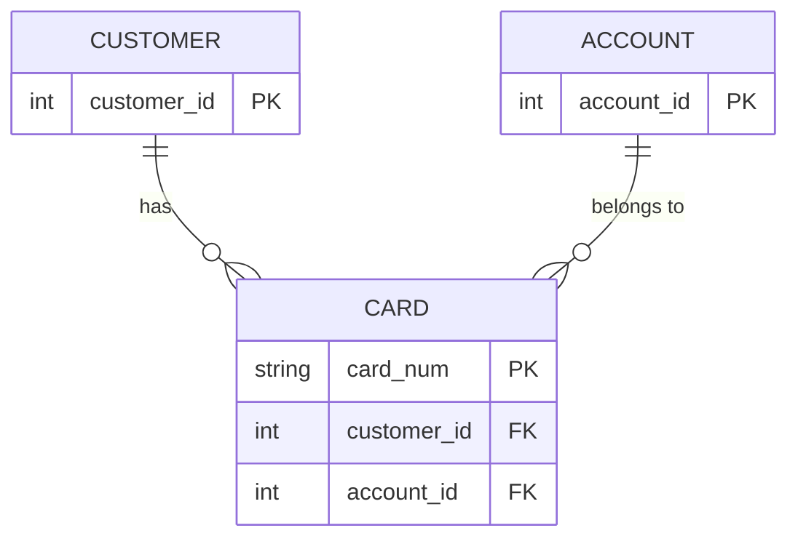
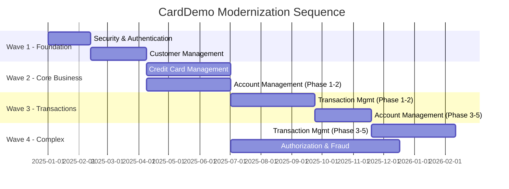
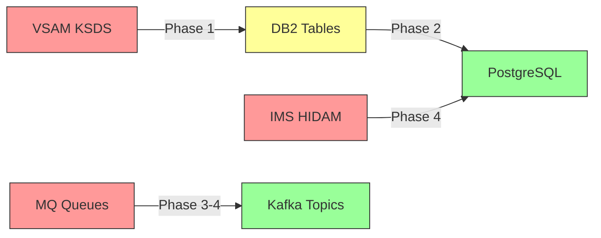

# Modernization Blueprint — CardDemo COBOL Application

## Table of Contents

1. [Executive Summary](#1-executive-summary)
2. [Security & Authentication](#2-security--authentication)
3. [Customer Management](#3-customer-management)
4. [Account Management](#4-account-management)
5. [Credit Card Management](#5-credit-card-management)
6. [Transaction Management](#6-transaction-management)
7. [Authorization & Fraud Management](#7-authorization--fraud-management)
8. [Cross-Domain Considerations](#8-cross-domain-considerations)
9. [Technology Stack Recommendations](#9-technology-stack-recommendations)
10. [Appendix](#10-appendix)

---

## 1. Executive Summary

### Estate Overview

The CardDemo application is a multi-tier mainframe credit card management system comprising **44 COBOL programs** totaling approximately **30,175 lines of code**, supported by **30 copybooks** defining shared data structures and **38 JCL jobs** orchestrated by Control-M and CA-7 schedulers. The application spans four deployment modules:

| Module | Programs | Primary Technologies |
|--------|----------|---------------------|
| Core CardDemo (`app/cbl/`) | 31 | COBOL, CICS, VSAM, BMS |
| Authorization IMS/DB2/MQ (`app/app-authorization-ims-db2-mq/`) | 8 | COBOL, IMS HIDAM, DB2, MQ |
| Transaction Type DB2 (`app/app-transaction-type-db2/`) | 3 | COBOL, CICS, DB2 |
| VSAM-MQ Integration (`app/app-vsam-mq/`) | 2 | COBOL, CICS, MQ, VSAM |

The system processes credit card transactions through a combination of online CICS screens (16 programs handling user interaction via 3270 terminals) and batch pipelines (13 programs handling daily transaction posting, monthly interest calculation, statement generation, and data migration).

### Recommended Strategy Summary

| Domain | Recommended Strategy | Effort | Risk | Time to Value |
|--------|---------------------|--------|------|---------------|
| Security & Authentication | **Rewrite** (Java/Spring Security) | Low | Low | 4–6 weeks |
| Customer Management | **Rewrite** (Java/Spring Boot) | Low–Medium | Low | 6–8 weeks |
| Account Management | **Strangler Pattern** (API-first, incremental replace) | High | Medium | 12–16 weeks |
| Credit Card Management | **Rewrite** (Java/Spring Boot) | Medium | Medium | 10–12 weeks |
| Transaction Management | **Strangler Pattern** (API-first, incremental replace) | High | High | 16–20 weeks |
| Authorization & Fraud Management | **Rewrite** (Java/Spring Boot + Kafka) | High | High | 16–24 weeks |

### High-Level Effort and Risk Summary

The total modernization effort is estimated at **12–18 months** with a cross-functional team of 6–8 engineers experienced in both mainframe and cloud-native development. The highest-risk areas are the **CARDXREF cross-domain coupling** (linking Card, Customer, and Account) and the **batch transaction posting pipeline** (POSTTRAN/INTCALC), both of which mutate shared state across domain boundaries. The lowest-risk starting point is the **Security domain**, which is self-contained and decoupled from business data flows.

---

## 2. Security & Authentication

### a. Domain Overview

**Programs:**

| Program | Type | LOC | Purpose |
|---------|------|-----|---------|
| `COSGN00C.cbl` | CICS Online | 260 | Sign-on screen — authenticate user against USRSEC, route to Admin or Main menu |
| `COUSR00C.cbl` | CICS Online | 695 | User List — paginated browse of USRSEC security file |
| `COUSR01C.cbl` | CICS Online | 299 | User Add — add new user to USRSEC |
| `COUSR02C.cbl` | CICS Online | 414 | User Update — modify existing user record |
| `COUSR03C.cbl` | CICS Online | 359 | User Delete — remove user from USRSEC |

**Total LOC:** 2,027
**Copybooks:** COCOM01Y, CSUSR01Y, COTTL01Y, CSDAT01Y, CSMSG01Y, DFHAID, DFHBMSCA, BMS maps (COSGN00, COUSR00–03)
**CICS Transactions:** CDSG (Sign-on), CAUL (User List), CAUA (User Add), CAUU (User Update), CAUD (User Delete)
**Data Store:** USRSEC VSAM KSDS (80-byte records, key = SEC-USR-ID, 8 bytes)
**Batch Jobs:** DUSRSECJ.jcl (define and load USRSEC file — on-demand/initial setup only)

**Hotspot Scores:** None of these programs appear in the top 10 hotspot list. COUSR00C has a composite score of approximately 35 (695 LOC, 8 copybooks, 4 I/O ops, moderate nesting). This domain has the lowest complexity in the estate.

### b. Current State Assessment

The Security domain implements a straightforward CRUD model for user management backed by a single VSAM file. `COSGN00C` reads the USRSEC file to authenticate users by matching `SEC-USR-ID` and `SEC-USR-PWD` (stored in **plaintext** — a critical security vulnerability), then routes admin users (`SEC-USR-TYPE = 'A'`) to `COADM01C` and regular users (`SEC-USR-TYPE = 'U'`) to `COMEN01C`. The four COUSR* programs implement standard list/add/update/delete operations against the same file.

**Key Business Logic:**
- Authentication is simple string comparison (no hashing, no salting, no lockout policy)
- User type determination gates access to admin menu (binary: Admin vs. User)
- No session management beyond CICS pseudo-conversational patterns
- No password complexity enforcement, expiration, or rotation

**Pain Points:**
- Plaintext password storage violates all modern security standards
- No audit trail for login attempts or user changes
- Single-factor authentication only
- No role granularity beyond Admin/User binary

**Coupling to Other Domains:** The Security domain has the cleanest separation of any domain. It shares only the `COCOM01Y` COMMAREA (which passes `CDEMO-USER-ID` and `CDEMO-USER-TYPE` to downstream programs) and has no data dependencies on Account, Card, Customer, or Transaction files. The cross-cutting nature is limited to the initial sign-on gate — all subsequent authorization is implicit via `SEC-USR-TYPE` carried in COMMAREA.

### c. Strategy Evaluation

#### (i) Strangler Pattern (Wrap with APIs, incrementally replace)

**How it would work:** Expose the existing USRSEC VSAM file operations through a thin API layer (e.g., a Spring Boot REST service). The API would initially delegate to the COBOL programs running on a CICS emulator, then gradually replace each operation (authenticate, list, create, update, delete) with native Java implementations.

- **Pros:** Lowest initial disruption; other CICS programs continue using COSGN00C unchanged
- **Cons:** Overengineered for such a simple domain; maintaining the VSAM-backed COBOL alongside the new API adds unnecessary complexity; the plaintext password vulnerability persists until full replacement
- **Effort:** Medium (wrapper + gradual replacement ≈ same work as direct rewrite, but slower)
- **Key Risks:** Dual authentication paths during transition; plaintext passwords remain exposed longer

#### (ii) Replatform (Keep COBOL, move to cloud runtime)

**How it would work:** Deploy the existing COSGN00C/COUSR* programs on AWS Mainframe Modernization (M2) or Micro Focus (now OpenText) runtime. USRSEC would remain as a VSAM file on the cloud runtime.

- **Pros:** Zero code changes; fastest path to cloud infrastructure
- **Cons:** Plaintext passwords persist (unacceptable security posture); no modern auth capabilities (OAuth2, MFA, SSO); VSAM file requires ongoing mainframe-style management; no integration with cloud IAM
- **Effort:** Low (infrastructure-only)
- **Key Risks:** Security vulnerability remains; compliance failure for any regulated environment; cloud runtime license cost for minimal business value

#### (iii) Refactor (Restructure COBOL for maintainability)

**How it would work:** Rewrite the COBOL programs to use DB2 instead of VSAM for user storage, add password hashing (via a COBOL callable service or external routine), and restructure the programs for better separation of concerns.

- **Pros:** Addresses the password storage vulnerability while staying on COBOL; improves data access
- **Cons:** Still limited to CICS/COBOL capabilities; cannot add modern auth features (OAuth2, JWT, MFA); pool of COBOL developers shrinking; investment in a dying platform
- **Effort:** Medium (DB2 migration + password hashing integration)
- **Key Risks:** Limited ROI — invests in COBOL for a domain that maps trivially to modern frameworks

#### (iv) Rewrite (Translate to Java/Spring Security)

**How it would work:** Implement a complete Spring Security-based authentication and user management service. Replace USRSEC VSAM with a PostgreSQL/MySQL users table with BCrypt-hashed passwords. Expose REST APIs for user CRUD. Implement JWT token issuance for session management. The modernized security service becomes the gateway for all other domains as they are modernized.

- **Pros:** Eliminates plaintext passwords immediately; enables OAuth2/OIDC, MFA, SSO; clean REST API surface; Spring Security is the industry standard with extensive tooling; simplest domain to rewrite (2,027 LOC, one data store, no batch); establishes the authentication perimeter for all future domain modernizations
- **Cons:** Requires migration of user data (trivial — only 80-byte records with 5 fields); existing CICS programs must be updated to authenticate against the new service (can be deferred using a CICS-side adapter)
- **Effort:** Low (2–4 weeks for core auth service + 2 weeks for user CRUD)
- **Key Risks:** Must coordinate transition for CICS programs that rely on COSGN00C; brief dual-auth period during cutover

### d. Strategy Comparison Matrix

| Criterion | Strangler | Replatform | Refactor | Rewrite |
|-----------|-----------|------------|----------|---------|
| **Effort** | Medium | Low | Medium | **Low** |
| **Risk** | Low | Medium (compliance) | Low | **Low** |
| **Business Value** | Low | None | Medium | **High** |
| **Time to Value** | 8–10 weeks | 2–3 weeks | 8–10 weeks | **4–6 weeks** |
| **Maintainability Gain** | Low | None | Medium | **High** |
| **Team Skill Requirements** | Java + COBOL | Mainframe ops | COBOL + DB2 | Java/Spring |

### e. RECOMMENDED STRATEGY

> **Rewrite** — Implement as a standalone Spring Security authentication and user management microservice.

**Primary Justification:**

The Security domain is the ideal first target for a full rewrite because it combines the lowest complexity in the estate (2,027 LOC, one VSAM file, no batch dependencies) with the highest urgency for modernization (plaintext password storage is an immediate compliance and security risk). The domain's clean separation from business data — it shares only the COMMAREA user context with downstream programs — means it can be modernized independently without triggering cascading changes across the other 39 programs.

A rewrite to Spring Security delivers disproportionate value: it eliminates the most critical security vulnerability (P0 per the PII audit), establishes the authentication perimeter that all other modernized domains will use, and gives the team a complete end-to-end modernization success within 4–6 weeks. This builds confidence and establishes patterns (REST APIs, JWT tokens, cloud database) that subsequent domain rewrites will reuse.

The alternative strategies all leave the plaintext password vulnerability in place for longer than acceptable (Strangler/Replatform) or invest in COBOL skills for diminishing returns (Refactor). Given that the entire domain maps to approximately 200 lines of Spring Security configuration plus a simple JPA entity, the rewrite is both the fastest and most valuable path.

**Prerequisites:**
- Target database provisioned (PostgreSQL or MySQL with BCrypt password storage)
- Spring Boot project skeleton with Spring Security dependency
- JWT signing keys generated and stored in secrets manager
- Decision on cloud hosting (AWS ECS/EKS, or equivalent)

**Dependencies on Other Domains:**
- None for initial deployment — the new auth service operates independently
- Other domains will depend on this service once they are modernized (consume JWT tokens)
- During transition, a CICS-side adapter can proxy auth requests to the new service

**Success Criteria:**
- All user authentication flows through the new service (zero USRSEC reads from COBOL)
- Passwords stored as BCrypt hashes (OWASP compliance)
- REST endpoints operational: `POST /api/auth/login`, `GET/POST/PUT/DELETE /api/users`
- Token-based session management (JWT with configurable expiry)
- Audit logging for all authentication events

**Target Technology Stack:**
- Java 17+ / Spring Boot 3.x / Spring Security 6.x
- PostgreSQL 15+ (users table with BCrypt password column)
- JWT (io.jsonwebtoken/jjwt) for token management
- Spring Data JPA for user CRUD

---

## 3. Customer Management

### a. Domain Overview

**Programs:**

| Program | Type | LOC | Purpose |
|---------|------|-----|---------|
| `CBCUS01C.cbl` | Batch | 178 | Read Customer VSAM file sequentially and display records |
| `CBSTM03A.CBL` | Batch | 924 | Statement generation — reads CUSTFILE for customer name/address |
| `CBEXPORT.cbl` | Batch | 582 | Export all VSAM data including customers to sequential file |
| `CBIMPORT.cbl` | Batch | 487 | Import data including customers from sequential file |

**Total LOC (domain-specific):** 178 (CBCUS01C only; others are shared across domains)
**Copybooks:** CVCUS01Y (500-byte customer record), CUSTREC (alternate layout for statements), CVEXPORT (export layout)
**CICS Transactions:** None dedicated — customer data is accessed indirectly through Account and Card screens
**Data Store:** CUSTFILE VSAM KSDS (500-byte records, key = CUST-ID 9 digits)
**Batch Jobs:** CUSTFILE.jcl (define/load), READCUST.jcl (sequential read), DEFCUST.jcl (alternate define)

**Hotspot Scores:** CBCUS01C has a minimal composite score (~15). CBSTM03A.CBL (which reads CUSTFILE for statements) ranks #9 with a score of 54, primarily due to its 97 I/O operations. The customer domain itself has the lowest online complexity since there are no dedicated CICS customer management screens.

### b. Current State Assessment

The Customer Management domain is notable for what it **lacks**: there are no dedicated CICS transactions for customer CRUD operations. Customers can only be viewed indirectly through Account View (COACTVWC, which displays the customer name from COMMAREA) and Card screens. Customer records are created and maintained exclusively through batch operations — CBIMPORT loads customer data from a sequential file, and CBEXPORT extracts it. The CBCUS01C batch program provides a simple sequential read/display for verification.

**Key Business Logic:**
- Customer record contains PII (SSN, DOB, government ID, addresses, phone numbers)
- FICO credit score tracked (CUST-FICO-CREDIT-SCORE, range 300–850)
- Primary cardholder indicator (CUST-PRI-CARD-HOLDER-IND) distinguishes authorized users
- EFT account ID enables automated payment linkage
- Customer-to-Account linkage is indirect via CARDXREF (XREF-CUST-ID)

**Pain Points:**
- No online customer management — all changes require batch processes
- PII stored unencrypted (SSN in plaintext across CUSTFILE and EXPORT-FILE)
- No customer self-service capability
- Weak referential integrity (customer deletion requires manual cascade to CARDXREF)
- CUSTREC.cpy duplicates CVCUS01Y layout unnecessarily

**Coupling to Other Domains:**
- **Card domain:** CARDXREF (CVACT03Y.cpy) links XREF-CUST-ID to customer records; card screens resolve customer names via this cross-reference
- **Account domain:** Indirect coupling through CARDXREF (Account → Card → Customer)
- **Statement generation:** CBSTM03A reads CUSTFILE directly for name/address on statements
- **Authorization:** CIPAUSMY contains PA-CUST-ID linking authorization records to customers

### c. Strategy Evaluation

#### (i) Strangler Pattern (Wrap with APIs, incrementally replace)

**How it would work:** Create a Customer API service that initially reads from the existing CUSTFILE VSAM. New operations (create, update) go through the API while batch processes continue reading from VSAM. Gradually migrate all consumers to the API, then switch the backing store from VSAM to a relational database.

- **Pros:** Low disruption to existing batch jobs; allows gradual migration of consumers
- **Cons:** Overengineered for a domain with no existing online interface — there's nothing to "strangle"; maintaining dual access paths to customer data adds complexity without clear benefit
- **Effort:** Medium
- **Key Risks:** VSAM-to-API read consistency during transition; batch jobs must be modified to write through API

#### (ii) Replatform (Keep COBOL, move to cloud runtime)

**How it would work:** Move CUSTFILE VSAM and associated batch programs to AWS M2 runtime. Customer data remains in VSAM format on cloud infrastructure.

- **Pros:** No code changes; maintains current batch workflows
- **Cons:** PII remains unencrypted in VSAM; still no online customer management; no path to customer self-service; GDPR right-to-erasure remains impossible without custom batch development
- **Effort:** Low
- **Key Risks:** Compliance exposure (GDPR, CCPA) due to unencrypted SSN/PII; no competitive advantage

#### (iii) Refactor (Restructure COBOL for maintainability)

**How it would work:** Add CICS online customer management screens (Customer List, View, Update, Delete) following the pattern of existing COUSR* programs. Migrate CUSTFILE from VSAM to DB2. Add field-level encryption for PII fields.

- **Pros:** Fills the functional gap (online customer management); DB2 enables SQL access patterns
- **Cons:** Investing in new COBOL/CICS development for a function that maps trivially to a REST API; still limited to 3270 terminal interface; PII encryption in COBOL is complex
- **Effort:** High (new COBOL programs + DB2 migration + encryption)
- **Key Risks:** COBOL developer availability; no path to web/mobile customer-facing UI

#### (iv) Rewrite (Translate to Java/Spring Boot)

**How it would work:** Build a Customer Management microservice with full CRUD REST APIs. Migrate customer data from VSAM to PostgreSQL with field-level encryption for PII (SSN, government ID). Implement cascading referential integrity with the CARDXREF replacement service. Enable customer self-service portal.

- **Pros:** Fills the biggest functional gap in the current system (no online customer CRUD); enables PII compliance (encryption, right-to-erasure, audit logging); provides foundation for customer self-service; simple data model (single entity with standard fields); enables proper FICO score integration
- **Cons:** Requires coordination with CARDXREF migration (cross-domain dependency); CBSTM03A and other batch consumers must be redirected to new API
- **Effort:** Low–Medium (simple entity, well-defined record structure)
- **Key Risks:** CARDXREF dependency must be addressed (Customer ID foreign key); statement generation must access the new data source

### d. Strategy Comparison Matrix

| Criterion | Strangler | Replatform | Refactor | Rewrite |
|-----------|-----------|------------|----------|---------|
| **Effort** | Medium | Low | High | **Low–Medium** |
| **Risk** | Medium | Medium (compliance) | Medium | **Low** |
| **Business Value** | Medium | None | Medium | **High** |
| **Time to Value** | 8–10 weeks | 2–3 weeks | 12–14 weeks | **6–8 weeks** |
| **Maintainability Gain** | Medium | None | Medium | **High** |
| **Team Skill Requirements** | Java + COBOL | Mainframe ops | COBOL + CICS + DB2 | Java/Spring |

### e. RECOMMENDED STRATEGY

> **Rewrite** — Build a standalone Customer Management microservice with REST APIs and encrypted PII storage.

**Primary Justification:**

The Customer domain is the second-best candidate for a full rewrite because it addresses the most significant functional gap in the current system: the complete absence of online customer management. Today, customer data can only be modified through batch import — a workflow that is operationally slow, error-prone, and incompatible with modern customer expectations. A rewrite delivers immediate business value by enabling real-time customer operations while simultaneously resolving the PII compliance risk (unencrypted SSN stored in plaintext VSAM files).

The domain's simplicity makes it an excellent rewrite target. The customer record (CVCUS01Y.cpy) maps directly to a single JPA entity with approximately 15 fields. There are no complex business rules, no EVALUATE statement nesting, and no multi-file transaction logic. The only meaningful coupling is the XREF-CUST-ID in CARDXREF, which can be addressed through the shared lookup service designed in the Cross-Domain Considerations section.

Furthermore, this rewrite is a prerequisite for Statement Generation modernization (CBSTM03A currently reads CUSTFILE directly) and for enabling GDPR right-to-erasure compliance (cascading delete across customer, card, and transaction records).

**Prerequisites:**
- Security domain microservice operational (provides auth context)
- PostgreSQL schema designed with field-level encryption columns for SSN, government ID
- CARDXREF lookup API designed (can be implemented concurrently)
- Data migration scripts written to convert EBCDIC VSAM to UTF-8 relational

**Dependencies on Other Domains:**
- Security: Must be complete (provides authentication for Customer API)
- Card/Account: CARDXREF shared service must be available or designed for concurrent development
- Statement Generation: Must be redirected to new Customer API (post-migration task)

**Success Criteria:**
- Full CRUD REST API: `GET/POST/PUT/DELETE /api/customers/{id}`
- PII encrypted at rest (SSN, government ID, DOB)
- Audit logging for all customer data access and modifications
- GDPR right-to-erasure capability implemented
- Data migration from CUSTFILE VSAM complete with zero data loss
- CBSTM03A consumer redirected to Customer API

**Target Technology Stack:**
- Java 17+ / Spring Boot 3.x / Spring Data JPA
- PostgreSQL 15+ with pgcrypto extension for field-level encryption
- Hibernate Envers for audit trail
- OpenAPI 3.0 specification for contract-first API design

---

## 4. Account Management

### a. Domain Overview

**Programs:**

| Program | Type | LOC | Hotspot Score | Purpose |
|---------|------|-----|---------------|---------|
| `COACTUPC.cbl` | CICS Online | 4,236 | **96** (Rank #1) | Account Update — full CRUD with extensive validation |
| `COACTVWC.cbl` | CICS Online | 941 | **55** (Rank #8) | Account View — display account details by ID |
| `CBACT01C.cbl` | Batch | 430 | — | Read Account VSAM; write to flat output files |
| `CBACT04C.cbl` | Batch | 652 | — | Interest calculation — compute interest on account balances |
| `CBTRN01C.cbl` | Batch | 494 | — | Post daily transactions — update account balances |
| `COBIL00C.cbl` | CICS Online | 572 | — | Bill Payment — process payments against accounts |

**Total LOC:** 7,325
**Copybooks:** CVACT01Y (300-byte account record), CVACT02Y, CVACT03Y, COCOM01Y, CSDAT01Y, CSMSG01Y, CSMSG02Y, CSUTLDWY, CSSETATY (×30+ validation tables), BMS maps (COACTVW, COACTUP, COBIL00)
**CICS Transactions:** CAAV (Account View), CAAU (Account Update), CABP (Bill Payment)
**Data Store:** ACCTDAT VSAM KSDS (300-byte records, key = ACCT-ID 11 digits); also accessed via CARDAIX alternate index
**Batch Jobs:** ACCTFILE.jcl (define/load), READACCT.jcl (sequential read), INTCALC.jcl (monthly interest), POSTTRAN.jcl (daily posting)

**Hotspot Scores:** COACTUPC.cbl is the **#1 hotspot** in the entire estate with a composite score of 96. At 4,236 lines, it is nearly 3× the next-largest core program. It references 56 copybooks (the most of any program), contains 20 EVALUATE statements, performs 20 I/O operations, and has 7 dependency connections. COACTVWC.cbl ranks #8 with a composite score of 55.

### b. Current State Assessment

The Account Management domain is dominated by `COACTUPC.cbl` — the single most complex program in the CardDemo estate. This monolithic module handles all account CRUD operations: field-level display, validation (including phone area code lookup via CSSETATY with 800+ entries, state code validation, date validation via CSUTLDWY), credit limit changes, balance recalculations, account status transitions, and expiration date management. It is the most heavily coupled program, referenced by 6 screens via XCTL and in turn transferring control back to COMEN01C.

**Key Business Logic:**
- Credit limit enforcement (`ACCT-CURR-BAL` vs. `ACCT-CREDIT-LIMIT`)
- Cash advance limit management (`ACCT-CASH-CREDIT-LIMIT ≤ ACCT-CREDIT-LIMIT`)
- Billing cycle tracking (cycle credits/debits reset monthly)
- Account status transitions (Active/Inactive/Closed)
- Disclosure group assignment (links to interest rate tiers)
- Interest calculation algorithm (CBACT04C reads DISCGRP for rates, processes all accounts)
- Daily balance mutation via POSTTRAN batch (posts from DALYTRAN to ACCT-CURR-BAL)

**Pain Points:**
- COACTUPC is a 4,236-line monolith handling display, validation, persistence, and error handling in a single program — nearly impossible to modify safely
- 56 copybook references create extreme coupling — changes to any shared structure require regression testing of this program
- Interest calculation (CBACT04C) requires exclusive VSAM access via CLOSEFIL/OPENFIL batch window
- Bill payment (COBIL00C) duplicates some balance update logic from the batch pipeline
- No API surface — all access through 3270 terminal screens

**Coupling to Other Domains:**
- **Card:** CARDAIX alternate index enables account lookup from card number; COACTVWC reads via AIX
- **Transaction:** POSTTRAN and INTCALC batch jobs write to ACCTFILE (mutate balances); COTRN02C reads ACCTDAT for account validation
- **Customer:** Indirect via CARDXREF (account → card → customer chain)
- **Authorization:** COPAUA0C reads ACCTDAT for authorization verification
- **Statement:** CBSTM03A reads ACCTFILE for statement header data
- **Bill Payment:** COBIL00C reads/writes ACCTDAT directly

### c. Strategy Evaluation

#### (i) Strangler Pattern (Wrap with APIs, incrementally replace)

**How it would work:** Deploy an Account API facade that intercepts calls to Account operations. Begin with the read-only Account View (COACTVWC) as a simple REST GET endpoint. Incrementally extract validation rules, business logic, and update operations from COACTUPC into discrete services behind the API. Maintain the COBOL programs during transition, routing traffic gradually from 3270 screens to the new API.

- **Pros:** Lowest risk for the highest-complexity program; allows incremental decomposition of the 4,236-line COACTUPC; existing batch jobs (INTCALC, POSTTRAN) continue unchanged during transition; read-only Account View can be delivered in weeks as confidence builder; natural decomposition points exist (validation, update, status management)
- **Cons:** Longest time to full modernization; dual-system maintenance during transition period; batch jobs must eventually be migrated regardless; VSAM concurrent access limitations persist until data migration
- **Effort:** High (but spread over time)
- **Key Risks:** Dual-write consistency during transition; VSAM batch window persists until data layer is migrated; risk of "permanent halfway" state if migration stalls

#### (ii) Replatform (Keep COBOL, move to cloud runtime)

**How it would work:** Run existing Account programs on AWS M2 runtime. ACCTDAT VSAM remains as-is on cloud infrastructure.

- **Pros:** No code changes to the most complex program; batch jobs continue unchanged
- **Cons:** The 4,236-line monolith remains unmaintainable; batch window persists; no API exposure; no possibility of decomposition; COACTUPC remains a change-risk nightmare
- **Effort:** Low
- **Key Risks:** Operational risk from unmaintainable code persists; any future enhancement requires COBOL development; cloud runtime costs for compute-intensive batch

#### (iii) Refactor (Restructure COBOL for maintainability)

**How it would work:** Decompose COACTUPC into multiple COBOL programs: AccountReadService, AccountValidationService, AccountUpdateService. Migrate ACCTDAT from VSAM to DB2. Extract validation rules (state codes, area codes, dates) into shared callable modules.

- **Pros:** Addresses the maintainability problem; DB2 migration eliminates batch window; creates natural module boundaries
- **Cons:** Requires extensive COBOL refactoring of the largest, most complex program — highest regression risk; still limited to 3270 interface; validation tables (800+ area codes) remain in COBOL; investment in dying skill set
- **Effort:** High (refactoring 4,236 LOC with 56 copybooks safely is extremely labor-intensive)
- **Key Risks:** Regression risk in the most connected program; COBOL refactoring tooling limitations; no path to API surface

#### (iv) Rewrite (Translate to Java/Spring Boot)

**How it would work:** Build a complete Account Management service in Java/Spring Boot. Decompose COACTUPC's functionality into: AccountController (REST API), AccountService (business logic), AccountValidationService (field validation), and AccountRepository (data access). Migrate ACCTDAT to PostgreSQL. Implement the interest calculation as a scheduled Spring Batch job.

- **Pros:** Eliminates the #1 hotspot; enables API access; validation rules become testable units; interest calculation becomes a modern scheduled job without VSAM batch window; decomposition enables independent team ownership
- **Cons:** Highest effort due to program complexity (4,236 LOC of dense business logic); risk of subtle logic errors in translation of 20 EVALUATE statements and nested validation; must maintain batch window compatibility until Transaction domain is also migrated (POSTTRAN writes to ACCTFILE)
- **Effort:** High
- **Key Risks:** Incomplete business logic translation (especially credit limit enforcement and interest rate tier logic); POSTTRAN batch dependency requires coordination with Transaction domain; must handle concurrent VSAM access during transition

### d. Strategy Comparison Matrix

| Criterion | Strangler | Replatform | Refactor | Rewrite |
|-----------|-----------|------------|----------|---------|
| **Effort** | **High** (distributed) | Low | High | High |
| **Risk** | **Low–Medium** | Low | High (regression) | Medium–High |
| **Business Value** | **High** | None | Medium | High |
| **Time to Value** | **4–6 weeks** (first API) | 2–3 weeks | 14–18 weeks | 12–16 weeks |
| **Maintainability Gain** | **High** (gradual) | None | Medium | High |
| **Team Skill Requirements** | Java + COBOL (transition) | Mainframe ops | COBOL + DB2 | Java/Spring |

### e. RECOMMENDED STRATEGY

> **Strangler Pattern** — Wrap with APIs, decompose incrementally, starting with Account View and progressing to full replacement.

**Primary Justification:**

The Account Management domain contains the single most complex and risky program in the estate (COACTUPC, composite score 96, 4,236 LOC). A big-bang rewrite of this program carries unacceptable risk of subtle business logic errors — particularly in the interest calculation algorithm, credit limit enforcement, and the 20 EVALUATE-driven state machine for screen navigation. The Strangler Pattern mitigates this risk by enabling incremental replacement with continuous validation against the existing system.

The recommended approach starts with the lowest-risk, highest-confidence entry point: COACTVWC (Account View, rank #8, 941 LOC). This read-only program maps to a simple `GET /api/accounts/{id}` endpoint, can be delivered in 2–3 weeks, and validates the entire data access and API infrastructure without mutation risk. Once the read path is proven, the strategy proceeds to decompose COACTUPC's operations into discrete services: validation (phone, state, date), status management, balance queries, and finally update operations.

The batch pipeline (POSTTRAN, INTCALC) continues operating against the existing VSAM data store during transition. Only after the Account API fully controls all write paths — and the Transaction domain has been addressed — does the data store migration to PostgreSQL occur. This ensures zero business disruption while progressively eliminating the unmaintainable monolith.

**Prerequisites:**
- Security domain microservice operational (provides auth)
- API gateway deployed to route traffic between legacy and modern endpoints
- Database schema designed for account entity (PostgreSQL)
- Integration test framework capable of comparing COBOL output with API output

**Dependencies on Other Domains:**
- Security: Required (authentication for API access)
- Transaction: POSTTRAN and INTCALC batch jobs mutate ACCTFILE — must be coordinated (can continue against VSAM during transition via dual-write)
- Card: CARDAIX alternate index access must be replicated in the new service
- Authorization: COPAUA0C reads ACCTDAT — needs redirect to Account API

**Success Criteria:**
- Phase 1: Account View API operational (`GET /api/accounts/{id}`) — response matches COACTVWC output
- Phase 2: Account validation extracted (state codes, area codes, dates) — shared validation library
- Phase 3: Account Update API operational — COACTUPC fully decommissioned
- Phase 4: Interest calculation migrated to Spring Batch scheduled job
- Phase 5: ACCTDAT VSAM decommissioned — all access through PostgreSQL

**Target Technology Stack:**
- Java 17+ / Spring Boot 3.x / Spring Data JPA
- PostgreSQL 15+ (account table with proper indexing for ACCT-ID)
- Spring Batch for interest calculation job
- Resilience4j for circuit breaking during transition
- Contract testing (Pact) to validate API responses against COBOL output

---

## 5. Credit Card Management

### a. Domain Overview

**Programs:**

| Program | Type | LOC | Hotspot Score | Purpose |
|---------|------|-----|---------------|---------|
| `COCRDLIC.cbl` | CICS Online | 1,459 | **69** (Rank #5) | Card List — browse/search cards by account, paginated |
| `COCRDSLC.cbl` | CICS Online | 887 | **51** (Rank #10) | Card View — display selected card detail |
| `COCRDUPC.cbl` | CICS Online | 1,560 | **72** (Rank #4) | Card Update — edit card details with validation |
| `CBACT02C.cbl` | Batch | 178 | — | Read Card VSAM file sequentially |
| `CBACT03C.cbl` | Batch | 178 | — | Read Card-Xref VSAM file sequentially |

**Total LOC:** 4,262
**Copybooks:** CVACT02Y (150-byte card record), CVACT03Y (50-byte XREF record), CVCRD01Y (card screen work areas), COCOM01Y, CSDAT01Y, CSMSG01Y, BMS maps (COCRDLI, COCRDSL, COCRDUP)
**CICS Transactions:** CACL (Card List), CACS (Card Select/View), CACU (Card Update)
**Data Stores:** CARDDAT VSAM KSDS (150-byte records, key = CARD-NUM 16 bytes); CARDXREF VSAM KSDS (50-byte records, key = XREF-CARD-NUM 16 bytes); CARDAIX (Alternate Index on CARD-ACCT-ID)
**Batch Jobs:** CARDFILE.jcl (define/load with AIX), XREFFILE.jcl (define/load), READCARD.jcl, READXREF.jcl

**Hotspot Scores:** COCRDUPC ranks #4 (score 72) and COCRDLIC ranks #5 (score 69). Both feature moderate nesting depth (6 levels) but high EVALUATE statement counts (16 and 18 respectively). COCRDLIC uses the most complex VSAM access pattern in the estate (Alternate Index browsing). COCRDSLC ranks #10 (score 51) as a simpler read-only complement.

### b. Current State Assessment

The Credit Card Management domain is a self-contained trio of CICS programs (List, View, Update) that collectively manage card lifecycle operations. The domain is architecturally cohesive — all three programs share the same copybooks and data stores, with natural navigation flows between them (List → View, List → Update, Update → Menu).

**Key Business Logic:**
- Card number validation (16-digit PAN, Luhn check assumed external)
- CVV management (3-digit code — **critical PII stored in plaintext**)
- Card expiration date management
- Embossed name handling (50-char, tied to customer)
- Card active/inactive status transitions
- Account-to-card association via CARDAIX alternate index (one account → multiple cards)
- Cross-reference management (CARDXREF links Card ↔ Customer ↔ Account)

**Pain Points:**
- PAN (card numbers) and CVV stored unencrypted in VSAM — PCI-DSS violation
- CVV retention post-authorization violates PCI-DSS Requirement 3.2 — must never be stored
- AIX (Alternate Index) for account-based card lookup is the most complex VSAM access pattern, requiring explicit DEFINE AIX, DEFINE PATH, and BLDINDEX JCL steps
- CARDXREF acts as a "join table" across three domains — any card change potentially affects Customer and Account domains
- No card issuance/reissuance workflow in online system (batch-only via CBIMPORT)

**Coupling to Other Domains:**
- **Account:** CARDAIX provides account→card lookup; COCRDLIC reads ACCTDAT for account details on card list; COCRDUPC reads ACCTDAT for validation
- **Customer:** CARDXREF (XREF-CUST-ID) links cards to customers; central to cross-domain resolution
- **Transaction:** CBTRN01C/02C read CARDFILE for card validation during transaction posting
- **Authorization:** COPAUA0C reads CARDDAT and CARDAIX for authorization processing
- **Statement:** CBSTM03A uses XREFFILE to resolve cards for statement generation

### c. Strategy Evaluation

#### (i) Strangler Pattern (Wrap with APIs, incrementally replace)

**How it would work:** Create a Card API service that wraps the existing COCRDLIC/COCRDSLC/COCRDUPC functionality. Start with Card View (read-only), then Card List (with paginated query), then Card Update. The API would initially read from VSAM via a thin adapter.

- **Pros:** Low risk for initial read operations; preserves batch job compatibility during transition
- **Cons:** The trio is cohesive enough that partial replacement adds complexity without meaningful risk reduction; the real value (PCI compliance) requires the data layer migration which the Strangler Pattern defers
- **Effort:** Medium–High
- **Key Risks:** PCI-DSS violation persists until data layer is migrated; maintaining AIX access pattern in the adapter is complex

#### (ii) Replatform (Keep COBOL, move to cloud runtime)

**How it would work:** Deploy existing Card programs on cloud CICS runtime with VSAM files on cloud storage.

- **Pros:** No code changes; fast deployment
- **Cons:** PCI-DSS violations persist (plaintext PAN, CVV storage); AIX management overhead remains; no path to card tokenization or modern security controls
- **Effort:** Low
- **Key Risks:** Regulatory failure — PCI-DSS audit would immediately flag CVV storage and unencrypted PANs

#### (iii) Refactor (Restructure COBOL for maintainability)

**How it would work:** Migrate CARDDAT and CARDXREF from VSAM to DB2. Rewrite card programs to use embedded SQL. Implement field-level encryption for PAN in COBOL via a callable encryption service. Remove CVV storage entirely.

- **Pros:** Addresses PCI compliance within COBOL; eliminates AIX complexity; DB2 enables SQL-based card lookups
- **Cons:** COBOL-based encryption is awkward and non-standard; still limited to 3270 interface; high effort for programs that map naturally to REST APIs
- **Effort:** High
- **Key Risks:** COBOL encryption integration complexity; program-level testing of security controls is difficult in COBOL

#### (iv) Rewrite (Translate to Java/Spring Boot)

**How it would work:** Build a Card Management microservice with REST APIs. Migrate card data to PostgreSQL with tokenized PANs (using a vault service like HashiCorp Vault or AWS KMS). Eliminate CVV storage entirely. Replace CARDAIX with a simple `findByAccountId()` JPA query. Implement the CARDXREF as a relational join table with foreign keys.

- **Pros:** Resolves all PCI-DSS violations (tokenization, CVV removal, encryption at rest); AIX access pattern becomes trivial JPA query; trio of programs maps cleanly to a single Card service with standard CRUD; enables card issuance/lifecycle management not possible in current system; natural module boundary — all three programs share data and flow
- **Cons:** CARDXREF migration has cross-domain impact (Customer and Account domains reference it); must coordinate with batch pipeline (CBTRN01C/02C read CARDFILE for validation)
- **Effort:** Medium
- **Key Risks:** CARDXREF is the central coupling point — migration must be coordinated with Customer and Account domains; Authorization domain reads CARDDAT (COPAUA0C) and needs redirect

### d. Strategy Comparison Matrix

| Criterion | Strangler | Replatform | Refactor | Rewrite |
|-----------|-----------|------------|----------|---------|
| **Effort** | Medium–High | Low | High | **Medium** |
| **Risk** | Medium | High (PCI) | Medium | **Medium** |
| **Business Value** | Medium | None | Medium | **High** |
| **Time to Value** | 10–12 weeks | 2–3 weeks | 14–16 weeks | **10–12 weeks** |
| **Maintainability Gain** | Medium | None | Medium | **High** |
| **Team Skill Requirements** | Java + COBOL | Mainframe ops | COBOL + DB2 | Java/Spring |

### e. RECOMMENDED STRATEGY

> **Rewrite** — Build a Card Management microservice with PAN tokenization and PCI-DSS compliant storage.

**Primary Justification:**

The Credit Card domain is a compelling rewrite candidate because of the convergence of three factors: (1) the programs form a naturally cohesive trio that can be modernized as a unit, (2) PCI-DSS compliance failures (plaintext PAN, CVV retention) create legal urgency that cannot be addressed by partial measures, and (3) the most complex technical pattern in the current system (VSAM Alternate Index browsing) maps to a trivial JPA query (`findByAccountId()`), delivering immediate simplification.

The three programs (COCRDLIC, COCRDSLC, COCRDUPC) total 3,906 LOC with hotspot scores of 72, 69, and 51 — moderately complex but far less daunting than the Account domain's COACTUPC (4,236 LOC, score 96). The programs share the same copybooks and data stores, making them natural candidates for a single cohesive service. The business logic (card validation, status management, expiration handling) is well-understood and maps directly to standard credit card management patterns in Java.

The critical dependency is CARDXREF — the "Rosetta Stone" that links Card, Customer, and Account. This rewrite must include the XREF data migration as part of the Card service, with foreign key relationships to Customer and Account tables. The shared lookup API (replacing the VSAM cross-reference reads) will be consumed by all three domains going forward.

**Prerequisites:**
- Security domain operational (authentication)
- Customer domain API available or concurrent development agreed
- PAN tokenization vault service provisioned (AWS KMS or HashiCorp Vault)
- PCI-DSS compliance review of target architecture approved

**Dependencies on Other Domains:**
- Account: Must provide Account API (or shared CARDXREF lookup) for card-to-account resolution
- Customer: CARDXREF links cards to customers — Customer API must be available
- Transaction: CBTRN01C/02C read CARDFILE for validation — needs redirect during transition
- Authorization: COPAUA0C reads CARDDAT/CARDAIX — requires API redirect

**Success Criteria:**
- REST APIs operational: `GET/POST/PUT/DELETE /api/cards/{num}`, `GET /api/cards?accountId=...`
- PAN tokenized at rest (vault-backed, never stored in plaintext)
- CVV removed from persistent storage entirely (authorization-time-only)
- CARDXREF migrated to relational join table with referential integrity
- AIX-based lookups replaced with indexed database queries
- PCI-DSS compliance validated by QSA or internal audit

**Target Technology Stack:**
- Java 17+ / Spring Boot 3.x / Spring Data JPA
- PostgreSQL 15+ with pg_trgm for partial card number search
- HashiCorp Vault or AWS KMS for PAN tokenization
- Spring Security with PCI-scoped access controls
- OpenAPI 3.0 for contract-first API design

---

## 6. Transaction Management

### a. Domain Overview

**Programs:**

| Program | Type | LOC | Hotspot Score | Purpose |
|---------|------|-----|---------------|---------|
| `COTRN00C.cbl` | CICS Online | 699 | — | Transaction List — paginated browse of TRANSACT |
| `COTRN01C.cbl` | CICS Online | 330 | — | Transaction View — display single transaction detail |
| `COTRN02C.cbl` | CICS Online | 783 | — | Transaction Add — add new transaction with date validation |
| `CORPT00C.cbl` | CICS Online | 649 | — | Report selection — submit batch report requests |
| `CBTRN01C.cbl` | Batch | 494 | — | Post daily transactions — validate card, update balances |
| `CBTRN02C.cbl` | Batch | 731 | — | Validate and reject transactions — check expiry, overlimit |
| `CBTRN03C.cbl` | Batch | 649 | — | Generate transaction reports — daily/monthly summaries |
| `CBACT04C.cbl` | Batch | 652 | — | Interest calculation — compute interest, create interest transactions |
| `CBSTM03A.CBL` | Batch | 924 | **54** (Rank #9) | Statement generation — customer statements |
| `CBSTM03B.CBL` | Batch | 230 | — | Statement print subroutine (called by CBSTM03A) |
| `COTRTLIC.cbl` | CICS/DB2 | 2,098 | **89** (Rank #2) | Transaction Type List — paginated DB2 browse |
| `COTRTUPC.cbl` | CICS/DB2 | 1,702 | **87** (Rank #3) | Transaction Type Update — DB2 CRUD |
| `COBTUPDT.cbl` | Batch/DB2 | 237 | — | Batch update of transaction types in DB2 |

**Total LOC:** 10,178
**Copybooks:** CVTRA05Y (350-byte transaction record), CVTRA06Y (daily input), CVTRA01Y–04Y (category/type/report structures), CVTRA07Y (report formatting), COSTM01 (statement transaction), DCLTRTYP (DB2 type), DCLTRCAT (DB2 category), CSDB2RPY, CSDB2RWY
**CICS Transactions:** CATL (List), CATV (View), CATA (Add), CARP (Reports), CTTT (Type List), CTTU (Type Update)
**Data Stores:** TRANSACT VSAM KSDS (350-byte, key = TRAN-ID 16 bytes); DALYTRAN sequential; DB2 tables TRANSACTION_TYPE and TRANSACTION_CATEGORY; TCATBALF VSAM; TRANTYPE/TRANCATG VSAM (ref data sync from DB2)
**Batch Jobs:** POSTTRAN.jcl (daily), COMBTRAN.jcl (monthly), INTCALC.jcl (monthly), TRANREPT.jcl (on-demand), CREASTMT.JCL (monthly), MNTTRDB2.jcl (weekly), TRANEXTR.jcl (weekly), TRANCATG.jcl (weekly), TRANTYPE.jcl (weekly)

**Hotspot Scores:** COTRTLIC (#2, score 89) and COTRTUPC (#3, score 87) are the 2nd and 3rd most complex programs in the estate. COTRTLIC has 32 EVALUATE statements (highest in estate) with 18-level nesting. COTRTUPC has 72-level nesting depth (highest in estate) with 26 EVALUATE statements. CBSTM03A ranks #9 (score 54) with 97 I/O operations (highest in estate).

### b. Current State Assessment

The Transaction Management domain is the largest and most complex domain in the estate, spanning 10,178 LOC across 13 programs and involving the most sophisticated batch processing pipelines. It includes three distinct functional areas: (1) online transaction CRUD (COTRN00C–02C), (2) batch transaction processing pipeline (CBTRN01C–03C, CBACT04C, CBSTM03A/B), and (3) transaction type/category reference data management via DB2 (COTRTLIC, COTRTUPC, COBTUPDT).

**Key Business Logic:**
- Daily transaction posting: CBTRN01C validates card via XREFFILE lookup, resolves account, posts to TRANFILE, updates ACCT-CURR-BAL
- Transaction validation: CBTRN02C checks card expiry, overlimit conditions, invalid amounts; writes rejects to DALYREJS
- Interest calculation: CBACT04C iterates all accounts, reads disclosure groups (DISCGRP) for rate tiers, computes interest per category, creates interest transactions in TRANFILE, updates ACCT-CURR-BAL
- Statement generation: CBSTM03A reads customer/account/xref data, generates formatted statement pages via CBSTM03B subroutine
- Transaction type management: COTRTLIC/COTRTUPC provide full CRUD against DB2 tables with paginated browsing, inline editing, and multi-row operations
- Report generation: CBTRN03C generates daily/monthly summaries with category breakdowns

**Pain Points:**
- Dual-store sync pattern: Transaction types mastered in DB2 but extracted weekly to VSAM for online CICS programs (TRANEXTR/TRANCATG/TRANTYPE weekly sync jobs)
- COTRTLIC (32 EVALUATEs, 18-level nesting) and COTRTUPC (26 EVALUATEs, 72-level nesting) represent the deepest and most complex screen navigation logic in the estate
- Batch window requirement: CLOSEFIL/OPENFIL pattern locks out online users during daily transaction posting
- Statement generation (CBSTM03A) has 97 I/O operations — the highest in the estate — making it difficult to optimize without architectural change
- DALYTRAN external feed integration has no error recovery or dead-letter mechanism

**Coupling to Other Domains:**
- **Account:** POSTTRAN/INTCALC directly mutate ACCT-CURR-BAL (highest-risk coupling in estate)
- **Card:** CBTRN01C/02C read CARDFILE for card validation; COTRN02C reads CARDDAT for transaction add
- **Customer:** CBSTM03A reads CUSTFILE for statement generation
- **Authorization:** Transaction types drive interest rates for authorization fraud scoring
- **Cross-reference:** CBTRN01C/02C/03C and CBSTM03A read XREFFILE for card→account resolution

### c. Strategy Evaluation

#### (i) Strangler Pattern (Wrap with APIs, incrementally replace)

**How it would work:** Deploy a Transaction API facade that routes to existing COBOL for reads (COTRN00C/01C) and writes (COTRN02C). Incrementally replace each operation. For batch, introduce event-driven processing alongside existing batch jobs — new transactions flow through both paths with comparison/validation. Gradually shift volume to the new system. DB2-based transaction types can be accessed directly without VSAM sync.

- **Pros:** Enables immediate elimination of the dual-store sync pattern (transaction types already in DB2); batch pipeline can be migrated incrementally (daily → monthly → statements); read operations are low-risk first targets; allows validation of new processing against established batch results
- **Cons:** Longest total timeline for full migration; maintaining parallel batch paths is operationally complex; POSTTRAN/INTCALC dual-write coordination is challenging
- **Effort:** High (but risk-distributed over time)
- **Key Risks:** Dual-write consistency between VSAM and new database during transition; batch pipeline ordering dependencies (POSTTRAN must complete before INTCALC)

#### (ii) Replatform (Keep COBOL, move to cloud runtime)

**How it would work:** Deploy all transaction programs on cloud CICS/DB2 runtime. VSAM files and DB2 tables move to cloud equivalents.

- **Pros:** Preserves all batch pipeline logic unchanged; DB2 programs already cloud-compatible
- **Cons:** Dual-store sync pattern persists; CLOSEFIL/OPENFIL batch window persists; no API exposure; complex programs (COTRTLIC, COTRTUPC) remain unmaintainable; statement generation remains inefficient
- **Effort:** Low
- **Key Risks:** No modernization gain; operational complexity of batch window on cloud; license costs for CICS runtime

#### (iii) Refactor (Restructure COBOL for maintainability)

**How it would work:** Migrate TRANSACT from VSAM to DB2 (eliminating dual-store sync). Decompose COTRTLIC and COTRTUPC into smaller modules. Convert batch programs from VSAM I/O to embedded SQL. Eliminate CLOSEFIL/OPENFIL by using DB2 concurrent access.

- **Pros:** Eliminates the most wasteful pattern (dual-store sync); DB2 concurrent access removes batch window; COBOL programs become simpler with SQL replacing VSAM I/O
- **Cons:** COTRTLIC (32 EVALUATEs) and COTRTUPC (72-level nesting) are extremely risky to refactor; does not enable API access or modern reporting; statement generation architecture unchanged
- **Effort:** High
- **Key Risks:** Regression risk in programs with 72-level nesting depth; COBOL developer capacity for such complex refactoring

#### (iv) Rewrite (Translate to Java/Spring Boot)

**How it would work:** Build Transaction Management as a suite of microservices: TransactionService (CRUD), TransactionProcessingService (batch equivalent), InterestCalculationService (scheduled job), StatementGenerationService (templated output), and TransactionTypeService (already DB2-native, simplest to migrate). Replace DALYTRAN feed with an event queue. Replace VSAM with PostgreSQL.

- **Pros:** Eliminates all architectural pain points simultaneously; event-driven processing replaces batch window; COTRTLIC/COTRTUPC's complex screen navigation becomes trivial with React data grids; statement generation becomes a template engine; eliminates dual-store sync entirely; highest long-term value
- **Cons:** Highest effort and risk domain — 10,178 LOC with critical financial logic; interest calculation must be pixel-perfect (financial compliance); statement generation has legal formatting requirements; POSTTRAN balance update logic must be transactionally correct
- **Effort:** High
- **Key Risks:** Financial logic accuracy (interest calculation must match exactly); POSTTRAN/Account balance coupling requires saga or transactional boundaries; statement formatting compliance

### d. Strategy Comparison Matrix

| Criterion | Strangler | Replatform | Refactor | Rewrite |
|-----------|-----------|------------|----------|---------|
| **Effort** | **High** (distributed) | Low | High | High |
| **Risk** | **Medium** | Low | High | High |
| **Business Value** | **High** | None | Medium | High |
| **Time to Value** | **6–8 weeks** (type sync elimination) | 2–3 weeks | 12–16 weeks | 16–20 weeks |
| **Maintainability Gain** | **High** (incremental) | None | Medium | High |
| **Team Skill Requirements** | Java + COBOL + DB2 | Mainframe ops | COBOL + DB2 | Java/Spring + Kafka |

### e. RECOMMENDED STRATEGY

> **Strangler Pattern** — Eliminate dual-store sync immediately, wrap with APIs, incrementally replace batch pipeline with event-driven processing.

**Primary Justification:**

The Transaction Management domain presents the highest total effort and risk of any domain, spanning 10,178 LOC across 13 programs with critical financial logic (interest calculation, balance posting, statement generation). A big-bang rewrite of this domain would require 16–20 weeks of development with significant risk of financial calculation errors that could have regulatory consequences. The Strangler Pattern provides a safer path that delivers quick wins while managing risk.

The first quick win is immediate: eliminate the dual-store sync pattern. Transaction types already live in DB2 (COTRTLIC and COTRTUPC prove this pattern works). By providing direct DB2 access to all programs — or routing through a Transaction Type REST API — the weekly TRANEXTR/TRANCATG/TRANTYPE sync pipeline (4 batch jobs) can be decommissioned within 6–8 weeks. This delivers measurable operational simplification and eliminates the stale-data risk between sync cycles.

The second phase wraps the online transaction CRUD (COTRN00C–02C, 1,812 LOC) with REST APIs — these are moderately complex programs with well-defined inputs and outputs. The third phase tackles the batch pipeline (POSTTRAN → INTCALC → statements), replacing sequential VSAM processing with event-driven or scheduled database operations. This phased approach allows financial logic to be validated at each step against existing batch output, ensuring calculation accuracy.

**Prerequisites:**
- Account domain API operational (for balance update coordination)
- Card domain API operational (for card validation during transaction posting)
- Event bus infrastructure deployed (Kafka or equivalent for transaction events)
- DB2 direct access proven for transaction types (leverage existing COTRTLIC pattern)

**Dependencies on Other Domains:**
- Account: POSTTRAN/INTCALC mutate account balances — requires tight coordination or saga pattern
- Card: Transaction validation reads card data — Card API must support validation queries
- Customer: Statement generation reads customer data — Customer API must be available
- Security: Authentication for all new API endpoints

**Success Criteria:**
- Phase 1: Dual-store sync eliminated — TRANEXTR/TRANCATG/TRANTYPE jobs decommissioned
- Phase 2: Online transaction CRUD available via REST API
- Phase 3: Transaction posting migrated to event-driven processing (DALYTRAN → Kafka topic)
- Phase 4: Interest calculation migrated to scheduled job with database operations
- Phase 5: Statement generation migrated to template engine (PDF output)
- Zero-delta validation: All financial calculations match existing COBOL output to 2 decimal places

**Target Technology Stack:**
- Java 17+ / Spring Boot 3.x / Spring Data JPA
- PostgreSQL 15+ (transaction tables partitioned by date)
- Apache Kafka for event-driven transaction processing
- Spring Batch for interest calculation and statement generation
- Thymeleaf or Apache FOP for statement PDF generation
- DB2 direct access retained for transaction types during Phase 1

---

## 7. Authorization & Fraud Management

### a. Domain Overview

**Programs:**

| Program | Type | LOC | Hotspot Score | Purpose |
|---------|------|-----|---------------|---------|
| `COPAUS0C.cbl` | CICS/DB2 | 1,032 | **62** (Rank #6) | Pending Auth Summary — list from IMS DB via DB2 view |
| `COPAUS1C.cbl` | CICS/DB2 | 604 | — | Pending Auth Detail — single authorization detail |
| `COPAUS2C.cbl` | CICS | 244 | — | Pending Auth Schedule — process scheduled review |
| `COPAUA0C.cbl` | CICS/MQ | 1,026 | **61** (Rank #7) | Auth request processor — MQ queue, validate card/account, fraud score |
| `CBPAUP0C.cbl` | Batch/IMS | 386 | — | Delete expired pending authorizations from IMS DB |
| `DBUNLDGS.CBL` | Batch/IMS | 366 | — | Unload IMS DB segments to GSAM output |
| `PAUDBLOD.CBL` | Batch/IMS | 369 | — | Load IMS DB from sequential input |
| `PAUDBUNL.CBL` | Batch/IMS | 317 | — | Unload IMS DB to sequential output |

**Total LOC:** 4,344
**Copybooks:** CCPAURQY (MQ auth request), CCPAURLY (MQ auth response), CCPAUERY (error response), CIPAUDTY (IMS detail segment), CIPAUSMY (IMS summary segment), PAUTBPCB/PADFLPCB/PASFLPCB (IMS PCB masks), COCOM01Y, CSDAT01Y, CSMSG01Y, BMS maps (COPAU00, COPAU01)
**CICS Transactions:** CPAS (Auth Summary), CPA1 (Auth Detail), CPA2 (Auth Schedule), CPAA (Auth Async Processor)
**Data Stores:** IMS HIDAM database PAUTBDB (segments: CIPAUSMY parent, CIPAUDTY child); DB2 view AUTHFRDS (fraud reporting); MQ queues (auth request/response); VSAM ACCTDAT, CARDDAT, CARDAIX (cross-reference lookups)
**Batch Jobs:** CBPAUP0J.jcl (daily purge via IMS BMP), DBPAUTP0.jcl (DB provisioning), LOADPADB.JCL (IMS reload), UNLDPADB.JCL (IMS unload), UNLDGSAM.JCL (GSAM export)

**Hotspot Scores:** COPAUS0C ranks #6 (score 62) with 22 EVALUATE statements spanning DB2 and VSAM access. COPAUA0C ranks #7 (score 61) with 16 copybooks (highest among auth programs), 11 I/O operations spanning MQ and VSAM, and is the only MQ-driven asynchronous processor in the estate.

### b. Current State Assessment

The Authorization & Fraud Management domain is the most technologically complex domain in the CardDemo estate, spanning **three distinct storage technologies** (IMS HIDAM, DB2, VSAM) plus **MQ message queuing** for asynchronous processing. This is the only domain that operates asynchronously — COPAUA0C processes authorization requests from an MQ queue rather than responding to 3270 terminal input.

**Key Business Logic:**
- **Authorization request processing** (COPAUA0C): Receives MQ messages containing card number, merchant info, and transaction amount. Validates card exists (VSAM CARDDAT), verifies account status and credit limit (VSAM ACCTDAT via CARDAIX), calculates fraud score, issues approval/decline response via MQ
- **Fraud scoring**: Business rules in COPAUA0C evaluate merchant category codes, transaction amounts, geographic patterns, and POS entry modes to generate a fraud risk assessment
- **Authorization lifecycle**: Pending authorizations stored in IMS HIDAM (parent: CIPAUSMY account-level summary, child: CIPAUDTY individual auth detail); matched against posted transactions; expired records purged daily by CBPAUP0C
- **Fraud reporting**: Confirmed fraud cases written to DB2 AUTHFRDS view for analysis via COPAUS0C/COPAUS1C screens
- **Match/reconciliation**: PA-MATCH-STATUS tracks authorization lifecycle (Pending → Matched/Declined/Expired)

**Pain Points:**
- Three storage technologies (IMS + DB2 + VSAM) in a single workflow — maximum operational complexity
- IMS HIDAM is the most exotic technology in the estate (hierarchical database with segment-level DL/I navigation)
- MQ message processing has no retry/dead-letter pattern visible in current code
- Fraud scoring logic is embedded in COPAUA0C with no externalization or ML integration
- IMS database maintenance (load/unload/purge) requires specialized batch infrastructure (BMP region, GSAM)
- PA-AUTH-DATE/TIME stored as packed decimal (COMP-3) requiring binary arithmetic

**Coupling to Other Domains:**
- **Card:** COPAUA0C reads CARDDAT and CARDAIX for card validation during authorization
- **Account:** COPAUA0C reads ACCTDAT for credit limit verification; CIPAUSMY stores PA-CREDIT-LIMIT, PA-CREDIT-BALANCE
- **Transaction:** Authorization results eventually match against posted transactions (PA-MATCH-STATUS = 'M')
- **Cross-reference:** Card→Account resolution uses CARDAIX (same as Card domain)

### c. Strategy Evaluation

#### (i) Strangler Pattern (Wrap with APIs, incrementally replace)

**How it would work:** Create an Authorization API service that fronts the existing MQ-based workflow. New authorization requests enter through the API but are forwarded to the existing MQ queue for COPAUA0C processing. Gradually replace components: first the fraud scoring logic (extract to a pluggable service), then the VSAM lookups (redirect to Card/Account APIs), and finally the IMS storage (replace with PostgreSQL).

- **Pros:** Preserves the working MQ-based async pattern during transition; fraud scoring can be extracted first (highest business value for ML integration); VSAM dependency removal benefits from Card/Account APIs already being available
- **Cons:** IMS database remains operational until final replacement (requires continued IMS infrastructure); MQ-to-API bridging adds complexity; three-technology maintenance during extended transition
- **Effort:** High
- **Key Risks:** IMS operational expertise retention during transition; message loss risk if MQ bridge fails; extended period of three-technology maintenance

#### (ii) Replatform (Keep COBOL, move to cloud runtime)

**How it would work:** Deploy IMS programs on AWS M2 with IMS managed environment. Deploy MQ programs with Amazon MQ. Maintain DB2 on RDS or equivalent.

- **Pros:** Preserves all complex authorization logic unchanged; AWS M2 supports IMS workloads
- **Cons:** IMS on cloud is expensive and rare; MQ management overhead; three-technology complexity persists; no path to modern fraud detection (ML, real-time analytics); no scalability for authorization volume
- **Effort:** Medium (IMS cloud deployment is non-trivial)
- **Key Risks:** IMS cloud runtime cost and availability; vendor lock-in to specialized cloud mainframe services; no competitive advantage

#### (iii) Refactor (Restructure COBOL for maintainability)

**How it would work:** Migrate IMS HIDAM data to DB2 tables (flatten hierarchical segments into relational tables). Consolidate all authorization data access to DB2-only. Retain MQ messaging but simplify COBOL programs to use embedded SQL instead of DL/I calls.

- **Pros:** Eliminates IMS (the rarest and most expensive technology); unifies data access under DB2; DL/I navigation becomes SQL joins (simpler)
- **Cons:** Flattening IMS hierarchical segments to relational tables requires careful data modeling (parent-child → one-to-many); MQ processing still in COBOL; no path to ML-based fraud detection; COBOL IMS expertise needed for data migration validation
- **Effort:** High
- **Key Risks:** Data model translation from hierarchical to relational may lose performance characteristics; historical authorization data migration complexity

#### (iv) Rewrite (Translate to Java/Spring Boot + Kafka)

**How it would work:** Build an Authorization & Fraud service suite: AuthorizationRequestProcessor (replaces COPAUA0C's MQ processing with Kafka consumer), FraudScoringEngine (pluggable strategy pattern with ML integration), AuthorizationRepository (replaces IMS HIDAM with PostgreSQL), and AuthorizationDashboard API (replaces COPAUS0C/1C screens). Replace MQ with Kafka for event streaming. Replace IMS with PostgreSQL tables.

- **Pros:** Eliminates all three legacy technologies simultaneously; Kafka consumer naturally replaces MQ listener pattern; fraud scoring becomes pluggable (rule-based → ML); enables real-time authorization at scale; PostgreSQL replaces both IMS and DB2 authorization stores; event-driven architecture enables future analytics; highest long-term strategic value
- **Cons:** Highest total effort of any domain; fraud scoring rules must be extracted accurately from COPAUA0C; IMS hierarchical data model must be carefully translated; MQ message format migration requires coordination with external card network integration
- **Effort:** High
- **Key Risks:** Fraud scoring accuracy during transition (must not increase false decline rate); external card network MQ integration format change coordination; IMS data migration complexity (packed decimals, segment hierarchies); authorization latency requirements (sub-second response)

### d. Strategy Comparison Matrix

| Criterion | Strangler | Replatform | Refactor | Rewrite |
|-----------|-----------|------------|----------|---------|
| **Effort** | High | Medium | High | **High** |
| **Risk** | Medium | Low | Medium | **Medium–High** |
| **Business Value** | Medium | None | Medium | **High** |
| **Time to Value** | 10–12 weeks (first extraction) | 6–8 weeks | 14–18 weeks | **16–24 weeks** |
| **Maintainability Gain** | Medium | None | Medium | **High** |
| **Team Skill Requirements** | Java + COBOL + IMS + MQ | IMS + cloud ops | COBOL + DB2 + IMS | Java/Spring + Kafka |

### e. RECOMMENDED STRATEGY

> **Rewrite** — Build event-driven Authorization & Fraud microservices with Kafka, PostgreSQL, and pluggable fraud scoring.

**Primary Justification:**

The Authorization domain is recommended for a full rewrite despite its complexity because the three legacy technologies it depends on (IMS HIDAM, MQ, multi-VSAM cross-lookups) represent the highest ongoing operational cost and the rarest skill requirements in the estate. Maintaining IMS expertise, MQ infrastructure, and the three-technology integration pattern is unsustainable long-term — and partial measures (Strangler, Refactor) leave the most expensive components operational for extended periods.

The rewrite is strategically viable because COPAUA0C's MQ-driven asynchronous processing pattern maps naturally to a Kafka consumer architecture — the conceptual model is identical (receive message → validate → process → respond), only the implementation technology changes. The fraud scoring logic, currently embedded in COPAUA0C, can be extracted into a pluggable Strategy pattern that initially replicates the existing rule-based scoring and then enables ML model integration for improved fraud detection.

The timing of this rewrite is intentionally last in the sequencing order. By the time the Authorization domain is addressed, the Card and Account APIs (its primary data dependencies) will already be operational, eliminating the VSAM cross-lookup complexity. The PostgreSQL tables for cards and accounts will support the validation queries that COPAUA0C currently performs against CARDDAT and ACCTDAT via CICS READ commands.

**Prerequisites:**
- Card Management API operational (provides card validation)
- Account Management API operational (provides credit limit/balance queries)
- Kafka infrastructure deployed and validated
- IMS data export completed (PAUDBUNL/DBUNLDGS provide the mechanism)
- External card network integration team engaged for message format migration

**Dependencies on Other Domains:**
- Card: Must provide real-time card validation API (replaces VSAM CARDDAT read)
- Account: Must provide real-time credit limit and balance query (replaces VSAM ACCTDAT read)
- Transaction: Authorization matches eventually posted transactions — event coordination required
- Security: Authentication for dashboard APIs

**Success Criteria:**
- Authorization request processing latency < 200ms (p99)
- Kafka consumer processes authorization events with at-least-once delivery
- Fraud scoring matches or improves upon existing rule-based accuracy
- IMS HIDAM fully decommissioned — all authorization data in PostgreSQL
- MQ queues decommissioned — all messaging through Kafka
- Dashboard API operational: `GET /api/authorizations`, `GET /api/authorizations/{id}`, `PUT /api/authorizations/{id}/fraud`
- Zero authorization message loss during migration (dual-publish during cutover)

**Target Technology Stack:**
- Java 17+ / Spring Boot 3.x / Spring Kafka
- Apache Kafka (authorization request/response topics)
- PostgreSQL 15+ (authorization tables replacing IMS segments)
- Spring Data JPA for authorization persistence
- Pluggable fraud scoring: initial rule-based engine → future ML model (Python/TensorFlow via gRPC)
- Redis for authorization caching (sub-second lookups)
- Prometheus/Grafana for authorization latency monitoring

---

## 8. Cross-Domain Considerations

### 8.1 Shared Data Structures

The most critical shared data structure in the CardDemo estate is the **CARDXREF** cross-reference file (copybook `CVACT03Y.cpy`). This 50-byte VSAM record links three domains through a single key:

```
XREF-CARD-NUM (16 bytes) → XREF-CUST-ID (9 bytes) → XREF-ACCT-ID (11 bytes)
```

**Impact on modernization:**
- Every card lookup resolves its owning customer and account through CARDXREF
- Programs across Card, Account, Transaction, and Authorization domains all read XREFFILE
- In the modernized architecture, this becomes a **shared lookup service** or is decomposed into foreign key relationships:



**Other shared structures:**
- **COCOM01Y (COMMAREA):** Carries user context (user ID, user type, customer ID, account ID, card number) across all CICS programs. In the modernized architecture, this becomes JWT token claims plus request-scoped context.
- **CSDAT01Y (Date/Time):** Working storage for timestamps used by all online programs. Replaced by `java.time` in modern services.
- **COTTL01Y (Screen Title):** Branding constants — irrelevant after modernization.
- **CSMSG01Y/02Y (Messages):** Error/info display structures — replaced by HTTP response codes and error payloads.

### 8.2 Sequencing Constraints

The following migration sequence respects dependency constraints and risk ordering:



**Sequencing rationale:**

1. **Security FIRST** — All other domains require authentication. Zero data dependencies.
2. **Customer SECOND** — Simple domain, enables CARDXREF migration, prerequisite for statements.
3. **Credit Card THIRD** — Resolves PCI-DSS compliance; establishes CARDXREF lookup service that Account and Transaction need.
4. **Account PARALLEL with Card** — Strangler Pattern starts with Account View (independent of Card), but Account Update needs Card API for CARDAIX equivalent.
5. **Transaction AFTER Card + Account** — Batch pipeline (POSTTRAN, INTCALC) mutates both Account and Transaction data; both APIs must be stable before replacement.
6. **Authorization LAST** — Depends on Card API (validation) and Account API (credit limits); also benefits from having Kafka infrastructure proven by Transaction domain.

### 8.3 Integration Patterns During Transition

During the multi-wave modernization, legacy COBOL programs and modern services must coexist. Three integration patterns manage this transition:

#### API Gateway (North-South Traffic)

```
┌─────────────┐     ┌─────────────┐     ┌─────────────────────────┐
│   3270      │     │  API Gateway │     │  Modern UI (React)      │
│  Terminal   │     │  (Kong/AWS)  │     │  + Mobile Apps          │
└──────┬──────┘     └──────┬──────┘     └────────────┬────────────┘
       │                   │                          │
       ▼                   ▼                          ▼
┌──────────────────────────────────────────────────────────────────┐
│                     Service Mesh / API Layer                      │
├─────────────┬─────────────┬─────────────┬────────────────────────┤
│  Security   │  Customer   │    Card     │  Account (Strangler)   │
│  Service    │  Service    │  Service    │   Legacy ←→ Modern     │
└─────────────┴─────────────┴─────────────┴────────────────────────┘
```

#### Event Bus (East-West Traffic)

```
┌─────────────────────────────────────────────────────────────────┐
│                    Apache Kafka Event Bus                         │
├──────────────┬──────────────┬───────────────┬───────────────────┤
│ account.     │ transaction. │ authorization.│ card.             │
│ balance.     │ posted       │ request       │ status.           │
│ updated      │              │               │ changed           │
└──────┬───────┴──────┬───────┴───────┬───────┴─────────┬─────────┘
       │              │               │                 │
       ▼              ▼               ▼                 ▼
  Account Svc   Transaction Svc  Auth Service     Card Service
```

#### Dual-Write Bridge (Legacy ↔ Modern)

During transition phases where both VSAM and PostgreSQL contain the same data:

1. **Writes** go to both stores (VSAM via existing COBOL, PostgreSQL via API)
2. **Reads** are progressively shifted from VSAM to PostgreSQL
3. **Reconciliation** batch job compares both stores nightly
4. **Cutover** happens per-domain when reconciliation shows zero deltas for 7+ days

---

## 9. Technology Stack Recommendations

### 9.1 Rewrite Domains — Target Stack

| Layer | Technology | Justification |
|-------|-----------|---------------|
| **Language** | Java 17+ (LTS) | Team skill availability; mainframe-to-Java tooling ecosystem; strong type system for financial logic |
| **Framework** | Spring Boot 3.x | Industry standard; comprehensive ecosystem (Security, Data, Batch, Kafka); long-term support |
| **API** | REST (OpenAPI 3.0) + gRPC (internal) | REST for external consumers; gRPC for low-latency inter-service calls (authorization) |
| **Database** | PostgreSQL 15+ | Feature-rich RDBMS; field-level encryption (pgcrypto); partitioning for transactions; JSON support |
| **Messaging** | Apache Kafka | Event-driven architecture; transaction event streaming; authorization request/response; audit trail |
| **Caching** | Redis | Authorization lookup caching (sub-second SLA); session state; rate limiting |
| **Search** | Elasticsearch (optional) | Transaction search, card number partial matching, audit log queries |
| **Security** | Spring Security 6.x + JWT | OAuth2/OIDC; role-based access; PCI-DSS scoping |
| **Batch** | Spring Batch | Interest calculation, statement generation, data migration — direct replacement for JCL/COBOL batch |
| **PDF Generation** | Apache FOP or iText | Statement formatting (replaces CBSTM03B print subroutine) |
| **Monitoring** | Prometheus + Grafana | Authorization latency, transaction throughput, error rates |
| **CI/CD** | GitHub Actions or Jenkins | Automated testing, deployment, migration validation |

### 9.2 Data Store Migration Path



**Phase 1 — VSAM to DB2 (optional intermediate step):**
- For domains using the Strangler Pattern (Account, Transaction), an intermediate DB2 migration can eliminate the batch window (CLOSEFIL/OPENFIL) without requiring a full Java rewrite
- This leverages the pattern already proven by `app-transaction-type-db2` programs (COTRTLIC, COTRTUPC)

**Phase 2 — DB2/VSAM to PostgreSQL:**
- For rewrite domains (Security, Customer, Card), migrate directly from VSAM to PostgreSQL
- For strangler domains, migrate from DB2 to PostgreSQL when the Java services fully replace COBOL

**Phase 3 — MQ to Kafka:**
- Replace IBM MQ with Apache Kafka for all asynchronous messaging
- Authorization request/response flow becomes Kafka topics
- Account inquiry and date validation MQ services become REST APIs

**Phase 4 — IMS to PostgreSQL:**
- Flatten IMS HIDAM hierarchical segments into relational tables
- CIPAUSMY (summary) → `authorization_summary` table
- CIPAUDTY (detail) → `authorization_detail` table with foreign key to summary

### 9.3 Middleware Replacements

| Legacy Component | Replacement | Migration Notes |
|-----------------|-------------|-----------------|
| **CICS** (transaction processing) | Spring Boot embedded Tomcat/Netty | Pseudo-conversational pattern → stateless REST; COMMAREA → JWT claims + request body |
| **CICS BMS** (screen maps) | React SPA or Thymeleaf server-rendered | 3270 terminal screens → responsive web UI |
| **IBM MQ** (messaging) | Apache Kafka | Point-to-point → pub/sub with topics; enables replay and event sourcing |
| **IMS DB** (hierarchical) | PostgreSQL with proper relational design | DL/I navigation (GN, GNP, ISRT, DLET) → JPA/SQL; hierarchical → relational |
| **DB2** (relational) | PostgreSQL | Minimal change — SQL syntax compatible; SQLCA → JDBC exceptions |
| **VSAM KSDS** (key-sequenced) | PostgreSQL table with B-tree index | EXEC CICS READ → JPA findById(); BROWSE → paginated query |
| **VSAM AIX** (alternate index) | PostgreSQL secondary index | DEFINE AIX → CREATE INDEX; automatic maintenance |
| **Control-M / CA-7** (scheduling) | Spring Batch + Kubernetes CronJob | Declarative scheduling; no CLOSEFIL/OPENFIL needed |
| **JCL** (job control) | CI/CD pipelines (GitHub Actions) | EXEC PGM → container execution; DD cards → environment variables |
| **IDCAMS** (VSAM admin) | Flyway/Liquibase (schema migration) | DEFINE CLUSTER → CREATE TABLE; version-controlled DDL |
| **GDG** (backup versioning) | PostgreSQL WAL + point-in-time recovery | Generation Data Groups → native RDBMS backup/recovery |
| **SDSF** (system display) | Kubernetes dashboard + Grafana | System monitoring and job management |

---

## 10. Appendix

### 10.1 Program-to-Domain Mapping (All 44 Programs)

| # | Program | Module | Type | LOC | Domain |
|---|---------|--------|------|-----|--------|
| 1 | CBACT01C.cbl | Core | Batch | 430 | Account Management |
| 2 | CBACT02C.cbl | Core | Batch | 178 | Credit Card Management |
| 3 | CBACT03C.cbl | Core | Batch | 178 | Credit Card Management |
| 4 | CBACT04C.cbl | Core | Batch | 652 | Transaction Management (Interest Calc) |
| 5 | CBCUS01C.cbl | Core | Batch | 178 | Customer Management |
| 6 | CBEXPORT.cbl | Core | Batch | 582 | Cross-Domain (Data Migration) |
| 7 | CBIMPORT.cbl | Core | Batch | 487 | Cross-Domain (Data Migration) |
| 8 | CBSTM03A.CBL | Core | Batch | 924 | Transaction Management (Statements) |
| 9 | CBSTM03B.CBL | Core | Batch | 230 | Transaction Management (Statements) |
| 10 | CBTRN01C.cbl | Core | Batch | 494 | Transaction Management (Daily Posting) |
| 11 | CBTRN02C.cbl | Core | Batch | 731 | Transaction Management (Validation) |
| 12 | CBTRN03C.cbl | Core | Batch | 649 | Transaction Management (Reports) |
| 13 | COBSWAIT.cbl | Core | Utility | 41 | Cross-Domain (Infrastructure) |
| 14 | COSGN00C.cbl | Core | CICS | 260 | Security & Authentication |
| 15 | COMEN01C.cbl | Core | CICS | 308 | Cross-Domain (Navigation) |
| 16 | COADM01C.cbl | Core | CICS | 288 | Cross-Domain (Navigation) |
| 17 | COACTVWC.cbl | Core | CICS | 941 | Account Management |
| 18 | COACTUPC.cbl | Core | CICS | 4,236 | Account Management |
| 19 | COCRDLIC.cbl | Core | CICS | 1,459 | Credit Card Management |
| 20 | COCRDSLC.cbl | Core | CICS | 887 | Credit Card Management |
| 21 | COCRDUPC.cbl | Core | CICS | 1,560 | Credit Card Management |
| 22 | COTRN00C.cbl | Core | CICS | 699 | Transaction Management |
| 23 | COTRN01C.cbl | Core | CICS | 330 | Transaction Management |
| 24 | COTRN02C.cbl | Core | CICS | 783 | Transaction Management |
| 25 | CORPT00C.cbl | Core | CICS | 649 | Transaction Management (Reports) |
| 26 | COBIL00C.cbl | Core | CICS | 572 | Account Management (Bill Payment) |
| 27 | COUSR00C.cbl | Core | CICS | 695 | Security & Authentication |
| 28 | COUSR01C.cbl | Core | CICS | 299 | Security & Authentication |
| 29 | COUSR02C.cbl | Core | CICS | 414 | Security & Authentication |
| 30 | COUSR03C.cbl | Core | CICS | 359 | Security & Authentication |
| 31 | CSUTLDTC.cbl | Core | Utility | 157 | Cross-Domain (Date Validation) |
| 32 | CBPAUP0C.cbl | Auth-IMS | Batch | 386 | Authorization & Fraud |
| 33 | COPAUA0C.cbl | Auth-IMS | CICS/MQ | 1,026 | Authorization & Fraud |
| 34 | COPAUS0C.cbl | Auth-IMS | CICS/DB2 | 1,032 | Authorization & Fraud |
| 35 | COPAUS1C.cbl | Auth-IMS | CICS/DB2 | 604 | Authorization & Fraud |
| 36 | COPAUS2C.cbl | Auth-IMS | CICS | 244 | Authorization & Fraud |
| 37 | DBUNLDGS.CBL | Auth-IMS | Batch/IMS | 366 | Authorization & Fraud |
| 38 | PAUDBLOD.CBL | Auth-IMS | Batch/IMS | 369 | Authorization & Fraud |
| 39 | PAUDBUNL.CBL | Auth-IMS | Batch/IMS | 317 | Authorization & Fraud |
| 40 | COBTUPDT.cbl | DB2 | Batch | 237 | Transaction Management (Types) |
| 41 | COTRTLIC.cbl | DB2 | CICS/DB2 | 2,098 | Transaction Management (Types) |
| 42 | COTRTUPC.cbl | DB2 | CICS/DB2 | 1,702 | Transaction Management (Types) |
| 43 | COACCT01.cbl | VSAM-MQ | CICS/MQ | 620 | Account Management (MQ Inquiry) |
| 44 | CODATE01.cbl | VSAM-MQ | CICS/MQ | 524 | Cross-Domain (Date Validation) |

### 10.2 Glossary of COBOL/Mainframe Terms for Java Developers

| Term | Definition | Java/Cloud Equivalent |
|------|-----------|----------------------|
| **BMS (Basic Mapping Support)** | CICS screen definition language for 3270 terminals | HTML/JSX templates; React components |
| **CICS** | Customer Information Control System — mainframe transaction processing monitor | Spring Boot application server (Tomcat/Netty) |
| **COMMAREA** | Communication area — memory block passed between CICS programs for state transfer | JWT token claims + request body; session state |
| **COMP** | Binary numeric storage format (full-word integer) | `int` / `long` in Java |
| **COMP-3** | Packed decimal storage format (BCD — two digits per byte) | `BigDecimal` in Java |
| **Copybook** | Shared COBOL source file included at compile time (like a header file) | Java class/interface; shared DTO/entity |
| **DB2** | IBM relational database management system | PostgreSQL, MySQL, or any RDBMS |
| **DL/I** | Data Language/I — IMS hierarchical database access language | JPA/Hibernate for relational; or document DB queries |
| **EVALUATE** | COBOL multi-way branch statement (equivalent of switch/case) | `switch` statement or pattern matching |
| **EXEC CICS READ** | Read a record from a VSAM file by key | `repository.findById(key)` |
| **EXEC CICS XCTL** | Transfer control to another program (with COMMAREA) | REST API call or internal service method call |
| **GDG (Generation Data Group)** | Versioned dataset management (keeps N generations of a file) | Database WAL; versioned S3 objects; git-based schema versioning |
| **GSAM** | Generalized Sequential Access Method — IMS sequential output | File output stream; S3 object write |
| **HIDAM** | Hierarchical Indexed Direct Access Method — IMS storage structure | B-tree indexed relational table with parent-child FK |
| **IDCAMS** | Access Method Services — utility for managing VSAM clusters | `CREATE TABLE`; Flyway/Liquibase migrations |
| **IMS** | Information Management System — hierarchical database/transaction manager | PostgreSQL with tree-structured data; or MongoDB for documents |
| **JCL (Job Control Language)** | Batch job definition language specifying programs, files, and execution sequence | CI/CD pipeline YAML; Kubernetes CronJob; Spring Batch job configuration |
| **KSDS** | Key Sequenced Data Set — VSAM file organized by primary key (like a B-tree) | PostgreSQL table with B-tree primary key index |
| **MQ (Message Queuing)** | IBM MQ — point-to-point and pub/sub messaging middleware | Apache Kafka; RabbitMQ; AWS SQS/SNS |
| **NEWCOPY** | CICS command to refresh a program's in-memory copy after recompilation | Container restart; rolling deployment |
| **PIC clause** | Picture clause — COBOL field type definition (e.g., `PIC 9(11)` = 11-digit number) | Java type declaration (`int`, `String`, `BigDecimal`) |
| **PSB (Program Specification Block)** | IMS security/access definition for a program's database views | Database role/grant; JPA entity mapping |
| **Pseudo-conversational** | CICS pattern where program ends after each screen display, restarts on input | Stateless REST endpoint (each request is independent) |
| **REDEFINES** | COBOL clause allowing the same memory to be interpreted as different record types | Java polymorphism; discriminated union; `@JsonTypeInfo` |
| **REPRO** | IDCAMS command to copy records between datasets | `INSERT INTO ... SELECT FROM ...`; data migration script |
| **VSAM** | Virtual Storage Access Method — IBM indexed file system for mainframes | PostgreSQL tables with appropriate indexes |
| **XCTL** | Transfer Control — CICS command to pass control to another program | Method call; REST API call; event publication |
| **88-level** | COBOL condition name (named boolean test on a field value) | Java enum; constant comparison; validation annotation |

---

*This document serves as the authoritative reference for planning each domain's deep-dive modernization session. It should be updated as decisions are validated and implementation progresses.*
