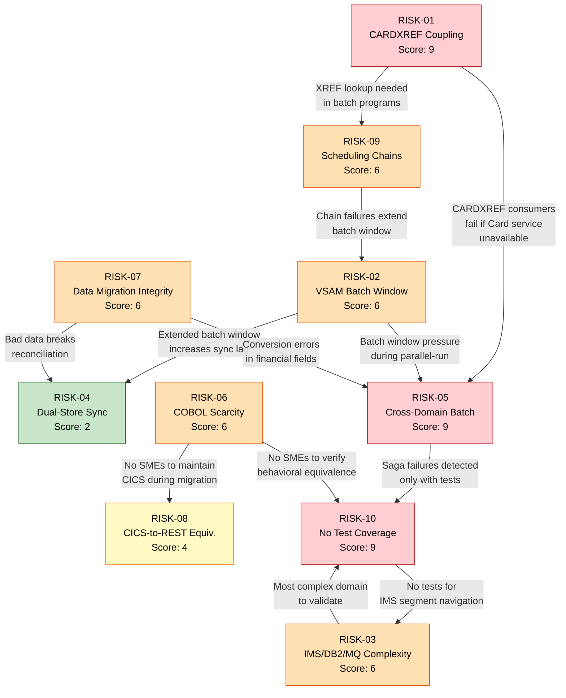

# Risk Register — CardDemo COBOL-to-Java Migration

## Quick Summary

### What Does This Document Mean?

**For Business Analysts:**
- This document identifies the top 10 things that could go wrong during the CardDemo mainframe-to-Java migration, ranked by likelihood and business impact.
- Each risk is tied to specific business domains and migration phases, so you can see which business functions are most exposed.
- Mitigation strategies and contingency plans describe what the team will do to prevent or respond to each risk.

**For Developers:**
- Each risk references specific COBOL programs, copybooks, and data stores — these are the code areas where problems are most likely to surface.
- Early warning indicators (per risk) tell you what signals to watch for in your development and testing work.
- The CARDXREF tri-domain coupling (RISK-01) and lack of automated test coverage (RISK-10) are the two risks that most directly affect your daily work.

**For Architects:**
- The risk heat map and interdependency diagram (Section 4) show how risks compound — a failure in data sync (RISK-04) can trigger batch chain failures (RISK-09) and regression issues (RISK-10).
- Risks are mapped to cutover phases, so you can see which phases carry the highest accumulated risk.
- The IMS/DB2/MQ multi-technology complexity in the Authorization domain (RISK-03) is flagged as the highest-complexity architectural challenge.

**For Product Owners / Project Managers:**
- The Risk Register Table (Section 2) gives you a one-page view of all 10 risks with scores, mitigations, and owner roles.
- Three risks score 9/9 (highest) — these need executive attention and dedicated mitigation budgets.
- The monitoring plan (Section 5) defines review cadence and escalation triggers for your governance process.

**For a Total Beginner:**
- Every big technology project has risks — things that might go wrong. This document lists the 10 biggest ones for this migration.
- Each risk has a score (1–9) based on how likely it is to happen and how bad it would be if it did.
- For each risk, there's a plan to prevent it and a backup plan if it happens anyway.

### How Can I Use This Document?

**For Business Analysts:**
- Review risks tagged to your domain to understand what business-impact scenarios to plan for.
- Use the contingency plans to draft business continuity procedures for each migration phase.

**For Developers:**
- Check early warning indicators for risks related to your domain — flag these signals to your team lead immediately if observed.
- RISK-10 (no automated tests) directly impacts you: prioritize writing test suites for the COBOL programs you're migrating.

**For Architects:**
- Use the risk interdependency diagram to design monitoring and alerting that catches cascading failures early.
- Ensure your integration architecture addresses the top-3 risks (CARDXREF coupling, VSAM batch window, IMS/DB2/MQ complexity).

**For Product Owners / Project Managers:**
- Add the Risk Register Table to your project dashboard and review it at every steering committee meeting.
- Use the risk monitoring plan cadence (Section 5) to schedule regular risk reviews.

**For a Total Beginner:**
- Read the Executive Summary heat map (Section 1) for a visual overview of risk severity.
- Then read the Risk Register Table (Section 2) for a one-line summary of each risk before diving into details.

### Key Sections and What They Indicate

| Section | What It Tells You |
|---------|-------------------|
| 1. Executive Summary | Risk heat map (likelihood vs. impact matrix) with top 3 risks highlighted |
| 2. Risk Register Table | One-row-per-risk summary with scores, mitigations, and owner roles |
| 3. Detailed Risk Analyses | Deep dive on each of 10 risks: description, scoring justification, mitigation, contingency, early warnings, and phase/domain mapping |
| 4. Risk Interdependencies | Which risks compound each other, with a Mermaid relationship diagram |
| 5. Risk Monitoring Plan | Review cadence, escalation triggers, and governance process |

---

## Table of Contents

1. [Executive Summary](#1-executive-summary)
2. [Risk Register Table](#2-risk-register-table)
3. [Detailed Risk Analyses](#3-detailed-risk-analyses)
   - [RISK-01: CARDXREF Tri-Domain Coupling](#risk-01-cardxref-tri-domain-coupling-prevents-independent-domain-deployment)
   - [RISK-02: VSAM Batch Window Availability](#risk-02-vsam-batch-window-availability-loss-during-migration)
   - [RISK-03: IMS/DB2/MQ Authorization Complexity](#risk-03-imsdb2mq-multi-technology-authorization-domain-complexity)
   - [RISK-04: Dual-Store Sync Integrity](#risk-04-dual-store-sync-data-integrity-failure)
   - [RISK-05: Cross-Domain Batch Mutations](#risk-05-cross-domain-batch-mutations-break-domain-boundaries)
   - [RISK-06: COBOL Developer Scarcity](#risk-06-cobol-developer-scarcity-for-legacy-maintenance)
   - [RISK-07: High-Volume Transaction Data Migration](#risk-07-high-volume-transaction-data-migration-integrity)
   - [RISK-08: CICS-to-REST Behavioral Equivalence](#risk-08-cics-to-rest-api-behavioral-equivalence)
   - [RISK-09: Batch Job Scheduling Chain Dependencies](#risk-09-batch-job-scheduling-chain-dependencies)
   - [RISK-10: Regression Risk from Limited Test Coverage](#risk-10-regression-risk-from-30175-loc-with-no-automated-test-coverage)
4. [Risk Interdependencies](#4-risk-interdependencies)
5. [Risk Monitoring Plan](#5-risk-monitoring-plan)

---

## 1. Executive Summary

### Risk Heat Map

```
                    ┌───────────────────────────────────────────────┐
                    │           I M P A C T                         │
                    │     Low (1)     Medium (2)     High (3)       │
  ┌─────────────────┼───────────────┬──────────────┬───────────────┤
  │ L  High (3)     │               │  RISK-06     │  RISK-01      │
  │ I               │               │  RISK-09     │  RISK-05      │
  │ K               │               │              │  RISK-10      │
  │ E  ─────────────┼───────────────┼──────────────┼───────────────┤
  │ L  Medium (2)   │               │  RISK-08     │  RISK-02      │
  │ I               │               │              │  RISK-03      │
  │ H               │               │              │  RISK-07      │
  │ O  ─────────────┼───────────────┼──────────────┼───────────────┤
  │ O  Low (1)      │               │  RISK-04     │               │
  │ D               │               │              │               │
  └─────────────────┴───────────────┴──────────────┴───────────────┘
```

### Top 3 Risks

1. **RISK-01 — CARDXREF Tri-Domain Coupling (Score: 9):** The cross-reference file `CVACT03Y.cpy` is shared across 16 programs in all 6 bounded contexts, making independent domain deployment impossible without an API-mediated decoupling strategy. This is the single greatest structural impediment to the migration.

2. **RISK-05 — Cross-Domain Batch Mutations (Score: 9):** POSTTRAN (`CBTRN01C`) and INTCALC (`CBACT04C`) mutate ACCTDATA and TRANSACT across domain boundaries within single batch runs. Decomposing these into microservice calls introduces distributed transaction semantics that have no equivalent in the current VSAM-based atomic write model.

3. **RISK-10 — Regression Risk from No Automated Tests (Score: 9):** The 30,175-LOC estate has zero automated test coverage. Every migrated program requires validation against COBOL behavior, and there is no regression safety net during the ~55-week cutover.

---

## 2. Risk Register Table

| # | Risk | Category | Likelihood | Impact | Risk Score | Mitigation | Early Warning Indicators | Owner Role |
|---|------|----------|------------|--------|------------|------------|--------------------------|------------|
| RISK-01 | CARDXREF tri-domain coupling prevents independent domain deployment | Technical | High (3) | High (3) | **9** | Card service owns XREF; expose lookup API; all consumers migrate to API before domain split | Domain teams discover they cannot deploy without Card service being live | Lead Architect |
| RISK-02 | VSAM batch window unavailability blocks online operations during migration | Operational | Medium (2) | High (3) | **6** | Replace CLOSEFIL/OPENFIL with PostgreSQL; eliminate exclusive file access requirement | Batch window duration increasing; online users reporting downtime during batch runs | Platform Lead |
| RISK-03 | IMS/DB2/MQ multi-technology Authorization domain has highest migration complexity | Technical | Medium (2) | High (3) | **6** | Migrate authorization last (Phase 5); prototype IMS-to-JPA mapping early; use Kafka to replace MQ | Prototype for IMS segment navigation takes >2× estimated time | Lead Architect |
| RISK-04 | DB2 master → VSAM replica sync divergence during dual-run period | Data | Low (1) | Medium (2) | **2** | Implement checksummed reconciliation jobs; run continuous delta comparison during parallel-run | Row count drift >0.1% between DB2/PostgreSQL and VSAM; reconciliation job failures | Data Engineer |
| RISK-05 | POSTTRAN/INTCALC cross-domain batch mutations break domain boundaries | Technical | High (3) | High (3) | **9** | Implement saga pattern with compensating transactions; keep batch monolithic until Phase 5 parallel-run validates | Balance mismatches in parallel-run comparison; saga compensations triggered >1% of transactions | Lead Architect |
| RISK-06 | COBOL developer scarcity delays legacy maintenance during migration | Organizational | High (3) | Medium (2) | **6** | Cross-train Java developers on COBOL reading; retain 2 COBOL SMEs through migration; document tribal knowledge in analysis artifacts | COBOL bug fix turnaround time >5 business days; SME attrition | Engineering Manager |
| RISK-07 | High-volume transaction data migration loses integrity or truncates data | Data | Medium (2) | High (3) | **6** | Migrate with checksummed ETL pipeline; validate record counts and balance totals post-load; run reconciliation for 30 days | Checksum mismatches on TRANSACT; `ACCT-CURR-BAL` totals differ between VSAM and PostgreSQL | Data Engineer |
| RISK-08 | CICS-to-REST API behavioral equivalence gaps in screen state machines | Technical | Medium (2) | Medium (2) | **4** | Map CICS pseudo-conversational flows to stateless REST; build screen-scrape-vs-API comparison harness; test EVALUATE branches exhaustively | UAT testers report different navigation behavior; field validation mismatches | QA Lead |
| RISK-09 | Batch job scheduling chain dependencies cause cascade failures | Operational | High (3) | Medium (2) | **6** | Map full Control-M/CA7 DAG; implement health checks between steps; build retry/dead-letter for each job | Downstream jobs fail because predecessor did not complete; batch window overruns | Platform Lead |
| RISK-10 | 30,175 LOC with no automated test coverage creates regression blind spots | Schedule | High (3) | High (3) | **9** | Build golden-file test harness (COBOL output vs Java output) before any migration; mandate 80%+ unit test coverage for new Java code | Migration defects discovered post-cutover in production; UAT pass rate <90% | QA Lead |

---

## 3. Detailed Risk Analyses

### RISK-01: CARDXREF Tri-Domain Coupling Prevents Independent Domain Deployment

**Category:** Technical

**Description:**
The Card Cross-Reference file (CARDXREF, defined in `app/cpy/CVACT03Y.cpy`) is a 50-byte VSAM KSDS record containing three foreign keys: `XREF-CARD-NUM` (PK), `XREF-CUST-ID`, and `XREF-ACCT-ID`. This single data structure links the Card, Customer, and Account entities, creating a tri-domain join table that is referenced by **16 programs across all 6 bounded contexts**:

- **Batch:** CBACT03C, CBACT04C, CBEXPORT, CBIMPORT, CBSTM03A, CBTRN01C, CBTRN02C, CBTRN03C
- **CICS Online:** COACTUPC, COACTVWC, COBIL00C, COTRN02C
- **Authorization:** COPAUA0C, COPAUS0C
- **Via AIX:** COCRDLIC, COCRDSLC, COCRDUPC (access CARDXREF via the VSAM Alternate Index path `CXACAIX`)

As documented in `DOMAIN_DECOMPOSITION.md` §3.1, CVACT03Y is the only copybook that touches all 6 domains. Any attempt to deploy the Card, Account, or Transaction domain independently requires this cross-reference to be available — meaning no domain can go live without the Card service (which owns CARDXREF) being operational and exposing a lookup API.

**Likelihood:** High (3) — The coupling is structural and unavoidable; 16 programs already depend on it. Every phase of the CUTOVER_PLAN (Phases 1–5) includes programs that read CARDXREF.

**Impact:** High (3) — If domains cannot be deployed independently, the migration collapses into a big-bang approach, eliminating the risk-reduction benefit of phased migration. The strangler pattern (recommended for Account and Transaction domains in MODERNIZATION_BLUEPRINT.md §4–§6) requires API-mediated access to CARDXREF.

**Risk Score:** 9 (3 × 3)

**Mitigation Strategy:**
1. Designate the Card service (`card-service`) as the sole owner of CARDXREF data, migrated to a `card_xref` PostgreSQL table
2. Expose a high-performance lookup API: `GET /api/cards/{cardNum}/xref` → returns `{custId, acctId}`
3. Deploy the Card service XREF lookup endpoint in **Phase 2** (Customer & Card Domain Core), before any consumer domain goes live
4. During the parallel-run period, implement a dual-read strategy: Java services call the Card service API; COBOL programs continue reading VSAM directly
5. Add a Redis/Hazelcast cache in front of the XREF lookup API — this dataset is read-heavy (16 readers, 1 writer: CBIMPORT) and changes infrequently

**Contingency Plan:**
If the Card service API cannot achieve acceptable latency (<5ms p99), fall back to a shared read-replica PostgreSQL schema visible to all services during migration. This sacrifices microservice purity but unblocks deployment. Post-migration, refactor to API calls once performance is tuned.

**Early Warning Indicators:**
- Card service XREF API latency exceeds 10ms p99 under load testing
- Domain teams request direct database access to `card_xref` table instead of using the API
- Phase 2 (Customer + Card) programs fail integration tests due to XREF lookup failures

**Related Cutover Phase:** Phase 1 (Security) through Phase 5 (Authorization & Fraud) — all phases include XREF consumers

**Related Domain:** Card Management (owner), Account Management, Transaction Management, Customer Management, Authorization/Fraud (consumers)

---

### RISK-02: VSAM Batch Window Availability Loss During Migration

**Category:** Operational

**Description:**
The CardDemo application uses a daily CLOSEFIL/OPENFIL pattern (`app/jcl/CLOSEFIL.jcl`, `app/jcl/OPENFIL.jcl`) that issues CICS `CEMT SET FIL(...) CLO` commands to close VSAM files (TRANSACT, CCXREF, ACCTDAT, CXACAIX, USRSEC) for exclusive batch access, then reopens them after batch completion. During this window, **all online CICS transactions are blocked** from accessing these files.

The Control-M scheduler (`app/scheduler/CardDemo.controlm`) shows this pattern runs **daily** (DAILY-TransactionBackup folder, `DAYS="ALL"`), **weekly** (WEEKLY-DisclosureGroupsRefresh, `DAYS="SA"`), and **monthly** (MONTHLY-InterestCalculation). The CA7 scheduler (`app/scheduler/CardDemo.ca7`) adds additional daily chains (CLOSEFIL → CBPAUP0J → POSTTRAN → WAITSTEP → OPENFIL).

During the migration's parallel-run period (Phases 4–5), both COBOL and Java systems must process transactions. If the VSAM batch window is extended (to accommodate dual processing), online availability degrades. If it's shortened, batch jobs may not complete.

**Likelihood:** Medium (2) — The batch window already operates on a tight daily schedule. Adding parallel-run overhead will pressure the window, but the migration to PostgreSQL eliminates the exclusive-access requirement for Java services.

**Impact:** High (3) — Extended downtime for online CICS transactions directly impacts cardholders and customer service. The 5 VSAM files closed by CLOSEFIL.jcl (TRANSACT, CCXREF, ACCTDAT, CXACAIX, USRSEC) underpin every online screen in the application.

**Risk Score:** 6 (2 × 3)

**Mitigation Strategy:**
1. Migrate PostgreSQL as the primary data store before attempting batch parallel-runs — PostgreSQL does not require exclusive file access
2. Shorten the VSAM batch window by running only validation (COBOL) during the window while the Java batch runs against PostgreSQL independently
3. Implement the batch comparison outside the window: capture COBOL batch outputs to GDG files and compare asynchronously
4. For Phase 4 (Transaction Management), schedule parallel-runs during weekends when transaction volumes are lower

**Contingency Plan:**
If the batch window cannot accommodate parallel processing, abandon dual-run for batch programs and rely instead on golden-file comparison testing: run the Java batch against a snapshot of production data and compare outputs to COBOL batch results from the previous cycle.

**Early Warning Indicators:**
- Batch window duration exceeds its allocated time slot by >15%
- OPENFIL.jcl completes after the start of business hours
- Online users report "file unavailable" errors outside the expected batch window

**Related Cutover Phase:** Phase 4 (Transaction Management), Phase 5 (Authorization & Fraud)

**Related Domain:** All domains (CLOSEFIL.jcl closes files used across every domain)

---

### RISK-03: IMS/DB2/MQ Multi-Technology Authorization Domain Complexity

**Category:** Technical

**Description:**
The Authorization/Fraud Management domain is the most technologically diverse in the estate, spanning **four distinct data access technologies** in a single transaction flow:

1. **IMS HIDAM** — PAUTBDB database with hierarchical segments CIPAUSMY (summary, root) and CIPAUDTY (detail, child), accessed via DL/I calls (GN, GNP, ISRT, DLET) in programs CBPAUP0C, DBUNLDGS, PAUDBLOD, PAUDBUNL
2. **DB2** — AUTHFRDS view read by COPAUS0C and COPAUS1C for fraud analysis display
3. **MQ** — COPAUA0C (`app/app-authorization-ims-db2-mq/cbl/COPAUA0C.cbl`, 1,026 LOC, composite score 61) processes authorization requests via MQGET/MQPUT1 from card network queues
4. **VSAM** — COPAUA0C also reads ACCTDAT, CARDDAT, CARDAIX for card/account verification during authorization

This domain contains **10 programs** (HOTSPOT_REPORT.md §6–7) with the highest integration complexity. COPAUA0C alone touches MQ + VSAM + CICS in a single request. The IMS HIDAM database has no direct relational equivalent — its hierarchical segment navigation (parent→child via GNP) must be flattened into JPA entity relationships.

**Likelihood:** Medium (2) — IMS migration is well-understood in mainframe modernization practice, and this domain is scheduled last (Phase 5) to allow maximum learning time. However, the 4-technology intersection is unique in this estate.

**Impact:** High (3) — Authorization is a real-time, customer-facing function. Incorrect migration breaks fraud detection and card authorization, with direct financial exposure (fraudulent transactions approved or legitimate transactions declined).

**Risk Score:** 6 (2 × 3)

**Mitigation Strategy:**
1. Prototype the IMS HIDAM → JPA mapping during Prerequisites (CUTOVER_PLAN §2): model CIPAUSMY/CIPAUDTY as a one-to-many JPA relationship (`PendingAuthSummary` → `PendingAuthDetail`)
2. Replace MQ with Kafka (as recommended in MODERNIZATION_BLUEPRINT.md §7): `COPAUA0C` MQGET/MQPUT1 maps to a Spring Kafka `@KafkaListener` / `KafkaTemplate.send()`
3. Migrate the DB2 AUTHFRDS view to a PostgreSQL materialized view, maintaining read compatibility for COPAUS0C/COPAUS1C screens
4. Keep the authorization domain on COBOL until Phase 5 — by then, all consumer domains (Account, Card, Transaction) will have migrated, reducing cross-domain integration pressure
5. Run COPAUA0C's fraud scoring logic through the golden-file test harness with production MQ message samples

**Contingency Plan:**
If IMS migration proves infeasible within the timeline, replatform the authorization domain on AWS M2 Managed Runtime (keeping COBOL) while migrating the MQ interface to an Amazon MQ bridge. This isolates the hardest migration while still modernizing the messaging layer.

**Early Warning Indicators:**
- IMS HIDAM → JPA prototype takes >2 weeks (budgeted for 1 week)
- Fraud scoring accuracy diverges >0.5% between COBOL and Java implementations
- MQ-to-Kafka bridge drops or reorders messages during load testing

**Related Cutover Phase:** Phase 5 (Authorization & Fraud)

**Related Domain:** Authorization/Fraud Management

---

### RISK-04: Dual-Store Sync Data Integrity Failure

**Category:** Data

**Description:**
During the parallel-run phases (Phases 3–5), both VSAM and PostgreSQL will contain live data. The migration strategy (MODERNIZATION_BLUEPRINT.md §1) requires incremental sync between the two stores: PostgreSQL becomes the primary for migrated domains while VSAM remains primary for un-migrated domains. The sync patterns include:

- **DB2 → VSAM replica via batch:** The weekly MNTTRDB2 job updates DB2 transaction types, then CLOSEFIL → DISCGRP → OPENFIL refreshes the VSAM disclosure group file from DB2 (documented in DEPENDENCY_MAP.md §6.3)
- **VSAM → PostgreSQL ETL:** The pre-migration ETL pipeline (CUTOVER_PLAN.md §2 Prerequisites) must handle incremental sync for ACCTDATA (300-byte records), TRANSACT (350-byte records), CARDDATA (150-byte records), CUSTDATA (500-byte records), and CARDXREF (50-byte records)

The highest-risk scenario involves ACCTDATA — classified as "Shared-Mutable" in DOMAIN_DECOMPOSITION.md §5.1 — where 4 batch writers (CBIMPORT, CBTRN01C, CBTRN02C, CBACT04C) and 2 online writers (COACTUPC, COBIL00C) all modify `ACCT-CURR-BAL`. A sync failure could result in balance discrepancies between the two stores.

**Likelihood:** Low (1) — The ETL pipeline will be purpose-built with checksumming, and the dual-store period is time-bounded. Standard CDC (change data capture) techniques are well-established.

**Impact:** Medium (2) — Balance discrepancies affect financial accuracy but would be caught by reconciliation before reaching customers. No data is permanently lost — the authoritative VSAM copy can always be used to correct PostgreSQL.

**Risk Score:** 2 (1 × 2)

**Mitigation Strategy:**
1. Implement record-level checksums (CRC32 of full record bytes) on both VSAM and PostgreSQL sides
2. Run a nightly reconciliation job comparing record counts and `SUM(ACCT-CURR-BAL)` across all accounts
3. Design the ETL pipeline as idempotent: re-running sync for any time window produces the same result
4. Log all sync operations to an audit table with before/after values
5. During Phase 4 (Transaction Management), run reconciliation after every batch cycle, not just nightly

**Contingency Plan:**
If sync divergence is detected, halt the parallel-run for the affected domain, resync from the authoritative VSAM source, and investigate the root cause before resuming. The COBOL system remains fully operational as the primary during this recovery.

**Early Warning Indicators:**
- Record count delta >0 between VSAM and PostgreSQL for any dataset after sync completion
- `SUM(ACCT-CURR-BAL)` differs by >$0.01 between stores
- Reconciliation job execution time increases >50% (indicates growing data volume or sync lag)

**Related Cutover Phase:** Phase 3 (Account Management) through Phase 5 (Authorization & Fraud)

**Related Domain:** Account Management (highest risk due to Shared-Mutable ACCTDATA), Transaction Management

---

### RISK-05: Cross-Domain Batch Mutations Break Domain Boundaries

**Category:** Technical

**Description:**
Two critical batch programs mutate data stores owned by multiple domains within a single batch run, violating the domain-boundary principle that underpins the microservice decomposition:

1. **POSTTRAN (CBTRN01C, 494 LOC)** — Executed by `app/jcl/POSTTRAN.jcl`. Reads DALYTRAN (Transaction domain), looks up CUSTFILE (Customer domain), XREFFILE/CARDFILE (Card domain), and **writes** both TRANFILE (Transaction domain) and ACCTFILE (Account domain, updating `ACCT-CURR-BAL` and `ACCT-CURR-CYC-DEBIT`). Cross-domain job risk rated **HIGH** in DOMAIN_DECOMPOSITION.md §4.3.

2. **INTCALC (CBACT04C, 652 LOC)** — Executed by `app/jcl/INTCALC.jcl`. Reads XREFFILE (Card domain), DISCGRP (Account domain), ACCTFILE, and **writes** both TRANFILE (creating interest-generated transactions in Transaction domain) and ACCTFILE (updating balances in Account domain). Also updates TCATBALF (category balances).

In the current COBOL system, these cross-domain writes are atomic — VSAM file I/O within a single batch program provides implicit transactional consistency. In a microservice architecture, CBTRN01C's write to ACCTFILE becomes an API call to `account-service`, and CBACT04C's write to TRANFILE becomes an API call to `transaction-service`. These cross-service writes require distributed transaction coordination (saga pattern) or must remain as monolithic batch operations.

**Likelihood:** High (3) — This is not a potential problem but a structural certainty. The programs already perform cross-domain writes. Decomposing them requires changing the transactional model.

**Impact:** High (3) — Incorrect balance updates have direct financial consequences. If CBTRN01C posts a transaction to TRANFILE but the corresponding ACCTFILE balance update fails (in a distributed scenario), the ledger becomes inconsistent.

**Risk Score:** 9 (3 × 3)

**Mitigation Strategy:**
1. **Keep batch monolithic through Phase 3:** Do not decompose POSTTRAN or INTCALC until the saga infrastructure is proven in Phase 4
2. **Implement the saga pattern for Phase 4 (Transaction Management):**
   - POSTTRAN saga: `TransactionService.post()` → `AccountService.updateBalance()` with compensating rollback
   - INTCALC saga: `AccountService.calculateInterest()` → `TransactionService.createInterestRecord()` with compensating rollback
3. **Run parallel batch:** Execute both COBOL and Java batch, compare outputs field-by-field, for a minimum of 30 days before cutting over
4. **Use outbox pattern:** Each service writes its local change + an outbox event in a single database transaction; a relay publishes the event to Kafka for the downstream service
5. **Implement idempotency keys:** Each transaction posting gets a unique key to prevent duplicate processing during retries

**Contingency Plan:**
If the saga pattern introduces unacceptable latency or failure rates (>0.1% compensation triggers), keep POSTTRAN and INTCALC as monolithic Spring Batch jobs with direct database access to both Account and Transaction schemas within a single JDBC transaction. This sacrifices microservice independence but preserves transactional integrity.

**Early Warning Indicators:**
- Saga compensation rate >0.1% of transactions during parallel-run
- Balance mismatch between Java and COBOL batch outputs
- Parallel-run comparison shows drift in `ACCT-CURR-BAL` totals
- Saga orchestration latency >500ms per transaction (vs. <1ms for VSAM direct write)

**Related Cutover Phase:** Phase 4 (Transaction Management — POSTTRAN/INTCALC are the critical-risk programs)

**Related Domain:** Transaction Management (POSTTRAN owner), Account Management (INTCALC owner, POSTTRAN writes to ACCTDATA)

---

### RISK-06: COBOL Developer Scarcity for Legacy Maintenance

**Category:** Organizational

**Description:**
The CardDemo estate comprises **44 COBOL programs totaling ~30,175 LOC** (MODERNIZATION_BLUEPRINT.md §1). During the ~55-week migration timeline (CUTOVER_PLAN.md), the legacy COBOL system must remain fully operational as the production fallback. This requires:

- Bug fixes in COBOL programs as issues are discovered
- Maintenance of the CICS/VSAM runtime environment
- Support for the CLOSEFIL/OPENFIL batch window operations
- Reading and interpreting COBOL code to verify Java behavioral equivalence

The global COBOL developer workforce is aging and shrinking. According to industry estimates, the average COBOL developer age exceeds 55, and fewer than 5% of computer science graduates have mainframe experience. The most complex programs — COACTUPC (4,236 LOC, score 96), COTRTLIC (2,098 LOC, 72-level nesting), and COTRTUPC (1,702 LOC, 72-level nesting) — require deep COBOL expertise to understand and maintain.

**Likelihood:** High (3) — Developer scarcity is an industry-wide trend that cannot be resolved within the project timeline.

**Impact:** Medium (2) — Loss of COBOL expertise slows bug fixes and migration validation but does not halt the project entirely — the analysis artifacts (APPLICATION_INVENTORY.md, DATA_DICTIONARY.md, DEPENDENCY_MAP.md, HOTSPOT_REPORT.md) partially mitigate tribal knowledge loss.

**Risk Score:** 6 (3 × 2)

**Mitigation Strategy:**
1. **Retain 2 dedicated COBOL SMEs** through the full migration period with retention bonuses tied to post-migration decommission completion
2. **Cross-train 3–4 Java developers** on COBOL reading (not writing): focus on copybook interpretation, EVALUATE/IF logic tracing, and CICS command patterns
3. **Front-load COBOL-intensive phases:** Complete Phase 4 (Transaction — the most complex COBOL logic) before Phase 5 (Authorization), reducing SME dependency in later phases
4. **Leverage existing documentation:** The 4 PR #18 artifacts provide comprehensive program inventories, data dictionaries, dependency maps, and hotspot rankings that reduce the need for exploratory COBOL reading
5. **Use AI-assisted COBOL analysis** tools to generate Java pseudo-code from COBOL for developer review

**Contingency Plan:**
If COBOL SMEs depart mid-migration, contract with a mainframe services firm (e.g., Infosys, TCS, DXC) for on-demand COBOL expertise. Budget $200–300/hr for specialized COBOL consultants. Prioritize completing the highest-complexity programs (COACTUPC, COTRTLIC/COTRTUPC) while SMEs are still available.

**Early Warning Indicators:**
- COBOL bug fix turnaround time exceeds 5 business days
- SME resignation or retirement notice received
- Java developers report inability to trace COBOL logic in COACTUPC or CBACT04C without SME help
- Unfilled COBOL contractor positions after 30 days of recruiting

**Related Cutover Phase:** All phases (COBOL system must be maintained throughout)

**Related Domain:** All domains

---

### RISK-07: High-Volume Transaction Data Migration Integrity

**Category:** Data

**Description:**
The TRANSACT file (`AWS.M2.CARDDEMO.TRANSACT.VSAM.KSDS`, documented in DEPENDENCY_MAP.md §2.5) is the highest-volume data store in the estate. Each record is 350 bytes (defined in `app/cpy/CVTRA05Y.cpy`) with 13 business fields including `TRAN-AMT` (`S9(09)V99` — signed decimal), `TRAN-CARD-NUM` (16-byte FK to Card), and two 26-byte timestamps (`TRAN-ORIG-TS`, `TRAN-PROC-TS`).

The data migration must handle:
- **EBCDIC → ASCII character encoding** for alphanumeric fields (100-byte `TRAN-DESC`, 50-byte `TRAN-MERCHANT-NAME`, 50-byte `TRAN-MERCHANT-CITY`)
- **COMP-3 (packed decimal) → Java BigDecimal** conversion for the export format (CVEXPORT.cpy uses `S9(10)V99 COMP-3` for balance fields)
- **Signed numeric precision:** `TRAN-AMT` is `S9(09)V99` — 11 digits with 2 decimal places. Rounding or truncation during conversion could create penny-level discrepancies that compound across millions of records
- **VSAM key preservation:** `TRAN-ID` (16 bytes, `X(16)`) must be preserved as-is to maintain referential integrity with CARDXREF and ACCTDATA

The ACCTDATA file (300-byte records, `app/cpy/CVACT01Y.cpy`) faces similar risks. The `ACCT-CURR-BAL` field (`S9(10)V99`) holds signed decimal balances where even a $0.01 error per account compounds across the portfolio.

**Likelihood:** Medium (2) — EBCDIC-to-ASCII and packed decimal conversion are well-understood processes, but the volume and precision requirements increase the probability of edge cases (e.g., negative balances, special characters in merchant names, zero-fill in FILLER fields).

**Impact:** High (3) — Financial data integrity errors in account balances or transaction amounts have regulatory and audit consequences. A systematic conversion error (e.g., incorrect COMP-3 sign nibble handling) could affect every record.

**Risk Score:** 6 (2 × 3)

**Mitigation Strategy:**
1. **Build the ETL pipeline using IBM's Record Generator for Java** or a proven COBOL-to-Java data conversion library that handles COMP-3, COMP, and signed numeric correctly
2. **Validate with checksum comparison:** After each migration batch, compute `SUM(TRAN-AMT)` and `SUM(ACCT-CURR-BAL)` on both VSAM and PostgreSQL and compare to 2 decimal places
3. **Test with production-scale data:** Use the `app/data/` EBCDIC sample datasets for unit tests, but validate with full production volume during the Prerequisites phase
4. **Handle edge cases explicitly:** Test negative balances, zero amounts, max-value fields (`S9(10)V99` max = 9,999,999,999.99), and special characters in `TRAN-DESC`
5. **Preserve VSAM keys as-is:** Map `TRAN-ID` to `VARCHAR(16)` in PostgreSQL (not auto-generated IDs) to maintain referential integrity

**Contingency Plan:**
If systematic conversion errors are discovered post-migration, rerun the ETL from the VSAM backup (GDG files created by TRANBKP.jcl). VSAM data is never deleted during migration — it remains the authoritative source until post-migration decommission.

**Early Warning Indicators:**
- `SUM(TRAN-AMT)` differs between VSAM and PostgreSQL after ETL
- Record count mismatch between source and target
- COMP-3 conversion test failures for negative or zero values
- Production data volume exceeds test data volume by >10× (indicating test coverage gap)

**Related Cutover Phase:** Prerequisites (CUTOVER_PLAN §2 — ETL pipeline build), Phase 4 (Transaction Management — live data migration)

**Related Domain:** Transaction Management, Account Management

---

### RISK-08: CICS-to-REST API Behavioral Equivalence

**Category:** Technical

**Description:**
The CardDemo application's 16 CICS online programs implement a **pseudo-conversational state machine** where screen state is maintained in COMMAREA (`app/cpy/COCOM01Y.cpy`, 47 lines defining fields like `CDEMO-FROM-PROGRAM`, `CDEMO-TO-PROGRAM`, `CDEMO-PGM-CONTEXT`). Navigation between screens uses `EXEC CICS XCTL` (transfer control), and each program uses EVALUATE blocks to dispatch based on the AID key pressed (Enter, PF keys, Clear).

The most complex state machine is COACTUPC (4,236 LOC, 20 EVALUATE statements, HOTSPOT_REPORT.md §1): it handles account view, edit, confirm, and error states within a single program, using COMMAREA fields `CDEMO-PGM-CONTEXT` (0=ENTER, 1=REENTER) and `CDEMO-LAST-MAP`/`CDEMO-LAST-MAPSET` to track navigation state.

Converting this to stateless REST APIs requires:
- Mapping COMMAREA session state to client-side state (e.g., React component state) or server-side session tokens
- Translating AID key-based dispatch (`CCARD-AID-ENTER`, `CCARD-AID-PFK01`–`CCARD-AID-PFK12`, defined in `app/cpy/CVCRD01Y.cpy`) to HTTP methods and URL paths
- Ensuring that multi-step workflows (e.g., edit → confirm → save in COACTUPC) maintain the same validation order and error messaging

Subtle behavioral differences are likely in screen navigation edge cases: what happens when a user presses PF3 (back) during a confirm step, or when the COMMAREA indicates a re-enter but the map has changed.

**Likelihood:** Medium (2) — The CICS pseudo-conversational pattern is well-documented and the mapping to REST is conceptually straightforward. However, the 20+ EVALUATE statements in COACTUPC and 72-level nesting in COTRTUPC create numerous edge-case branches.

**Impact:** Medium (2) — Behavioral differences affect user experience but not data integrity (write operations are validated separately). The risk is that users encounter different navigation flows or error messages, causing confusion and support tickets.

**Risk Score:** 4 (2 × 2)

**Mitigation Strategy:**
1. **Build a CICS screen-scrape test harness** (referenced in CUTOVER_PLAN.md Phase 2 validation strategy): capture CICS 3270 screen outputs for every AID key combination and compare with REST API responses
2. **Map each EVALUATE branch to a test case:** For COACTUPC's 20 EVALUATE statements, create at least one test per branch (minimum 20 test cases for this program alone)
3. **Preserve COMMAREA field semantics in the REST API:** Use a session context object that mirrors `CDEMO-PGM-CONTEXT`, `CDEMO-FROM-PROGRAM`, `CDEMO-TO-PROGRAM` for the SPA router
4. **Migrate read-only screens first** (COACTVWC, COCRDSLC, COTRN01C in Phase 2 Customer + Card) to establish the pattern before tackling CRUD screens
5. **Document every PF key → HTTP method mapping** explicitly before implementation begins

**Contingency Plan:**
If behavioral equivalence cannot be achieved for COACTUPC within the Phase 3 timeline, decompose the migration: migrate view and simple-edit paths first, keep complex paths (multi-field edit + confirm) on CICS via a hybrid UI that routes some flows to the legacy system.

**Early Warning Indicators:**
- UAT testers report >5 navigation-flow discrepancies per screen during Phase 2 (Customer + Card) testing
- Screen-scrape comparison shows field value mismatches (not just formatting differences)
- COACTUPC migration estimate exceeds 6 weeks (budgeted for 4 weeks in CUTOVER_PLAN.md Phase 3)

**Related Cutover Phase:** Phase 2 (Customer + Card), Phase 3 (Account Management — COACTUPC is critical path)

**Related Domain:** Account Management (COACTUPC), Credit Card Management (COCRDLIC/COCRDUPC/COCRDSLC), Transaction Management

---

### RISK-09: Batch Job Scheduling Chain Dependencies

**Category:** Operational

**Description:**
The CardDemo batch environment is orchestrated by two scheduler systems:

1. **Control-M** (`app/scheduler/CardDemo.controlm`): Defines 3 scheduling folders with chained job dependencies using INCOND/OUTCOND conditions:
   - DAILY-TransactionBackup: CLOSEFIL → TRANBKP → WAITSTEP → OPENFIL (4 jobs, `DAYS="ALL"`)
   - WEEKLY-TransactionTypesDBRefresh: MNTTRDB2 → DisclosureGroupsRefresh SMART_FOLDER → TransactionTypesDBRefresh
   - WEEKLY-DisclosureGroupsRefresh: CLOSEFIL → DISCGRP → WAITSTEP → OPENFIL

2. **CA7** (`app/scheduler/CardDemo.ca7`): Defines additional chains including daily processing (CLOSEFIL → CBPAUP0J → POSTTRAN → WAITSTEP → OPENFIL) and monthly cycles (statement generation, interest calculation, validation).

As documented in DEPENDENCY_MAP.md §6, **12 of 38 JCL jobs span multiple domains**. The chains have strict sequential dependencies — if any job fails, all downstream jobs are blocked. For example, if POSTTRAN fails (CBTRN01C abends), WAITSTEP and OPENFIL never execute, leaving CICS files closed and blocking all online users.

During migration, these chains must be replicated in the Java batch scheduler (Spring Batch + a scheduler like Quartz or the native orchestrator). The migration from Control-M INCOND/OUTCOND to a new scheduling paradigm requires careful mapping of every dependency edge.

**Likelihood:** High (3) — The chains are complex (12+ cross-domain jobs), and scheduler migration is a known high-failure-rate activity. Control-M semantics (MAXRERUN=5, MAXWAIT=7) must be translated to equivalent retry/timeout policies.

**Impact:** Medium (2) — A scheduling chain failure blocks batch processing but does not corrupt data (VSAM files are either open or closed; partial writes are handled by abend recovery). However, a missed batch window delays financial processing by 24 hours.

**Risk Score:** 6 (3 × 2)

**Mitigation Strategy:**
1. **Map the complete scheduling DAG** before any batch migration: extract all INCOND/OUTCOND edges from `CardDemo.controlm` and all trigger chains from `CardDemo.ca7`
2. **Implement health-check probes** between every job step: before POSTTRAN starts, verify CLOSEFIL completed successfully by checking file status
3. **Add dead-letter queues** for failed batch jobs: if CBTRN01C abends, capture the failure context and alert operations rather than silently blocking the chain
4. **Build a monitoring dashboard** that visualizes the batch DAG in real-time, showing job status, duration, and dependencies
5. **Run the new scheduler in shadow mode** for 30 days before cutover: execute both Control-M (production) and the new scheduler (shadow) and compare timing and completion status

**Contingency Plan:**
If the new scheduler cannot replicate Control-M behavior reliably, keep Control-M as the orchestrator during the migration and have it call Java batch jobs as external steps (Control-M supports external job types). Migrate the scheduler itself last, after all batch programs are on Java.

**Early Warning Indicators:**
- Shadow scheduler completes >10 minutes after Control-M for the same chain
- Any job in the shadow scheduler fails while Control-M succeeds (or vice versa)
- Batch window overruns (OPENFIL completes after business hours) more than once per month
- Operations team reports difficulty mapping Control-M alerts to the new monitoring system

**Related Cutover Phase:** Phase 4 (Transaction Management — batch chains are most critical), Phase 5 (Authorization & Fraud)

**Related Domain:** All domains (CLOSEFIL/OPENFIL is cross-cutting); Transaction Management and Account Management (POSTTRAN, INTCALC chains)

---

### RISK-10: Regression Risk from 30,175 LOC with No Automated Test Coverage

**Category:** Schedule

**Description:**
The CardDemo COBOL estate has **zero automated tests** — no unit tests, no integration tests, no regression test suite. The 44 programs totaling ~30,175 LOC (MODERNIZATION_BLUEPRINT.md §1) are validated solely through manual testing and production monitoring. Key complexity metrics from HOTSPOT_REPORT.md:

- COACTUPC: 4,236 LOC, 20 EVALUATE statements, 56 copybook references
- COTRTLIC: 2,098 LOC, 32 EVALUATE statements, 18-level nesting
- COTRTUPC: 1,702 LOC, 26 EVALUATE statements, 72-level nesting
- CBSTM03A: 924 LOC, 97 I/O operations (highest in estate)
- CBACT04C: 652 LOC, 17 I/O operations, interest calculation logic

Without tests, every migrated program requires **manual verification** of behavioral equivalence. The CUTOVER_PLAN.md prescribes 44 programs across 5 phases over ~55 weeks. If each program requires manual testing of all code paths, the QA effort could exceed the development effort.

The highest regression risk is in batch programs that modify financial data: CBTRN01C (post transactions), CBTRN02C (validate/reject), CBACT04C (interest calculation). An undetected regression in any of these programs could result in incorrect account balances for the entire portfolio.

**Likelihood:** High (3) — Zero test coverage is a fact, not a probability. Every migration introduces regression potential, and without automated tests, detection depends entirely on manual review and production monitoring.

**Impact:** High (3) — Undetected regressions in financial calculations (interest, balance updates, transaction validation) have direct monetary impact. A systematic error in CBACT04C (interest calculation) could mis-calculate interest for every account. Post-production regression discovery requires emergency rollback and reprocessing.

**Risk Score:** 9 (3 × 3)

**Mitigation Strategy:**
1. **Build a golden-file test harness during Prerequisites** (CUTOVER_PLAN.md §2): run each COBOL program against sample data, capture all outputs (VSAM writes, report files, display records), and use these as the expected output for Java program validation
2. **Mandate 80%+ line coverage** for all new Java code — enforce via CI/CD coverage gates
3. **Create property-based tests** for financial calculations: for CBACT04C (interest), verify that `interest = balance × rate × (days / 365)` holds for random inputs
4. **Implement production-shadow testing** in Phases 4–5: route a copy of production data to the Java system, compare outputs, but do not write results to production
5. **Build regression detection into the CI/CD pipeline:** every PR must pass golden-file comparison tests before merge
6. **Prioritize test creation for the top 10 hotspot programs** (HOTSPOT_REPORT.md): these 10 programs represent the highest complexity and therefore the highest regression risk

**Contingency Plan:**
If golden-file tests reveal behavioral discrepancies that cannot be resolved before the phase deadline, extend the parallel-run period for the affected programs. The COBOL system remains the production system of record until the Java replacement passes all golden-file tests. Budget 2 additional weeks per phase for test remediation.

**Early Warning Indicators:**
- Golden-file test pass rate <90% for any Phase 1+ program
- UAT defect rate >3 defects per program during acceptance testing
- Java code coverage <60% at end of any phase (below 80% target)
- Production incidents attributed to migrated programs within 30 days of cutover
- Phase timeline slippage >2 weeks due to testing delays

**Related Cutover Phase:** All phases (testing is required for every phase), but highest impact in Phase 4 (Transaction Management)

**Related Domain:** All domains, with highest impact on Transaction Management and Account Management

---

## 4. Risk Interdependencies

Several risks compound each other. Understanding these interdependencies is critical for prioritizing mitigation efforts.

### Risk Relationship Diagram



### Compounding Risk Pairs

| Risk Pair | Compounding Effect | Combined Mitigation |
|-----------|-------------------|---------------------|
| **RISK-01 + RISK-05** | CARDXREF coupling means POSTTRAN/INTCALC cannot decompose without Card service API; if XREF API is slow, saga patterns add latency on top of the cross-domain write overhead | Deploy XREF API with <5ms SLA in Phase 2; validate saga performance with production-scale XREF lookups |
| **RISK-05 + RISK-10** | Cross-domain batch mutations require precise testing to validate saga correctness; without automated tests, saga compensation errors go undetected | Build golden-file tests specifically for POSTTRAN and INTCALC before attempting saga decomposition |
| **RISK-06 + RISK-10** | COBOL SME departure leaves no one to verify Java behavioral equivalence; automated tests become the only safety net, but they don't exist yet | Front-load golden-file test creation while SMEs are available; have SMEs review test assertions |
| **RISK-02 + RISK-09** | Scheduling chain failures extend the batch window; extended batch windows increase online downtime — a feedback loop | Implement circuit breakers in scheduling chains; fail-fast rather than retry indefinitely |
| **RISK-07 + RISK-04** | Data migration conversion errors propagate through dual-store sync; reconciliation catches the symptom but the root cause is in the ETL | Validate ETL conversion correctness independently before enabling sync |
| **RISK-03 + RISK-10** | The IMS/DB2/MQ domain is the most complex to migrate and has no tests to validate correctness | Build the IMS-to-JPA prototype during Prerequisites and create integration tests before Phase 5 |

---

## 5. Risk Monitoring Plan

### Review Cadence

| Review Type | Frequency | Participants | Focus |
|-------------|-----------|-------------|-------|
| **Risk Stand-up** | Weekly | Lead Architect, Platform Lead, QA Lead | Review early warning indicators for all 10 risks; update likelihood/impact if new information emerges |
| **Phase Gate Review** | At each phase boundary | Full project team + stakeholders | Verify that mitigation actions for the upcoming phase's risks are complete before proceeding |
| **Escalation Review** | Triggered by early warning | Engineering Manager + project sponsor | Assess whether to invoke contingency plan for the triggered risk |
| **Quarterly Risk Retrospective** | Quarterly | Full project team | Re-score all risks based on actual migration experience; add new risks discovered; retire mitigated risks |

### Early Warning Indicator Dashboard

Each risk's early warning indicators should be tracked in a monitoring dashboard. The following metrics should be collected and reviewed at the weekly Risk Stand-up:

| Metric | Source | Threshold | Triggered Risk |
|--------|--------|-----------|---------------|
| Card service XREF API p99 latency | APM (e.g., Datadog, New Relic) | >10ms | RISK-01 |
| Batch window duration (CLOSEFIL→OPENFIL) | Control-M job history | >allocated window + 15% | RISK-02, RISK-09 |
| IMS-to-JPA prototype completion | JIRA sprint board | >2 weeks | RISK-03 |
| VSAM↔PostgreSQL record count delta | Reconciliation job | >0 records | RISK-04, RISK-07 |
| VSAM↔PostgreSQL balance sum delta | Reconciliation job | >$0.01 | RISK-04, RISK-07 |
| Saga compensation rate | Application logs | >0.1% | RISK-05 |
| COBOL bug fix turnaround time | JIRA ticket metrics | >5 business days | RISK-06 |
| COBOL SME headcount | HR system | <2 | RISK-06 |
| `SUM(TRAN-AMT)` VSAM vs PostgreSQL | ETL validation | Any difference | RISK-07 |
| UAT navigation-flow discrepancy count | UAT defect tracker | >5 per screen | RISK-08 |
| Shadow scheduler timing delta | Scheduler monitoring | >10 minutes | RISK-09 |
| Golden-file test pass rate | CI/CD pipeline | <90% | RISK-10 |
| Java code line coverage | CI/CD coverage report | <60% | RISK-10 |

### Escalation Triggers

| Trigger | Response | Owner |
|---------|----------|-------|
| Any score-9 risk early warning fires | Immediate escalation to Engineering Manager; assess contingency plan activation | Lead Architect |
| 2+ early warnings fire simultaneously | Emergency Risk Stand-up within 24 hours | Engineering Manager |
| Phase gate criteria not met after 1-week extension | Invoke contingency plan for the blocking risk; consider phase resequencing | Project Sponsor |
| COBOL SME resignation | Activate contingency (external contractor engagement); freeze current COBOL-dependent phase until replacement onboarded | Engineering Manager |
| Production incident attributed to migrated code | Rollback to COBOL; root-cause analysis before resuming migration | QA Lead |

### Risk Retirement Criteria

A risk is retired (removed from active monitoring) when:
1. The risk's root cause has been eliminated (e.g., RISK-02 is retired when all VSAM files are decommissioned after Phase 5)
2. The risk's early warning indicators have been green for 30 consecutive days after the related phase completes
3. The project team unanimously agrees the risk is no longer relevant at a Quarterly Risk Retrospective
